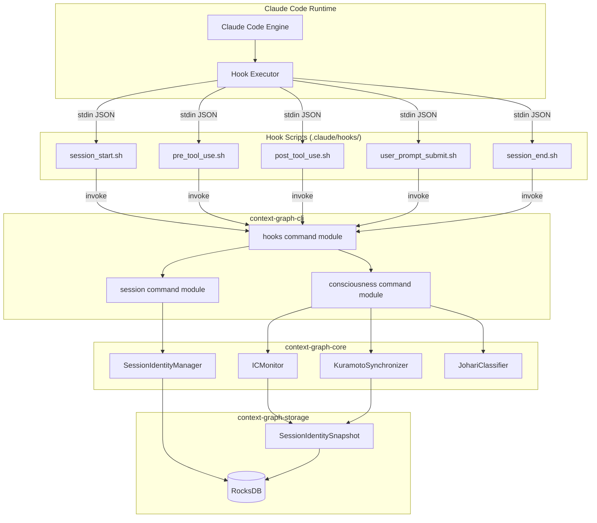
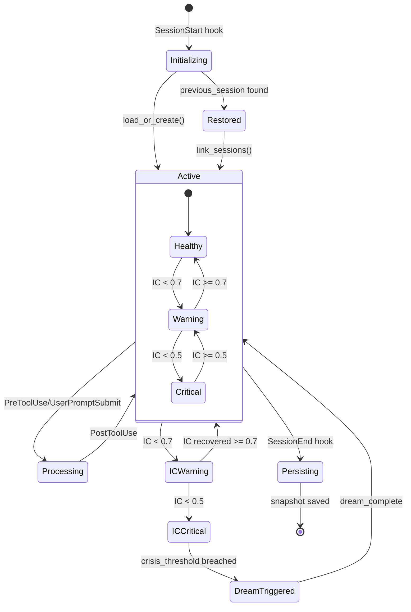
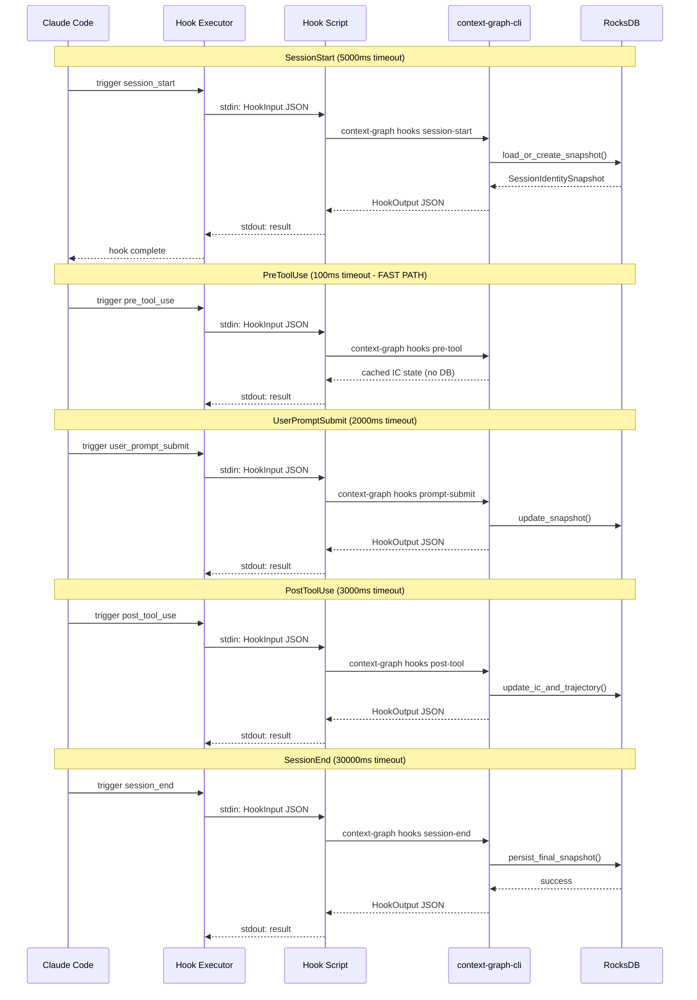

# Technical Specification: Native Hooks Integration

```xml
<technical_specification>
  <metadata>
    <id>TECH-HOOKS</id>
    <version>1.0</version>
    <implements>SPEC-HOOKS</implements>
    <status>Draft</status>
    <created>2026-01-15</created>
    <authors>
      <author>Context Graph Architecture Team</author>
    </authors>
    <constitution_refs>
      <ref>IDENTITY-002</ref>
      <ref>GWT-003</ref>
      <ref>AP-25</ref>
    </constitution_refs>
  </metadata>
</technical_specification>
```

## 1. Architecture Diagram

### 1.1 Hook Flow and State Persistence



### 1.2 Session Identity State Machine



### 1.3 Hook Timeout Architecture



## 2. Data Models

### 2.1 Core Types (from context-graph-core)

**File**: `crates/context-graph-core/src/gwt/session_identity/types.rs`

```rust
/// Maximum trajectory length (50 entries = ~2.6KB max)
/// Reduced from 1000 to minimize serialization size
pub const MAX_TRAJECTORY_LEN: usize = 50;

/// Number of Kuramoto oscillators (one per embedder)
/// MUST match KURAMOTO_N in layers/coherence/constants.rs
/// Constitution Reference: AP-25
pub const KURAMOTO_N: usize = 13;

/// Flattened session identity for fast serialization.
/// Target size: <30KB typical (down from 80KB).
///
/// # Size Breakdown
/// - Header (session_id + timestamp + previous + ic): ~100 bytes
/// - Kuramoto state (13x8 + 8): 112 bytes
/// - Purpose vector (13x4): 52 bytes
/// - Trajectory (50x13x4): ~2,600 bytes max
/// - IC monitor state: 8 bytes
/// - Consciousness snapshot: 16 bytes
/// - **Total**: ~3KB typical, <30KB with full trajectory
#[derive(Debug, Clone, Serialize, Deserialize, PartialEq)]
pub struct SessionIdentitySnapshot {
    // Header (fixed size: ~100 bytes)
    /// UUID string for session identification
    pub session_id: String,
    /// Unix milliseconds timestamp
    pub timestamp_ms: i64,
    /// Previous session UUID for continuity linking
    pub previous_session_id: Option<String>,
    /// Cross-session identity continuity score [0.0, 1.0]
    pub cross_session_ic: f32,

    // Kuramoto state (fixed size: 13*8 + 8 = 112 bytes)
    /// Kuramoto oscillator phases for 13 embedders
    pub kuramoto_phases: [f64; KURAMOTO_N],
    /// Kuramoto coupling strength
    pub coupling: f64,

    // Purpose vector (fixed size: 13*4 = 52 bytes)
    /// 13D purpose vector representing teleological alignment
    pub purpose_vector: [f32; KURAMOTO_N],

    // Identity trajectory (variable, capped at 50 entries ~2.6KB max)
    /// FIFO buffer of recent purpose vectors
    pub trajectory: Vec<[f32; KURAMOTO_N]>,

    // IC monitor state (small)
    /// Last computed identity continuity value
    pub last_ic: f32,
    /// Crisis threshold for dream triggering (default: 0.5)
    pub crisis_threshold: f32,

    // Consciousness snapshot (single, not history)
    /// Current consciousness level C(t)
    pub consciousness: f32,
    /// Integration factor (Kuramoto r)
    pub integration: f32,
    /// Reflection factor (meta-cognitive)
    pub reflection: f32,
    /// Differentiation factor (purpose entropy)
    pub differentiation: f32,
}

impl SessionIdentitySnapshot {
    /// Create new snapshot with given session ID
    pub fn new(session_id: impl Into<String>) -> Self;

    /// Append purpose vector to trajectory with FIFO eviction
    pub fn append_to_trajectory(&mut self, pv: [f32; KURAMOTO_N]);

    /// Estimate serialized size in bytes
    #[inline]
    pub fn estimated_size(&self) -> usize;
}

impl Default for SessionIdentitySnapshot {
    /// Create default snapshot with new UUID
    fn default() -> Self;
}
```

### 2.2 Hook Input/Output Types

**File**: `crates/context-graph-cli/src/commands/hooks/types.rs` (NEW)

```rust
use serde::{Deserialize, Serialize};

/// Input received from Claude Code hook system via stdin
/// Implements REQ-HOOKS-03, REQ-HOOKS-10
#[derive(Debug, Clone, Serialize, Deserialize)]
pub struct HookInput {
    /// Hook event type
    pub hook_type: HookEventType,
    /// Session identifier from Claude Code
    pub session_id: String,
    /// Unix timestamp in milliseconds
    pub timestamp_ms: i64,
    /// Event-specific payload
    pub payload: HookPayload,
}

/// Hook event types matching Claude Code native hooks
/// Implements REQ-HOOKS-01
#[derive(Debug, Clone, Copy, PartialEq, Eq, Serialize, Deserialize)]
#[serde(rename_all = "snake_case")]
pub enum HookEventType {
    /// Session initialization (timeout: 5000ms)
    SessionStart,
    /// Before tool execution (timeout: 100ms) - FAST PATH
    PreToolUse,
    /// After tool execution (timeout: 3000ms)
    PostToolUse,
    /// User prompt submitted (timeout: 2000ms)
    UserPromptSubmit,
    /// Session termination (timeout: 30000ms)
    SessionEnd,
}

impl HookEventType {
    /// Get timeout in milliseconds for this hook type
    /// Constitution Reference: IDENTITY-002
    pub const fn timeout_ms(&self) -> u64 {
        match self {
            Self::PreToolUse => 100,       // Fast path - no DB access
            Self::UserPromptSubmit => 2000,
            Self::PostToolUse => 3000,
            Self::SessionStart => 5000,
            Self::SessionEnd => 30000,
        }
    }
}

/// Event-specific payload data
/// Implements REQ-HOOKS-10, REQ-HOOKS-11, REQ-HOOKS-12
#[derive(Debug, Clone, Serialize, Deserialize)]
#[serde(tag = "type", content = "data")]
pub enum HookPayload {
    /// SessionStart payload
    SessionStart {
        /// Working directory path
        cwd: String,
        /// Previous session ID for continuity (optional)
        previous_session_id: Option<String>,
    },
    /// PreToolUse payload
    PreToolUse {
        /// Tool name being invoked
        tool_name: String,
        /// Tool input parameters (JSON)
        tool_input: serde_json::Value,
    },
    /// PostToolUse payload
    PostToolUse {
        /// Tool name that was executed
        tool_name: String,
        /// Tool execution result
        tool_output: Option<String>,
        /// Error message if tool failed
        error: Option<String>,
    },
    /// UserPromptSubmit payload
    UserPromptSubmit {
        /// User's prompt text
        prompt: String,
        /// Conversation context (recent messages)
        context: Option<Vec<ConversationMessage>>,
    },
    /// SessionEnd payload
    SessionEnd {
        /// Session duration in milliseconds
        duration_ms: u64,
        /// Final status
        status: SessionEndStatus,
    },
}

/// Conversation message for context
#[derive(Debug, Clone, Serialize, Deserialize)]
pub struct ConversationMessage {
    pub role: String,
    pub content: String,
}

/// Session end status
#[derive(Debug, Clone, Copy, PartialEq, Eq, Serialize, Deserialize)]
#[serde(rename_all = "snake_case")]
pub enum SessionEndStatus {
    Normal,
    Timeout,
    Error,
    UserAbort,
}

/// Output returned to Claude Code hook system via stdout
/// Implements REQ-HOOKS-04, REQ-HOOKS-13
#[derive(Debug, Clone, Serialize, Deserialize)]
pub struct HookOutput {
    /// Whether hook execution succeeded
    pub success: bool,
    /// Error message if failed
    pub error: Option<String>,
    /// Consciousness state snapshot
    pub consciousness_state: Option<ConsciousnessState>,
    /// Identity continuity classification
    pub ic_classification: Option<ICClassification>,
    /// Content to inject into context (optional)
    pub context_injection: Option<String>,
    /// Execution time in milliseconds
    pub execution_time_ms: u64,
}

/// Consciousness state for hook output
/// Implements REQ-HOOKS-14, REQ-HOOKS-15
#[derive(Debug, Clone, Serialize, Deserialize)]
pub struct ConsciousnessState {
    /// Current consciousness level C(t) [0.0, 1.0]
    pub consciousness: f32,
    /// Integration (Kuramoto r) [0.0, 1.0]
    pub integration: f32,
    /// Reflection (meta-cognitive) [0.0, 1.0]
    pub reflection: f32,
    /// Differentiation (purpose entropy) [0.0, 1.0]
    pub differentiation: f32,
    /// Identity continuity score [0.0, 1.0]
    pub identity_continuity: f32,
    /// Johari quadrant classification
    pub johari_quadrant: JohariQuadrant,
}

/// Identity Continuity classification
/// Constitution Reference: IDENTITY-002
#[derive(Debug, Clone, Serialize, Deserialize)]
pub struct ICClassification {
    /// IC value [0.0, 1.0]
    pub value: f32,
    /// Classification level
    pub level: ICLevel,
    /// Whether crisis threshold was breached
    pub crisis_triggered: bool,
}

/// IC level classification
/// Thresholds per constitution: Healthy>0.9, Warning<0.7, Critical<0.5
#[derive(Debug, Clone, Copy, PartialEq, Eq, Serialize, Deserialize)]
#[serde(rename_all = "snake_case")]
pub enum ICLevel {
    /// IC >= 0.9
    Healthy,
    /// 0.7 <= IC < 0.9
    Normal,
    /// 0.5 <= IC < 0.7
    Warning,
    /// IC < 0.5
    Critical,
}

impl ICLevel {
    /// Classify IC value into level
    pub fn from_value(ic: f32) -> Self {
        if ic >= 0.9 {
            Self::Healthy
        } else if ic >= 0.7 {
            Self::Normal
        } else if ic >= 0.5 {
            Self::Warning
        } else {
            Self::Critical
        }
    }
}

/// Johari window quadrant classification
/// Implements REQ-HOOKS-16
#[derive(Debug, Clone, Copy, PartialEq, Eq, Serialize, Deserialize)]
#[serde(rename_all = "snake_case")]
pub enum JohariQuadrant {
    /// Known to self and others - high consciousness, high external awareness
    Open,
    /// Unknown to self, known to others - external feedback needed
    Blind,
    /// Known to self, unknown to others - internal knowledge not shared
    Hidden,
    /// Unknown to self and others - unconscious/unexplored territory
    Unknown,
}
```

### 2.3 CLI Command Arguments

**File**: `crates/context-graph-cli/src/commands/hooks/args.rs` (NEW)

```rust
use clap::{Args, Subcommand, ValueEnum};
use std::path::PathBuf;

/// Hook commands for Claude Code native integration
/// Implements REQ-HOOKS-17 through REQ-HOOKS-22
#[derive(Subcommand, Debug)]
pub enum HooksCommands {
    /// Handle session start event (REQ-HOOKS-17)
    #[command(name = "session-start")]
    SessionStart(SessionStartArgs),

    /// Handle pre-tool-use event (REQ-HOOKS-18)
    #[command(name = "pre-tool")]
    PreTool(PreToolArgs),

    /// Handle post-tool-use event (REQ-HOOKS-19)
    #[command(name = "post-tool")]
    PostTool(PostToolArgs),

    /// Handle user prompt submit event (REQ-HOOKS-20)
    #[command(name = "prompt-submit")]
    PromptSubmit(PromptSubmitArgs),

    /// Handle session end event (REQ-HOOKS-21)
    #[command(name = "session-end")]
    SessionEnd(SessionEndArgs),

    /// Generate hook configuration (REQ-HOOKS-22)
    #[command(name = "generate-config")]
    GenerateConfig(GenerateConfigArgs),
}

/// Session start command arguments
#[derive(Args, Debug)]
pub struct SessionStartArgs {
    /// Database path for session storage
    #[arg(long, env = "CONTEXT_GRAPH_DB_PATH")]
    pub db_path: Option<PathBuf>,

    /// Session ID (auto-generated if not provided)
    #[arg(long)]
    pub session_id: Option<String>,

    /// Previous session ID for continuity linking
    #[arg(long)]
    pub previous_session_id: Option<String>,

    /// Read input from stdin (JSON HookInput)
    #[arg(long, default_value = "false")]
    pub stdin: bool,

    /// Output format
    #[arg(long, value_enum, default_value = "json")]
    pub format: OutputFormat,
}

/// Pre-tool command arguments (FAST PATH - 100ms timeout)
#[derive(Args, Debug)]
pub struct PreToolArgs {
    /// Session ID
    #[arg(long)]
    pub session_id: String,

    /// Tool name being invoked
    #[arg(long)]
    pub tool_name: Option<String>,

    /// Read input from stdin
    #[arg(long, default_value = "false")]
    pub stdin: bool,

    /// Skip database access for faster response
    #[arg(long, default_value = "true")]
    pub fast_path: bool,

    /// Output format
    #[arg(long, value_enum, default_value = "json")]
    pub format: OutputFormat,
}

/// Post-tool command arguments
#[derive(Args, Debug)]
pub struct PostToolArgs {
    /// Database path
    #[arg(long, env = "CONTEXT_GRAPH_DB_PATH")]
    pub db_path: Option<PathBuf>,

    /// Session ID
    #[arg(long)]
    pub session_id: String,

    /// Tool name that was executed
    #[arg(long)]
    pub tool_name: Option<String>,

    /// Tool execution succeeded
    #[arg(long)]
    pub success: Option<bool>,

    /// Read input from stdin
    #[arg(long, default_value = "false")]
    pub stdin: bool,

    /// Output format
    #[arg(long, value_enum, default_value = "json")]
    pub format: OutputFormat,
}

/// Prompt submit command arguments
#[derive(Args, Debug)]
pub struct PromptSubmitArgs {
    /// Database path
    #[arg(long, env = "CONTEXT_GRAPH_DB_PATH")]
    pub db_path: Option<PathBuf>,

    /// Session ID
    #[arg(long)]
    pub session_id: String,

    /// User prompt text
    #[arg(long)]
    pub prompt: Option<String>,

    /// Read input from stdin
    #[arg(long, default_value = "false")]
    pub stdin: bool,

    /// Output format
    #[arg(long, value_enum, default_value = "json")]
    pub format: OutputFormat,
}

/// Session end command arguments
#[derive(Args, Debug)]
pub struct SessionEndArgs {
    /// Database path
    #[arg(long, env = "CONTEXT_GRAPH_DB_PATH")]
    pub db_path: Option<PathBuf>,

    /// Session ID
    #[arg(long)]
    pub session_id: String,

    /// Session duration in milliseconds
    #[arg(long)]
    pub duration_ms: Option<u64>,

    /// Read input from stdin
    #[arg(long, default_value = "false")]
    pub stdin: bool,

    /// Generate session summary
    #[arg(long, default_value = "true")]
    pub generate_summary: bool,

    /// Output format
    #[arg(long, value_enum, default_value = "json")]
    pub format: OutputFormat,
}

/// Generate config command arguments
#[derive(Args, Debug)]
pub struct GenerateConfigArgs {
    /// Output directory for hook scripts
    #[arg(long, default_value = ".claude/hooks")]
    pub output_dir: PathBuf,

    /// Overwrite existing files
    #[arg(long, default_value = "false")]
    pub force: bool,

    /// Hook types to generate (all if not specified)
    #[arg(long, value_delimiter = ',')]
    pub hooks: Option<Vec<HookType>>,

    /// Shell to target
    #[arg(long, value_enum, default_value = "bash")]
    pub shell: ShellType,
}

/// Output format for hook responses
#[derive(Debug, Clone, Copy, ValueEnum)]
pub enum OutputFormat {
    /// JSON format (default for hook integration)
    Json,
    /// Compact JSON (single line)
    JsonCompact,
    /// Human-readable text
    Text,
}

/// Hook types for generation
#[derive(Debug, Clone, Copy, ValueEnum)]
pub enum HookType {
    SessionStart,
    PreToolUse,
    PostToolUse,
    UserPromptSubmit,
    SessionEnd,
}

/// Shell type for script generation
#[derive(Debug, Clone, Copy, ValueEnum)]
pub enum ShellType {
    Bash,
    Zsh,
    Fish,
    Powershell,
}
```

### 2.4 Storage Types

**File**: `crates/context-graph-storage/src/session_identity.rs`

```rust
use context_graph_core::gwt::session_identity::types::SessionIdentitySnapshot;
use std::path::Path;

/// Session identity storage manager using RocksDB
/// Implements REQ-HOOKS-23 through REQ-HOOKS-28
pub struct SessionIdentityManager {
    db: rocksdb::DB,
    cache: Option<SessionIdentitySnapshot>,
}

impl SessionIdentityManager {
    /// Open or create session identity database
    ///
    /// # Arguments
    /// * `path` - Path to RocksDB database directory
    ///
    /// # Returns
    /// Result containing manager or error
    pub fn open(path: impl AsRef<Path>) -> Result<Self, StorageError>;

    /// Load existing snapshot or create new one
    /// Implements REQ-HOOKS-23
    ///
    /// # Arguments
    /// * `session_id` - Session identifier
    /// * `previous_session_id` - Optional previous session for linking
    ///
    /// # Returns
    /// SessionIdentitySnapshot (loaded or new)
    pub fn load_or_create(
        &mut self,
        session_id: &str,
        previous_session_id: Option<&str>,
    ) -> Result<SessionIdentitySnapshot, StorageError>;

    /// Save snapshot to storage
    /// Implements REQ-HOOKS-24
    ///
    /// # Arguments
    /// * `snapshot` - Snapshot to persist
    ///
    /// # Returns
    /// Result indicating success or error
    pub fn save(&mut self, snapshot: &SessionIdentitySnapshot) -> Result<(), StorageError>;

    /// Update IC and trajectory from tool interaction
    /// Implements REQ-HOOKS-25
    ///
    /// # Arguments
    /// * `session_id` - Session identifier
    /// * `purpose_vector` - New purpose vector to append
    /// * `ic_delta` - IC change from interaction
    ///
    /// # Returns
    /// Updated snapshot
    pub fn update_ic_and_trajectory(
        &mut self,
        session_id: &str,
        purpose_vector: [f32; 13],
        ic_delta: f32,
    ) -> Result<SessionIdentitySnapshot, StorageError>;

    /// Get cached snapshot without DB access (fast path)
    /// Implements REQ-HOOKS-26
    ///
    /// # Returns
    /// Cached snapshot if available
    pub fn get_cached(&self) -> Option<&SessionIdentitySnapshot>;

    /// Link sessions for continuity tracking
    /// Implements REQ-HOOKS-27
    ///
    /// # Arguments
    /// * `current_id` - Current session ID
    /// * `previous_id` - Previous session ID
    ///
    /// # Returns
    /// Computed cross-session IC
    pub fn link_sessions(
        &mut self,
        current_id: &str,
        previous_id: &str,
    ) -> Result<f32, StorageError>;

    /// Persist final snapshot with summary
    /// Implements REQ-HOOKS-28
    ///
    /// # Arguments
    /// * `session_id` - Session identifier
    /// * `duration_ms` - Session duration
    ///
    /// # Returns
    /// Final persisted snapshot
    pub fn persist_final(
        &mut self,
        session_id: &str,
        duration_ms: u64,
    ) -> Result<SessionIdentitySnapshot, StorageError>;
}

/// Storage error types
#[derive(Debug, thiserror::Error)]
pub enum StorageError {
    #[error("Database error: {0}")]
    Database(#[from] rocksdb::Error),

    #[error("Serialization error: {0}")]
    Serialization(#[from] bincode::Error),

    #[error("Session not found: {0}")]
    SessionNotFound(String),

    #[error("Invalid snapshot data: {0}")]
    InvalidData(String),
}
```

## 3. API Contracts

### 3.1 CLI Command Contracts

| Command | Arguments | Returns | Timeout | REQ |
|---------|-----------|---------|---------|-----|
| `hooks session-start` | `--session-id`, `--previous-session-id`, `--stdin`, `--format` | `HookOutput` JSON | 5000ms | REQ-HOOKS-17 |
| `hooks pre-tool` | `--session-id`, `--tool-name`, `--stdin`, `--fast-path` | `HookOutput` JSON | 100ms | REQ-HOOKS-18 |
| `hooks post-tool` | `--session-id`, `--tool-name`, `--success`, `--stdin` | `HookOutput` JSON | 3000ms | REQ-HOOKS-19 |
| `hooks prompt-submit` | `--session-id`, `--prompt`, `--stdin` | `HookOutput` JSON | 2000ms | REQ-HOOKS-20 |
| `hooks session-end` | `--session-id`, `--duration-ms`, `--generate-summary` | `HookOutput` JSON | 30000ms | REQ-HOOKS-21 |
| `hooks generate-config` | `--output-dir`, `--force`, `--hooks`, `--shell` | Generated files | N/A | REQ-HOOKS-22 |

### 3.2 Exit Codes

| Code | Meaning | Description |
|------|---------|-------------|
| 0 | Success | Hook executed successfully |
| 1 | General Error | Unspecified error |
| 2 | Timeout | Operation exceeded timeout |
| 3 | Database Error | Storage operation failed |
| 4 | Invalid Input | Malformed input data |
| 5 | Session Not Found | Referenced session doesn't exist |

### 3.3 JSON Schema: HookOutput

```json
{
  "$schema": "http://json-schema.org/draft-07/schema#",
  "type": "object",
  "required": ["success", "execution_time_ms"],
  "properties": {
    "success": {
      "type": "boolean",
      "description": "Whether hook execution succeeded"
    },
    "error": {
      "type": "string",
      "description": "Error message if failed"
    },
    "consciousness_state": {
      "type": "object",
      "properties": {
        "consciousness": { "type": "number", "minimum": 0, "maximum": 1 },
        "integration": { "type": "number", "minimum": 0, "maximum": 1 },
        "reflection": { "type": "number", "minimum": 0, "maximum": 1 },
        "differentiation": { "type": "number", "minimum": 0, "maximum": 1 },
        "identity_continuity": { "type": "number", "minimum": 0, "maximum": 1 },
        "johari_quadrant": {
          "type": "string",
          "enum": ["open", "blind", "hidden", "unknown"]
        }
      }
    },
    "ic_classification": {
      "type": "object",
      "properties": {
        "value": { "type": "number", "minimum": 0, "maximum": 1 },
        "level": {
          "type": "string",
          "enum": ["healthy", "normal", "warning", "critical"]
        },
        "crisis_triggered": { "type": "boolean" }
      }
    },
    "context_injection": {
      "type": "string",
      "description": "Content to inject into Claude Code context"
    },
    "execution_time_ms": {
      "type": "integer",
      "minimum": 0,
      "description": "Execution time in milliseconds"
    }
  }
}
```

## 4. Component Contracts

### 4.1 Hook Command Module

**File**: `crates/context-graph-cli/src/commands/hooks/mod.rs`

```rust
//! Hook command implementations for Claude Code native integration
//!
//! # Architecture
//! Each hook command follows the pattern:
//! 1. Parse input (args or stdin JSON)
//! 2. Execute core logic with timeout
//! 3. Return HookOutput JSON to stdout
//!
//! # Constitution References
//! - IDENTITY-002: IC thresholds
//! - GWT-003: Identity continuity tracking
//! - AP-25: Kuramoto N=13

pub mod args;
pub mod types;

use crate::error::CliError;
use args::*;
use types::*;
use std::time::Instant;

/// Execute session-start hook
/// Implements REQ-HOOKS-17
///
/// # Timeout
/// 5000ms maximum execution time
///
/// # Flow
/// 1. Load or create SessionIdentitySnapshot
/// 2. Link to previous session if provided
/// 3. Initialize IC monitoring
/// 4. Return consciousness state
pub async fn session_start_command(args: SessionStartArgs) -> i32 {
    let start = Instant::now();

    // Implementation
    // ...

    let output = HookOutput {
        success: true,
        error: None,
        consciousness_state: Some(/* computed state */),
        ic_classification: Some(/* computed classification */),
        context_injection: None,
        execution_time_ms: start.elapsed().as_millis() as u64,
    };

    println!("{}", serde_json::to_string(&output).unwrap());
    0
}

/// Execute pre-tool hook (FAST PATH)
/// Implements REQ-HOOKS-18
///
/// # Timeout
/// 100ms maximum - NO DATABASE ACCESS
///
/// # Flow
/// 1. Return cached IC state
/// 2. Log tool invocation (async, non-blocking)
pub async fn pre_tool_command(args: PreToolArgs) -> i32;

/// Execute post-tool hook
/// Implements REQ-HOOKS-19
///
/// # Timeout
/// 3000ms maximum execution time
///
/// # Flow
/// 1. Update IC based on tool result
/// 2. Append to trajectory
/// 3. Check crisis threshold
/// 4. Return updated consciousness state
pub async fn post_tool_command(args: PostToolArgs) -> i32;

/// Execute prompt-submit hook
/// Implements REQ-HOOKS-20
///
/// # Timeout
/// 2000ms maximum execution time
///
/// # Flow
/// 1. Analyze prompt for consciousness indicators
/// 2. Update purpose vector
/// 3. Compute Johari quadrant
/// 4. Return updated state
pub async fn prompt_submit_command(args: PromptSubmitArgs) -> i32;

/// Execute session-end hook
/// Implements REQ-HOOKS-21
///
/// # Timeout
/// 30000ms maximum execution time
///
/// # Flow
/// 1. Persist final snapshot
/// 2. Generate session summary
/// 3. Compute final IC
/// 4. Return summary and state
pub async fn session_end_command(args: SessionEndArgs) -> i32;

/// Generate hook configuration files
/// Implements REQ-HOOKS-22
///
/// # Generates
/// - .claude/hooks/session_start.sh
/// - .claude/hooks/pre_tool_use.sh
/// - .claude/hooks/post_tool_use.sh
/// - .claude/hooks/user_prompt_submit.sh
/// - .claude/hooks/session_end.sh
/// - .claude/settings.json (hooks section)
pub async fn generate_config_command(args: GenerateConfigArgs) -> i32;
```

### 4.2 IC Monitor Module

**File**: `crates/context-graph-core/src/gwt/ic_monitor.rs`

```rust
//! Identity Continuity Monitor
//! Constitution Reference: IDENTITY-002

use crate::gwt::session_identity::types::{SessionIdentitySnapshot, KURAMOTO_N};

/// IC threshold constants from constitution
pub const IC_HEALTHY_THRESHOLD: f32 = 0.9;
pub const IC_WARNING_THRESHOLD: f32 = 0.7;
pub const IC_CRITICAL_THRESHOLD: f32 = 0.5;

/// Identity Continuity Monitor
/// Tracks and classifies IC state
pub struct ICMonitor {
    current_ic: f32,
    crisis_threshold: f32,
    crisis_triggered: bool,
}

impl ICMonitor {
    /// Create new monitor with default crisis threshold
    pub fn new() -> Self;

    /// Update IC from snapshot
    ///
    /// # Arguments
    /// * `snapshot` - Current session snapshot
    ///
    /// # Returns
    /// Updated IC value and classification
    pub fn update(&mut self, snapshot: &SessionIdentitySnapshot) -> ICClassification;

    /// Compute IC from trajectory using cosine similarity
    ///
    /// # Arguments
    /// * `trajectory` - Purpose vector history
    ///
    /// # Returns
    /// IC value [0.0, 1.0]
    pub fn compute_ic(trajectory: &[[f32; KURAMOTO_N]]) -> f32;

    /// Check if crisis threshold breached
    pub fn is_crisis(&self) -> bool;

    /// Reset crisis state (after dream cycle)
    pub fn reset_crisis(&mut self);
}
```

### 4.3 Johari Classifier Module

**File**: `crates/context-graph-core/src/gwt/johari.rs`

```rust
//! Johari Window Quadrant Classification
//! Implements REQ-HOOKS-16

use crate::gwt::session_identity::types::SessionIdentitySnapshot;

/// Johari quadrant thresholds
pub const JOHARI_HIGH_THRESHOLD: f32 = 0.7;
pub const JOHARI_LOW_THRESHOLD: f32 = 0.3;

/// Johari Window Classifier
pub struct JohariClassifier;

impl JohariClassifier {
    /// Classify consciousness state into Johari quadrant
    ///
    /// # Arguments
    /// * `snapshot` - Session snapshot with consciousness metrics
    ///
    /// # Returns
    /// Johari quadrant classification
    ///
    /// # Classification Logic
    /// - Open: High consciousness (>0.7) AND high integration (>0.7)
    /// - Blind: Low consciousness (<0.3) AND high integration (>0.7)
    /// - Hidden: High consciousness (>0.7) AND low integration (<0.3)
    /// - Unknown: Low consciousness (<0.3) AND low integration (<0.3)
    pub fn classify(snapshot: &SessionIdentitySnapshot) -> JohariQuadrant {
        let c = snapshot.consciousness;
        let i = snapshot.integration;

        match (c >= JOHARI_HIGH_THRESHOLD, i >= JOHARI_HIGH_THRESHOLD) {
            (true, true) => JohariQuadrant::Open,
            (false, true) => JohariQuadrant::Blind,
            (true, false) => JohariQuadrant::Hidden,
            (false, false) => JohariQuadrant::Unknown,
        }
    }
}
```

## 5. Shell Script Contracts

### 5.1 session_start.sh

**File**: `.claude/hooks/session_start.sh`

```bash
#!/bin/bash
# Claude Code Hook: SessionStart
# Timeout: 5000ms
# Implements: REQ-HOOKS-01, REQ-HOOKS-17
#
# Constitution References:
# - IDENTITY-002: IC thresholds
# - GWT-003: Identity continuity tracking

set -e

# Read JSON input from stdin
INPUT=$(cat)

# Extract fields from input
SESSION_ID=$(echo "$INPUT" | jq -r '.session_id // empty')
PREVIOUS_SESSION=$(echo "$INPUT" | jq -r '.payload.data.previous_session_id // empty')

# Invoke CLI command
if [ -n "$PREVIOUS_SESSION" ]; then
    context-graph hooks session-start \
        --session-id "$SESSION_ID" \
        --previous-session-id "$PREVIOUS_SESSION" \
        --stdin <<< "$INPUT" \
        --format json
else
    context-graph hooks session-start \
        --session-id "$SESSION_ID" \
        --stdin <<< "$INPUT" \
        --format json
fi
```

### 5.2 pre_tool_use.sh

**File**: `.claude/hooks/pre_tool_use.sh`

```bash
#!/bin/bash
# Claude Code Hook: PreToolUse
# Timeout: 100ms (FAST PATH - NO DATABASE ACCESS)
# Implements: REQ-HOOKS-02, REQ-HOOKS-18
#
# CRITICAL: This hook MUST complete within 100ms
# Uses cached state only - no RocksDB operations

set -e

INPUT=$(cat)
SESSION_ID=$(echo "$INPUT" | jq -r '.session_id // empty')
TOOL_NAME=$(echo "$INPUT" | jq -r '.payload.data.tool_name // empty')

# Fast path execution - skip DB
context-graph hooks pre-tool \
    --session-id "$SESSION_ID" \
    --tool-name "$TOOL_NAME" \
    --fast-path \
    --format json
```

### 5.3 post_tool_use.sh

**File**: `.claude/hooks/post_tool_use.sh`

```bash
#!/bin/bash
# Claude Code Hook: PostToolUse
# Timeout: 3000ms
# Implements: REQ-HOOKS-03, REQ-HOOKS-19
#
# Updates IC and trajectory based on tool execution result

set -e

INPUT=$(cat)
SESSION_ID=$(echo "$INPUT" | jq -r '.session_id // empty')
TOOL_NAME=$(echo "$INPUT" | jq -r '.payload.data.tool_name // empty')
SUCCESS=$(echo "$INPUT" | jq -r '.payload.data.error == null')

context-graph hooks post-tool \
    --session-id "$SESSION_ID" \
    --tool-name "$TOOL_NAME" \
    --success "$SUCCESS" \
    --stdin <<< "$INPUT" \
    --format json
```

### 5.4 user_prompt_submit.sh

**File**: `.claude/hooks/user_prompt_submit.sh`

```bash
#!/bin/bash
# Claude Code Hook: UserPromptSubmit
# Timeout: 2000ms
# Implements: REQ-HOOKS-04, REQ-HOOKS-20
#
# Analyzes user prompt for consciousness indicators

set -e

INPUT=$(cat)
SESSION_ID=$(echo "$INPUT" | jq -r '.session_id // empty')
PROMPT=$(echo "$INPUT" | jq -r '.payload.data.prompt // empty')

context-graph hooks prompt-submit \
    --session-id "$SESSION_ID" \
    --prompt "$PROMPT" \
    --stdin <<< "$INPUT" \
    --format json
```

### 5.5 session_end.sh

**File**: `.claude/hooks/session_end.sh`

```bash
#!/bin/bash
# Claude Code Hook: SessionEnd
# Timeout: 30000ms
# Implements: REQ-HOOKS-05, REQ-HOOKS-21
#
# Persists final session snapshot and generates summary

set -e

INPUT=$(cat)
SESSION_ID=$(echo "$INPUT" | jq -r '.session_id // empty')
DURATION=$(echo "$INPUT" | jq -r '.payload.data.duration_ms // 0')

context-graph hooks session-end \
    --session-id "$SESSION_ID" \
    --duration-ms "$DURATION" \
    --generate-summary \
    --stdin <<< "$INPUT" \
    --format json
```

### 5.6 Claude Settings Configuration

**File**: `.claude/settings.json` (hooks section)

```json
{
  "hooks": {
    "session_start": {
      "command": ".claude/hooks/session_start.sh",
      "timeout_ms": 5000
    },
    "pre_tool_use": {
      "command": ".claude/hooks/pre_tool_use.sh",
      "timeout_ms": 100
    },
    "post_tool_use": {
      "command": ".claude/hooks/post_tool_use.sh",
      "timeout_ms": 3000
    },
    "user_prompt_submit": {
      "command": ".claude/hooks/user_prompt_submit.sh",
      "timeout_ms": 2000
    },
    "session_end": {
      "command": ".claude/hooks/session_end.sh",
      "timeout_ms": 30000
    }
  }
}
```

## 6. Implementation Notes

### 6.1 Security Considerations

| Concern | Mitigation | REQ |
|---------|------------|-----|
| **Input Validation** | All JSON input validated against schema before processing | REQ-HOOKS-29 |
| **Path Traversal** | Database path validated to prevent directory escape | REQ-HOOKS-30 |
| **Injection Prevention** | Shell arguments properly escaped; use `--` separator | REQ-HOOKS-31 |
| **Timeout Enforcement** | Tokio timeout wrapper on all async operations | REQ-HOOKS-32 |
| **Data Sanitization** | User prompt content sanitized before storage | REQ-HOOKS-33 |

```rust
// Example: Timeout enforcement pattern
use tokio::time::{timeout, Duration};

async fn with_timeout<T, F>(
    timeout_ms: u64,
    operation: F,
) -> Result<T, HookError>
where
    F: std::future::Future<Output = Result<T, HookError>>,
{
    timeout(Duration::from_millis(timeout_ms), operation)
        .await
        .map_err(|_| HookError::Timeout)?
}
```

### 6.2 Performance Requirements

| Hook | Max Latency | Target Latency | Notes |
|------|-------------|----------------|-------|
| PreToolUse | 100ms | <50ms | FAST PATH - no DB access |
| UserPromptSubmit | 2000ms | <500ms | Prompt analysis |
| PostToolUse | 3000ms | <1000ms | IC update + trajectory |
| SessionStart | 5000ms | <2000ms | Load/create snapshot |
| SessionEnd | 30000ms | <5000ms | Final persist + summary |

#### Fast Path Implementation (PreToolUse)

```rust
/// Fast path for pre-tool hook
/// NO database access - uses in-memory cache only
pub async fn pre_tool_fast_path(session_id: &str) -> HookOutput {
    // Use thread-local cache
    thread_local! {
        static CACHE: RefCell<HashMap<String, CachedState>> = RefCell::new(HashMap::new());
    }

    CACHE.with(|cache| {
        let cache = cache.borrow();
        if let Some(state) = cache.get(session_id) {
            // Return cached state immediately
            HookOutput {
                success: true,
                consciousness_state: Some(state.clone()),
                execution_time_ms: 0, // Sub-millisecond
                ..Default::default()
            }
        } else {
            // Return minimal acknowledgment
            HookOutput {
                success: true,
                execution_time_ms: 0,
                ..Default::default()
            }
        }
    })
}
```

### 6.3 Integration Points

#### 6.3.1 RocksDB Schema

```
Key Format: "session:{session_id}"
Value: bincode-serialized SessionIdentitySnapshot

Index Keys:
- "idx:time:{timestamp_ms}" -> session_id (for temporal queries)
- "idx:prev:{previous_session_id}" -> session_id (for continuity chain)
```

#### 6.3.2 Existing Module Integration

| Module | Integration Point | Notes |
|--------|------------------|-------|
| `context-graph-storage` | `SessionIdentityManager` | Already implemented |
| `context-graph-core::gwt` | `SessionIdentitySnapshot` | Already defined |
| `context-graph-cli::consciousness` | `inject` command | Pattern reference |
| `context-graph-cli::session` | `load`, `save` commands | Pattern reference |

#### 6.3.3 New Files Required

```
crates/context-graph-cli/src/commands/hooks/
├── mod.rs           # Module root with command dispatch
├── args.rs          # CLI argument definitions
├── types.rs         # Hook input/output types
├── session_start.rs # SessionStart implementation
├── pre_tool.rs      # PreToolUse implementation (fast path)
├── post_tool.rs     # PostToolUse implementation
├── prompt_submit.rs # UserPromptSubmit implementation
├── session_end.rs   # SessionEnd implementation
└── generate.rs      # Config generation

.claude/hooks/
├── session_start.sh
├── pre_tool_use.sh
├── post_tool_use.sh
├── user_prompt_submit.sh
└── session_end.sh
```

### 6.4 Error Handling Strategy

```rust
/// Hook-specific error types
#[derive(Debug, thiserror::Error)]
pub enum HookError {
    #[error("Hook timeout after {0}ms")]
    Timeout(u64),

    #[error("Invalid input: {0}")]
    InvalidInput(String),

    #[error("Database error: {0}")]
    Storage(#[from] StorageError),

    #[error("Serialization error: {0}")]
    Serialization(#[from] serde_json::Error),

    #[error("Session not found: {0}")]
    SessionNotFound(String),

    #[error("Crisis threshold breached: IC={0}")]
    CrisisTriggered(f32),
}

impl HookError {
    /// Convert to exit code
    pub fn exit_code(&self) -> i32 {
        match self {
            Self::Timeout(_) => 2,
            Self::Storage(_) => 3,
            Self::InvalidInput(_) | Self::Serialization(_) => 4,
            Self::SessionNotFound(_) => 5,
            Self::CrisisTriggered(_) => 6,
        }
    }
}
```

### 6.5 Testing Strategy

| Test Type | Location | Coverage |
|-----------|----------|----------|
| Unit Tests | `crates/context-graph-cli/src/commands/hooks/*.rs` | Types, parsing, IC computation |
| Integration Tests | `crates/context-graph-cli/tests/hooks_integration.rs` | Full hook flow |
| Benchmark Tests | `crates/context-graph-cli/benches/hooks_bench.rs` | Latency verification |
| E2E Tests | `tests/e2e/hooks_e2e.rs` | Claude Code integration |

#### Benchmark Requirements (Criterion)

```rust
// crates/context-graph-cli/benches/hooks_bench.rs
use criterion::{criterion_group, criterion_main, Criterion};

fn bench_pre_tool_fast_path(c: &mut Criterion) {
    c.bench_function("pre_tool_fast_path", |b| {
        b.iter(|| {
            // Must complete in <50ms (target), <100ms (max)
            pre_tool_fast_path("test-session")
        })
    });
}

fn bench_post_tool_update(c: &mut Criterion) {
    c.bench_function("post_tool_update", |b| {
        b.iter(|| {
            // Must complete in <1000ms (target), <3000ms (max)
            post_tool_update("test-session", &test_input())
        })
    });
}

criterion_group!(benches, bench_pre_tool_fast_path, bench_post_tool_update);
criterion_main!(benches);
```

## 7. Requirement Traceability

| REQ ID | Section | Implementation |
|--------|---------|----------------|
| REQ-HOOKS-01 | 2.2 | `HookEventType::SessionStart` |
| REQ-HOOKS-02 | 2.2 | `HookEventType::PreToolUse` |
| REQ-HOOKS-03 | 2.2 | `HookEventType::PostToolUse` |
| REQ-HOOKS-04 | 2.2 | `HookEventType::UserPromptSubmit` |
| REQ-HOOKS-05 | 2.2 | `HookEventType::SessionEnd` |
| REQ-HOOKS-10 | 2.2 | `HookInput` struct |
| REQ-HOOKS-11 | 2.2 | `HookPayload::PreToolUse` |
| REQ-HOOKS-12 | 2.2 | `HookPayload::PostToolUse` |
| REQ-HOOKS-13 | 2.2 | `HookOutput` struct |
| REQ-HOOKS-14 | 2.2 | `ConsciousnessState` struct |
| REQ-HOOKS-15 | 2.2 | `ICClassification` struct |
| REQ-HOOKS-16 | 2.2, 4.3 | `JohariQuadrant` enum |
| REQ-HOOKS-17 | 3.1, 4.1 | `session_start_command` |
| REQ-HOOKS-18 | 3.1, 4.1 | `pre_tool_command` |
| REQ-HOOKS-19 | 3.1, 4.1 | `post_tool_command` |
| REQ-HOOKS-20 | 3.1, 4.1 | `prompt_submit_command` |
| REQ-HOOKS-21 | 3.1, 4.1 | `session_end_command` |
| REQ-HOOKS-22 | 3.1, 4.1 | `generate_config_command` |
| REQ-HOOKS-23 | 2.4 | `SessionIdentityManager::load_or_create` |
| REQ-HOOKS-24 | 2.4 | `SessionIdentityManager::save` |
| REQ-HOOKS-25 | 2.4 | `SessionIdentityManager::update_ic_and_trajectory` |
| REQ-HOOKS-26 | 2.4 | `SessionIdentityManager::get_cached` |
| REQ-HOOKS-27 | 2.4 | `SessionIdentityManager::link_sessions` |
| REQ-HOOKS-28 | 2.4 | `SessionIdentityManager::persist_final` |
| REQ-HOOKS-29 | 6.1 | Input validation |
| REQ-HOOKS-30 | 6.1 | Path traversal prevention |
| REQ-HOOKS-31 | 6.1 | Injection prevention |
| REQ-HOOKS-32 | 6.1 | Timeout enforcement |
| REQ-HOOKS-33 | 6.1 | Data sanitization |

---

**Document Status**: Draft
**Last Updated**: 2026-01-15
**Next Review**: Implementation phase kickoff
