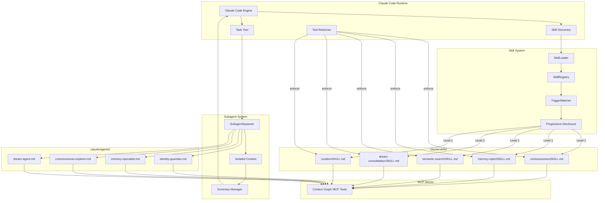
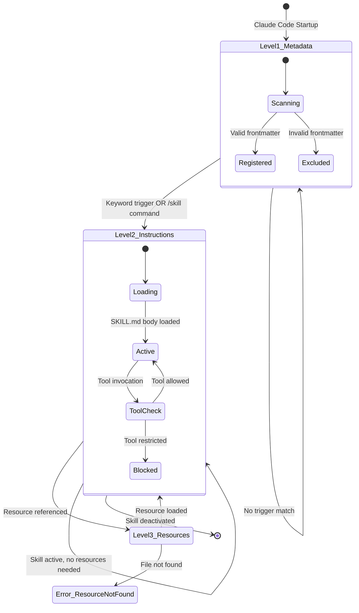
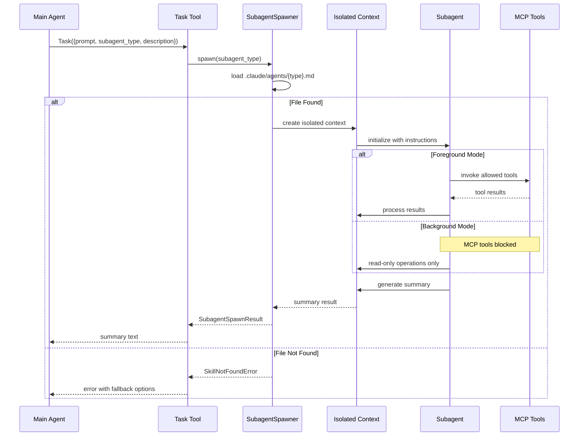
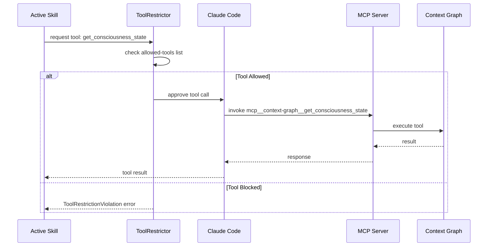
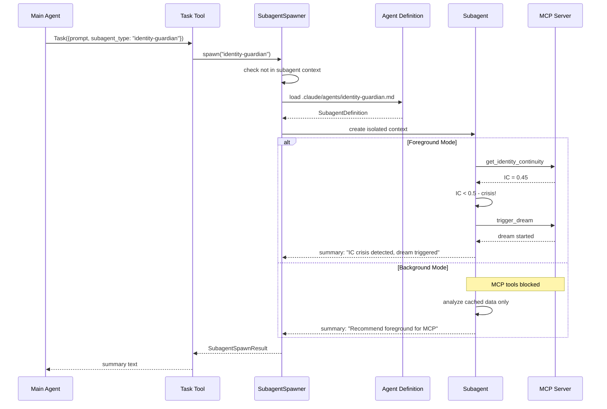

# Technical Specification: Skills and Subagents

```xml
<technical_specification>
  <metadata>
    <id>TECH-SKILLS</id>
    <version>1.0</version>
    <implements>SPEC-SKILLS</implements>
    <depends_on>
      <spec_ref>TECH-HOOKS</spec_ref>
      <spec_ref>TECH-CLI</spec_ref>
      <spec_ref>TECH-SESSION-IDENTITY</spec_ref>
    </depends_on>
    <status>Draft</status>
    <created>2026-01-15</created>
    <estimated_effort>20 hours</estimated_effort>
    <authors>
      <author>Context Graph Architecture Team</author>
    </authors>
    <constitution_refs>
      <ref>claude_code.skills</ref>
      <ref>claude_code.subagents</ref>
      <ref>AP-25</ref>
    </constitution_refs>
  </metadata>
</technical_specification>
```

## 1. Architecture Diagram

### 1.1 Skills and Subagents Integration Flow



### 1.2 Progressive Disclosure State Machine



### 1.3 Subagent Lifecycle



## 2. Data Models

### 2.1 Skill Definition Types

**File**: `crates/context-graph-cli/src/skills/types.rs` (NEW)

```rust
use serde::{Deserialize, Serialize};
use std::collections::HashSet;

/// Progressive disclosure level for skill content loading
/// Implements REQ-SKILLS-03
#[derive(Debug, Clone, Copy, PartialEq, Eq, Serialize, Deserialize)]
pub enum ProgressiveDisclosureLevel {
    /// Level 1: name + description only (~100 tokens)
    Metadata,
    /// Level 2: Full SKILL.md body (<5k tokens)
    Instructions,
    /// Level 3: Bundled resources (unlimited)
    Resources,
}

impl ProgressiveDisclosureLevel {
    /// Get maximum token budget for this level
    pub fn token_budget(&self) -> Option<usize> {
        match self {
            Self::Metadata => Some(100),
            Self::Instructions => Some(5000),
            Self::Resources => None, // unlimited
        }
    }
}

/// YAML frontmatter structure for SKILL.md files
/// Implements REQ-SKILLS-02
#[derive(Debug, Clone, Serialize, Deserialize)]
pub struct SkillFrontmatter {
    /// Skill name (max 64 chars, lowercase with hyphens)
    pub name: String,
    /// Skill description (max 1024 chars, WHAT/WHEN/keywords format)
    pub description: String,
    /// Comma-separated list of allowed tools (optional)
    #[serde(rename = "allowed-tools")]
    pub allowed_tools: Option<String>,
    /// Model to use: haiku|sonnet|opus|inherit (optional)
    pub model: Option<SkillModel>,
    /// Semantic version (optional)
    pub version: Option<String>,
    /// Block auto-invocation by context (optional)
    #[serde(rename = "disable-model-invocation")]
    pub disable_model_invocation: Option<bool>,
    /// Show in /skill menu (optional)
    #[serde(rename = "user-invocable")]
    pub user_invocable: Option<bool>,
}

/// Model selection for skills and subagents
#[derive(Debug, Clone, Copy, PartialEq, Eq, Serialize, Deserialize)]
#[serde(rename_all = "lowercase")]
pub enum SkillModel {
    Haiku,
    Sonnet,
    Opus,
    Inherit,
}

impl Default for SkillModel {
    fn default() -> Self {
        Self::Inherit
    }
}

/// Complete skill definition with parsed content
/// Implements REQ-SKILLS-01, REQ-SKILLS-02
#[derive(Debug, Clone)]
pub struct SkillDefinition {
    /// YAML frontmatter configuration
    pub frontmatter: SkillFrontmatter,
    /// Full SKILL.md body (after frontmatter)
    pub body: String,
    /// Absolute path to skill directory
    pub base_dir: std::path::PathBuf,
    /// Parsed allowed tools set
    pub allowed_tools_set: HashSet<String>,
    /// Keywords extracted from description
    pub keywords: Vec<String>,
}

impl SkillDefinition {
    /// Parse allowed-tools string into set
    pub fn parse_allowed_tools(&mut self) {
        if let Some(tools) = &self.frontmatter.allowed_tools {
            self.allowed_tools_set = tools
                .split(',')
                .map(|s| s.trim().to_string())
                .filter(|s| !s.is_empty())
                .collect();
        }
    }

    /// Extract keywords from description for trigger matching
    pub fn extract_keywords(&mut self) {
        // Keywords appear after "Keywords:" in description
        if let Some(idx) = self.frontmatter.description.find("Keywords:") {
            let keyword_str = &self.frontmatter.description[idx + 9..];
            self.keywords = keyword_str
                .split(&[',', ' '][..])
                .map(|s| s.trim().to_lowercase())
                .filter(|s| !s.is_empty())
                .collect();
        }
    }

    /// Check if tool is allowed for this skill
    pub fn is_tool_allowed(&self, tool_name: &str) -> bool {
        // Empty allowed_tools means all tools allowed
        if self.allowed_tools_set.is_empty() {
            return true;
        }
        // Check exact match or scoped match (e.g., Bash(git:*))
        self.allowed_tools_set.contains(tool_name) ||
            self.allowed_tools_set.iter().any(|allowed| {
                if allowed.contains('(') && allowed.contains('*') {
                    // Handle scoped tools like Bash(git:*)
                    let prefix = allowed.split('(').next().unwrap_or("");
                    tool_name.starts_with(prefix)
                } else {
                    false
                }
            })
    }

    /// Estimate token count for current disclosure level
    pub fn estimate_tokens(&self, level: ProgressiveDisclosureLevel) -> usize {
        match level {
            ProgressiveDisclosureLevel::Metadata => {
                // name + description only
                (self.frontmatter.name.len() + self.frontmatter.description.len()) / 4
            }
            ProgressiveDisclosureLevel::Instructions => {
                // Full body
                self.body.len() / 4
            }
            ProgressiveDisclosureLevel::Resources => {
                // Varies by resource, cannot estimate
                0
            }
        }
    }
}

/// Result of loading a skill
/// Implements REQ-SKILLS-03
#[derive(Debug, Clone)]
pub struct SkillLoadResult {
    /// Whether skill was successfully loaded
    pub loaded: bool,
    /// Current disclosure level
    pub level: ProgressiveDisclosureLevel,
    /// Skill definition (if loaded)
    pub skill: Option<SkillDefinition>,
    /// Instructions text (Level 2+)
    pub instructions: Option<String>,
    /// Tool restrictions parsed from frontmatter
    pub tool_restrictions: HashSet<String>,
    /// Error message if loading failed
    pub error: Option<String>,
}

/// Trigger configuration for auto-invoking skills
/// Implements US-SKILLS-01 through US-SKILLS-05
#[derive(Debug, Clone, Serialize, Deserialize)]
pub struct SkillTrigger {
    /// Skill name to trigger
    pub skill_name: String,
    /// Keywords that trigger this skill
    pub keywords: Vec<String>,
    /// Minimum confidence score for trigger (0.0-1.0)
    pub min_confidence: f32,
    /// Whether user must confirm before loading
    pub require_confirmation: bool,
}

impl Default for SkillTrigger {
    fn default() -> Self {
        Self {
            skill_name: String::new(),
            keywords: Vec::new(),
            min_confidence: 0.5,
            require_confirmation: false,
        }
    }
}
```

### 2.2 Subagent Definition Types

**File**: `crates/context-graph-cli/src/skills/subagent_types.rs` (NEW)

```rust
use serde::{Deserialize, Serialize};
use std::collections::HashSet;

/// Subagent definition loaded from .claude/agents/*.md
/// Implements REQ-SKILLS-11, REQ-SKILLS-12
#[derive(Debug, Clone, Serialize, Deserialize)]
pub struct SubagentDefinition {
    /// Subagent type name (from filename without .md)
    pub name: String,
    /// Subagent description
    pub description: String,
    /// Model to use (haiku for speed, sonnet for capability)
    pub model: SubagentModel,
    /// Allowed MCP tools for this subagent
    pub tools: Vec<String>,
    /// Full instruction content
    pub instructions: String,
    /// Absolute path to definition file
    pub definition_path: std::path::PathBuf,
}

/// Model selection for subagents
#[derive(Debug, Clone, Copy, PartialEq, Eq, Serialize, Deserialize)]
#[serde(rename_all = "lowercase")]
pub enum SubagentModel {
    Haiku,  // Fast, for memory-specialist
    Sonnet, // Balanced, for most subagents
    Opus,   // Most capable, rarely needed
}

impl Default for SubagentModel {
    fn default() -> Self {
        Self::Sonnet
    }
}

/// Result of spawning a subagent via Task tool
/// Implements REQ-SKILLS-17, REQ-SKILLS-20
#[derive(Debug, Clone)]
pub struct SubagentSpawnResult {
    /// Whether spawn was successful
    pub success: bool,
    /// Subagent type that was spawned
    pub subagent_type: String,
    /// Summary returned by subagent
    pub summary: Option<String>,
    /// Duration of subagent execution in milliseconds
    pub duration_ms: u64,
    /// Whether executed in background
    pub background: bool,
    /// Error message if spawn failed
    pub error: Option<String>,
}

/// Built-in subagent types (Task tool defaults)
/// Implements REQ-SKILLS-20
#[derive(Debug, Clone, Copy, PartialEq, Eq, Serialize, Deserialize)]
pub enum BuiltinSubagentType {
    /// Fast codebase search (haiku, read-only)
    Explore,
    /// Analysis and planning (sonnet, read-only)
    Plan,
    /// Complex multi-step tasks (sonnet, read/write)
    GeneralPurpose,
}

impl BuiltinSubagentType {
    pub fn model(&self) -> SubagentModel {
        match self {
            Self::Explore => SubagentModel::Haiku,
            Self::Plan => SubagentModel::Sonnet,
            Self::GeneralPurpose => SubagentModel::Sonnet,
        }
    }

    pub fn is_read_only(&self) -> bool {
        matches!(self, Self::Explore | Self::Plan)
    }
}

/// Context Graph custom subagent types
/// Implements REQ-SKILLS-13 through REQ-SKILLS-16
#[derive(Debug, Clone, Copy, PartialEq, Eq, Serialize, Deserialize)]
#[serde(rename_all = "kebab-case")]
pub enum ContextGraphSubagent {
    /// IC monitoring and protection (sonnet)
    IdentityGuardian,
    /// Fast memory operations (haiku, <500ms)
    MemorySpecialist,
    /// GWT debugging (sonnet)
    ConsciousnessExplorer,
    /// NREM/REM execution (sonnet)
    DreamAgent,
}

impl ContextGraphSubagent {
    pub fn model(&self) -> SubagentModel {
        match self {
            Self::IdentityGuardian => SubagentModel::Sonnet,
            Self::MemorySpecialist => SubagentModel::Haiku,
            Self::ConsciousnessExplorer => SubagentModel::Sonnet,
            Self::DreamAgent => SubagentModel::Sonnet,
        }
    }

    pub fn definition_filename(&self) -> &'static str {
        match self {
            Self::IdentityGuardian => "identity-guardian.md",
            Self::MemorySpecialist => "memory-specialist.md",
            Self::ConsciousnessExplorer => "consciousness-explorer.md",
            Self::DreamAgent => "dream-agent.md",
        }
    }

    pub fn target_latency_ms(&self) -> Option<u64> {
        match self {
            Self::MemorySpecialist => Some(500),
            _ => None,
        }
    }
}

/// Task tool invocation parameters
/// Implements REQ-SKILLS-20
#[derive(Debug, Clone, Serialize, Deserialize)]
pub struct TaskToolParams {
    /// Task prompt/instructions for subagent
    pub prompt: String,
    /// Subagent type (custom or builtin)
    pub subagent_type: String,
    /// Task description
    pub description: String,
    /// Optional model override
    pub model: Option<SubagentModel>,
    /// Run in background (non-blocking)
    pub run_in_background: Option<bool>,
    /// Resume token for background tasks
    pub resume: Option<String>,
}
```

### 2.3 Error Types

**File**: `crates/context-graph-cli/src/skills/errors.rs` (NEW)

```rust
use thiserror::Error;

/// Skill system error types
/// Implements error states ERR-SKILLS-01 through ERR-SKILLS-12
#[derive(Debug, Error)]
pub enum SkillError {
    /// Skill directory or SKILL.md not found
    #[error("Skill '{skill_name}' not found at path: {path}")]
    SkillNotFound {
        skill_name: String,
        path: String,
    },

    /// Invalid YAML frontmatter in SKILL.md
    #[error("Failed to parse skill '{skill_name}': Invalid YAML frontmatter. {details}")]
    SkillParseError {
        skill_name: String,
        details: String,
    },

    /// Required frontmatter field missing
    #[error("Skill '{path}' missing required field '{field}'. Required fields: name, description.")]
    MissingRequiredField {
        path: String,
        field: String,
    },

    /// Skill name validation failed
    #[error("Invalid skill name '{name}': {reason}")]
    InvalidSkillName {
        name: String,
        reason: String,
    },

    /// Tool not in allowed-tools list
    #[error("Tool '{tool}' not allowed for skill '{skill}'. Allowed: {allowed:?}")]
    ToolRestrictionViolation {
        skill: String,
        tool: String,
        allowed: Vec<String>,
    },

    /// Referenced MCP tool not available
    #[error("Skill '{skill}' references unknown tool '{tool}'. Tool not available in current MCP configuration.")]
    ToolNotFound {
        skill: String,
        tool: String,
    },

    /// Resource file not found
    #[error("Resource not found for skill '{skill}': {path}")]
    ResourceNotFound {
        skill: String,
        path: String,
    },

    /// Path traversal attempt detected
    #[error("Security error: Resource path '{path}' attempts traversal outside skill directory.")]
    PathTraversal {
        path: String,
    },

    /// Description exceeds maximum length
    #[error("Description for skill '{skill}' exceeds 1024 character limit ({length} chars).")]
    DescriptionTooLong {
        skill: String,
        length: usize,
    },
}

/// Subagent error types
#[derive(Debug, Error)]
pub enum SubagentError {
    /// Subagent type not found in .claude/agents/
    #[error("Subagent type '{subagent_type}' not found. Expected file: .claude/agents/{subagent_type}.md")]
    SubagentNotFound {
        subagent_type: String,
    },

    /// Subagent spawn was blocked
    #[error("Subagent '{id}' cannot spawn subagents. Subagent spawning is prohibited to prevent recursion.")]
    SpawnBlocked {
        id: String,
    },

    /// MCP tool blocked in background mode
    #[error("MCP tool '{tool}' unavailable in background mode. Use foreground execution for MCP access.")]
    BackgroundMcpBlocked {
        tool: String,
    },

    /// Task tool invocation failed
    #[error("Failed to spawn subagent '{subagent_type}': {reason}")]
    SpawnFailed {
        subagent_type: String,
        reason: String,
    },

    /// Subagent execution timed out
    #[error("Subagent '{subagent_type}' timed out after {timeout_ms}ms")]
    ExecutionTimeout {
        subagent_type: String,
        timeout_ms: u64,
    },

    /// MCP tool execution failed
    #[error("MCP tool '{tool}' failed: {details}")]
    McpToolFailed {
        tool: String,
        details: String,
    },
}

/// Trigger matching error types
#[derive(Debug, Error)]
pub enum TriggerError {
    /// Multiple skills triggered with equal confidence
    #[error("Trigger conflict: Skills {skills:?} all matched with confidence {confidence}. User clarification needed.")]
    TriggerMatchConflict {
        skills: Vec<String>,
        confidence: f32,
    },

    /// Auto-invocation blocked by skill configuration
    #[error("Skill '{skill}' has auto-invocation disabled. Use explicit /{skill} command.")]
    AutoInvocationBlocked {
        skill: String,
    },
}
```

## 3. Component Contracts

### 3.1 SkillLoader

**File**: `crates/context-graph-cli/src/skills/loader.rs` (NEW)

```rust
use crate::skills::{
    errors::SkillError,
    types::{ProgressiveDisclosureLevel, SkillDefinition, SkillFrontmatter, SkillLoadResult},
};
use std::path::{Path, PathBuf};

/// Loads SKILL.md files with progressive disclosure
/// Implements REQ-SKILLS-01, REQ-SKILLS-02, REQ-SKILLS-03
pub struct SkillLoader {
    /// Base directory for skill discovery (e.g., .claude/skills)
    skills_dir: PathBuf,
}

impl SkillLoader {
    /// Create new loader for given skills directory
    ///
    /// # Arguments
    /// * `skills_dir` - Absolute path to .claude/skills directory
    ///
    /// # Errors
    /// Returns error if skills_dir does not exist or is not absolute
    pub fn new(skills_dir: impl AsRef<Path>) -> Result<Self, SkillError>;

    /// Load skill metadata only (Level 1)
    /// Token budget: ~100 tokens per skill
    ///
    /// # Arguments
    /// * `skill_name` - Name of skill directory (e.g., "consciousness")
    ///
    /// # Returns
    /// SkillLoadResult with frontmatter metadata only
    ///
    /// # Errors
    /// - SkillNotFound if directory/SKILL.md missing
    /// - SkillParseError if frontmatter invalid
    /// - MissingRequiredField if name/description missing
    pub fn load_metadata(&self, skill_name: &str) -> Result<SkillLoadResult, SkillError>;

    /// Load skill instructions (Level 2)
    /// Token budget: <5000 tokens
    ///
    /// # Arguments
    /// * `skill_name` - Name of skill directory
    ///
    /// # Returns
    /// SkillLoadResult with full SKILL.md body
    ///
    /// # Errors
    /// Same as load_metadata plus body parsing errors
    pub fn load_instructions(&self, skill_name: &str) -> Result<SkillLoadResult, SkillError>;

    /// Load skill resource (Level 3)
    /// Token budget: unlimited (load on demand)
    ///
    /// # Arguments
    /// * `skill_name` - Name of skill directory
    /// * `resource_path` - Relative path within skill directory (e.g., "references/doc.md")
    ///
    /// # Returns
    /// Resource content as string
    ///
    /// # Errors
    /// - ResourceNotFound if file missing
    /// - PathTraversal if path escapes skill directory
    pub fn load_resource(&self, skill_name: &str, resource_path: &str) -> Result<String, SkillError>;

    /// Parse YAML frontmatter from SKILL.md content
    ///
    /// # Arguments
    /// * `content` - Full SKILL.md file content
    ///
    /// # Returns
    /// Tuple of (SkillFrontmatter, body_content)
    ///
    /// # Errors
    /// - SkillParseError if YAML invalid
    /// - MissingRequiredField if required fields absent
    fn parse_frontmatter(&self, content: &str) -> Result<(SkillFrontmatter, String), SkillError>;

    /// Validate skill name according to rules
    ///
    /// # Rules
    /// - Max 64 characters
    /// - Lowercase a-z, digits 0-9, hyphens only
    /// - Cannot contain "anthropic" or "claude"
    ///
    /// # Errors
    /// InvalidSkillName if validation fails
    fn validate_skill_name(&self, name: &str) -> Result<(), SkillError>;

    /// Validate description according to rules
    ///
    /// # Rules
    /// - Max 1024 characters
    /// - Should be third person
    /// - Should include WHAT/WHEN/keywords
    ///
    /// # Errors
    /// DescriptionTooLong if exceeds limit
    fn validate_description(&self, skill_name: &str, description: &str) -> Result<(), SkillError>;

    /// Resolve {baseDir} placeholders in resource paths
    fn resolve_base_dir(&self, skill_name: &str, path: &str) -> PathBuf;

    /// Check for path traversal attempts
    fn check_path_traversal(&self, skill_name: &str, path: &str) -> Result<(), SkillError>;
}
```

### 3.2 SkillRegistry

**File**: `crates/context-graph-cli/src/skills/registry.rs` (NEW)

```rust
use crate::skills::{
    errors::SkillError,
    loader::SkillLoader,
    types::{SkillDefinition, SkillLoadResult, SkillTrigger},
};
use std::collections::HashMap;
use std::path::PathBuf;

/// Manages skill discovery and registration
/// Implements REQ-SKILLS-34 (precedence)
pub struct SkillRegistry {
    /// Project-level skills (.claude/skills/)
    project_skills: HashMap<String, SkillDefinition>,
    /// Personal skills (~/.claude/skills/)
    personal_skills: HashMap<String, SkillDefinition>,
    /// Plugin skills (from installed plugins)
    plugin_skills: HashMap<String, SkillDefinition>,
    /// Skill loader instance
    loader: SkillLoader,
}

impl SkillRegistry {
    /// Create new registry and discover all skills
    ///
    /// # Arguments
    /// * `project_dir` - Project root containing .claude/
    ///
    /// # Discovery Order (precedence)
    /// 1. Project: {project_dir}/.claude/skills/ (highest)
    /// 2. Personal: ~/.claude/skills/ (medium)
    /// 3. Plugins: installed plugin skills/ (lowest)
    pub fn new(project_dir: impl Into<PathBuf>) -> Result<Self, SkillError>;

    /// Discover all skills at startup (Level 1 metadata only)
    ///
    /// # Returns
    /// Number of skills discovered
    ///
    /// # Side Effects
    /// Populates project_skills, personal_skills, plugin_skills maps
    pub fn discover_all(&mut self) -> Result<usize, SkillError>;

    /// Get skill by name with precedence resolution
    ///
    /// # Arguments
    /// * `name` - Skill name
    ///
    /// # Returns
    /// SkillDefinition if found, checking project -> personal -> plugin
    pub fn get(&self, name: &str) -> Option<&SkillDefinition>;

    /// Get all registered skill names
    pub fn list_all(&self) -> Vec<String>;

    /// Get skills filtered by source (project/personal/plugin)
    pub fn list_by_source(&self, source: SkillSource) -> Vec<&SkillDefinition>;

    /// Register a skill manually (e.g., from plugin installation)
    pub fn register(&mut self, skill: SkillDefinition, source: SkillSource);

    /// Unregister a skill by name
    pub fn unregister(&mut self, name: &str, source: SkillSource) -> bool;

    /// Load full instructions for a skill (Level 2)
    pub fn load_instructions(&mut self, name: &str) -> Result<SkillLoadResult, SkillError>;

    /// Get all trigger configurations for registered skills
    pub fn get_triggers(&self) -> Vec<SkillTrigger>;

    /// Check if skill exists (any source)
    pub fn exists(&self, name: &str) -> bool;
}

/// Source of a skill definition
#[derive(Debug, Clone, Copy, PartialEq, Eq)]
pub enum SkillSource {
    /// Project-level (.claude/skills/)
    Project,
    /// Personal (~/.claude/skills/)
    Personal,
    /// Plugin (installed plugin skills/)
    Plugin,
}
```

### 3.3 SubagentSpawner

**File**: `crates/context-graph-cli/src/skills/spawner.rs` (NEW)

```rust
use crate::skills::{
    errors::SubagentError,
    subagent_types::{
        ContextGraphSubagent, SubagentDefinition, SubagentModel, SubagentSpawnResult, TaskToolParams,
    },
};
use std::path::PathBuf;

/// Spawns subagents via Task tool
/// Implements REQ-SKILLS-17, REQ-SKILLS-18, REQ-SKILLS-19, REQ-SKILLS-20
pub struct SubagentSpawner {
    /// Directory containing subagent definitions (.claude/agents/)
    agents_dir: PathBuf,
    /// Currently active subagent (if any) - used to enforce no-spawn constraint
    current_subagent: Option<String>,
}

impl SubagentSpawner {
    /// Create new spawner for given agents directory
    ///
    /// # Arguments
    /// * `agents_dir` - Absolute path to .claude/agents directory
    pub fn new(agents_dir: impl Into<PathBuf>) -> Self;

    /// Load subagent definition from file
    ///
    /// # Arguments
    /// * `subagent_type` - Subagent type name (without .md)
    ///
    /// # Returns
    /// SubagentDefinition with parsed content
    ///
    /// # Errors
    /// SubagentNotFound if file missing
    pub fn load_definition(&self, subagent_type: &str) -> Result<SubagentDefinition, SubagentError>;

    /// Spawn a subagent with given parameters
    ///
    /// # Arguments
    /// * `params` - Task tool invocation parameters
    ///
    /// # Returns
    /// SubagentSpawnResult with summary or error
    ///
    /// # Errors
    /// - SubagentNotFound if definition missing
    /// - SpawnBlocked if called from within subagent
    /// - BackgroundMcpBlocked if background mode with MCP tools
    ///
    /// # Constraints
    /// - Subagents cannot spawn other subagents (REQ-SKILLS-18)
    /// - Background subagents cannot use MCP tools (REQ-SKILLS-19)
    pub fn spawn(&mut self, params: TaskToolParams) -> Result<SubagentSpawnResult, SubagentError>;

    /// Spawn a Context Graph subagent by type
    ///
    /// # Arguments
    /// * `subagent` - Context Graph subagent type
    /// * `prompt` - Task prompt
    /// * `background` - Run in background mode
    pub fn spawn_context_graph(
        &mut self,
        subagent: ContextGraphSubagent,
        prompt: &str,
        background: bool,
    ) -> Result<SubagentSpawnResult, SubagentError>;

    /// Check if currently executing within a subagent context
    pub fn is_in_subagent_context(&self) -> bool {
        self.current_subagent.is_some()
    }

    /// Set current subagent context (called when subagent starts)
    pub fn enter_subagent_context(&mut self, subagent_type: &str);

    /// Clear current subagent context (called when subagent ends)
    pub fn exit_subagent_context(&mut self);

    /// Check if MCP tools allowed for current context
    ///
    /// # Arguments
    /// * `tool_name` - MCP tool name
    /// * `background` - Whether running in background mode
    ///
    /// # Returns
    /// true if tool allowed, false if blocked
    pub fn is_mcp_allowed(&self, tool_name: &str, background: bool) -> bool;

    /// Get list of read-only tools allowed in background mode
    pub fn background_allowed_tools() -> Vec<&'static str> {
        vec!["Read", "Grep", "Glob"]
    }
}
```

### 3.4 ToolRestrictor

**File**: `crates/context-graph-cli/src/skills/restrictor.rs` (NEW)

```rust
use crate::skills::{
    errors::SkillError,
    types::SkillDefinition,
};
use std::collections::HashSet;

/// Enforces tool restrictions per skill/subagent
/// Implements allowed-tools frontmatter field
pub struct ToolRestrictor {
    /// Active skill's allowed tools (empty = all allowed)
    active_restrictions: HashSet<String>,
    /// Active skill name (for error messages)
    active_skill: Option<String>,
    /// Whether in background mode (MCP blocked)
    background_mode: bool,
}

impl ToolRestrictor {
    /// Create new restrictor with no active restrictions
    pub fn new() -> Self;

    /// Apply restrictions from skill definition
    ///
    /// # Arguments
    /// * `skill` - Skill definition with allowed-tools
    pub fn apply_skill(&mut self, skill: &SkillDefinition);

    /// Apply restrictions for subagent in background mode
    pub fn apply_background_mode(&mut self);

    /// Clear all restrictions
    pub fn clear(&mut self);

    /// Check if tool invocation is allowed
    ///
    /// # Arguments
    /// * `tool_name` - Full tool name (e.g., "mcp__context-graph__get_consciousness_state")
    ///
    /// # Returns
    /// Ok(()) if allowed, Err with details if blocked
    ///
    /// # Errors
    /// - ToolRestrictionViolation if tool not in allowed list
    pub fn check(&self, tool_name: &str) -> Result<(), SkillError>;

    /// Check if tool is MCP tool
    pub fn is_mcp_tool(tool_name: &str) -> bool {
        tool_name.starts_with("mcp__")
    }

    /// Check if tool is read-only (allowed in background)
    pub fn is_read_only_tool(tool_name: &str) -> bool {
        matches!(tool_name, "Read" | "Grep" | "Glob")
    }

    /// Get current active restrictions
    pub fn active_restrictions(&self) -> &HashSet<String>;
}

impl Default for ToolRestrictor {
    fn default() -> Self {
        Self::new()
    }
}
```

### 3.5 TriggerMatcher

**File**: `crates/context-graph-cli/src/skills/matcher.rs` (NEW)

```rust
use crate::skills::{
    errors::TriggerError,
    types::{SkillDefinition, SkillTrigger},
};

/// Matches context to auto-trigger skills
/// Implements skill discovery via keywords
pub struct TriggerMatcher {
    /// Registered skill triggers
    triggers: Vec<SkillTrigger>,
    /// Minimum confidence threshold for trigger
    min_confidence: f32,
}

impl TriggerMatcher {
    /// Create new matcher with default confidence threshold
    pub fn new() -> Self {
        Self {
            triggers: Vec::new(),
            min_confidence: 0.5,
        }
    }

    /// Create matcher with custom confidence threshold
    pub fn with_confidence(min_confidence: f32) -> Self {
        Self {
            triggers: Vec::new(),
            min_confidence,
        }
    }

    /// Register triggers from skill definitions
    ///
    /// # Arguments
    /// * `skills` - Slice of skill definitions to extract triggers from
    pub fn register_triggers(&mut self, skills: &[SkillDefinition]);

    /// Match user input against registered triggers
    ///
    /// # Arguments
    /// * `input` - User input text to analyze
    ///
    /// # Returns
    /// Matched skill name if confident match found
    ///
    /// # Errors
    /// - TriggerMatchConflict if multiple skills match with equal confidence
    /// - AutoInvocationBlocked if matched skill has disable-model-invocation
    pub fn match_input(&self, input: &str) -> Result<Option<String>, TriggerError>;

    /// Calculate match confidence for a skill
    ///
    /// # Arguments
    /// * `trigger` - Skill trigger configuration
    /// * `input` - User input text
    ///
    /// # Returns
    /// Confidence score 0.0-1.0
    fn calculate_confidence(&self, trigger: &SkillTrigger, input: &str) -> f32;

    /// Get all potential matches above threshold
    ///
    /// # Arguments
    /// * `input` - User input text
    ///
    /// # Returns
    /// Vector of (skill_name, confidence) tuples sorted by confidence
    pub fn get_all_matches(&self, input: &str) -> Vec<(String, f32)>;

    /// Check for trigger conflicts
    ///
    /// # Arguments
    /// * `matches` - Sorted matches from get_all_matches
    ///
    /// # Errors
    /// TriggerMatchConflict if top matches have equal confidence
    fn check_conflicts(&self, matches: &[(String, f32)]) -> Result<(), TriggerError>;
}

impl Default for TriggerMatcher {
    fn default() -> Self {
        Self::new()
    }
}
```

## 4. File System Layout

### 4.1 Directory Structure

```
.claude/
├── settings.json              # Native hook configuration (Phase 3)
├── skills/
│   ├── consciousness/
│   │   └── SKILL.md           # Consciousness state access skill
│   ├── memory-inject/
│   │   └── SKILL.md           # Context retrieval skill
│   ├── semantic-search/
│   │   └── SKILL.md           # Graph search skill
│   ├── dream-consolidation/
│   │   └── SKILL.md           # Memory consolidation skill
│   └── curation/
│       └── SKILL.md           # Graph maintenance skill
├── agents/
│   ├── identity-guardian.md   # IC monitoring subagent
│   ├── memory-specialist.md   # Fast memory ops subagent
│   ├── consciousness-explorer.md  # GWT debugging subagent
│   └── dream-agent.md         # Dream execution subagent
└── rules/
    └── consciousness.md       # Always-on consciousness rules

hooks/                         # Shell script executors (Phase 3)
├── session-start.sh
├── pre-tool-use.sh
├── post-tool-use.sh
├── user-prompt-submit.sh
└── session-end.sh
```

### 4.2 Optional Skill Subdirectories

```
.claude/skills/{skill-name}/
├── SKILL.md                   # Required: Main skill definition
├── scripts/                   # Optional: Execute via bash
│   └── helper.py              # Script code never loads into context
├── references/                # Optional: Read when needed (Level 3)
│   └── extended-docs.md       # Loaded on demand
├── templates/                 # Optional: Copy/modify
│   └── output-template.md     # Template files
└── assets/                    # Optional: Binary files
    └── image.png              # Asset files
```

## 5. SKILL.md Template Structure

### 5.1 Frontmatter Schema

```yaml
---
# REQUIRED FIELDS
name: skill-name               # Max 64 chars, lowercase, hyphens only
                               # Cannot contain "anthropic" or "claude"

description: |                 # Max 1024 chars
  What the skill does.         # Third person, WHAT/WHEN/keywords format
  When to use it.              # Include trigger keywords at end
  Keywords: keyword1, keyword2, keyword3

# OPTIONAL FIELDS
allowed-tools: Read,Grep,Tool1,Tool2    # Comma-separated tool names
                                         # Supports scoped: Bash(git:*)

model: sonnet                  # haiku | sonnet | opus | inherit
                               # Default: inherit (use current model)

version: 1.0.0                 # Semantic version

disable-model-invocation: false  # true = block auto-invocation
                                 # Requires explicit /skill command

user-invocable: true           # true = show in /skill menu
---
```

### 5.2 Body Structure

```markdown
# Skill Title

## Overview
Purpose and capabilities of this skill.
High-level description of what it accomplishes.

## Prerequisites
- Any requirements or dependencies
- Expected MCP tools available

## Instructions
1. Step one with specific action
2. Step two with expected result
3. Continue with numbered steps

## Parameters
| Parameter | Default | Description |
|-----------|---------|-------------|
| param1    | value   | What it does |
| param2    | value   | What it does |

## Thresholds
| Status | Range | Action |
|--------|-------|--------|
| good   | >= X  | None   |
| warn   | < X   | Alert  |

## Examples
### Example 1: Basic Usage
Input: "User query here"
Response: Expected output format

### Example 2: Advanced Usage
Input: "Complex query"
Response: Detailed output

## Error Handling
| Error | Cause | Solution |
|-------|-------|----------|
| Err1  | Reason| Fix      |

## Resources
- `{baseDir}/scripts/helper.py` - Helper script
- `{baseDir}/references/docs.md` - Extended documentation
```

## 6. Subagent Definition Template

### 6.1 Agent Markdown Structure

```markdown
# {Agent Name} Subagent

## Role
Brief description of the subagent's purpose and responsibilities.

## Model
{haiku | sonnet | opus}

## Allowed Tools
- mcp__context-graph__{tool1}
- mcp__context-graph__{tool2}
- Read
- Grep (if applicable)

## Protocol
1. First step in execution protocol
2. Second step
3. Continue with numbered steps
4. Final step and summary generation

## Thresholds
| Status | Range | Color | Action |
|--------|-------|-------|--------|
| state1 | >= X  | Green | Continue |
| state2 | < X   | Yellow| Monitor |
| state3 | < Y   | Red   | Escalate |

## Parameters
| Parameter | Default | Description |
|-----------|---------|-------------|
| param1    | value   | Purpose     |

## Output Format
Return summary with:
- Key metric 1
- Key metric 2
- Actions taken
- Recommendations

## Constraints
- Cannot spawn other subagents
- Background mode: No MCP tools
- Target latency: {if applicable}
```

## 7. MCP Tool Mappings

### 7.1 Skills to MCP Tools

| Skill | MCP Tools |
|-------|-----------|
| `consciousness` | `get_consciousness_state`, `get_kuramoto_sync`, `get_identity_continuity`, `get_ego_state`, `get_workspace_status` |
| `memory-inject` | `inject_context`, `get_memetic_status` |
| `semantic-search` | `search_graph`, `find_causal_path`, `generate_search_plan` |
| `dream-consolidation` | `trigger_dream`, `get_memetic_status`, `get_consciousness_state` |
| `curation` | `merge_concepts`, `annotate_node`, `forget_concept`, `boost_importance`, `get_memetic_status` |

### 7.2 Subagents to MCP Tools

| Subagent | MCP Tools |
|----------|-----------|
| `identity-guardian` | `get_identity_continuity`, `get_ego_state`, `trigger_dream` |
| `memory-specialist` | `inject_context`, `search_graph`, `store_memory`, `memory_retrieve` |
| `consciousness-explorer` | `get_consciousness_state`, `get_kuramoto_sync`, `get_workspace_status`, `get_johari_classification` |
| `dream-agent` | `trigger_dream`, `get_memetic_status` |

### 7.3 Tool Restriction Matrix

| Tool Category | Skills | Subagents (FG) | Subagents (BG) |
|---------------|--------|----------------|----------------|
| MCP Tools | Per allowed-tools | Per definition | BLOCKED |
| Read | Always allowed | Always allowed | Allowed |
| Grep | If in allowed-tools | If in definition | Allowed |
| Glob | If in allowed-tools | If in definition | Allowed |
| Write | If in allowed-tools | If in definition | BLOCKED |
| Edit | If in allowed-tools | If in definition | BLOCKED |
| Bash | If in allowed-tools | If in definition | BLOCKED |
| Task | Allowed | BLOCKED | BLOCKED |

## 8. Integration Points

### 8.1 Phase 3 Hooks Integration

| Hook | Skill/Subagent Integration |
|------|---------------------------|
| `SessionStart` | Skills available after session restore; identity-guardian can monitor restored IC |
| `PreToolUse` | Consciousness skill provides brief; ToolRestrictor validates allowed tools |
| `PostToolUse` | Identity-guardian monitors IC delta; skills can auto-trigger on tool results |
| `UserPromptSubmit` | TriggerMatcher matches input to skills; memory-inject can inject context |
| `SessionEnd` | Dream-agent can consolidate; curation skill can prune before persist |

### 8.2 MCP Tool Invocation Flow



### 8.3 Task Tool Subagent Flow



## 9. Test Strategy

### 9.1 Unit Tests

#### TC-SKILLS-U01: SKILL.md Frontmatter Parsing
```rust
#[test]
fn test_valid_frontmatter_parsing() {
    let loader = SkillLoader::new(".claude/skills").unwrap();
    let result = loader.load_metadata("consciousness").unwrap();

    assert!(result.loaded);
    assert_eq!(result.level, ProgressiveDisclosureLevel::Metadata);

    let skill = result.skill.unwrap();
    assert_eq!(skill.frontmatter.name, "consciousness");
    assert!(skill.frontmatter.description.contains("consciousness"));
    assert_eq!(skill.frontmatter.model, Some(SkillModel::Sonnet));
}

#[test]
fn test_invalid_yaml_frontmatter() {
    let content = "---\nname:consciousness\n  bad indent\n---";
    let loader = SkillLoader::new(".claude/skills").unwrap();
    let result = loader.parse_frontmatter(content);

    assert!(matches!(result, Err(SkillError::SkillParseError { .. })));
}

#[test]
fn test_missing_required_field() {
    let content = "---\ndescription: No name field\n---";
    let loader = SkillLoader::new(".claude/skills").unwrap();
    let result = loader.parse_frontmatter(content);

    assert!(matches!(result, Err(SkillError::MissingRequiredField { field, .. }) if field == "name"));
}
```

#### TC-SKILLS-U02: Progressive Disclosure Levels
```rust
#[test]
fn test_level1_metadata_tokens() {
    let loader = SkillLoader::new(".claude/skills").unwrap();
    let result = loader.load_metadata("consciousness").unwrap();

    let skill = result.skill.unwrap();
    let tokens = skill.estimate_tokens(ProgressiveDisclosureLevel::Metadata);

    assert!(tokens <= 150, "Level 1 should be ~100 tokens, got {}", tokens);
}

#[test]
fn test_level2_instructions_tokens() {
    let loader = SkillLoader::new(".claude/skills").unwrap();
    let result = loader.load_instructions("consciousness").unwrap();

    let skill = result.skill.unwrap();
    let tokens = skill.estimate_tokens(ProgressiveDisclosureLevel::Instructions);

    assert!(tokens < 5000, "Level 2 should be <5k tokens, got {}", tokens);
}
```

#### TC-SKILLS-U03: Tool Restriction Enforcement
```rust
#[test]
fn test_allowed_tools_check() {
    let skill = create_test_skill_with_tools("Read,Grep,mcp__context-graph__get_consciousness_state");

    assert!(skill.is_tool_allowed("Read"));
    assert!(skill.is_tool_allowed("Grep"));
    assert!(skill.is_tool_allowed("mcp__context-graph__get_consciousness_state"));
    assert!(!skill.is_tool_allowed("Write"));
    assert!(!skill.is_tool_allowed("mcp__context-graph__store_memory"));
}

#[test]
fn test_scoped_bash_tools() {
    let skill = create_test_skill_with_tools("Bash(git:*)");

    assert!(skill.is_tool_allowed("Bash(git:status)"));
    assert!(skill.is_tool_allowed("Bash(git:commit)"));
    assert!(!skill.is_tool_allowed("Bash(rm:-)"));
}
```

#### TC-SKILLS-U04: Subagent Spawn Constraint
```rust
#[test]
fn test_subagent_cannot_spawn_subagent() {
    let mut spawner = SubagentSpawner::new(".claude/agents");

    // Enter subagent context
    spawner.enter_subagent_context("identity-guardian");

    // Attempt to spawn another subagent
    let params = TaskToolParams {
        prompt: "test".into(),
        subagent_type: "dream-agent".into(),
        description: "test".into(),
        ..Default::default()
    };

    let result = spawner.spawn(params);
    assert!(matches!(result, Err(SubagentError::SpawnBlocked { .. })));
}
```

#### TC-SKILLS-U05: Background MCP Tool Constraint
```rust
#[test]
fn test_background_mcp_blocked() {
    let spawner = SubagentSpawner::new(".claude/agents");

    assert!(!spawner.is_mcp_allowed("mcp__context-graph__get_consciousness_state", true));
    assert!(spawner.is_mcp_allowed("mcp__context-graph__get_consciousness_state", false));
}

#[test]
fn test_background_readonly_allowed() {
    let spawner = SubagentSpawner::new(".claude/agents");

    assert!(SubagentSpawner::background_allowed_tools().contains(&"Read"));
    assert!(SubagentSpawner::background_allowed_tools().contains(&"Grep"));
    assert!(SubagentSpawner::background_allowed_tools().contains(&"Glob"));
}
```

#### TC-SKILLS-U06: IC Threshold Classification
```rust
#[test]
fn test_ic_thresholds() {
    // Test identity-guardian threshold classification
    assert_eq!(classify_ic(0.95), "healthy");   // >= 0.9 green
    assert_eq!(classify_ic(0.85), "healthy");   // >= 0.9 green
    assert_eq!(classify_ic(0.75), "warning");   // 0.7-0.9 yellow
    assert_eq!(classify_ic(0.55), "degraded");  // 0.5-0.7 orange
    assert_eq!(classify_ic(0.45), "critical");  // < 0.5 red
    assert_eq!(classify_ic(0.30), "critical");  // < 0.5 red
}

fn classify_ic(ic: f32) -> &'static str {
    if ic >= 0.9 { "healthy" }
    else if ic >= 0.7 { "warning" }
    else if ic >= 0.5 { "degraded" }
    else { "critical" }
}
```

### 9.2 Integration Tests

#### TC-SKILLS-I01: Skill Discovery and Loading
```rust
#[tokio::test]
async fn test_all_skills_discoverable() {
    let registry = SkillRegistry::new(".").unwrap();

    let expected_skills = vec![
        "consciousness",
        "memory-inject",
        "semantic-search",
        "dream-consolidation",
        "curation",
    ];

    for skill_name in expected_skills {
        assert!(registry.exists(skill_name), "Skill {} should exist", skill_name);

        let skill = registry.get(skill_name).unwrap();
        assert!(!skill.keywords.is_empty(), "Skill {} should have keywords", skill_name);
    }
}
```

#### TC-SKILLS-I02: Subagent Spawn and Execution
```rust
#[tokio::test]
async fn test_all_subagents_spawnable() {
    let spawner = SubagentSpawner::new(".claude/agents");

    let subagents = vec![
        ContextGraphSubagent::IdentityGuardian,
        ContextGraphSubagent::MemorySpecialist,
        ContextGraphSubagent::ConsciousnessExplorer,
        ContextGraphSubagent::DreamAgent,
    ];

    for subagent in subagents {
        let def = spawner.load_definition(subagent.definition_filename().trim_end_matches(".md")).unwrap();

        assert!(!def.instructions.is_empty());
        assert!(!def.tools.is_empty());
        assert_eq!(def.model, subagent.model());
    }
}
```

#### TC-SKILLS-I03: Skill MCP Tool Integration
```rust
#[tokio::test]
async fn test_skill_mcp_tools_valid() {
    let registry = SkillRegistry::new(".").unwrap();

    let skill = registry.get("consciousness").unwrap();

    // Verify all allowed tools exist in MCP namespace
    for tool in &skill.allowed_tools_set {
        if tool.starts_with("mcp__context-graph__") {
            // Would verify against actual MCP server in real test
            assert!(tool.len() > "mcp__context-graph__".len());
        }
    }
}
```

### 9.3 Performance Tests

#### TC-SKILLS-P01: Skill Discovery Latency
```rust
#[test]
fn test_skill_discovery_performance() {
    let start = std::time::Instant::now();

    let registry = SkillRegistry::new(".").unwrap();
    let count = registry.discover_all().unwrap();

    let duration = start.elapsed();

    assert!(duration.as_millis() < 1000, "Discovery should complete in <1s");
    assert_eq!(count, 5, "Should discover 5 skills");
}
```

#### TC-SKILLS-P03: Memory Specialist Latency
```rust
#[tokio::test]
async fn test_memory_specialist_latency() {
    let mut spawner = SubagentSpawner::new(".claude/agents");

    let start = std::time::Instant::now();

    let result = spawner.spawn_context_graph(
        ContextGraphSubagent::MemorySpecialist,
        "Search for authentication patterns",
        false,
    ).unwrap();

    let duration = start.elapsed();

    assert!(result.success);
    assert!(duration.as_millis() < 500, "Memory specialist should complete in <500ms");
}
```

## 10. Critical Implementation Rules

1. **NO backwards compatibility code** - Skills and subagents are new, no legacy support needed
2. **Fail fast with detailed error messages** - Use SkillError/SubagentError types with context
3. **All paths must be absolute** - Use PathBuf, never relative paths
4. **No path traversal** - Validate all resource paths stay within skill directory
5. **TypeScript strict mode** - If any TS code needed, use strict: true
6. **Structured logging** - All errors log to tracing with skill/subagent context

## 11. Appendix

### A. Skill Name Validation Rules

| Rule | Regex | Example Valid | Example Invalid |
|------|-------|---------------|-----------------|
| Max 64 chars | `.{1,64}` | `memory-inject` | `a-very-long-skill-name-that-exceeds-the-maximum-allowed-character-limit` |
| Lowercase | `[a-z0-9-]+` | `semantic-search` | `Semantic-Search` |
| Hyphens only | `^[a-z][a-z0-9-]*$` | `dream-consolidation` | `dream_consolidation` |
| No reserved words | - | `my-assistant` | `claude-helper`, `anthropic-skill` |

### B. Complete MCP Tool Reference

```
mcp__context-graph__get_consciousness_state
mcp__context-graph__get_kuramoto_sync
mcp__context-graph__get_identity_continuity
mcp__context-graph__get_ego_state
mcp__context-graph__get_workspace_status
mcp__context-graph__inject_context
mcp__context-graph__get_memetic_status
mcp__context-graph__search_graph
mcp__context-graph__find_causal_path
mcp__context-graph__generate_search_plan
mcp__context-graph__trigger_dream
mcp__context-graph__merge_concepts
mcp__context-graph__annotate_node
mcp__context-graph__forget_concept
mcp__context-graph__boost_importance
mcp__context-graph__store_memory
mcp__context-graph__memory_retrieve
mcp__context-graph__get_johari_classification
```

### C. Requirement Traceability

| Spec Section | Requirements | Test Cases |
|--------------|--------------|------------|
| Skill Definition | REQ-SKILLS-01 to 10 | TC-SKILLS-U01, U02, U03 |
| Subagent Definition | REQ-SKILLS-11 to 20 | TC-SKILLS-U04, U05, U06 |
| Skill Content | REQ-SKILLS-21 to 30 | TC-SKILLS-I01, I03 |
| File Structure | REQ-SKILLS-31 to 35 | TC-SKILLS-I01, I02 |
| Performance | REQ-SKILLS-36 to 40 | TC-SKILLS-P01, P03 |
| Integration | REQ-SKILLS-41 to 45 | TC-SKILLS-I03 |
