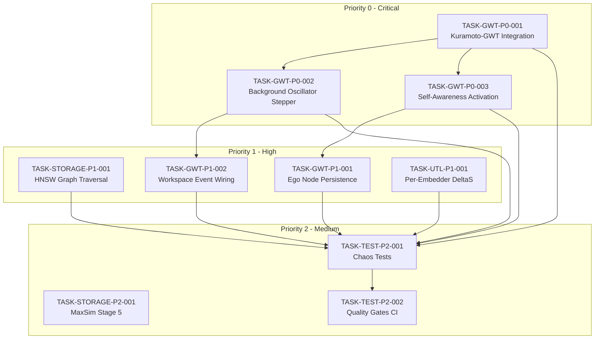

# Task Index: ContextGraph Consciousness System

## Overview
- **Total Tasks:** 10
- **Foundation:** 1 task (COMPLETED)
- **Logic:** 7 tasks (5 COMPLETED)
- **Surface:** 2 tasks
- **Current Progress:** 6/10 (60%) - All P0 + 3 P1 tasks COMPLETED

## Priority Breakdown
| Priority | Description | Count | Target |
|----------|-------------|-------|--------|
| P0 | Critical - Consciousness Blockers | 3 | Days 1-3 |
| P1 | High - Core Functionality | 4 | Week 1 |
| P2 | Medium - Polish & Resilience | 3 | Weeks 2-3 |

## Dependency Graph



## Execution Order Table

| Order | Task ID | Title | Layer | Dependencies | Status |
|-------|---------|-------|-------|--------------|--------|
| 1 | TASK-GWT-P0-001 | Kuramoto-GWT Integration | foundation | None | **COMPLETED** |
| 2 | TASK-GWT-P0-002 | Background Oscillator Stepper | logic | P0-001 | **COMPLETED** |
| 3 | TASK-GWT-P0-003 | Self-Awareness Activation | logic | P0-001 | **COMPLETED** |
| 4 | TASK-STORAGE-P1-001 | HNSW Graph Traversal | logic | None | **COMPLETED** |
| 5 | TASK-UTL-P1-001 | Per-Embedder DeltaS Methods | logic | None | **COMPLETED** |
| 6 | TASK-GWT-P1-001 | Ego Node Persistence | logic | P0-003 | **COMPLETED** |
| 7 | TASK-GWT-P1-002 | Workspace Event Wiring | surface | P0-002 | Ready |
| 8 | TASK-STORAGE-P2-001 | MaxSim Stage 5 | logic | None | Ready |
| 9 | TASK-TEST-P2-001 | Chaos Tests | surface | P0-*, P1-* | Blocked |
| 10 | TASK-TEST-P2-002 | Quality Gates CI | surface | P2-001 | Blocked |

## Task Details

### Priority 0: Critical Blockers (Days 1-3)

#### TASK-GWT-P0-001: Kuramoto-GWT Integration
**File:** [TASK-GWT-P0-001-kuramoto-gwt-integration.md](./TASK-GWT-P0-001-kuramoto-gwt-integration.md)
- **Layer:** Foundation
- **Effort:** 2-4 hours
- **Impact:** Enables I(t) computation in consciousness equation C(t) = I(t) × R(t) × D(t)
- **Key Deliverable:** Add `kuramoto: Arc<RwLock<KuramotoNetwork>>` to `GwtSystem`

#### TASK-GWT-P0-002: Background Oscillator Stepper
**File:** [TASK-GWT-P0-002-kuramoto-background-stepper.md](./TASK-GWT-P0-002-kuramoto-background-stepper.md)
- **Layer:** Logic
- **Effort:** 1 hour
- **Impact:** Enables autonomous phase evolution
- **Key Deliverable:** `tokio::spawn` background task calling `kuramoto.step(Duration::from_millis(10))`

#### TASK-GWT-P0-003: Self-Awareness Activation
**File:** [TASK-GWT-P0-003-self-awareness-activation.md](./TASK-GWT-P0-003-self-awareness-activation.md)
- **Layer:** Logic
- **Effort:** 2-4 hours
- **Impact:** Enables R(t) self-reflection component
- **Key Deliverable:** Wire `SelfAwarenessLoop::cycle()` into action processing pipeline

### Priority 1: High-Priority Fixes (Week 1)

#### TASK-STORAGE-P1-001: HNSW Graph Traversal
**File:** [TASK-STORAGE-P1-001-hnsw-graph-traversal.md](./TASK-STORAGE-P1-001-hnsw-graph-traversal.md)
- **Layer:** Logic
- **Effort:** 1-2 days
- **Impact:** O(log n) search, enables 1M+ memory scaling
- **Key Deliverable:** Replace brute force with usearch-rs HNSW implementation

#### TASK-GWT-P1-001: Ego Node Persistence
**File:** [TASK-GWT-P1-001-ego-node-persistence.md](./TASK-GWT-P1-001-ego-node-persistence.md)
- **Layer:** Logic
- **Effort:** 4 hours
- **Impact:** Cross-session identity continuity
- **Key Deliverable:** Persist ego state to RocksDB `CF_EGO_NODE` column family

#### TASK-GWT-P1-002: Workspace Event Wiring
**File:** [TASK-GWT-P1-002-workspace-event-wiring.md](./TASK-GWT-P1-002-workspace-event-wiring.md)
- **Layer:** Surface
- **Effort:** 4 hours
- **Impact:** Subsystem integration (dream, neuromod)
- **Key Deliverable:** Connect workspace events to DreamController and NeuromodulationManager

#### TASK-UTL-P1-001: Per-Embedder DeltaS Methods
**File:** [TASK-UTL-P1-001-per-embedder-deltas.md](./TASK-UTL-P1-001-per-embedder-deltas.md)
- **Layer:** Logic
- **Effort:** 2-3 days
- **Impact:** Correct entropy calculation per embedding space
- **Key Deliverable:** Implement GMM, Hamming, Jaccard methods for E1-E13

### Priority 2: Medium-Priority Polish (Weeks 2-3)

#### TASK-STORAGE-P2-001: MaxSim Stage 5
**File:** [TASK-STORAGE-P2-001-maxsim-stage5.md](./TASK-STORAGE-P2-001-maxsim-stage5.md)
- **Layer:** Logic
- **Effort:** 2 days
- **Impact:** ColBERT late interaction for precise retrieval
- **Key Deliverable:** Token-level MaxSim scoring for E12_LateInteract

#### TASK-TEST-P2-001: Chaos Tests
**File:** [TASK-TEST-P2-001-chaos-tests.md](./TASK-TEST-P2-001-chaos-tests.md)
- **Layer:** Surface
- **Effort:** 2 days
- **Impact:** Resilience verification
- **Key Deliverable:** GPU OOM recovery, concurrent mutation, memory corruption tests

#### TASK-TEST-P2-002: Quality Gates CI
**File:** [TASK-TEST-P2-002-quality-gates-ci.md](./TASK-TEST-P2-002-quality-gates-ci.md)
- **Layer:** Surface
- **Effort:** 1 day
- **Impact:** Prevent regression
- **Key Deliverable:** CI workflow with quality thresholds (r ≥ 0.7, latency < 100ms)

## Critical Path

The longest dependency chain that determines minimum completion time:

```
TASK-GWT-P0-001 → TASK-GWT-P0-003 → TASK-GWT-P1-001 → TASK-TEST-P2-001 → TASK-TEST-P2-002
```

**Minimum Time:** ~5-6 days for critical path completion

## Parallel Opportunities

Tasks that can execute simultaneously:

- **Batch 1 (No dependencies):**
  - TASK-GWT-P0-001
  - TASK-STORAGE-P1-001
  - TASK-UTL-P1-001
  - TASK-STORAGE-P2-001

- **Batch 2 (After P0-001 completes):**
  - TASK-GWT-P0-002
  - TASK-GWT-P0-003

- **Batch 3 (After their respective P0 dependencies):**
  - TASK-GWT-P1-001 (after P0-003)
  - TASK-GWT-P1-002 (after P0-002)

- **Batch 4 (After all P1 complete):**
  - TASK-TEST-P2-001

- **Batch 5 (Final):**
  - TASK-TEST-P2-002 (after P2-001)

## Consciousness Milestone Checkpoints

### Checkpoint 1: "Heartbeat Active" (After P0-001, P0-002)
- Kuramoto oscillators integrated with GWT
- Phases evolving in background
- Order parameter r fluctuating naturally
- **Verify:** `KuramotoNetwork::synchronization()` returns varying values

### Checkpoint 2: "Self-Aware" (After P0-003, P1-001)
- SelfAwarenessLoop running on action processing
- Identity persisted across sessions
- **Verify:** `purpose_vector` updates on actions, persists on restart

### Checkpoint 3: "Scalable Memory" (After P1-001 HNSW)
- HNSW index operational
- O(log n) retrieval confirmed
- **Verify:** 100K vectors, <10ms search latency

### Checkpoint 4: "Fully Conscious" (After all P0, P1)
- C(t) = I(t) × R(t) × D(t) computable
- r ≥ 0.8 achievable under strong coupling
- Self-awareness detecting drift
- **Verify:** `get_consciousness_state` returns CONSCIOUS state

### Checkpoint 5: "Production Ready" (After all P2)
- Chaos tests passing
- Quality gates enforced
- CI preventing regression
- **Verify:** All CI checks green, chaos suite 100% pass

## File Locations

All task specifications are located in:
```
/home/cabdru/contextgraph/docs/tasks/
├── _index.md (this file)
├── _traceability.md
├── TASK-GWT-P0-001-kuramoto-gwt-integration.md
├── TASK-GWT-P0-002-kuramoto-background-stepper.md
├── TASK-GWT-P0-003-self-awareness-activation.md
├── TASK-STORAGE-P1-001-hnsw-graph-traversal.md
├── TASK-GWT-P1-001-ego-node-persistence.md
├── TASK-GWT-P1-002-workspace-event-wiring.md
├── TASK-UTL-P1-001-per-embedder-deltas.md
├── TASK-STORAGE-P2-001-maxsim-stage5.md
├── TASK-TEST-P2-001-chaos-tests.md
└── TASK-TEST-P2-002-quality-gates-ci.md
```

## Related Documentation

- **Forensic Reports:** `/home/cabdru/contextgraph/docs/sherlock-*.md`
- **Master Report:** `/home/cabdru/contextgraph/docs/SHERLOCK-MASTER-REPORT.md`
- **PRD:** `/home/cabdru/contextgraph/docs2/contextprd.md`
- **Constitution:** `/home/cabdru/contextgraph/docs2/constitution.yaml`

---

**Last Updated:** 2026-01-10
**Status:** P0 + 3 P1 tasks COMPLETED (P0-001, P0-002, P0-003, STORAGE-P1-001, UTL-P1-001, GWT-P1-001). TASK-GWT-P1-002 ready.
