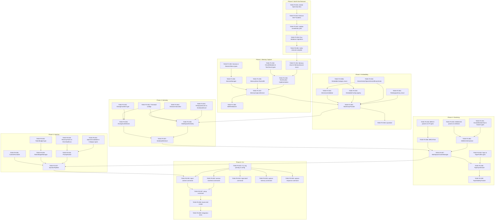

# Task Index: Dynamic Multi-Purpose Vector Implementation

## Overview

This document contains the complete task breakdown for implementing the impplan.md specification. Tasks are organized using the **inside-out, bottom-up** approach:

1. **Foundation Layer** - Data models, types, migrations (no dependencies)
2. **Logic Layer** - Services, business rules (depends on foundation)
3. **Surface Layer** - CLI, hooks, integration (depends on logic)

**Total Tasks:** 54 tasks across 7 phases

---

## Dependency Graph



---

## Execution Order

### Phase 0: North Star Removal (5 tasks)

| # | Task ID | Title | Layer | Depends On | Est. Complexity |
|---|---------|-------|-------|------------|-----------------|
| 1 | TASK-P0-001 | Delete North Star source files | foundation | — | low |
| 2 | TASK-P0-002 | Remove MCP handlers and routes | foundation | P0-001 | low |
| 3 | TASK-P0-003 | Update constitution.yaml | foundation | P0-002 | low |
| 4 | TASK-P0-004 | Database migrations (drop tables) | foundation | P0-003 | low |
| 5 | TASK-P0-005 | Verify removal and run tests | logic | P0-004 | low |

### Phase 1: Memory Capture (8 tasks)

| # | Task ID | Title | Layer | Depends On | Est. Complexity |
|---|---------|-------|-------|------------|-----------------|
| 6 | TASK-P1-001 | Memory struct and MemorySource enum | foundation | P0-005 | low |
| 7 | TASK-P1-002 | ChunkMetadata and TextChunk types | foundation | — | low |
| 8 | TASK-P1-003 | Session and SessionStatus types | foundation | — | low |
| 9 | TASK-P1-004 | TextChunker implementation | logic | P1-001, P1-002 | medium |
| 10 | TASK-P1-005 | MemoryStore with RocksDB | logic | P1-001 | medium |
| 11 | TASK-P1-006 | SessionManager | logic | P1-003 | low |
| 12 | TASK-P1-007 | MemoryCaptureService | logic | P1-004, P1-005, P1-006 | medium |
| 13 | TASK-P1-008 | MDFileWatcher | surface | P1-007 | medium |

### Phase 2: 13-Space Embedding (7 tasks)

| # | Task ID | Title | Layer | Depends On | Est. Complexity |
|---|---------|-------|-------|------------|-----------------|
| 14 | TASK-P2-001 | TeleologicalArray struct | foundation | — | low |
| 15 | TASK-P2-002 | DenseVector, SparseVector, BinaryVector | foundation | — | medium |
| 15b | TASK-P2-003b | EmbedderCategory enum (Semantic/Temporal/Relational/Structural) | foundation | — | low |
| 16 | TASK-P2-003 | EmbedderConfig registry with category field | foundation | P2-003b | low |
| 17 | TASK-P2-004 | DimensionValidator | logic | P2-002 | low |
| 18 | TASK-P2-005 | MultiArrayProvider | logic | P2-001, P2-002, P2-003, P2-004 | high |
| 19 | TASK-P2-006 | Quantizer (PQ-8, Float8, etc.) | logic | P2-005 | high |

### Phase 3: Similarity & Divergence (7 tasks)

| # | Task ID | Title | Layer | Depends On | Est. Complexity |
|---|---------|-------|-------|------------|-----------------|
| 20 | TASK-P3-001 | PerSpaceScores and SimilarityResult | foundation | — | low |
| 21 | TASK-P3-002 | DivergenceAlert type | foundation | — | low |
| 22 | TASK-P3-003 | Threshold configurations | foundation | — | low |
| 23 | TASK-P3-004 | DistanceCalculator (all metrics, category-aware notes) | logic | P2-002 | medium |
| 24 | TASK-P3-005 | MultiSpaceSimilarity (category-weighted, excludes temporal) | logic | P3-001, P3-003, P3-004, P2-003 | medium |
| 25 | TASK-P3-006 | DivergenceDetector (semantic spaces only) | logic | P3-002, P3-003, P2-003 | medium |
| 26 | TASK-P3-007 | SimilarityRetriever | logic | P3-005, P3-006 | medium |

### Phase 4: Multi-Space Clustering (9 tasks)

| # | Task ID | Title | Layer | Depends On | Est. Complexity |
|---|---------|-------|-------|------------|-----------------|
| 27 | TASK-P4-001 | ClusterMembership and Cluster types | foundation | — | low |
| 28 | TASK-P4-002 | Topic, TopicProfile, TopicPhase types | foundation | — | low |
| 29 | TASK-P4-003 | HDBSCANParams and ClusterSelectionMethod | foundation | — | low |
| 30 | TASK-P4-004 | BIRCHParams and ClusteringFeature | foundation | — | low |
| 31 | TASK-P4-005 | HDBSCANClusterer | logic | P4-001, P4-003 | high |
| 32 | TASK-P4-006 | BIRCHTree | logic | P4-004 | high |
| 33 | TASK-P4-007 | MultiSpaceClusterManager | logic | P4-005, P4-006 | high |
| 34 | TASK-P4-008 | TopicSynthesizer | logic | P4-002, P4-007 | medium |
| 35 | TASK-P4-009 | TopicStabilityTracker | logic | P4-008 | medium |

### Phase 5: Injection Pipeline (8 tasks)

| # | Task ID | Title | Layer | Depends On | Est. Complexity |
|---|---------|-------|-------|------------|-----------------|
| 36 | TASK-P5-001 | InjectionCandidate and InjectionCategory | foundation | — | low |
| 37 | TASK-P5-002 | TokenBudget type | foundation | — | low |
| 38 | TASK-P5-003 | InjectionResult type | foundation | P5-001 | low |
| 38.5 | TASK-P5-003b | TemporalEnrichmentProvider (Priority 5 badges) | logic | P2-001, P5-001 | low |
| 39 | TASK-P5-004 | PriorityRanker with weighted_agreement | logic | P5-001 | medium |
| 40 | TASK-P5-005 | TokenBudgetManager | logic | P5-002 | medium |
| 41 | TASK-P5-006 | ContextFormatter | logic | P5-003b | low |
| 42 | TASK-P5-007 | InjectionPipeline | logic | P5-004, P5-005, P5-006 | medium |

### Phase 6: CLI & Hooks (9 tasks)

| # | Task ID | Title | Layer | Depends On | Est. Complexity |
|---|---------|-------|-------|------------|-----------------|
| 43 | TASK-P6-001 | CLI arg parsing with clap | foundation | — | low |
| 44 | TASK-P6-002 | session start/end commands | surface | P6-001, P1-006 | low |
| 45 | TASK-P6-003 | inject-context command | surface | P6-001, P5-007 | medium |
| 46 | TASK-P6-004 | inject-brief command | surface | P6-001, P5-007 | low |
| 47 | TASK-P6-005 | capture-memory command | surface | P6-001, P1-007 | low |
| 48 | TASK-P6-006 | capture-response command | surface | P6-001, P1-007 | low |
| 49 | TASK-P6-007 | setup command | surface | P6-002, P6-003 | medium |
| 50 | TASK-P6-008 | Hook shell scripts | surface | P6-007 | low |
| 51 | TASK-P6-009 | E2E integration tests | surface | P6-008 | medium |
| 52 | TASK-P6-010 | Performance validation | surface | P6-009 | low |

---

## Status Tracking

| Phase | Total | Completed | In Progress | Pending |
|-------|-------|-----------|-------------|---------|
| Phase 0 | 5 | 0 | 0 | 5 |
| Phase 1 | 8 | 0 | 0 | 8 |
| Phase 2 | 7 | 0 | 0 | 7 |
| Phase 3 | 7 | 0 | 0 | 7 |
| Phase 4 | 9 | 0 | 0 | 9 |
| Phase 5 | 8 | 0 | 0 | 8 |
| Phase 6 | 10 | 0 | 0 | 10 |
| **Total** | **54** | **0** | **0** | **54** |

**Progress: 0/54 tasks (0%)**

---

## Critical Path

The critical path through the implementation:

```
P0-001 → P0-002 → P0-003 → P0-004 → P0-005 (North Star Removal)
    ↓
P1-001 → P1-004 → P1-007 (Memory Capture Core)
    ↓
P2-001 → P2-005 (Embedding Provider)
    ↓
P3-005 → P3-007 (Similarity Retriever)
    ↓
P4-005 → P4-007 → P4-008 (Clustering)
    ↓
P5-007 (Injection Pipeline)
    ↓
P6-003 → P6-007 → P6-008 → P6-009 (CLI Integration)
```

**Critical Path Length:** 20 tasks

---

## Parallelization Opportunities

These tasks can be worked on in parallel:

**Within Phase 1:**
- P1-002, P1-003 can run parallel to P1-001

**Within Phase 2:**
- P2-001, P2-002, P2-003b can all start simultaneously
- P2-003 depends on P2-003b (EmbedderCategory enum)

**Within Phase 3:**
- P3-001, P3-002, P3-003 can all start simultaneously

**Within Phase 4:**
- P4-001, P4-002, P4-003, P4-004 can all start simultaneously

**Within Phase 5:**
- P5-001, P5-002, P5-003 can all start simultaneously
- P5-003b depends on P2-001 and P5-001 (can run after those complete)

**Within Phase 6:**
- P6-004, P6-005, P6-006 can run parallel after P6-001

**Across Phases (once dependencies met):**
- P3 foundation tasks can start once P2-002 is complete
- P5 foundation tasks are independent of P4

---

## Notes

1. **No mock data in tests** - All tests use real synthetic data
2. **Fail fast** - All errors propagate immediately
3. **No backwards compatibility** - System works or fails
4. **Full state verification** - Each task verifies its outputs
5. **Inside-out, bottom-up** - Foundation → Logic → Surface ordering
