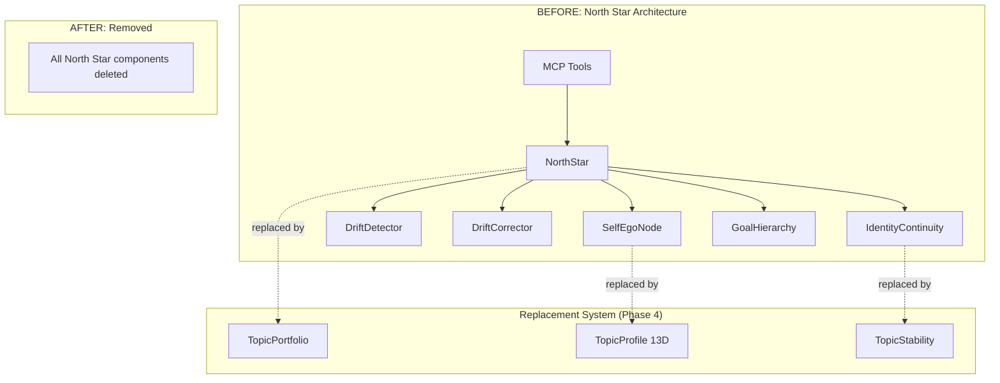

# Technical Specification: Phase 0 - North Star System Removal

```xml
<technical_spec id="TECH-PHASE0" version="1.0" implements="SPEC-PHASE0">
<metadata>
  <title>North Star System Removal Implementation</title>
  <status>approved</status>
  <last_updated>2026-01-16</last_updated>
</metadata>

<architecture_diagram>

</architecture_diagram>

<files_to_delete>
<directory path="crates/context-graph-core/src/autonomous/north_star.rs" reason="Main North Star implementation"/>
<directory path="crates/context-graph-core/src/autonomous/goal_hierarchy.rs" reason="Goal hierarchy system"/>
<directory path="crates/context-graph-core/src/autonomous/drift.rs" reason="Drift detection/correction"/>
<directory path="crates/context-graph-core/src/gwt/ego_node/" reason="Self Ego Node directory"/>
<directory path="crates/context-graph-core/src/gwt/ego_node/mod.rs"/>
<directory path="crates/context-graph-core/src/gwt/ego_node/purpose_vector.rs"/>
<directory path="crates/context-graph-core/src/gwt/ego_node/identity_continuity.rs"/>
<directory path="crates/context-graph-core/src/gwt/ego_node/crisis_detection.rs"/>
<directory path="crates/context-graph-mcp/src/handlers/autonomous/bootstrap.rs" reason="Bootstrap MCP handler"/>
<directory path="crates/context-graph-mcp/src/handlers/autonomous/drift.rs" reason="Drift MCP handlers"/>
</files_to_delete>

<files_to_modify>
<file path="crates/context-graph-core/src/autonomous/mod.rs">
  <action>Remove re-exports of north_star, goal_hierarchy, drift modules</action>
  <before>
pub mod north_star;
pub mod goal_hierarchy;
pub mod drift;
  </before>
  <after>
// North Star system removed per impplan.md
// Replaced by emergent topic system in Phase 4
  </after>
</file>

<file path="crates/context-graph-core/src/gwt/mod.rs">
  <action>Remove ego_node module</action>
  <before>
pub mod ego_node;
  </before>
  <after>
// ego_node removed per impplan.md
// Identity replaced by TopicProfile in Phase 4
  </after>
</file>

<file path="crates/context-graph-mcp/src/handlers/autonomous/mod.rs">
  <action>Remove bootstrap and drift handler modules</action>
  <before>
pub mod bootstrap;
pub mod drift;
  </before>
  <after>
// North Star MCP handlers removed per impplan.md
  </after>
</file>

<file path="crates/context-graph-mcp/src/router.rs">
  <action>Remove routes for North Star MCP tools</action>
  <routes_to_remove>
    - auto_bootstrap_north_star
    - get_alignment_drift
    - get_drift_history
    - trigger_drift_correction
    - get_identity_continuity
    - get_ego_state
  </routes_to_remove>
</file>

<file path="docs2/constitution.yaml">
  <action>Remove North Star constitution rules</action>
  <rules_to_remove>
    - AP-01 (North Star alignment)
    - AP-26 (Self Ego Node)
    - AP-37 (Identity Continuity thresholds)
    - AP-38 (Drift detection triggers)
    - AP-40 (Goal hierarchy rules)
    - gwt.self_ego_node section
  </rules_to_remove>
</file>
</files_to_modify>

<structs_to_delete>
<struct name="NorthStar" file="north_star.rs">
  <fields>
    goal: Goal,
    alignment_score: f32,
    created_at: Timestamp,
    updated_at: Timestamp,
  </fields>
</struct>

<struct name="GoalHierarchy" file="goal_hierarchy.rs">
  <fields>
    root_goal: Goal,
    sub_goals: Vec&lt;Goal&gt;,
    strategic_goals: Vec&lt;Goal&gt;,
    tactical_goals: Vec&lt;Goal&gt;,
  </fields>
</struct>

<struct name="SelfEgoNode" file="ego_node/mod.rs">
  <fields>
    id: Uuid,
    purpose_vector: [f32; 13],
    identity_continuity: f32,
    trajectory: Vec&lt;PurposeVector&gt;,
    coherence_with_actions: f32,
  </fields>
</struct>

<struct name="IdentityContinuityMonitor" file="ego_node/identity_continuity.rs">
  <fields>
    current_ic: f32,
    history: VecDeque&lt;f32&gt;,
    threshold: f32,
    in_crisis: bool,
  </fields>
</struct>

<struct name="DriftDetector" file="drift.rs">
  <fields>
    baseline: TeleologicalFingerprint,
    current: TeleologicalFingerprint,
    drift_score: f32,
    severity: DriftSeverity,
  </fields>
</struct>

<struct name="DriftCorrector" file="drift.rs">
  <fields>
    target_alignment: f32,
    correction_strategy: CorrectionStrategy,
    last_correction: Timestamp,
  </fields>
</struct>
</structs_to_delete>

<mcp_tools_to_remove>
<tool name="auto_bootstrap_north_star">
  <handler_file>handlers/autonomous/bootstrap.rs</handler_file>
  <description>Initialize North Star from existing embeddings</description>
</tool>

<tool name="get_alignment_drift">
  <handler_file>handlers/autonomous/drift.rs</handler_file>
  <description>Get current drift state</description>
</tool>

<tool name="get_drift_history">
  <handler_file>handlers/autonomous/drift.rs</handler_file>
  <description>Get historical drift measurements</description>
</tool>

<tool name="trigger_drift_correction">
  <handler_file>handlers/autonomous/drift.rs</handler_file>
  <description>Manually trigger drift correction</description>
</tool>

<tool name="get_identity_continuity">
  <handler_file>handlers/autonomous/drift.rs</handler_file>
  <description>Get IC status</description>
</tool>

<tool name="get_ego_state">
  <handler_file>handlers/autonomous/drift.rs</handler_file>
  <description>Get Self Ego Node state</description>
</tool>
</mcp_tools_to_remove>

<constitution_changes>
<section path="autonomous_principles">
  <rules_to_remove>
    AP-01: North Star alignment tracking
    AP-26: Self Ego Node protection
    AP-37: IC < 0.3 = degraded, IC < 0.5 = warning
    AP-38: High drift triggers correction
    AP-40: Goal hierarchy maintenance
  </rules_to_remove>
</section>

<section path="gwt.self_ego_node">
  <action>Delete entire section</action>
  <content_removed>
    purpose_vector: [f32; 13]
    identity_continuity: f32
    coherence_threshold: 0.7
    crisis_threshold: 0.3
  </content_removed>
</section>

<section path="triggers">
  <modifications>
    <before>ic_threshold: 0.3</before>
    <after>REMOVED - replaced by entropy/churn triggers in Phase 4</after>
  </modifications>
</section>
</constitution_changes>

<database_changes>
<table name="north_star_goals">
  <action>DROP TABLE IF EXISTS</action>
  <migration>V0_001__drop_north_star_tables.sql</migration>
</table>

<table name="drift_history">
  <action>DROP TABLE IF EXISTS</action>
  <migration>V0_001__drop_north_star_tables.sql</migration>
</table>

<table name="ego_node_state">
  <action>DROP TABLE IF EXISTS</action>
  <migration>V0_001__drop_north_star_tables.sql</migration>
</table>

<column_removals>
  <table name="memories">
    <column>north_star_alignment</column>
    <migration>V0_002__remove_alignment_column.sql</migration>
  </table>
</column_removals>
</database_changes>

<migration_scripts>
<script id="V0_001__drop_north_star_tables.sql">
-- Drop North Star related tables
DROP TABLE IF EXISTS north_star_goals CASCADE;
DROP TABLE IF EXISTS drift_history CASCADE;
DROP TABLE IF EXISTS ego_node_state CASCADE;
DROP TABLE IF EXISTS goal_hierarchy CASCADE;
DROP TABLE IF EXISTS identity_continuity_history CASCADE;
</script>

<script id="V0_002__remove_alignment_column.sql">
-- Remove north_star_alignment column from memories table
ALTER TABLE memories DROP COLUMN IF EXISTS north_star_alignment;
</script>
</migration_scripts>

<import_cleanup>
<file path="crates/context-graph-core/src/lib.rs">
  <remove_imports>
    - pub use autonomous::north_star::*;
    - pub use autonomous::goal_hierarchy::*;
    - pub use autonomous::drift::*;
    - pub use gwt::ego_node::*;
  </remove_imports>
</file>

<file path="crates/context-graph-mcp/src/lib.rs">
  <remove_imports>
    - use crate::handlers::autonomous::bootstrap::*;
    - use crate::handlers::autonomous::drift::*;
  </remove_imports>
</file>
</import_cleanup>

<verification_protocol>
<step order="1">
  <action>Run cargo check on context-graph-core</action>
  <command>cd crates/context-graph-core && cargo check</command>
  <expected>No compilation errors</expected>
  <failure_indicates>Missed import cleanup or struct reference</failure_indicates>
</step>

<step order="2">
  <action>Run cargo check on context-graph-mcp</action>
  <command>cd crates/context-graph-mcp && cargo check</command>
  <expected>No compilation errors</expected>
  <failure_indicates>Missed handler removal or route cleanup</failure_indicates>
</step>

<step order="3">
  <action>Run database migrations</action>
  <command>cargo run --bin migrate</command>
  <expected>Migrations complete without error</expected>
  <failure_indicates>Table dependencies or foreign keys issue</failure_indicates>
</step>

<step order="4">
  <action>Verify MCP tool count</action>
  <command>cargo run --bin list-tools | wc -l</command>
  <expected>Tool count decreased by 6 (59 → 53)</expected>
  <failure_indicates>Route not properly removed</failure_indicates>
</step>

<step order="5">
  <action>Search for remaining North Star references</action>
  <command>grep -r "north_star\|NorthStar\|ego_node\|EgoNode\|drift_detector\|DriftDetector" crates/</command>
  <expected>Zero matches (except comments explaining removal)</expected>
  <failure_indicates>Incomplete cleanup</failure_indicates>
</step>

<step order="6">
  <action>Run full test suite</action>
  <command>cargo test --workspace</command>
  <expected>All tests pass (North Star tests should be deleted)</expected>
  <failure_indicates>Test files not deleted or integration test failure</failure_indicates>
</step>

<step order="7">
  <action>Start service and verify boot</action>
  <command>cargo run --bin context-graph-server</command>
  <expected>Service starts without North Star initialization</expected>
  <failure_indicates>Startup dependency on removed code</failure_indicates>
</step>
</verification_protocol>

<test_deletion>
<test_files_to_delete>
  - crates/context-graph-core/src/autonomous/north_star_test.rs
  - crates/context-graph-core/src/autonomous/goal_hierarchy_test.rs
  - crates/context-graph-core/src/autonomous/drift_test.rs
  - crates/context-graph-core/src/gwt/ego_node/mod_test.rs
  - crates/context-graph-core/src/gwt/ego_node/identity_continuity_test.rs
  - crates/context-graph-mcp/tests/integration/north_star_tests.rs
  - crates/context-graph-mcp/tests/integration/drift_tests.rs
</test_files_to_delete>
</test_deletion>

<implementation_notes>
<note category="safety">
  All deletions use git rm to ensure proper tracking.
  Commit deletion separately from any new code additions.
  Tag commit as "north-star-removal-complete" for rollback reference.
</note>

<note category="backwards_compatibility">
  NO BACKWARDS COMPATIBILITY. System must work after removal or fail fast.
  Do not add any shims, stubs, or placeholder implementations.
  Removed code should be completely gone, not commented out.
</note>

<note category="migration">
  Run migrations in a transaction. Rollback entire migration if any step fails.
  Backup database before running removal migrations.
</note>

<note category="verification">
  Run all verification steps in CI/CD pipeline.
  Block merge if any verification step fails.
  Manual review required for this PR due to scope.
</note>
</implementation_notes>
</technical_spec>
```

## Deletion Checklist

### Directories to Remove
- [ ] `crates/context-graph-core/src/autonomous/north_star.rs`
- [ ] `crates/context-graph-core/src/autonomous/goal_hierarchy.rs`
- [ ] `crates/context-graph-core/src/autonomous/drift.rs`
- [ ] `crates/context-graph-core/src/gwt/ego_node/` (entire directory)
- [ ] `crates/context-graph-mcp/src/handlers/autonomous/bootstrap.rs`
- [ ] `crates/context-graph-mcp/src/handlers/autonomous/drift.rs`

### Module Exports to Remove
- [ ] `autonomous/mod.rs`: north_star, goal_hierarchy, drift
- [ ] `gwt/mod.rs`: ego_node
- [ ] `handlers/autonomous/mod.rs`: bootstrap, drift

### MCP Routes to Remove (6 total)
- [ ] auto_bootstrap_north_star
- [ ] get_alignment_drift
- [ ] get_drift_history
- [ ] trigger_drift_correction
- [ ] get_identity_continuity
- [ ] get_ego_state

### Constitution Rules to Remove
- [ ] AP-01, AP-26, AP-37, AP-38, AP-40
- [ ] gwt.self_ego_node section
- [ ] ic_threshold trigger

### Database Cleanup
- [ ] DROP north_star_goals
- [ ] DROP drift_history
- [ ] DROP ego_node_state
- [ ] DROP goal_hierarchy
- [ ] DROP identity_continuity_history
- [ ] ALTER memories DROP north_star_alignment

## Line Count Estimate

| Component | Estimated Lines |
|-----------|----------------|
| north_star.rs | ~2,000 |
| goal_hierarchy.rs | ~1,500 |
| drift.rs | ~2,500 |
| ego_node/ | ~3,000 |
| MCP handlers | ~1,500 |
| Tests | ~2,500 |
| **Total** | **~13,000 lines** |
