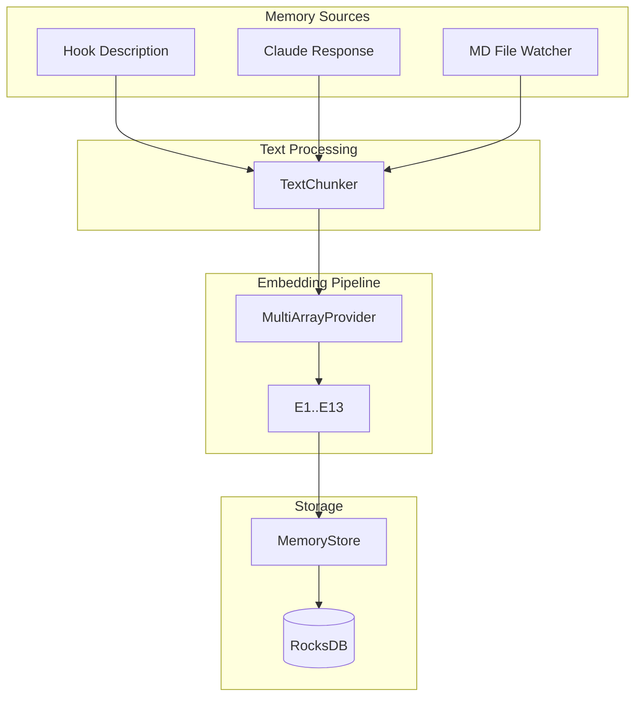

# Technical Specification: Phase 1 - Memory Capture System

```xml
<technical_spec id="TECH-PHASE1" version="1.0" implements="SPEC-PHASE1">
<metadata>
  <title>Memory Capture System Implementation</title>
  <status>approved</status>
  <last_updated>2026-01-16</last_updated>
</metadata>

<architecture_diagram>

</architecture_diagram>

<data_models>
<model name="Memory" file="crates/context-graph-core/src/memory/mod.rs">
  <field name="id" type="Uuid" constraints="primary_key, generated"/>
  <field name="content" type="String" constraints="not_null, max_length: 10000"/>
  <field name="source" type="MemorySource" constraints="not_null"/>
  <field name="created_at" type="DateTime&lt;Utc&gt;" constraints="not_null, auto"/>
  <field name="session_id" type="String" constraints="not_null, indexed"/>
  <field name="teleological_array" type="TeleologicalArray" constraints="not_null"/>
  <field name="chunk_metadata" type="Option&lt;ChunkMetadata&gt;" constraints="nullable"/>
  <field name="word_count" type="u32" constraints="not_null"/>
</model>

<model name="MemorySource" file="crates/context-graph-core/src/memory/source.rs">
  <variants>
    <variant name="HookDescription">
      <field name="hook_type" type="HookType"/>
      <field name="tool_name" type="Option&lt;String&gt;"/>
    </variant>
    <variant name="ClaudeResponse">
      <field name="response_type" type="ResponseType"/>
    </variant>
    <variant name="MDFileChunk">
      <field name="file_path" type="String"/>
      <field name="chunk_index" type="u32"/>
      <field name="total_chunks" type="u32"/>
    </variant>
  </variants>
</model>

<model name="HookType" file="crates/context-graph-core/src/memory/source.rs">
  <variants>
    <variant name="SessionStart"/>
    <variant name="UserPromptSubmit"/>
    <variant name="PreToolUse"/>
    <variant name="PostToolUse"/>
    <variant name="Stop"/>
    <variant name="SessionEnd"/>
  </variants>
</model>

<model name="ResponseType" file="crates/context-graph-core/src/memory/source.rs">
  <variants>
    <variant name="SessionSummary"/>
    <variant name="StopResponse"/>
    <variant name="SignificantResponse"/>
  </variants>
</model>

<model name="ChunkMetadata" file="crates/context-graph-core/src/memory/chunker.rs">
  <field name="file_path" type="String" constraints="not_null"/>
  <field name="chunk_index" type="u32" constraints="not_null"/>
  <field name="total_chunks" type="u32" constraints="not_null"/>
  <field name="word_offset" type="u32" constraints="not_null"/>
  <field name="char_offset" type="u32" constraints="not_null"/>
  <field name="original_file_hash" type="String" constraints="not_null"/>
</model>

<model name="TextChunk" file="crates/context-graph-core/src/memory/chunker.rs">
  <field name="content" type="String" constraints="not_null"/>
  <field name="word_count" type="u32" constraints="not_null"/>
  <field name="metadata" type="ChunkMetadata" constraints="not_null"/>
</model>

<model name="Session" file="crates/context-graph-core/src/memory/session.rs">
  <field name="id" type="String" constraints="primary_key"/>
  <field name="started_at" type="DateTime&lt;Utc&gt;" constraints="not_null"/>
  <field name="ended_at" type="Option&lt;DateTime&lt;Utc&gt;&gt;" constraints="nullable"/>
  <field name="status" type="SessionStatus" constraints="not_null"/>
  <field name="memory_count" type="u32" constraints="not_null, default: 0"/>
</model>

<model name="SessionStatus" file="crates/context-graph-core/src/memory/session.rs">
  <variants>
    <variant name="Active"/>
    <variant name="Completed"/>
    <variant name="Abandoned"/>
  </variants>
</model>
</data_models>

<component_contracts>
<component name="TextChunker" path="crates/context-graph-core/src/memory/chunker.rs">
  <constants>
    const CHUNK_SIZE_WORDS: usize = 200;
    const OVERLAP_WORDS: usize = 50;
    const MIN_CHUNK_WORDS: usize = 50;
    const SENTENCE_TERMINATORS: [char; 3] = ['.', '!', '?'];
  </constants>

  <method name="new">
    <signature>pub fn new(chunk_size: usize, overlap: usize) -> Self</signature>
    <behavior>
      1. Validate chunk_size > overlap
      2. Validate chunk_size >= MIN_CHUNK_WORDS
      3. Store configuration
    </behavior>
    <throws>ConfigError if validation fails</throws>
  </method>

  <method name="chunk_text">
    <signature>pub fn chunk_text(&amp;self, content: &amp;str, file_path: &amp;str) -> Result&lt;Vec&lt;TextChunk&gt;, ChunkerError&gt;</signature>
    <implements>REQ-P1-03, REQ-P1-04</implements>
    <behavior>
      1. Split content into words (whitespace-separated)
      2. If word_count <= chunk_size, return single chunk
      3. Initialize chunks = [], current_offset = 0
      4. While current_offset < words.len():
         a. end_offset = min(current_offset + chunk_size, words.len())
         b. Adjust end_offset to sentence boundary if within 20% of target
         c. Create TextChunk with words[current_offset..end_offset]
         d. Add to chunks
         e. current_offset = end_offset - overlap
      5. Compute file_hash = sha256(content)
      6. Populate ChunkMetadata for each chunk
      7. Return chunks
    </behavior>
    <edge_cases>
      - Empty content: return empty vec
      - Single word: return one chunk
      - No sentence boundaries: chunk at word boundary
      - Very long word: include in chunk regardless
    </edge_cases>
    <throws>
      ChunkerError::EmptyContent if content is empty string
      ChunkerError::InvalidUtf8 if content has invalid UTF-8
    </throws>
  </method>

  <method name="find_sentence_boundary">
    <signature>fn find_sentence_boundary(&amp;self, words: &amp;[&amp;str], start: usize, end: usize) -> usize</signature>
    <behavior>
      1. Search backwards from end to start
      2. Find word ending with SENTENCE_TERMINATORS
      3. If found within 20% of original end, return that position
      4. Otherwise return original end
    </behavior>
  </method>
</component>

<component name="MDFileWatcher" path="crates/context-graph-core/src/memory/watcher.rs">
  <dependencies>
    - notify crate for filesystem events
    - TextChunker for content processing
    - MemoryCaptureService for storage
  </dependencies>

  <method name="new">
    <signature>pub fn new(watch_paths: Vec&lt;PathBuf&gt;, capture_service: Arc&lt;MemoryCaptureService&gt;) -> Result&lt;Self, WatcherError&gt;</signature>
    <behavior>
      1. Validate all paths exist
      2. Create notify::Watcher with debounce of 1000ms
      3. Add paths to watcher
      4. Store capture_service reference
    </behavior>
  </method>

  <method name="start">
    <signature>pub async fn start(&amp;mut self) -> Result&lt;(), WatcherError&gt;</signature>
    <implements>REQ-P1-05</implements>
    <behavior>
      1. Spawn async task for event processing
      2. On Create/Modify event for .md file:
         a. Read file content
         b. Compute file hash
         c. Check if hash differs from last processed
         d. If different, call process_file()
      3. On Delete event: log, no action (memories persist)
      4. Handle errors without crashing watcher
    </behavior>
  </method>

  <method name="process_file">
    <signature>async fn process_file(&amp;self, path: &amp;Path) -> Result&lt;Vec&lt;Uuid&gt;, WatcherError&gt;</signature>
    <behavior>
      1. Read file content to String
      2. Validate is valid UTF-8
      3. Call chunker.chunk_text(content, path)
      4. For each chunk:
         a. Create Memory with source = MDFileChunk
         b. Store via capture_service
      5. Return vec of created memory IDs
    </behavior>
  </method>

  <method name="stop">
    <signature>pub fn stop(&amp;mut self)</signature>
    <behavior>
      1. Signal watcher thread to stop
      2. Wait for clean shutdown
      3. Log final statistics
    </behavior>
  </method>
</component>

<component name="MemoryCaptureService" path="crates/context-graph-core/src/memory/capture.rs">
  <dependencies>
    - MultiArrayProvider for embedding
    - MemoryStore for persistence
    - TextChunker for optional chunking
  </dependencies>

  <method name="capture_hook_description">
    <signature>pub async fn capture_hook_description(&amp;self, content: String, hook_type: HookType, session_id: String, tool_name: Option&lt;String&gt;) -> Result&lt;Uuid, CaptureError&gt;</signature>
    <implements>REQ-P1-01</implements>
    <behavior>
      1. Validate content not empty
      2. Create MemorySource::HookDescription { hook_type, tool_name }
      3. Call capture_memory(content, source, session_id, None)
    </behavior>
  </method>

  <method name="capture_claude_response">
    <signature>pub async fn capture_claude_response(&amp;self, content: String, response_type: ResponseType, session_id: String) -> Result&lt;Uuid, CaptureError&gt;</signature>
    <implements>REQ-P1-02</implements>
    <behavior>
      1. Validate content not empty
      2. Create MemorySource::ClaudeResponse { response_type }
      3. Call capture_memory(content, source, session_id, None)
    </behavior>
  </method>

  <method name="capture_md_chunk">
    <signature>pub async fn capture_md_chunk(&amp;self, chunk: TextChunk, session_id: String) -> Result&lt;Uuid, CaptureError&gt;</signature>
    <implements>REQ-P1-03</implements>
    <behavior>
      1. Create MemorySource::MDFileChunk from chunk.metadata
      2. Call capture_memory(chunk.content, source, session_id, Some(chunk.metadata))
    </behavior>
  </method>

  <method name="capture_memory">
    <signature>async fn capture_memory(&amp;self, content: String, source: MemorySource, session_id: String, chunk_meta: Option&lt;ChunkMetadata&gt;) -> Result&lt;Uuid, CaptureError&gt;</signature>
    <behavior>
      1. Generate UUID for memory
      2. Count words in content
      3. Call multi_array_provider.embed_all(&amp;content).await
      4. If embedding fails, return Err immediately (fail fast)
      5. Create Memory struct with all fields
      6. Store via memory_store.store(memory).await
      7. If store fails, return Err (fail fast, no partial storage)
      8. Return memory.id
    </behavior>
    <throws>
      CaptureError::EmptyContent
      CaptureError::EmbeddingFailed(EmbedderError)
      CaptureError::StorageFailed(StorageError)
    </throws>
  </method>
</component>

<component name="MemoryStore" path="crates/context-graph-core/src/memory/store.rs">
  <dependencies>
    - RocksDB for persistence
    - serde for serialization
  </dependencies>

  <method name="store">
    <signature>pub async fn store(&amp;self, memory: Memory) -> Result&lt;(), StorageError&gt;</signature>
    <behavior>
      1. Serialize memory to bytes via bincode
      2. Write to memories column family with key = memory.id.as_bytes()
      3. Update session_memories index
      4. Update source_type index
      5. If any write fails, return Err (no partial writes)
    </behavior>
  </method>

  <method name="get">
    <signature>pub async fn get(&amp;self, id: Uuid) -> Result&lt;Option&lt;Memory&gt;, StorageError&gt;</signature>
    <behavior>
      1. Read from memories CF with key = id.as_bytes()
      2. If not found, return Ok(None)
      3. Deserialize via bincode
      4. Return Ok(Some(memory))
    </behavior>
  </method>

  <method name="get_by_session">
    <signature>pub async fn get_by_session(&amp;self, session_id: &amp;str) -> Result&lt;Vec&lt;Memory&gt;, StorageError&gt;</signature>
    <behavior>
      1. Query session_memories index
      2. For each memory_id, call get(id)
      3. Collect and return
    </behavior>
  </method>

  <method name="count">
    <signature>pub async fn count(&amp;self) -> Result&lt;u64, StorageError&gt;</signature>
    <behavior>
      1. Return count from memories CF
    </behavior>
  </method>
</component>

<component name="SessionManager" path="crates/context-graph-core/src/memory/session.rs">
  <method name="start_session">
    <signature>pub async fn start_session(&amp;self) -> Result&lt;String, SessionError&gt;</signature>
    <behavior>
      1. Generate UUID as session_id
      2. Create Session { id, started_at: now, ended_at: None, status: Active, memory_count: 0 }
      3. Store session
      4. Write session_id to current_session file
      5. Return session_id
    </behavior>
  </method>

  <method name="end_session">
    <signature>pub async fn end_session(&amp;self, session_id: &amp;str) -> Result&lt;(), SessionError&gt;</signature>
    <behavior>
      1. Load session by id
      2. If not found, return Ok (idempotent)
      3. Update session.ended_at = now, status = Completed
      4. Store updated session
      5. Clear current_session file
    </behavior>
  </method>

  <method name="get_current_session">
    <signature>pub async fn get_current_session(&amp;self) -> Result&lt;Option&lt;String&gt;, SessionError&gt;</signature>
    <behavior>
      1. Read current_session file
      2. If empty or not exists, return None
      3. Return Some(session_id)
    </behavior>
  </method>
</component>
</component_contracts>

<error_types>
<error_enum name="ChunkerError" file="crates/context-graph-core/src/memory/chunker.rs">
  <variant name="EmptyContent">Content is empty string</variant>
  <variant name="InvalidUtf8">Content contains invalid UTF-8</variant>
  <variant name="ConfigError">
    <field name="message" type="String"/>
  </variant>
</error_enum>

<error_enum name="CaptureError" file="crates/context-graph-core/src/memory/capture.rs">
  <variant name="EmptyContent">Content is empty string</variant>
  <variant name="EmbeddingFailed">
    <field name="source" type="EmbedderError"/>
  </variant>
  <variant name="StorageFailed">
    <field name="source" type="StorageError"/>
  </variant>
  <variant name="SessionNotFound">
    <field name="session_id" type="String"/>
  </variant>
</error_enum>

<error_enum name="WatcherError" file="crates/context-graph-core/src/memory/watcher.rs">
  <variant name="PathNotFound">
    <field name="path" type="PathBuf"/>
  </variant>
  <variant name="WatchFailed">
    <field name="source" type="notify::Error"/>
  </variant>
  <variant name="ReadFailed">
    <field name="path" type="PathBuf"/>
    <field name="source" type="std::io::Error"/>
  </variant>
  <variant name="CaptureFailed">
    <field name="source" type="CaptureError"/>
  </variant>
</error_enum>

<error_enum name="StorageError" file="crates/context-graph-core/src/memory/store.rs">
  <variant name="SerializationFailed">
    <field name="source" type="bincode::Error"/>
  </variant>
  <variant name="WriteFailed">
    <field name="source" type="rocksdb::Error"/>
  </variant>
  <variant name="ReadFailed">
    <field name="source" type="rocksdb::Error"/>
  </variant>
</error_enum>

<error_enum name="SessionError" file="crates/context-graph-core/src/memory/session.rs">
  <variant name="NotFound">
    <field name="session_id" type="String"/>
  </variant>
  <variant name="AlreadyActive">
    <field name="session_id" type="String"/>
  </variant>
  <variant name="StorageFailed">
    <field name="source" type="StorageError"/>
  </variant>
</error_enum>
</error_types>

<database_schema>
<column_family name="memories">
  <key>UUID bytes (16 bytes)</key>
  <value>Memory struct serialized via bincode</value>
  <indexes>
    - session_id -> Vec&lt;UUID&gt;
    - source_type -> Vec&lt;UUID&gt;
    - created_at -> Vec&lt;UUID&gt; (sorted)
  </indexes>
</column_family>

<column_family name="sessions">
  <key>session_id string bytes</key>
  <value>Session struct serialized via bincode</value>
</column_family>

<column_family name="file_hashes">
  <key>file_path string bytes</key>
  <value>SHA256 hash + last_processed timestamp</value>
  <purpose>Detect file changes for MD watcher</purpose>
</column_family>
</database_schema>

<implementation_notes>
<note category="performance">
  TextChunker operations are synchronous and fast.
  Embedding is async and may take 50-200ms per chunk.
  Batch MD file processing to reduce embedding overhead.
</note>

<note category="memory">
  Keep only current session_id in memory file.
  Do not cache full session objects in memory.
  Let RocksDB handle caching via block cache.
</note>

<note category="error_handling">
  All errors are fail-fast. No retries at this layer.
  CLI layer may implement retries for transient failures.
  Log all errors with full context before returning.
</note>

<note category="testing">
  Use real RocksDB instance for integration tests (temp directory).
  Mock MultiArrayProvider for unit tests of capture logic.
  Test chunker with various text lengths and boundary conditions.
</note>
</implementation_notes>
</technical_spec>
```

## Chunking Algorithm Visualization

```
Input: "Sentence one. Sentence two. Sentence three. Sentence four. Sentence five."
       (25 words assumed, chunk_size=10, overlap=3)

Pass 1: [words 0-10]  -> "Sentence one. Sentence two. Sentence three."
                         Adjusted to sentence boundary at word 9
Pass 2: [words 7-17]  -> "Sentence three. Sentence four."
                         (starts at 10-3=7, overlap)
Pass 3: [words 14-25] -> "Sentence four. Sentence five."
                         (remaining content)

Result: 3 chunks with 3-word overlap
```

## File Structure

```
crates/context-graph-core/src/memory/
├── mod.rs           # Memory struct, re-exports
├── source.rs        # MemorySource enum, HookType, ResponseType
├── chunker.rs       # TextChunker, ChunkMetadata, TextChunk
├── watcher.rs       # MDFileWatcher
├── capture.rs       # MemoryCaptureService
├── store.rs         # MemoryStore (RocksDB)
└── session.rs       # SessionManager, Session, SessionStatus
```
