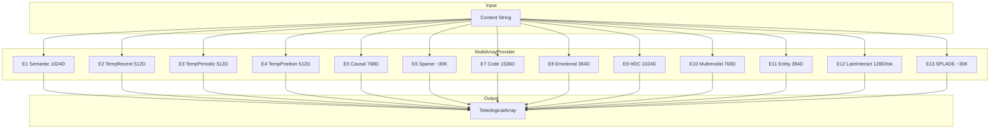

# Technical Specification: Phase 2 - 13-Space Embedding System

```xml
<technical_spec id="TECH-PHASE2" version="1.0" implements="SPEC-PHASE2">
<metadata>
  <title>13-Space Embedding System Implementation</title>
  <status>approved</status>
  <last_updated>2026-01-16</last_updated>
</metadata>

<architecture_diagram>

</architecture_diagram>

<data_models>
<model name="TeleologicalArray" file="crates/context-graph-core/src/embedding/teleological.rs">
  <field name="e1_semantic" type="DenseVector&lt;1024&gt;" constraints="not_null"/>
  <field name="e2_temp_recent" type="DenseVector&lt;512&gt;" constraints="not_null"/>
  <field name="e3_temp_periodic" type="DenseVector&lt;512&gt;" constraints="not_null"/>
  <field name="e4_temp_position" type="DenseVector&lt;512&gt;" constraints="not_null"/>
  <field name="e5_causal" type="DenseVector&lt;768&gt;" constraints="not_null"/>
  <field name="e6_sparse" type="SparseVector" constraints="not_null"/>
  <field name="e7_code" type="DenseVector&lt;1536&gt;" constraints="not_null"/>
  <field name="e8_emotional" type="DenseVector&lt;384&gt;" constraints="not_null"/>
  <field name="e9_hdc" type="BinaryVector&lt;1024&gt;" constraints="not_null"/>
  <field name="e10_multimodal" type="DenseVector&lt;768&gt;" constraints="not_null"/>
  <field name="e11_entity" type="DenseVector&lt;384&gt;" constraints="not_null"/>
  <field name="e12_late_interact" type="Vec&lt;DenseVector&lt;128&gt;&gt;" constraints="not_null, max_tokens: 512"/>
  <field name="e13_splade" type="SparseVector" constraints="not_null"/>
</model>

<model name="DenseVector" file="crates/context-graph-core/src/embedding/vector.rs">
  <generic_param name="N">const dimension: usize</generic_param>
  <field name="data" type="[f32; N]" constraints="not_null"/>
  <methods>
    - fn cosine_similarity(&amp;self, other: &amp;Self) -> f32
    - fn euclidean_distance(&amp;self, other: &amp;Self) -> f32
    - fn normalize(&amp;mut self)
    - fn magnitude(&amp;self) -> f32
  </methods>
</model>

<model name="SparseVector" file="crates/context-graph-core/src/embedding/vector.rs">
  <field name="indices" type="Vec&lt;u32&gt;" constraints="sorted, unique"/>
  <field name="values" type="Vec&lt;f32&gt;" constraints="same_len_as_indices"/>
  <field name="dimension" type="u32" constraints="~30000"/>
  <methods>
    - fn jaccard_similarity(&amp;self, other: &amp;Self) -> f32
    - fn dot_product(&amp;self, other: &amp;Self) -> f32
    - fn sparsity(&amp;self) -> f32
  </methods>
</model>

<model name="BinaryVector" file="crates/context-graph-core/src/embedding/vector.rs">
  <generic_param name="N">const bits: usize</generic_param>
  <field name="data" type="[u64; N/64]" constraints="packed bits"/>
  <methods>
    - fn hamming_distance(&amp;self, other: &amp;Self) -> u32
    - fn set_bit(&amp;mut self, index: usize, value: bool)
    - fn get_bit(&amp;self, index: usize) -> bool
    - fn popcount(&amp;self) -> u32
  </methods>
</model>

<model name="EmbedderConfig" file="crates/context-graph-core/src/embedding/config.rs">
  <field name="embedder" type="Embedder" constraints="enum variant"/>
  <field name="dimension" type="usize" constraints="matches spec"/>
  <field name="distance_metric" type="DistanceMetric" constraints="not_null"/>
  <field name="is_asymmetric" type="bool" constraints="default: false"/>
  <field name="is_sparse" type="bool" constraints="default: false"/>
  <field name="quantization" type="QuantizationConfig" constraints="not_null"/>
  <field name="category" type="EmbedderCategory" constraints="not_null">
    <description>The semantic category of this embedder (Semantic, Temporal, Relational, Structural)</description>
  </field>
  <field name="topic_weight" type="f32" constraints="0.0..=1.0, derived from category">
    <description>Weight used in topic extraction, derived from category.topic_weight()</description>
  </field>
</model>

<model name="DistanceMetric" file="crates/context-graph-core/src/embedding/config.rs">
  <variants>
    <variant name="Cosine"/>
    <variant name="Euclidean"/>
    <variant name="Jaccard"/>
    <variant name="Hamming"/>
    <variant name="MaxSim"/>
    <variant name="TransE"/>
  </variants>
</model>

<model name="QuantizationConfig" file="crates/context-graph-core/src/embedding/config.rs">
  <variants>
    <variant name="PQ8">
      <field name="num_subvectors" type="usize"/>
      <field name="bits_per_code" type="usize"/>
    </variant>
    <variant name="Float8"/>
    <variant name="Binary"/>
    <variant name="Inverted"/>
    <variant name="None"/>
  </variants>
</model>

<model name="Embedder" file="crates/context-graph-core/src/embedding/mod.rs">
  <variants>
    <variant name="E1Semantic" value="0"/>
    <variant name="E2TempRecent" value="1"/>
    <variant name="E3TempPeriodic" value="2"/>
    <variant name="E4TempPosition" value="3"/>
    <variant name="E5Causal" value="4"/>
    <variant name="E6Sparse" value="5"/>
    <variant name="E7Code" value="6"/>
    <variant name="E8Emotional" value="7"/>
    <variant name="E9HDC" value="8"/>
    <variant name="E10Multimodal" value="9"/>
    <variant name="E11Entity" value="10"/>
    <variant name="E12LateInteract" value="11"/>
    <variant name="E13SPLADE" value="12"/>
  </variants>
  <methods>
    <method name="category">
      <signature>pub fn category(&amp;self) -> EmbedderCategory</signature>
      <behavior>
        Returns the category for this embedder:
        - E1, E5, E6, E7, E10, E12, E13: Semantic
        - E2, E3, E4: Temporal
        - E8, E11: Relational
        - E9: Structural
      </behavior>
    </method>
    <method name="topic_weight">
      <signature>pub fn topic_weight(&amp;self) -> f32</signature>
      <behavior>
        Returns self.category().topic_weight()
      </behavior>
    </method>
    <method name="is_semantic">
      <signature>pub fn is_semantic(&amp;self) -> bool</signature>
      <behavior>
        Returns self.category() == EmbedderCategory::Semantic
      </behavior>
    </method>
    <method name="is_temporal">
      <signature>pub fn is_temporal(&amp;self) -> bool</signature>
      <behavior>
        Returns self.category() == EmbedderCategory::Temporal
      </behavior>
    </method>
  </methods>
</model>

<model name="EmbedderCategory" file="crates/context-graph-core/src/embedding/config.rs">
  <description>
    Categorizes embedders by their semantic role for topic modeling and fusion.
    Each category has an associated topic_weight used in topic extraction.
  </description>
  <rust_definition>
```rust
#[derive(Debug, Clone, Copy, PartialEq, Eq, Hash, Serialize, Deserialize)]
pub enum EmbedderCategory {
    Semantic,    // E1, E5, E6, E7, E10, E12, E13 - weight 1.0
    Temporal,    // E2, E3, E4 - weight 0.0 (excluded from topics)
    Relational,  // E8, E11 - weight 0.5
    Structural,  // E9 - weight 0.5
}

impl EmbedderCategory {
    pub fn topic_weight(&amp;self) -> f32 {
        match self {
            Self::Semantic => 1.0,
            Self::Temporal => 0.0,
            Self::Relational => 0.5,
            Self::Structural => 0.5,
        }
    }
}
```
  </rust_definition>
  <variants>
    <variant name="Semantic">
      <description>Content-meaning embedders contributing fully to topic extraction</description>
      <topic_weight>1.0</topic_weight>
      <embedders>E1 (SemanticCore), E5 (Causal), E6 (Sparse), E7 (Code), E10 (Multimodal), E12 (LateInteract), E13 (SPLADE)</embedders>
    </variant>
    <variant name="Temporal">
      <description>Time-based embedders excluded from topic extraction</description>
      <topic_weight>0.0</topic_weight>
      <embedders>E2 (HourOfDay), E3 (DayOfWeek), E4 (Recency)</embedders>
    </variant>
    <variant name="Relational">
      <description>Relationship/emotion embedders with partial topic contribution</description>
      <topic_weight>0.5</topic_weight>
      <embedders>E8 (Emotional), E11 (Entity)</embedders>
    </variant>
    <variant name="Structural">
      <description>Structure-based embedders with partial topic contribution</description>
      <topic_weight>0.5</topic_weight>
      <embedders>E9 (HDC/CodeStructure)</embedders>
    </variant>
  </variants>
</model>
</data_models>

<component_contracts>
<component name="MultiArrayProvider" path="crates/context-graph-core/src/embedding/provider.rs">
  <dependencies>
    - Individual embedder implementations
    - tokio for async parallel execution
    - EmbedderConfigRegistry for config lookup
  </dependencies>

  <method name="embed_all">
    <signature>pub async fn embed_all(&amp;self, content: &amp;str) -> Result&lt;TeleologicalArray, EmbedderError&gt;</signature>
    <implements>REQ-P2-01</implements>
    <behavior>
      1. Launch all 13 embeddings in parallel via tokio::join!
      2. Await all results
      3. If ANY embedder fails, return Err immediately (fail fast)
      4. Validate dimensions for each embedding
      5. If validation fails, return Err
      6. Construct TeleologicalArray from all 13 results
      7. Return Ok(array)
    </behavior>
    <parallel_execution>
      All 13 embedders run concurrently.
      Total time ≈ max(individual_times) not sum.
      Target: &lt;200ms for typical content.
    </parallel_execution>
    <throws>
      EmbedderError::ModelFailed { embedder, source }
      EmbedderError::DimensionMismatch { embedder, expected, actual }
      EmbedderError::Timeout { embedder, duration }
    </throws>
  </method>

  <method name="embed_single">
    <signature>pub async fn embed_single(&amp;self, content: &amp;str, embedder: Embedder) -> Result&lt;EmbeddingResult, EmbedderError&gt;</signature>
    <behavior>
      1. Get embedder implementation for specified embedder
      2. Call embedder.embed(content)
      3. Validate dimension
      4. Return result
    </behavior>
  </method>
</component>

<component name="EmbedderConfigRegistry" path="crates/context-graph-core/src/embedding/config.rs">
  <method name="get_config">
    <signature>pub fn get_config(embedder: Embedder) -> &amp;'static EmbedderConfig</signature>
    <implements>REQ-P2-05</implements>
    <behavior>
      Return static configuration for the specified embedder.
      Configurations are compile-time constants.
    </behavior>
  </method>

  <method name="get_distance_metric">
    <signature>pub fn get_distance_metric(embedder: Embedder) -> DistanceMetric</signature>
    <implements>REQ-P2-02</implements>
    <behavior>
      E1, E2, E3, E4, E5, E7, E8, E10: Cosine
      E6, E13: Jaccard
      E9: Hamming
      E11: TransE
      E12: MaxSim
    </behavior>
  </method>

  <method name="get_dimension">
    <signature>pub fn get_dimension(embedder: Embedder) -> usize</signature>
    <behavior>
      E1: 1024, E2-E4: 512, E5: 768, E6: 30000,
      E7: 1536, E8: 384, E9: 1024, E10: 768,
      E11: 384, E12: 128 (per token), E13: 30000
    </behavior>
  </method>

  <method name="is_asymmetric">
    <signature>pub fn is_asymmetric(embedder: Embedder) -> bool</signature>
    <behavior>
      E5 (Causal): true
      All others: false
    </behavior>
  </method>

  <method name="is_sparse">
    <signature>pub fn is_sparse(embedder: Embedder) -> bool</signature>
    <behavior>
      E6, E13: true
      All others: false
    </behavior>
  </method>

  <method name="get_category">
    <signature>pub fn get_category(embedder: Embedder) -> EmbedderCategory</signature>
    <behavior>
      Returns the category for the embedder:
      - Semantic: E1, E5, E6, E7, E10, E12, E13
      - Temporal: E2, E3, E4
      - Relational: E8, E11
      - Structural: E9
    </behavior>
  </method>

  <method name="get_topic_weight">
    <signature>pub fn get_topic_weight(embedder: Embedder) -> f32</signature>
    <behavior>
      Returns the topic weight for the embedder based on its category:
      - Semantic: 1.0
      - Temporal: 0.0
      - Relational: 0.5
      - Structural: 0.5
    </behavior>
  </method>

  <method name="get_embedders_by_category">
    <signature>pub fn get_embedders_by_category(category: EmbedderCategory) -> &amp;'static [Embedder]</signature>
    <behavior>
      Returns all embedders belonging to the specified category:
      - Semantic: [E1, E5, E6, E7, E10, E12, E13]
      - Temporal: [E2, E3, E4]
      - Relational: [E8, E11]
      - Structural: [E9]
    </behavior>
  </method>

  <method name="get_semantic_embedders">
    <signature>pub fn get_semantic_embedders() -> &amp;'static [Embedder]</signature>
    <behavior>
      Convenience method returning embedders with category == Semantic.
      Returns [E1, E5, E6, E7, E10, E12, E13]
    </behavior>
  </method>

  <method name="get_non_temporal_embedders">
    <signature>pub fn get_non_temporal_embedders() -> &amp;'static [Embedder]</signature>
    <behavior>
      Returns all embedders that contribute to topic extraction (weight > 0).
      Returns [E1, E5, E6, E7, E8, E9, E10, E11, E12, E13]
    </behavior>
  </method>
</component>

<component name="DimensionValidator" path="crates/context-graph-core/src/embedding/validator.rs">
  <method name="validate_teleological_array">
    <signature>pub fn validate_teleological_array(array: &amp;TeleologicalArray) -> Result&lt;(), ValidationError&gt;</signature>
    <implements>REQ-P2-04</implements>
    <behavior>
      1. Check e1_semantic.len() == 1024
      2. Check e2_temp_recent.len() == 512
      3. Check e3_temp_periodic.len() == 512
      4. Check e4_temp_position.len() == 512
      5. Check e5_causal.len() == 768
      6. Check e6_sparse.dimension == 30000 (approx)
      7. Check e7_code.len() == 1536
      8. Check e8_emotional.len() == 384
      9. Check e9_hdc bit_len == 1024
      10. Check e10_multimodal.len() == 768
      11. Check e11_entity.len() == 384
      12. Check e12_late_interact[].len() == 128 for all tokens
      13. Check e13_splade.dimension == 30000 (approx)
      14. If any check fails, return Err with details
    </behavior>
    <throws>
      ValidationError::DimensionMismatch { embedder, expected, actual }
    </throws>
  </method>
</component>

<component name="Quantizer" path="crates/context-graph-core/src/embedding/quantize.rs">
  <method name="quantize_array">
    <signature>pub fn quantize_array(array: &amp;TeleologicalArray) -> Result&lt;QuantizedArray, QuantizeError&gt;</signature>
    <implements>REQ-P2-03</implements>
    <behavior>
      1. E1, E5, E7, E10: Apply PQ-8 quantization
      2. E2, E3, E4, E8, E11: Apply Float8 quantization
      3. E9: Already binary, just pack bits
      4. E6, E13: Convert to inverted index format
      5. E12: Apply Float8 per token
      6. Return QuantizedArray with all compressed data
    </behavior>
  </method>

  <method name="dequantize_array">
    <signature>pub fn dequantize_array(quantized: &amp;QuantizedArray) -> Result&lt;TeleologicalArray, QuantizeError&gt;</signature>
    <behavior>
      Reverse of quantize_array.
      Note: Lossy for PQ-8 and Float8.
    </behavior>
  </method>
</component>
</component_contracts>

<error_types>
<error_enum name="EmbedderError" file="crates/context-graph-core/src/embedding/error.rs">
  <variant name="ModelFailed">
    <field name="embedder" type="Embedder"/>
    <field name="source" type="Box&lt;dyn std::error::Error + Send + Sync&gt;"/>
  </variant>
  <variant name="DimensionMismatch">
    <field name="embedder" type="Embedder"/>
    <field name="expected" type="usize"/>
    <field name="actual" type="usize"/>
  </variant>
  <variant name="Timeout">
    <field name="embedder" type="Embedder"/>
    <field name="duration" type="Duration"/>
  </variant>
  <variant name="OutOfMemory">
    <field name="embedder" type="Embedder"/>
  </variant>
</error_enum>

<error_enum name="ValidationError" file="crates/context-graph-core/src/embedding/validator.rs">
  <variant name="DimensionMismatch">
    <field name="embedder" type="Embedder"/>
    <field name="expected" type="usize"/>
    <field name="actual" type="usize"/>
  </variant>
  <variant name="EmptyEmbedding">
    <field name="embedder" type="Embedder"/>
  </variant>
</error_enum>

<error_enum name="QuantizeError" file="crates/context-graph-core/src/embedding/quantize.rs">
  <variant name="InvalidInput">
    <field name="message" type="String"/>
  </variant>
  <variant name="CodebookMissing">
    <field name="embedder" type="Embedder"/>
  </variant>
</error_enum>
</error_types>

<static_configuration>
<config name="EMBEDDER_CONFIGS" type="[EmbedderConfig; 13]">
  E1_Semantic:     { dim: 1024, distance: Cosine,  quant: PQ8(32, 8),  asymmetric: false, sparse: false, category: Semantic,   topic_weight: 1.0 }
  E2_TempRecent:   { dim: 512,  distance: Cosine,  quant: Float8,      asymmetric: false, sparse: false, category: Temporal,   topic_weight: 0.0 }
  E3_TempPeriodic: { dim: 512,  distance: Cosine,  quant: Float8,      asymmetric: false, sparse: false, category: Temporal,   topic_weight: 0.0 }
  E4_TempPosition: { dim: 512,  distance: Cosine,  quant: Float8,      asymmetric: false, sparse: false, category: Temporal,   topic_weight: 0.0 }
  E5_Causal:       { dim: 768,  distance: Cosine,  quant: PQ8(24, 8),  asymmetric: true,  sparse: false, category: Semantic,   topic_weight: 1.0 }
  E6_Sparse:       { dim: 30K,  distance: Jaccard, quant: Inverted,    asymmetric: false, sparse: true,  category: Semantic,   topic_weight: 1.0 }
  E7_Code:         { dim: 1536, distance: Cosine,  quant: PQ8(48, 8),  asymmetric: false, sparse: false, category: Semantic,   topic_weight: 1.0 }
  E8_Emotional:    { dim: 384,  distance: Cosine,  quant: Float8,      asymmetric: false, sparse: false, category: Relational, topic_weight: 0.5 }
  E9_HDC:          { dim: 1024, distance: Hamming, quant: Binary,      asymmetric: false, sparse: false, category: Structural, topic_weight: 0.5 }
  E10_Multimodal:  { dim: 768,  distance: Cosine,  quant: PQ8(24, 8),  asymmetric: false, sparse: false, category: Semantic,   topic_weight: 1.0 }
  E11_Entity:      { dim: 384,  distance: TransE,  quant: Float8,      asymmetric: false, sparse: false, category: Relational, topic_weight: 0.5 }
  E12_LateInteract:{ dim: 128,  distance: MaxSim,  quant: Float8,      asymmetric: false, sparse: false, category: Semantic,   topic_weight: 1.0 }
  E13_SPLADE:      { dim: 30K,  distance: Jaccard, quant: Inverted,    asymmetric: false, sparse: true,  category: Semantic,   topic_weight: 1.0 }
</config>

<config name="CATEGORY_SUMMARY" type="documentation">
  Category assignments and topic weights:

  Semantic (weight 1.0) - Full contribution to topic extraction:
    - E1 (SemanticCore): Primary semantic meaning
    - E5 (Causal): Cause-effect relationships
    - E6 (Sparse): Sparse lexical features
    - E7 (Code): Code understanding
    - E10 (Multimodal): Cross-modal semantics
    - E12 (LateInteract): Token-level semantics
    - E13 (SPLADE): Learned sparse representations

  Temporal (weight 0.0) - Excluded from topic extraction:
    - E2 (HourOfDay): Time-of-day patterns
    - E3 (DayOfWeek): Weekly patterns
    - E4 (Recency): Recency decay

  Relational (weight 0.5) - Partial contribution:
    - E8 (Emotional): Emotional context
    - E11 (Entity): Entity relationships

  Structural (weight 0.5) - Partial contribution:
    - E9 (HDC/CodeStructure): Structural patterns
</config>
</static_configuration>

<implementation_notes>
<note category="parallelism">
  Use tokio::join! for concurrent embedding.
  Each embedder may have its own thread pool for CPU-bound work.
  GPU embedders (E1, E7) share CUDA context.
</note>

<note category="memory">
  TeleologicalArray unquantized: ~100KB per memory
  TeleologicalArray quantized: ~11KB per memory
  Always store quantized; dequantize on retrieval if needed.
</note>

<note category="empty_content">
  Empty string content produces zero vectors.
  This is valid state, not an error.
  Log warning: "Embedding empty content produces zero vectors"
</note>

<note category="timeout">
  Per-embedder timeout: 500ms
  Total embed_all timeout: 1000ms
  Kill slow embedder and return error, don't wait forever.
</note>

<note category="topic_extraction">
  EmbedderCategory determines topic contribution weights:
  - Semantic embedders (E1, E5-E7, E10, E12-E13) contribute fully (weight 1.0)
  - Temporal embedders (E2-E4) are EXCLUDED from topic extraction (weight 0.0)
    because time-based patterns don't represent semantic topics
  - Relational/Structural embedders (E8, E9, E11) contribute partially (weight 0.5)
    as they capture structure more than semantic content

  When computing topic vectors, use weighted aggregation:
  topic_vector = sum(embedder.topic_weight() * normalized(embedding)) / sum(weights)
</note>

<note category="category_rationale">
  Category assignments are based on what each embedder captures:
  - Semantic: Captures meaning, concepts, and semantic content
  - Temporal: Captures time patterns (when), not content (what)
  - Relational: Captures relationships between entities
  - Structural: Captures code/document structure patterns

  The topic_weight reflects how much each embedder contributes to
  understanding "what" a memory is about vs "when/how" it occurred.
</note>
</implementation_notes>
</technical_spec>
```

## Storage Size Calculation (Quantized)

| Embedder | Raw | Quantized | Method |
|----------|-----|-----------|--------|
| E1 (1024D) | 4096B | 1024B | PQ-8: 32 subvectors × 8-bit codes |
| E2-E4 (3×512D) | 6144B | 1536B | Float8: 512 × 3 bytes |
| E5 (768D) | 3072B | 768B | PQ-8: 24 subvectors × 8-bit |
| E6 (~30K sparse) | ~4KB | ~1KB | Inverted index |
| E7 (1536D) | 6144B | 1536B | PQ-8: 48 subvectors × 8-bit |
| E8 (384D) | 1536B | 384B | Float8 |
| E9 (1024 bits) | 4096B | 128B | Binary packed |
| E10 (768D) | 3072B | 768B | PQ-8 |
| E11 (384D) | 1536B | 384B | Float8 |
| E12 (~10 tok × 128D) | ~5KB | ~2KB | Float8 per token |
| E13 (~30K sparse) | ~4KB | ~1KB | Inverted index |
| **Total** | **~43KB** | **~11KB** | **74% reduction** |

## File Structure

```
crates/context-graph-core/src/embedding/
├── mod.rs           # Embedder enum, re-exports
├── teleological.rs  # TeleologicalArray struct
├── vector.rs        # DenseVector, SparseVector, BinaryVector
├── config.rs        # EmbedderConfig, EmbedderCategory, DistanceMetric, registry
├── provider.rs      # MultiArrayProvider
├── validator.rs     # DimensionValidator
├── quantize.rs      # Quantizer
└── error.rs         # EmbedderError, ValidationError, QuantizeError
```
