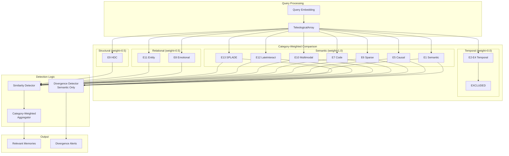

# Technical Specification: Phase 3 - Similarity & Divergence Detection

```xml
<technical_spec id="TECH-PHASE3" version="1.0" implements="SPEC-PHASE3">
<metadata>
  <title>Similarity & Divergence Detection Implementation</title>
  <status>approved</status>
  <last_updated>2026-01-16</last_updated>
</metadata>

<architecture_diagram>

</architecture_diagram>

<data_models>
<model name="SimilarityResult" file="crates/context-graph-core/src/retrieval/similarity.rs">
  <field name="memory_id" type="Uuid" constraints="not_null"/>
  <field name="per_space_scores" type="PerSpaceScores" constraints="not_null"/>
  <field name="weighted_similarity" type="f32" constraints="0.0..=1.0, category-weighted aggregate"/>
  <field name="relevance_score" type="f32" constraints="0.0..=1.0"/>
  <field name="matching_spaces" type="Vec&lt;Embedder&gt;" constraints="spaces above threshold"/>
  <field name="included_spaces" type="Vec&lt;Embedder&gt;" constraints="spaces with weight > 0"/>
  <field name="space_count" type="u8" constraints="0..=13"/>
</model>

<model name="PerSpaceScores" file="crates/context-graph-core/src/retrieval/similarity.rs">
  <field name="e1_semantic" type="f32" constraints="0.0..=1.0"/>
  <field name="e2_temp_recent" type="f32" constraints="0.0..=1.0"/>
  <field name="e3_temp_periodic" type="f32" constraints="0.0..=1.0"/>
  <field name="e4_temp_position" type="f32" constraints="0.0..=1.0"/>
  <field name="e5_causal" type="f32" constraints="0.0..=1.0"/>
  <field name="e6_sparse" type="f32" constraints="0.0..=1.0"/>
  <field name="e7_code" type="f32" constraints="0.0..=1.0"/>
  <field name="e8_emotional" type="f32" constraints="0.0..=1.0"/>
  <field name="e9_hdc" type="f32" constraints="0.0..=1.0"/>
  <field name="e10_multimodal" type="f32" constraints="0.0..=1.0"/>
  <field name="e11_entity" type="f32" constraints="0.0..=1.0"/>
  <field name="e12_late_interact" type="f32" constraints="0.0..=1.0"/>
  <field name="e13_splade" type="f32" constraints="0.0..=1.0"/>
  <field name="included_in_calculation" type="[bool; 13]" constraints="tracks which spaces were weighted"/>
</model>

<model name="DivergenceAlert" file="crates/context-graph-core/src/retrieval/divergence.rs">
  <field name="memory_id" type="Uuid" constraints="recent memory with low similarity"/>
  <field name="space" type="Embedder" constraints="space where divergence detected"/>
  <field name="similarity_score" type="f32" constraints="below low threshold"/>
  <field name="memory_summary" type="String" constraints="first 100 chars of content"/>
  <field name="detected_at" type="DateTime&lt;Utc&gt;" constraints="auto"/>
</model>

<model name="SimilarityThresholds" file="crates/context-graph-core/src/retrieval/config.rs">
  <field name="high_thresholds" type="PerSpaceThresholds" constraints="for relevance"/>
  <field name="low_thresholds" type="PerSpaceThresholds" constraints="for divergence"/>
</model>

<model name="PerSpaceThresholds" file="crates/context-graph-core/src/retrieval/config.rs">
  <field name="e1_semantic" type="f32"/>
  <field name="e2_temp_recent" type="f32"/>
  <field name="e3_temp_periodic" type="f32"/>
  <field name="e4_temp_position" type="f32"/>
  <field name="e5_causal" type="f32"/>
  <field name="e6_sparse" type="f32"/>
  <field name="e7_code" type="f32"/>
  <field name="e8_emotional" type="f32"/>
  <field name="e9_hdc" type="f32"/>
  <field name="e10_multimodal" type="f32"/>
  <field name="e11_entity" type="f32"/>
  <field name="e12_late_interact" type="f32"/>
  <field name="e13_splade" type="f32"/>
</model>

<model name="SpaceWeights" file="crates/context-graph-core/src/retrieval/config.rs">
  <description>Category-based weights for similarity calculation. Temporal spaces (E2-E4) are excluded with weight 0.0.</description>
  <field name="weights" type="[f32; 13]" constraints="category-weighted, temporal excluded"/>
  <methods>
    - fn get_weight(embedder: Embedder) -> f32
    - fn is_included(embedder: Embedder) -> bool  // Returns weight > 0.0
    - fn included_spaces() -> Vec&lt;Embedder&gt;  // Returns all non-zero weight spaces
    - fn total_weight() -> f32  // Sum of all non-zero weights
  </methods>
</model>

<model name="SpaceCategory" file="crates/context-graph-core/src/retrieval/config.rs">
  <description>Categorization of embedding spaces for weighted calculations.</description>
  <field name="Semantic" type="enum variant" constraints="E1, E5, E6, E7, E10, E12, E13 - weight 1.0"/>
  <field name="Temporal" type="enum variant" constraints="E2, E3, E4 - weight 0.0 (excluded)"/>
  <field name="Relational" type="enum variant" constraints="E8, E11 - weight 0.5"/>
  <field name="Structural" type="enum variant" constraints="E9 - weight 0.5"/>
  <methods>
    - fn from_embedder(embedder: Embedder) -> SpaceCategory
    - fn default_weight(&amp;self) -> f32
  </methods>
  <rust_implementation>
```rust
#[derive(Debug, Clone, Copy, PartialEq, Eq)]
pub enum SpaceCategory {
    Semantic,    // E1, E5, E6, E7, E10, E12, E13
    Temporal,    // E2, E3, E4
    Relational,  // E8, E11
    Structural,  // E9
}

impl SpaceCategory {
    pub fn from_embedder(embedder: Embedder) -> Self {
        match embedder {
            Embedder::E1Semantic
            | Embedder::E5Causal
            | Embedder::E6Sparse
            | Embedder::E7Code
            | Embedder::E10Multimodal
            | Embedder::E12LateInteract
            | Embedder::E13Splade => SpaceCategory::Semantic,

            Embedder::E2TempRecent
            | Embedder::E3TempPeriodic
            | Embedder::E4TempPosition => SpaceCategory::Temporal,

            Embedder::E8Emotional
            | Embedder::E11Entity => SpaceCategory::Relational,

            Embedder::E9Hdc => SpaceCategory::Structural,
        }
    }

    pub fn default_weight(&amp;self) -> f32 {
        match self {
            SpaceCategory::Semantic => 1.0,
            SpaceCategory::Temporal => 0.0,  // Excluded
            SpaceCategory::Relational => 0.5,
            SpaceCategory::Structural => 0.5,
        }
    }
}

/// Extension trait for Embedder to get category-based topic weights
impl Embedder {
    /// Returns the category-based weight for this embedding space.
    /// Temporal spaces return 0.0 (excluded from similarity calculations).
    pub fn topic_weight(&amp;self) -> f32 {
        SpaceCategory::from_embedder(*self).default_weight()
    }

    /// Returns true if this space should be included in weighted calculations
    pub fn is_topic_weighted(&amp;self) -> bool {
        self.topic_weight() > 0.0
    }

    /// Returns true if this is a semantic space (used for divergence detection)
    pub fn is_semantic(&amp;self) -> bool {
        matches!(SpaceCategory::from_embedder(*self), SpaceCategory::Semantic)
    }
}
```
  </rust_implementation>
</model>

<model name="DivergenceSpaces" file="crates/context-graph-core/src/retrieval/divergence.rs">
  <description>Constant array of semantic spaces checked for divergence detection.</description>
  <field name="DIVERGENCE_SPACES" type="[Embedder; 7]" constraints="E1, E5, E6, E7, E10, E12, E13"/>
</model>
</data_models>

<component_contracts>
<component name="MultiSpaceSimilarity" path="crates/context-graph-core/src/retrieval/similarity.rs">
  <method name="compute_similarity">
    <signature>pub fn compute_similarity(&amp;self, a: &amp;TeleologicalArray, b: &amp;TeleologicalArray) -> SimilarityResult</signature>
    <implements>REQ-P3-01</implements>
    <behavior>
      Category-weighted similarity calculation that excludes temporal spaces:

      1. Initialize accumulators:
         let mut weighted_sum = 0.0;
         let mut weight_total = 0.0;
         let mut per_space_scores = PerSpaceScores::default();
         let mut included_spaces = Vec::new();

      2. For each embedder in Embedder::iter().enumerate():
         a. Get category weight: weight = embedder.topic_weight()
         b. Compute raw similarity using appropriate metric:
            - Cosine: dot(a, b) / (|a| × |b|)
            - Jaccard: |A ∩ B| / |A ∪ B|
            - Hamming: 1 - (hamming_dist / total_bits)
            - MaxSim: max(sim(q_tok, m_tok)) averaged
            - TransE: 1 / (1 + euclidean_distance)
         c. Store similarity in per_space_scores[embedder]
         d. If weight > 0.0 (skip temporal E2-E4):
            - weighted_sum += weight * similarity
            - weight_total += weight
            - included_spaces.push(embedder)

      3. Calculate weighted aggregate:
         weighted_similarity = weighted_sum / weight_total

      4. Return SimilarityResult {
           per_space_scores,
           weighted_similarity,
           included_spaces,
           ...
         }
    </behavior>
    <rust_example>
```rust
pub fn compute_similarity(&amp;self, a: &amp;TeleologicalArray, b: &amp;TeleologicalArray) -> SimilarityResult {
    let mut weighted_sum = 0.0;
    let mut weight_total = 0.0;
    let mut included_spaces = Vec::new();

    for (i, embedder) in Embedder::iter().enumerate() {
        let weight = embedder.topic_weight();
        if weight > 0.0 {  // Skip temporal (E2-E4)
            let sim = self.distance_calc.similarity(embedder, &amp;a[i], &amp;b[i]);
            weighted_sum += weight * sim;
            weight_total += weight;
            included_spaces.push(embedder);
        }
    }

    SimilarityResult {
        weighted_similarity: weighted_sum / weight_total,
        included_spaces,
        // ... other fields
    }
}
```
    </rust_example>
  </method>

  <method name="is_relevant">
    <signature>pub fn is_relevant(scores: &amp;PerSpaceScores, thresholds: &amp;PerSpaceThresholds) -> bool</signature>
    <implements>REQ-P3-02</implements>
    <behavior>
      Return true if ANY space score > corresponding threshold.
      This implements the ANY() logic from the spec.
    </behavior>
  </method>

  <method name="matching_spaces">
    <signature>pub fn matching_spaces(scores: &amp;PerSpaceScores, thresholds: &amp;PerSpaceThresholds) -> Vec&lt;Embedder&gt;</signature>
    <behavior>
      Return list of embedders where score > threshold.
      Used for diversity bonus calculation.
    </behavior>
  </method>

  <method name="compute_relevance_score">
    <signature>pub fn compute_relevance_score(scores: &amp;PerSpaceScores, thresholds: &amp;PerSpaceThresholds, weights: &amp;SpaceWeights) -> f32</signature>
    <implements>REQ-P3-03</implements>
    <behavior>
      relevance = Σ (weight_i × max(0, score_i - threshold_i))
      Normalized to 0.0..1.0 range.
    </behavior>
  </method>
</component>

<component name="DivergenceDetector" path="crates/context-graph-core/src/retrieval/divergence.rs">
  <constants>
    <constant name="DIVERGENCE_SPACES" type="[Embedder; 7]">
      <description>Only semantic spaces are checked for divergence detection.</description>
      <value>[E1, E5, E6, E7, E10, E12, E13]</value>
      <rationale>
        - E1 (Semantic): Core meaning similarity
        - E5 (Causal): Intent/reasoning similarity
        - E6 (Sparse): Term overlap detection
        - E7 (Code): Code structure similarity
        - E10 (Multimodal): Cross-modal concept similarity
        - E12 (LateInteract): Deep semantic matching
        - E13 (SPLADE): Sparse lexical expansion

        Excluded:
        - E2-E4 (Temporal): Time-based, not semantic
        - E8 (Emotional): Relational, not topic-based
        - E9 (HDC): Structural, not topic-based
        - E11 (Entity): Relational, not topic-based
      </rationale>
    </constant>
  </constants>

  <method name="detect_divergence">
    <signature>pub fn detect_divergence(query: &amp;TeleologicalArray, recent_memories: &amp;[Memory], thresholds: &amp;PerSpaceThresholds) -> Vec&lt;DivergenceAlert&gt;</signature>
    <implements>REQ-P3-04</implements>
    <behavior>
      Only check SEMANTIC spaces (DIVERGENCE_SPACES) for topic divergence:

      For each recent memory:
        1. Compute PerSpaceScores with query
        2. For each space in DIVERGENCE_SPACES only:
           a. If score < low_threshold:
              Create DivergenceAlert { memory_id, space, score, summary }
      Return all alerts, sorted by score ascending (lowest first).

      Note: Temporal (E2-E4), Relational (E8, E11), and Structural (E9) spaces
      are excluded from divergence detection as they don't indicate topic drift.
    </behavior>
    <rust_example>
```rust
/// Spaces checked for divergence detection (semantic only)
pub const DIVERGENCE_SPACES: [Embedder; 7] = [
    Embedder::E1Semantic,
    Embedder::E5Causal,
    Embedder::E6Sparse,
    Embedder::E7Code,
    Embedder::E10Multimodal,
    Embedder::E12LateInteract,
    Embedder::E13Splade,
];

pub fn detect_divergence(
    query: &amp;TeleologicalArray,
    recent_memories: &amp;[Memory],
    thresholds: &amp;PerSpaceThresholds,
) -> Vec&lt;DivergenceAlert&gt; {
    let mut alerts = Vec::new();

    for memory in recent_memories {
        let scores = compute_per_space_scores(query, &amp;memory.embeddings);

        // Only check semantic spaces for divergence
        for &amp;space in &amp;DIVERGENCE_SPACES {
            let score = scores.get(space);
            let threshold = thresholds.get_low(space);

            if score < threshold {
                alerts.push(DivergenceAlert {
                    memory_id: memory.id,
                    space,
                    similarity_score: score,
                    memory_summary: memory.content[..100.min(memory.content.len())].to_string(),
                    detected_at: Utc::now(),
                });
            }
        }
    }

    alerts.sort_by(|a, b| a.similarity_score.partial_cmp(&amp;b.similarity_score).unwrap());
    alerts
}
```
    </rust_example>
  </method>

  <method name="get_recent_memories">
    <signature>pub async fn get_recent_memories(&amp;self, session_id: &amp;str, lookback: Duration) -> Result&lt;Vec&lt;Memory&gt;, RetrievalError&gt;</signature>
    <behavior>
      1. Query memories where session_id matches OR created_at > (now - lookback)
      2. Default lookback: 2 hours
      3. Limit to 50 most recent
      4. Return sorted by created_at descending
    </behavior>
  </method>

  <method name="format_divergence_alert">
    <signature>pub fn format_divergence_alert(alert: &amp;DivergenceAlert) -> String</signature>
    <behavior>
      Return formatted string:
      "⚠️ DIVERGENCE in {space}: Recent work on \"{summary}\" (similarity: {score:.2})"
    </behavior>
  </method>
</component>

<component name="SimilarityRetriever" path="crates/context-graph-core/src/retrieval/retriever.rs">
  <method name="retrieve_similar">
    <signature>pub async fn retrieve_similar(&amp;self, query: &amp;TeleologicalArray, limit: usize) -> Result&lt;Vec&lt;SimilarityResult&gt;, RetrievalError&gt;</signature>
    <implements>REQ-P3-05</implements>
    <behavior>
      1. Get all memories from store (or use index for large DBs)
      2. For each memory:
         a. Compute PerSpaceScores
         b. Check if relevant (ANY space above threshold)
         c. If relevant, compute relevance_score
      3. Filter to relevant memories only
      4. Sort by relevance_score descending
      5. Take top `limit` results
      6. Return SimilarityResult for each
    </behavior>
  </method>

  <method name="retrieve_by_space">
    <signature>pub async fn retrieve_by_space(&amp;self, query: &amp;TeleologicalArray, space: Embedder, limit: usize) -> Result&lt;Vec&lt;SimilarityResult&gt;, RetrievalError&gt;</signature>
    <behavior>
      1. Get all memories
      2. Compute similarity only in specified space
      3. Sort by that space's score
      4. Return top `limit`
    </behavior>
  </method>
</component>

<component name="DistanceCalculator" path="crates/context-graph-core/src/retrieval/distance.rs">
  <method name="cosine_similarity">
    <signature>pub fn cosine_similarity&lt;const N: usize&gt;(a: &amp;DenseVector&lt;N&gt;, b: &amp;DenseVector&lt;N&gt;) -> f32</signature>
    <behavior>
      dot = Σ(a[i] × b[i])
      mag_a = √(Σ(a[i]²))
      mag_b = √(Σ(b[i]²))
      return dot / (mag_a × mag_b)
    </behavior>
  </method>

  <method name="jaccard_similarity">
    <signature>pub fn jaccard_similarity(a: &amp;SparseVector, b: &amp;SparseVector) -> f32</signature>
    <behavior>
      intersection = indices in both a and b
      union = indices in a or b
      return |intersection| / |union|
    </behavior>
  </method>

  <method name="hamming_similarity">
    <signature>pub fn hamming_similarity&lt;const N: usize&gt;(a: &amp;BinaryVector&lt;N&gt;, b: &amp;BinaryVector&lt;N&gt;) -> f32</signature>
    <behavior>
      diff_bits = popcount(a XOR b)
      return 1.0 - (diff_bits / N)
    </behavior>
  </method>

  <method name="max_sim">
    <signature>pub fn max_sim(query_tokens: &amp;[DenseVector&lt;128&gt;], memory_tokens: &amp;[DenseVector&lt;128&gt;]) -> f32</signature>
    <behavior>
      For each query token:
        max_score = max(cosine_sim(query_tok, mem_tok) for all mem_tok)
      return mean(max_scores)
    </behavior>
  </method>

  <method name="transe_similarity">
    <signature>pub fn transe_similarity(a: &amp;DenseVector&lt;384&gt;, b: &amp;DenseVector&lt;384&gt;) -> f32</signature>
    <behavior>
      euclidean_dist = √(Σ(a[i] - b[i])²)
      return 1.0 / (1.0 + euclidean_dist)
    </behavior>
  </method>
</component>
</component_contracts>

<static_configuration>
<config name="HIGH_THRESHOLDS" type="PerSpaceThresholds">
  e1_semantic: 0.75
  e2_temp_recent: 0.70
  e3_temp_periodic: 0.70
  e4_temp_position: 0.70
  e5_causal: 0.70
  e6_sparse: 0.60
  e7_code: 0.80
  e8_emotional: 0.70
  e9_hdc: 0.70
  e10_multimodal: 0.70
  e11_entity: 0.70
  e12_late_interact: 0.70
  e13_splade: 0.60
</config>

<config name="LOW_THRESHOLDS" type="PerSpaceThresholds">
  e1_semantic: 0.30
  e2_temp_recent: 0.30
  e3_temp_periodic: 0.30
  e4_temp_position: 0.30
  e5_causal: 0.25
  e6_sparse: 0.20
  e7_code: 0.35
  e8_emotional: 0.30
  e9_hdc: 0.30
  e10_multimodal: 0.30
  e11_entity: 0.30
  e12_late_interact: 0.30
  e13_splade: 0.20
</config>

<config name="SPACE_WEIGHTS" type="SpaceWeights">
  <description>Category-based weights for similarity calculation. Temporal spaces excluded.</description>
  <category name="Semantic" weight="1.0">
    e1_semantic: 1.0      // E1: Core semantic similarity
    e5_causal: 1.0        // E5: Intent/causal similarity
    e6_sparse: 1.0        // E6: Sparse term overlap
    e7_code: 1.0          // E7: Code structure similarity
    e10_multimodal: 1.0   // E10: Cross-modal concepts
    e12_late_interact: 1.0 // E12: Deep semantic matching
    e13_splade: 1.0       // E13: Lexical expansion
  </category>
  <category name="Temporal" weight="0.0">
    e2_temp_recent: 0.0   // E2: Excluded from similarity calc
    e3_temp_periodic: 0.0 // E3: Excluded from similarity calc
    e4_temp_position: 0.0 // E4: Excluded from similarity calc
  </category>
  <category name="Relational" weight="0.5">
    e8_emotional: 0.5     // E8: Emotional/social context
    e11_entity: 0.5       // E11: Entity relationship
  </category>
  <category name="Structural" weight="0.5">
    e9_hdc: 0.5           // E9: Hyperdimensional structure
  </category>
  <rust_constant>
```rust
/// Category-based weights for topic similarity calculation
/// Temporal spaces (E2-E4) are excluded with weight 0.0
pub const SPACE_WEIGHTS: [f32; 13] = [
    1.0,  // E1: Semantic - core meaning
    0.0,  // E2: Temporal (excluded)
    0.0,  // E3: Temporal (excluded)
    0.0,  // E4: Temporal (excluded)
    1.0,  // E5: Semantic - causal/intent
    1.0,  // E6: Semantic - sparse terms
    1.0,  // E7: Semantic - code structure
    0.5,  // E8: Relational - emotional
    0.5,  // E9: Structural - HDC
    1.0,  // E10: Semantic - multimodal
    0.5,  // E11: Relational - entity
    1.0,  // E12: Semantic - late interaction
    1.0,  // E13: Semantic - SPLADE
];

// Total weight for normalization: 7*1.0 + 3*0.5 = 8.5
pub const TOTAL_WEIGHT: f32 = 8.5;
```
  </rust_constant>
</config>

<config name="RECENT_LOOKBACK" type="Duration">
  value: 2 hours
  purpose: Time window for divergence detection
</config>
</static_configuration>

<error_types>
<error_enum name="RetrievalError" file="crates/context-graph-core/src/retrieval/error.rs">
  <variant name="StorageError">
    <field name="source" type="StorageError"/>
  </variant>
  <variant name="InvalidQuery">
    <field name="message" type="String"/>
  </variant>
  <variant name="NoMemories">No memories in database</variant>
</error_enum>
</error_types>

<implementation_notes>
<note category="performance">
  For small memory counts (&lt;1000), linear scan is acceptable.
  For larger counts, build per-space HNSW indexes.
  Cosine similarity can use SIMD for 4x speedup.
</note>

<note category="caching">
  Cache TeleologicalArray dequantization for hot memories.
  LRU cache with 1000 entries typical.
</note>

<note category="divergence">
  Divergence detection is computationally cheaper than full retrieval.
  Only compare against recent memories (50 max).
  Run divergence check first, then full retrieval if no alerts.
  IMPORTANT: Only semantic spaces (E1, E5-E7, E10, E12-E13) are checked for
  divergence. Temporal, relational, and structural spaces are excluded.
</note>

<note category="normalization">
  All similarity scores normalized to 0.0..1.0 range.
  Hamming converts distance to similarity.
  TransE converts distance to similarity.
</note>

<note category="category-weighting">
  SPACE CATEGORIES AND WEIGHTS:
  - Semantic (weight=1.0): E1, E5, E6, E7, E10, E12, E13 - Topic/meaning similarity
  - Temporal (weight=0.0): E2, E3, E4 - EXCLUDED from weighted calculations
  - Relational (weight=0.5): E8, E11 - Context/relationship similarity
  - Structural (weight=0.5): E9 - Structure-based similarity

  The weighted_similarity is computed as:
    weighted_sum / weight_total where temporal spaces are skipped entirely.
  This ensures topic similarity is not diluted by temporal proximity.
</note>
</implementation_notes>
</technical_spec>
```

## Category-Weighted Similarity Calculation Example

```
Query vs Memory comparison with category-based weights:

Per-Space Scores (all computed, but weighted differently):

SEMANTIC SPACES (weight=1.0):
  E1 Semantic:      0.82  → 1.0 × 0.82 = 0.82
  E5 Causal:        0.75  → 1.0 × 0.75 = 0.75
  E6 Sparse:        0.60  → 1.0 × 0.60 = 0.60
  E7 Code:          0.85  → 1.0 × 0.85 = 0.85
  E10 Multimodal:   0.70  → 1.0 × 0.70 = 0.70
  E12 LateInteract: 0.65  → 1.0 × 0.65 = 0.65
  E13 SPLADE:       0.55  → 1.0 × 0.55 = 0.55

TEMPORAL SPACES (weight=0.0 - EXCLUDED):
  E2 TempRecent:   0.90  → SKIPPED (not included in calculation)
  E3 TempPeriodic: 0.85  → SKIPPED (not included in calculation)
  E4 TempPosition: 0.80  → SKIPPED (not included in calculation)

RELATIONAL SPACES (weight=0.5):
  E8 Emotional:    0.50  → 0.5 × 0.50 = 0.25
  E11 Entity:      0.60  → 0.5 × 0.60 = 0.30

STRUCTURAL SPACES (weight=0.5):
  E9 HDC:          0.55  → 0.5 × 0.55 = 0.275

Weighted Calculation:
  weighted_sum = 0.82 + 0.75 + 0.60 + 0.85 + 0.70 + 0.65 + 0.55  // semantic
               + 0.25 + 0.30 + 0.275                              // relational + structural
             = 5.545

  weight_total = 7 × 1.0 + 2 × 0.5 + 1 × 0.5 = 8.5

  weighted_similarity = 5.545 / 8.5 = 0.652

Included Spaces: [E1, E5, E6, E7, E8, E9, E10, E11, E12, E13]  // 10 spaces
Excluded Spaces: [E2, E3, E4]                                   // temporal

---

Divergence Detection (semantic spaces only):

For recent memory with these scores against DIVERGENCE_SPACES:
  E1:  0.25 < 0.30 threshold → ALERT: Topic drift in semantic space
  E5:  0.45 > 0.25 threshold → OK
  E6:  0.15 < 0.20 threshold → ALERT: Topic drift in sparse space
  E7:  0.40 > 0.35 threshold → OK
  E10: 0.35 > 0.30 threshold → OK
  E12: 0.28 < 0.30 threshold → ALERT: Topic drift in late-interact space
  E13: 0.25 > 0.20 threshold → OK

Result: 3 divergence alerts (E1, E6, E12 below low thresholds)
```

## File Structure

```
crates/context-graph-core/src/retrieval/
├── mod.rs           # Re-exports
├── similarity.rs    # MultiSpaceSimilarity
├── divergence.rs    # DivergenceDetector
├── retriever.rs     # SimilarityRetriever
├── distance.rs      # DistanceCalculator
├── config.rs        # Thresholds, weights
└── error.rs         # RetrievalError
```
