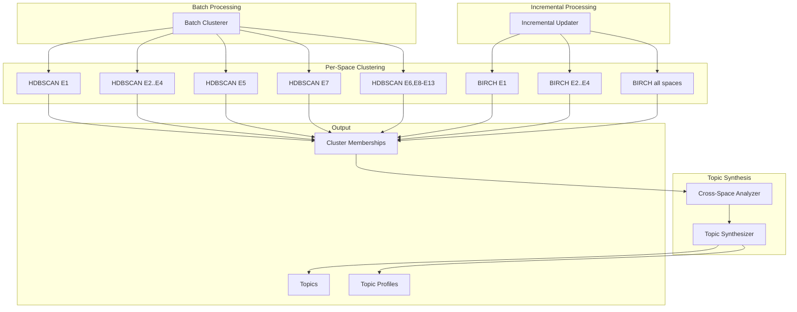

# Technical Specification: Phase 4 - Multi-Space Clustering

```xml
<technical_spec id="TECH-PHASE4" version="1.0" implements="SPEC-PHASE4">
<metadata>
  <title>Multi-Space Clustering Implementation</title>
  <status>approved</status>
  <last_updated>2026-01-16</last_updated>
</metadata>

<architecture_diagram>

</architecture_diagram>

<data_models>
<model name="ClusterMembership" file="crates/context-graph-core/src/clustering/membership.rs">
  <field name="memory_id" type="Uuid" constraints="not_null"/>
  <field name="space" type="Embedder" constraints="not_null"/>
  <field name="cluster_id" type="i32" constraints="-1 for noise"/>
  <field name="membership_probability" type="f32" constraints="0.0..=1.0"/>
  <field name="is_core_point" type="bool" constraints="not_null"/>
</model>

<model name="Cluster" file="crates/context-graph-core/src/clustering/cluster.rs">
  <field name="id" type="i32" constraints="unique per space"/>
  <field name="space" type="Embedder" constraints="not_null"/>
  <field name="centroid" type="Vec&lt;f32&gt;" constraints="dimension matches space"/>
  <field name="member_count" type="u32" constraints="&gt;= min_cluster_size"/>
  <field name="silhouette_score" type="f32" constraints="-1.0..=1.0"/>
  <field name="created_at" type="DateTime&lt;Utc&gt;" constraints="auto"/>
  <field name="updated_at" type="DateTime&lt;Utc&gt;" constraints="auto"/>
</model>

<model name="Topic" file="crates/context-graph-core/src/clustering/topic.rs">
  <field name="id" type="Uuid" constraints="auto generated"/>
  <field name="name" type="Option&lt;String&gt;" constraints="auto-generated or user-set"/>
  <field name="weighted_agreement" type="f32" constraints="sum of topic_weight for agreeing spaces, >= TOPIC_THRESHOLD (2.5)"/>
  <field name="confidence" type="f32" constraints="weighted_agreement / MAX_WEIGHTED_AGREEMENT (8.5)"/>
  <field name="agreeing_spaces" type="Vec&lt;Embedder&gt;" constraints="all spaces that clustered together"/>
  <field name="semantic_spaces" type="Vec&lt;Embedder&gt;" constraints="only semantic spaces (E1-E5) that clustered"/>
  <field name="profile" type="TopicProfile" constraints="not_null"/>
  <field name="contributing_spaces" type="Vec&lt;Embedder&gt;" constraints="len >= 3"/>
  <field name="cluster_ids" type="HashMap&lt;Embedder, i32&gt;" constraints="space -> cluster mapping"/>
  <field name="member_memories" type="Vec&lt;Uuid&gt;" constraints="intersection of cluster members"/>
  <field name="stability" type="TopicStability" constraints="not_null"/>
  <field name="created_at" type="DateTime&lt;Utc&gt;" constraints="auto"/>
</model>

<model name="TopicProfile" file="crates/context-graph-core/src/clustering/topic.rs">
  <field name="strengths" type="[f32; 13]" constraints="per-space strength 0.0..=1.0"/>
  <field name="semantic_agreement" type="f32" constraints="sum of semantic space weights (E1-E5), max 5.0"/>
  <field name="relational_agreement" type="f32" constraints="sum of relational space weights (E6-E9), max 2.5"/>
  <field name="structural_agreement" type="f32" constraints="sum of structural space weights (E10-E12), max 1.0"/>
  <description>
    Category breakdown tracks agreement by embedding category (temporal E13 excluded from topic synthesis).
    - Semantic (E1-E5): Core meaning spaces, weight 1.0 each
    - Relational (E6-E9): Relationship-based spaces, mixed weights (0.5-1.0)
    - Structural (E10-E12): Pattern spaces, weight 0.5 each (E10 excluded from topics)
  </description>
  <methods>
    - fn dominant_spaces(&amp;self) -> Vec&lt;Embedder&gt;
    - fn similarity(&amp;self, other: &amp;TopicProfile) -> f32
    - fn total_agreement(&amp;self) -> f32  // semantic + relational + structural
  </methods>
</model>

<model name="TopicStability" file="crates/context-graph-core/src/clustering/topic.rs">
  <field name="phase" type="TopicPhase" constraints="enum"/>
  <field name="age_hours" type="f32" constraints="time since creation"/>
  <field name="membership_churn" type="f32" constraints="0.0..=1.0"/>
  <field name="centroid_drift" type="f32" constraints="0.0..=1.0"/>
  <field name="access_count" type="u32" constraints="retrieval count"/>
  <field name="last_accessed" type="DateTime&lt;Utc&gt;" constraints="nullable"/>
</model>

<model name="TopicPhase" file="crates/context-graph-core/src/clustering/topic.rs">
  <variants>
    <variant name="Emerging">Less than 1 hour old, membership changing</variant>
    <variant name="Stable">Consistent membership for 24+ hours</variant>
    <variant name="Declining">Decreasing access, members leaving</variant>
    <variant name="Merging">Being absorbed into another topic</variant>
  </variants>
</model>

<model name="HDBSCANParams" file="crates/context-graph-core/src/clustering/hdbscan.rs">
  <field name="min_cluster_size" type="usize" constraints="default: 3"/>
  <field name="min_samples" type="usize" constraints="default: 2"/>
  <field name="cluster_selection_method" type="ClusterSelectionMethod" constraints="default: EOM"/>
  <field name="metric" type="DistanceMetric" constraints="from embedder config"/>
</model>

<model name="BIRCHParams" file="crates/context-graph-core/src/clustering/birch.rs">
  <field name="branching_factor" type="usize" constraints="default: 50"/>
  <field name="threshold" type="f32" constraints="default: 0.3, adaptive"/>
  <field name="max_node_entries" type="usize" constraints="default: 50"/>
</model>

<model name="ClusterSelectionMethod" file="crates/context-graph-core/src/clustering/hdbscan.rs">
  <variants>
    <variant name="EOM">Excess of Mass - default, good general purpose</variant>
    <variant name="Leaf">Leaf clusters only - more granular</variant>
  </variants>
</model>
</data_models>

<component_contracts>
<component name="HDBSCANClusterer" path="crates/context-graph-core/src/clustering/hdbscan.rs">
  <dependencies>
    - hdbscan crate or custom implementation
    - Distance functions from retrieval module
  </dependencies>

  <method name="fit">
    <signature>pub fn fit(&amp;self, embeddings: &amp;[Vec&lt;f32&gt;], params: &amp;HDBSCANParams) -> Result&lt;Vec&lt;ClusterMembership&gt;, ClusterError&gt;</signature>
    <implements>REQ-P4-01</implements>
    <behavior>
      1. Build mutual reachability graph
      2. Construct minimum spanning tree
      3. Build cluster hierarchy
      4. Extract clusters using EOM or Leaf method
      5. Compute membership probabilities
      6. Return ClusterMembership for each point
    </behavior>
    <complexity>O(n² log n) for dense, O(n log n) with spatial index</complexity>
  </method>

  <method name="compute_silhouette">
    <signature>pub fn compute_silhouette(&amp;self, embeddings: &amp;[Vec&lt;f32&gt;], labels: &amp;[i32]) -> f32</signature>
    <behavior>
      For each point:
        a = mean distance to same cluster
        b = min mean distance to other clusters
        s = (b - a) / max(a, b)
      Return mean(s) across all points
    </behavior>
  </method>
</component>

<component name="BIRCHTree" path="crates/context-graph-core/src/clustering/birch.rs">
  <method name="new">
    <signature>pub fn new(params: BIRCHParams) -> Self</signature>
    <behavior>
      Initialize empty CF-tree with given parameters.
    </behavior>
  </method>

  <method name="insert">
    <signature>pub fn insert(&amp;mut self, embedding: &amp;[f32]) -> Result&lt;ClusteringFeature, ClusterError&gt;</signature>
    <implements>REQ-P4-02</implements>
    <behavior>
      1. Start at root
      2. Find closest leaf entry using CF distance
      3. If distance < threshold, merge with entry
      4. Else create new entry
      5. If node overflows, split
      6. Propagate CF updates to parents
      7. Return CF of inserted point's cluster
    </behavior>
    <complexity>O(B log n) where B = branching_factor</complexity>
  </method>

  <method name="get_clusters">
    <signature>pub fn get_clusters(&amp;self) -> Vec&lt;ClusteringFeature&gt;</signature>
    <behavior>
      Return all leaf CFs as cluster summaries.
    </behavior>
  </method>

  <method name="adapt_threshold">
    <signature>pub fn adapt_threshold(&amp;mut self, target_cluster_count: usize)</signature>
    <behavior>
      Binary search for threshold that produces approximately
      target_cluster_count clusters. Update self.threshold.
    </behavior>
  </method>
</component>

<component name="ClusteringFeature" path="crates/context-graph-core/src/clustering/birch.rs">
  <field name="n" type="u32">Number of points</field>
  <field name="ls" type="Vec&lt;f32&gt;">Linear sum</field>
  <field name="ss" type="f32">Squared sum</field>
  <methods>
    - fn centroid(&amp;self) -> Vec&lt;f32&gt;  // ls / n
    - fn radius(&amp;self) -> f32          // sqrt(ss/n - centroid²)
    - fn diameter(&amp;self) -> f32
    - fn merge(&amp;mut self, other: &amp;ClusteringFeature)
    - fn distance(&amp;self, other: &amp;ClusteringFeature) -> f32
  </methods>
</component>

<component name="MultiSpaceClusterManager" path="crates/context-graph-core/src/clustering/manager.rs">
  <method name="cluster_all_spaces">
    <signature>pub async fn cluster_all_spaces(&amp;self, memories: &amp;[Memory]) -> Result&lt;HashMap&lt;Embedder, Vec&lt;ClusterMembership&gt;&gt;, ClusterError&gt;</signature>
    <implements>REQ-P4-03</implements>
    <behavior>
      For each embedder E1..E13:
        1. Extract embeddings from memories for this space
        2. Determine params based on embedder type
        3. Run HDBSCAN.fit()
        4. Store memberships
      Return map of space -> memberships
    </behavior>
  </method>

  <method name="insert_memory">
    <signature>pub async fn insert_memory(&amp;mut self, memory: &amp;Memory) -> Result&lt;(), ClusterError&gt;</signature>
    <implements>REQ-P4-02</implements>
    <behavior>
      For each embedder E1..E13:
        1. Extract embedding from memory
        2. Insert into BIRCH tree for this space
        3. Get cluster assignment
        4. Store ClusterMembership
    </behavior>
  </method>

  <method name="recluster_space">
    <signature>pub async fn recluster_space(&amp;mut self, space: Embedder) -> Result&lt;(), ClusterError&gt;</signature>
    <behavior>
      1. Load all memories
      2. Extract embeddings for this space
      3. Run HDBSCAN
      4. Update all memberships
      5. Rebuild BIRCH tree from new clusters
    </behavior>
  </method>
</component>

<component name="TopicSynthesizer" path="crates/context-graph-core/src/clustering/topic.rs">
  <constants>
    <const name="TOPIC_THRESHOLD" type="f32" value="2.5">
      Minimum weighted_agreement required to form a topic.
      Ensures meaningful cross-space consensus before topic creation.
    </const>
    <const name="MAX_WEIGHTED_AGREEMENT" type="f32" value="8.5">
      Maximum possible weighted_agreement: 7x1.0 (semantic+relational) + 2x0.5 (E11,E12) + 1x0.5 (E6).
      Used to normalize confidence to 0.0..=1.0 range.
      Note: E10 (structural patterns) and E13 (temporal) excluded from topic synthesis.
    </const>
  </constants>

  <method name="synthesize_topics">
    <signature>pub fn synthesize_topics(&amp;self, clusters: &amp;MultiSpaceClusterResult) -> Result&lt;Vec&lt;Topic&gt;, ClusterError&gt;</signature>
    <implements>REQ-P4-04</implements>
    <behavior>
      1. Group memories by cluster per space
      2. For each potential topic group (memories clustering together):
         a. Calculate weighted_agreement:
            ```rust
            let weighted_agreement: f32 = clusters.iter()
                .map(|(embedder, is_clustered)| {
                    if *is_clustered {
                        embedder.topic_weight()
                    } else {
                        0.0
                    }
                })
                .sum();
            ```
         b. Skip if weighted_agreement < TOPIC_THRESHOLD (2.5)
      3. For each qualifying group:
         a. Compute confidence = weighted_agreement / MAX_WEIGHTED_AGREEMENT (8.5)
         b. Collect agreeing_spaces = all spaces where is_clustered == true
         c. Collect semantic_spaces = agreeing_spaces filtered to E1-E5
         d. Compute TopicProfile with category breakdown:
            - semantic_agreement = sum of weights for E1-E5
            - relational_agreement = sum of weights for E6-E9
            - structural_agreement = sum of weights for E11-E12 (E10 excluded)
         e. Create Topic with all fields
      4. Merge highly similar topics (profile similarity > 0.9)
      5. Return final topic list
    </behavior>
    <weighted_agreement_calculation>
      Uses Embedder.topic_weight() which returns:
      - E1-E5 (semantic): 1.0 each
      - E6 (entity co-occurrence): 0.5
      - E7-E9 (relational): 1.0 each
      - E10 (structural patterns): excluded (0.0)
      - E11-E12 (structural): 0.5 each
      - E13 (temporal): excluded (0.0)

      Total possible = 5(1.0) + 0.5 + 3(1.0) + 2(0.5) = 8.5
    </weighted_agreement_calculation>
  </method>

  <method name="update_topic_stability">
    <signature>pub fn update_topic_stability(&amp;mut self, topic: &amp;mut Topic, old_members: &amp;[Uuid], new_members: &amp;[Uuid])</signature>
    <implements>REQ-P4-05</implements>
    <behavior>
      1. Compute membership_churn = |symmetric_difference| / |union|
      2. Compute centroid_drift = 1 - cosine_sim(old_centroid, new_centroid)
      3. Update topic.stability fields
      4. Determine phase:
         - If age < 1h AND churn > 0.3: Emerging
         - If churn < 0.1 for 24h: Stable
         - If access declining AND churn > 0.2: Declining
         - If profile very similar to larger topic: Merging
    </behavior>
  </method>
</component>

<component name="TopicStabilityTracker" path="crates/context-graph-core/src/clustering/stability.rs">
  <method name="track_churn">
    <signature>pub fn track_churn(&amp;mut self) -> f32</signature>
    <behavior>
      Compare current topic set to snapshot from 1 hour ago.
      churn = (topics_added + topics_removed) / total_topics
      Return churn rate 0.0..=1.0
    </behavior>
  </method>

  <method name="check_dream_trigger">
    <signature>pub fn check_dream_trigger(&amp;self, entropy: f32) -> bool</signature>
    <behavior>
      Return true if:
        (entropy > 0.7) AND (self.churn > 0.5)
      OR
        (entropy > 0.7) for 5+ continuous minutes
    </behavior>
  </method>

  <method name="take_snapshot">
    <signature>pub fn take_snapshot(&amp;mut self, topics: &amp;[Topic])</signature>
    <behavior>
      Store current topic state with timestamp.
      Keep last 24 hours of snapshots.
    </behavior>
  </method>
</component>
</component_contracts>

<static_configuration>
<config name="HDBSCAN_DEFAULTS" type="HDBSCANParams">
  min_cluster_size: 3
  min_samples: 2
  cluster_selection_method: EOM
</config>

<config name="BIRCH_DEFAULTS" type="BIRCHParams">
  branching_factor: 50
  threshold: 0.3
  max_node_entries: 50
</config>

<config name="TOPIC_SYNTHESIS" type="TopicSynthesisConfig">
  topic_threshold: 2.5              // Minimum weighted_agreement to form topic
  max_weighted_agreement: 8.5       // Maximum possible weighted_agreement
  min_silhouette: 0.3
  merge_similarity_threshold: 0.9
</config>

<config name="EMBEDDER_TOPIC_WEIGHTS" type="HashMap&lt;Embedder, f32&gt;">
  // Semantic spaces (high weight)
  E1_AllMiniLM: 1.0
  E2_SBERT: 1.0
  E3_InstructorXL: 1.0
  E4_BGESmall: 1.0
  E5_E5Base: 1.0
  // Relational spaces (mixed weights)
  E6_EntityCooccurrence: 0.5        // Lower weight - sparse representation
  E7_ConversationalRole: 1.0
  E8_ReferenceDensity: 1.0
  E9_EmotionalValence: 1.0
  // Structural spaces (lower weight)
  E10_StructuralPatterns: 0.0       // Excluded from topic synthesis
  E11_SemanticComplexity: 0.5
  E12_InformationDensity: 0.5
  // Temporal (excluded)
  E13_TemporalContext: 0.0          // Excluded from topic synthesis
</config>

<config name="RECLUSTER_THRESHOLDS" type="ReclusterConfig">
  birch_error_threshold: 0.15
  memory_count_trigger: 100
  time_trigger: 24 hours
</config>
</static_configuration>

<error_types>
<error_enum name="ClusterError" file="crates/context-graph-core/src/clustering/error.rs">
  <variant name="InsufficientData">
    <field name="required" type="usize"/>
    <field name="actual" type="usize"/>
  </variant>
  <variant name="DimensionMismatch">
    <field name="expected" type="usize"/>
    <field name="actual" type="usize"/>
  </variant>
  <variant name="NoValidClusters">No clusters with silhouette > threshold</variant>
  <variant name="StorageError">
    <field name="source" type="StorageError"/>
  </variant>
</error_enum>
</error_types>

<implementation_notes>
<note category="weighted_agreement">
  Topic synthesis uses weighted agreement instead of simple space counting.
  This ensures semantic and relational spaces have higher influence on topic formation.

  Key design decisions:
  - E10 (structural patterns) excluded: Too coarse for meaningful topic boundaries
  - E13 (temporal) excluded: Temporal proximity doesn't indicate topical similarity
  - E6 reduced weight (0.5): Sparse co-occurrence matrix less reliable than dense embeddings
  - E11, E12 reduced weight (0.5): Structural features are supporting signals, not primary

  Threshold of 2.5 ensures at least:
  - 3 semantic spaces agree, OR
  - 2 semantic + 1 relational, OR
  - 2 semantic + 1 low-weight space, OR
  - Similar meaningful combinations
</note>

<note category="progressive_activation">
  Tier 0-2 (0-9 memories): All cluster_id = -1, default TopicProfile
  Tier 3+ (10+ memories): Real clustering activated
  Check tier before clustering operations.
</note>

<note category="performance">
  HDBSCAN batch runs async, not blocking main thread.
  BIRCH insertion is O(log n), suitable for real-time.
  Schedule full recluster during low-activity periods.
</note>

<note category="sparse_spaces">
  E6 and E13 (sparse) use Jaccard distance in HDBSCAN.
  BIRCH not ideal for sparse; consider alternative for these spaces.
</note>

<note category="dream_integration">
  TopicStabilityTracker.check_dream_trigger() called periodically.
  Dream consolidation may trigger recluster on wake.
</note>
</implementation_notes>
</technical_spec>
```

## Progressive Activation Tiers

| Tier | Memory Count | Clustering Behavior |
|------|--------------|---------------------|
| 0 | 0 | No clustering, default values |
| 1 | 1-2 | No clustering, pairwise similarity only |
| 2 | 3-9 | Basic clustering enabled, min_cluster_size=3 may not form clusters |
| 3 | 10-29 | Multiple clusters possible, divergence detection active |
| 4 | 30-99 | Reliable statistics, topic synthesis active |
| 5 | 100-499 | Sub-clustering, trend analysis |
| 6 | 500+ | Full personalization |

## File Structure

```
crates/context-graph-core/src/clustering/
├── mod.rs           # Re-exports
├── hdbscan.rs       # HDBSCANClusterer, HDBSCANParams
├── birch.rs         # BIRCHTree, ClusteringFeature, BIRCHParams
├── membership.rs    # ClusterMembership
├── cluster.rs       # Cluster
├── topic.rs         # Topic, TopicProfile, TopicPhase
├── manager.rs       # MultiSpaceClusterManager
├── stability.rs     # TopicStabilityTracker
└── error.rs         # ClusterError
```

## Cross-Space Topic Detection Algorithm (Weighted Agreement)

```
Input: Memberships for 13 spaces (MultiSpaceClusterResult)
Constants:
  TOPIC_THRESHOLD = 2.5
  MAX_WEIGHTED_AGREEMENT = 8.5

Topic Weights by Embedder:
  E1-E5 (semantic): 1.0 each     → max 5.0
  E6 (entity co-occurrence): 0.5 → max 0.5
  E7-E9 (relational): 1.0 each   → max 3.0
  E10 (structural patterns): 0.0 (excluded)
  E11-E12 (structural): 0.5 each → max 1.0
  E13 (temporal): 0.0 (excluded)
  Total possible: 8.5

1. Build memory-to-clusters map:
   mem_clusters[memory_id] = {E1: cluster_3, E2: -1, E3: cluster_1, ...}

2. For each unique combination of (memory_id, cluster_id) across spaces:
   Find all memories that share this (space, cluster) assignment

3. Calculate weighted agreement for potential topic-mates:
   For memories A, B:
     weighted_agreement = 0.0
     agreeing_spaces = []
     For each space (embedder):
       if mem_clusters[A][space] == mem_clusters[B][space] != -1:
         weighted_agreement += embedder.topic_weight()
         agreeing_spaces.push(space)

     if weighted_agreement >= TOPIC_THRESHOLD:
       A and B are topic-mates

4. Build connected components of topic-mates → Candidate Topics

5. For each candidate topic:
   a. Recalculate weighted_agreement across all members
   b. Skip if weighted_agreement < TOPIC_THRESHOLD

   c. Compute confidence:
      confidence = weighted_agreement / MAX_WEIGHTED_AGREEMENT
      // Range: 0.29 (threshold/8.5) to 1.0 (perfect agreement)

   d. Categorize agreeing spaces:
      semantic_agreement = sum of weights for E1-E5 in agreeing_spaces
      relational_agreement = sum of weights for E6-E9 in agreeing_spaces
      structural_agreement = sum of weights for E11-E12 in agreeing_spaces

   e. Build Topic:
      - weighted_agreement: f32
      - confidence: f32
      - agreeing_spaces: Vec<Embedder> (all spaces that clustered)
      - semantic_spaces: Vec<Embedder> (E1-E5 only)
      - profile: TopicProfile with category breakdown

6. Merge highly similar topics (profile similarity > 0.9)

7. Return final topic list sorted by confidence descending
```

### Weighted Agreement Examples

| Scenario | Agreeing Spaces | Weighted Sum | Topic Created? |
|----------|-----------------|--------------|----------------|
| 3 semantic only | E1, E2, E3 | 3.0 | Yes (3.0 >= 2.5) |
| 2 semantic + 1 relational | E1, E2, E7 | 3.0 | Yes |
| 2 semantic only | E1, E2 | 2.0 | No (2.0 < 2.5) |
| 5 structural only | E6, E10, E11, E12, E13 | 0.5+0+0.5+0.5+0 = 1.5 | No |
| All spaces agree | E1-E12 (excl E10,E13) | 8.5 | Yes (confidence = 1.0) |
| Mixed strong | E1, E3, E5, E7, E9 | 5.0 | Yes (confidence = 0.59) |
