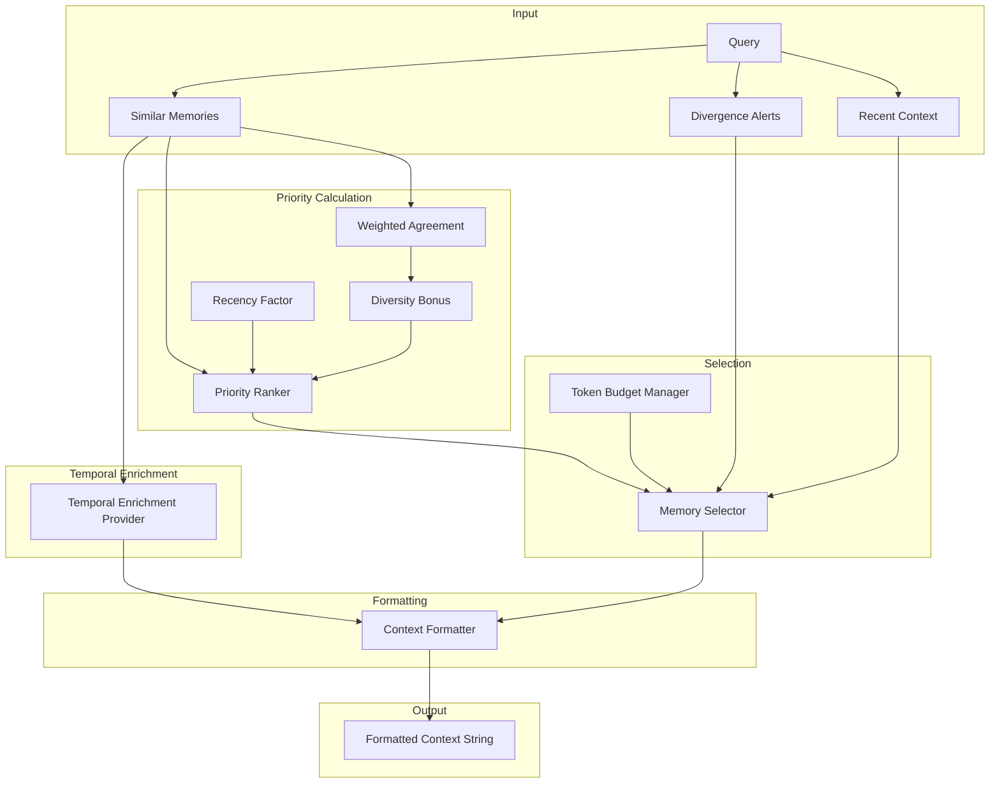

# Technical Specification: Phase 5 - Injection Pipeline

```xml
<technical_spec id="TECH-PHASE5" version="1.0" implements="SPEC-PHASE5">
<metadata>
  <title>Injection Pipeline Implementation</title>
  <status>approved</status>
  <last_updated>2026-01-16</last_updated>
</metadata>

<architecture_diagram>

</architecture_diagram>

<data_models>
<model name="InjectionCandidate" file="crates/context-graph-core/src/injection/candidate.rs">
  <field name="memory_id" type="Uuid" constraints="not_null"/>
  <field name="content" type="String" constraints="not_null"/>
  <field name="relevance_score" type="f32" constraints="0.0..=1.0"/>
  <field name="recency_factor" type="f32" constraints="0.0..=2.0"/>
  <field name="diversity_bonus" type="f32" constraints="1.0..=1.5"/>
  <field name="weighted_agreement" type="f32" constraints="sum of 1/position for matching spaces"/>
  <field name="temporal_badges" type="Vec&lt;String&gt;" constraints="temporal context badges"/>
  <field name="priority" type="f32" constraints="computed"/>
  <field name="token_count" type="u32" constraints="estimated"/>
  <field name="category" type="InjectionCategory" constraints="not_null"/>
</model>

<model name="InjectionCategory" file="crates/context-graph-core/src/injection/candidate.rs">
  <variants>
    <variant name="DivergenceAlert" priority="1" budget="200">Highest priority</variant>
    <variant name="HighRelevanceCluster" priority="2" budget="400">weighted_agreement >= 2.5</variant>
    <variant name="SingleSpaceMatch" priority="3" budget="300">weighted_agreement < 2.5</variant>
    <variant name="RecentSession" priority="4" budget="200">Last session summary</variant>
    <variant name="TemporalEnrichment" priority="5" budget="50">Time-based context badges</variant>
  </variants>
</model>

<model name="TokenBudget" file="crates/context-graph-core/src/injection/budget.rs">
  <field name="total" type="u32" constraints="default: 1250"/>
  <field name="divergence_budget" type="u32" constraints="default: 200"/>
  <field name="cluster_budget" type="u32" constraints="default: 400"/>
  <field name="single_space_budget" type="u32" constraints="default: 300"/>
  <field name="session_budget" type="u32" constraints="default: 200"/>
  <field name="temporal_budget" type="u32" constraints="default: 50"/>
  <field name="reserved" type="u32" constraints="default: 100"/>
</model>

<model name="InjectionResult" file="crates/context-graph-core/src/injection/result.rs">
  <field name="formatted_context" type="String" constraints="not_null"/>
  <field name="included_memories" type="Vec&lt;Uuid&gt;" constraints="memories used"/>
  <field name="divergence_alerts" type="Vec&lt;DivergenceAlert&gt;" constraints="alerts shown"/>
  <field name="tokens_used" type="u32" constraints="actual token count"/>
  <field name="categories_included" type="Vec&lt;InjectionCategory&gt;" constraints="which categories"/>
</model>

<model name="RecencyFactor" file="crates/context-graph-core/src/injection/priority.rs">
  <constants>
    HOUR_1: 1.3,
    DAY_1: 1.2,
    WEEK_1: 1.1,
    MONTH_1: 1.0,
    OLDER: 0.8
  </constants>
  <method name="compute">
    <signature>fn compute(created_at: DateTime&lt;Utc&gt;) -> f32</signature>
    <behavior>
      age = now - created_at
      if age < 1 hour: return 1.3
      if age < 1 day: return 1.2
      if age < 7 days: return 1.1
      if age < 30 days: return 1.0
      return 0.8
    </behavior>
  </method>
</model>

<model name="DiversityBonus" file="crates/context-graph-core/src/injection/priority.rs">
  <description>
    Computes diversity bonus based on weighted_agreement score.
    weighted_agreement = sum of (1/position) for each matching space,
    where position is the relevance rank of that space.
  </description>
  <constants>
    HIGH_AGREEMENT: 1.5 (weighted_agreement >= 5.0),
    MEDIUM_AGREEMENT: 1.2 (weighted_agreement >= 2.5),
    LOW_AGREEMENT: 1.0 (weighted_agreement < 2.5)
  </constants>
  <method name="compute">
    <signature>pub fn compute(weighted_agreement: f32) -> f32</signature>
    <behavior>
      if weighted_agreement >= 5.0: return 1.5
      if weighted_agreement >= 2.5: return 1.2
      return 1.0
    </behavior>
  </method>
</model>

<model name="TemporalEnrichmentProvider" file="crates/context-graph-core/src/injection/temporal.rs">
  <description>
    Generates temporal context badges based on time-based patterns.
    Uses E2 (hour similarity), E3 (day similarity), and E4 (recency) embeddings.
  </description>
  <method name="generate_badges">
    <signature>pub fn generate_badges(&amp;self, memory: &amp;Memory, query_time: DateTime&lt;Utc&gt;) -> Vec&lt;String&gt;</signature>
    <behavior>
      badges = []

      // E2: Hour similarity - same time of day pattern
      if memory.created_at.hour() within 2 hours of query_time.hour():
        badges.push("Same time of day")

      // E3: Day similarity - continuation pattern
      if memory.created_at.date() == query_time.date() - 1.day:
        badges.push("Continuation from yesterday")

      // E4: Recency - very recent activity
      if query_time - memory.created_at < 30.minutes:
        badges.push("Just discussed")
      elif query_time - memory.created_at < 2.hours:
        badges.push("Recent activity")

      return badges
    </behavior>
  </method>
  <method name="format_badges">
    <signature>pub fn format_badges(badges: &amp;[String]) -> String</signature>
    <behavior>
      if badges.is_empty(): return ""
      return format!("[{}]", badges.join(", "))
    </behavior>
  </method>
</model>
</data_models>

<component_contracts>
<component name="InjectionPipeline" path="crates/context-graph-core/src/injection/pipeline.rs">
  <dependencies>
    - SimilarityRetriever for memory retrieval
    - DivergenceDetector for alerts
    - ContextFormatter for output
    - TokenCounter for budget tracking
    - TemporalEnrichmentProvider for time-based badges
  </dependencies>

  <method name="generate_context">
    <signature>pub async fn generate_context(&amp;self, query: &amp;TeleologicalArray, session_id: &amp;str, budget: &amp;TokenBudget) -> Result&lt;InjectionResult, InjectionError&gt;</signature>
    <implements>REQ-P5-01, REQ-P5-02</implements>
    <behavior>
      1. Detect divergence against recent memories
      2. Retrieve similar memories with space rankings
      3. Get last session summary
      4. Build InjectionCandidates for each:
         a. Compute weighted_agreement from space rankings
         b. Assign category based on weighted_agreement threshold
         c. Generate temporal badges for each memory
      5. Compute priority = relevance × recency × diversity
      6. Sort by priority descending
      7. Select candidates within budget (including temporal_budget)
      8. Format selected content with temporal badges
      9. Return InjectionResult
    </behavior>
  </method>

  <method name="generate_brief_context">
    <signature>pub async fn generate_brief_context(&amp;self, query: &amp;TeleologicalArray, budget: u32) -> Result&lt;String, InjectionError&gt;</signature>
    <behavior>
      Simplified version for PreToolUse with strict budget.
      Skip divergence, focus on top-3 similar memories.
      Return brief formatted string.
    </behavior>
  </method>
</component>

<component name="PriorityRanker" path="crates/context-graph-core/src/injection/priority.rs">
  <method name="compute_priority">
    <signature>pub fn compute_priority(candidate: &amp;mut InjectionCandidate)</signature>
    <implements>REQ-P5-03</implements>
    <behavior>
      candidate.recency_factor = RecencyFactor::compute(candidate.created_at)
      candidate.diversity_bonus = DiversityBonus::compute(candidate.weighted_agreement)
      candidate.priority = candidate.relevance_score
                         × candidate.recency_factor
                         × candidate.diversity_bonus
    </behavior>
  </method>

  <method name="compute_weighted_agreement">
    <signature>pub fn compute_weighted_agreement(space_rankings: &amp;[(Embedder, usize)]) -> f32</signature>
    <behavior>
      // space_rankings contains (space, position) where position is 1-indexed relevance rank
      // Higher position = less relevant in that space
      weighted_agreement = 0.0
      for (space, position) in space_rankings:
        weighted_agreement += 1.0 / (position as f32)
      return weighted_agreement

      // Example: ranks [1, 2, 5] -> 1/1 + 1/2 + 1/5 = 1.7
      // Example: ranks [1, 1, 1, 2, 3] -> 1 + 1 + 1 + 0.5 + 0.33 = 3.83
    </behavior>
  </method>

  <method name="rank_candidates">
    <signature>pub fn rank_candidates(candidates: &amp;mut [InjectionCandidate])</signature>
    <behavior>
      Sort candidates by:
        1. category priority (divergence first)
        2. within category, by computed priority descending
    </behavior>
  </method>
</component>

<component name="TokenBudgetManager" path="crates/context-graph-core/src/injection/budget.rs">
  <method name="select_within_budget">
    <signature>pub fn select_within_budget(candidates: &amp;[InjectionCandidate], budget: &amp;TokenBudget) -> Vec&lt;InjectionCandidate&gt;</signature>
    <implements>REQ-P5-04</implements>
    <behavior>
      1. Group candidates by category
      2. For each category in priority order:
         a. Get category-specific budget
         b. Select candidates until budget exhausted
         c. Track remaining total budget
      3. If total budget not exhausted, allow overflow from higher priority categories
      4. Return selected candidates
    </behavior>
  </method>

  <method name="estimate_tokens">
    <signature>pub fn estimate_tokens(content: &amp;str) -> u32</signature>
    <behavior>
      Simple estimate: words × 1.3
      More accurate: use tiktoken or similar
    </behavior>
  </method>
</component>

<component name="ContextFormatter" path="crates/context-graph-core/src/injection/formatter.rs">
  <method name="format_full_context">
    <signature>pub fn format_full_context(candidates: &amp;[InjectionCandidate], alerts: &amp;[DivergenceAlert]) -> String</signature>
    <implements>REQ-P5-05</implements>
    <behavior>
      Build markdown string:
      ```
      ## Relevant Context

      ### Recent Related Work
      [High-relevance cluster matches]

      ### Potentially Related
      [Single-space matches]

      ### Note: Activity Shift Detected
      [Divergence alerts if any]
      ```
    </behavior>
  </method>

  <method name="format_brief_context">
    <signature>pub fn format_brief_context(candidates: &amp;[InjectionCandidate]) -> String</signature>
    <behavior>
      Brief format for PreToolUse:
      "Related: [summary1], [summary2]"
      Max 200 tokens.
    </behavior>
  </method>

  <method name="format_divergence_alert">
    <signature>pub fn format_divergence_alert(alert: &amp;DivergenceAlert) -> String</signature>
    <behavior>
      Format: "Recent activity in [space]: \"[summary]\" (similarity: 0.XX)"
    </behavior>
  </method>

  <method name="summarize_memory">
    <signature>pub fn summarize_memory(content: &amp;str, max_words: usize) -> String</signature>
    <behavior>
      1. Take first max_words words
      2. Truncate at sentence boundary if possible
      3. Add "..." if truncated
    </behavior>
  </method>
</component>

<component name="SessionContextProvider" path="crates/context-graph-core/src/injection/session.rs">
  <method name="get_last_session_summary">
    <signature>pub async fn get_last_session_summary(&amp;self, current_session_id: &amp;str) -> Result&lt;Option&lt;String&gt;, InjectionError&gt;</signature>
    <behavior>
      1. Find most recent completed session (not current)
      2. Get SessionSummary memory from that session
      3. Return content if found
    </behavior>
  </method>

  <method name="get_session_portfolio">
    <signature>pub async fn get_session_portfolio(&amp;self, session_id: &amp;str) -> Result&lt;PortfolioSummary, InjectionError&gt;</signature>
    <behavior>
      1. Get all topics
      2. Summarize top-5 by confidence
      3. Include any recent divergence patterns
      4. Return portfolio summary string
    </behavior>
  </method>
</component>

<component name="TemporalEnrichmentProvider" path="crates/context-graph-core/src/injection/temporal.rs">
  <description>
    Generates time-based context badges for memories based on temporal patterns.
    Leverages E2 (hour), E3 (day), and E4 (recency) embedding space relationships.
  </description>

  <method name="generate_badges">
    <signature>pub fn generate_badges(&amp;self, memory: &amp;Memory, query_time: DateTime&lt;Utc&gt;) -> Vec&lt;String&gt;</signature>
    <implements>REQ-P5-06</implements>
    <behavior>
      1. Check hour similarity (E2 pattern):
         - If memory.created_at.hour() within 2 hours of query_time.hour()
         - Add "Same time of day" badge
      2. Check day continuation (E3 pattern):
         - If memory.created_at.date() == query_time.date() - 1.day
         - Add "Continuation from yesterday" badge
      3. Check recency (E4 pattern):
         - If age < 30 minutes: add "Just discussed"
         - Else if age < 2 hours: add "Recent activity"
      4. Return collected badges
    </behavior>
  </method>

  <method name="format_badges">
    <signature>pub fn format_badges(badges: &amp;[String]) -> String</signature>
    <behavior>
      if badges.is_empty(): return ""
      return format!("[{}]", badges.join(", "))
    </behavior>
  </method>

  <method name="should_include_temporal">
    <signature>pub fn should_include_temporal(memory: &amp;Memory, query_time: DateTime&lt;Utc&gt;) -> bool</signature>
    <behavior>
      Return true if any temporal badge would be generated.
      Used for quick filtering before full badge generation.
    </behavior>
  </method>
</component>
</component_contracts>

<static_configuration>
<config name="DEFAULT_TOKEN_BUDGET" type="TokenBudget">
  total: 1250
  divergence_budget: 200
  cluster_budget: 400
  single_space_budget: 300
  session_budget: 200
  temporal_budget: 50
  reserved: 100
</config>

<config name="BRIEF_BUDGET" type="u32">
  value: 200
  purpose: PreToolUse quick context
</config>

<config name="SUMMARY_MAX_WORDS" type="usize">
  value: 50
  purpose: Memory content summarization
</config>
</static_configuration>

<error_types>
<error_enum name="InjectionError" file="crates/context-graph-core/src/injection/error.rs">
  <variant name="RetrievalError">
    <field name="source" type="RetrievalError"/>
  </variant>
  <variant name="FormattingError">
    <field name="message" type="String"/>
  </variant>
  <variant name="BudgetExceeded">
    <field name="requested" type="u32"/>
    <field name="available" type="u32"/>
  </variant>
  <variant name="NoContext">No relevant context found</variant>
</error_enum>
</error_types>

<implementation_notes>
<note category="performance">
  Cache portfolio summary, invalidate on topic change.
  Pre-compute token estimates during memory storage.
  Format_full_context should complete in &lt;50ms.
</note>

<note category="empty_output">
  If no relevant context found, return empty string.
  Empty string = no injection (Claude Code skips).
  This is normal state, not an error.
</note>

<note category="token_estimation">
  Simple: word_count × 1.3
  Accurate: Use cl100k_base tokenizer
  Cache token counts in memory metadata.
</note>

<note category="diversity">
  MMR (Maximal Marginal Relevance) can be applied:
  score = λ × relevance - (1-λ) × max_sim_to_selected
  λ = 0.7 per spec
</note>

<note category="weighted_agreement">
  weighted_agreement replaces simple space count for diversity bonus.
  Formula: sum of (1/position) for each matching space.
  This rewards memories consistently ranked high across multiple spaces,
  not just those appearing in many spaces with mediocre relevance.
  Thresholds: >= 5.0 → 1.5 bonus, >= 2.5 → 1.2 bonus, else 1.0
</note>

<note category="temporal_enrichment">
  Temporal badges add minimal token overhead (50 token budget).
  Badges are computed lazily during candidate building.
  Badge formatting uses compact "[badge1, badge2]" syntax.
  Temporal enrichment is lowest priority (5) but enhances user context.
</note>

<note category="category_assignment">
  Category assignment based on weighted_agreement:
  - HighRelevanceCluster: weighted_agreement >= 2.5
  - SingleSpaceMatch: weighted_agreement < 2.5
  This replaces the previous "3+ spaces" heuristic with a more nuanced
  scoring that considers ranking quality within each space.
</note>
</implementation_notes>
</technical_spec>
```

## Priority Calculation Example

```
Memory A:
  relevance_score: 0.82
  created_at: 2 hours ago → recency_factor: 1.2
  space_rankings: [E1@rank1, E5@rank2, E7@rank3, E10@rank5]
  weighted_agreement: 1/1 + 1/2 + 1/3 + 1/5 = 2.03 → diversity_bonus: 1.0
  priority = 0.82 × 1.2 × 1.0 = 0.98
  category: SingleSpaceMatch (weighted_agreement < 2.5)

Memory B:
  relevance_score: 0.78
  created_at: 1 hour ago → recency_factor: 1.3
  space_rankings: [E1@rank1, E2@rank1, E5@rank1, E7@rank2, E10@rank3]
  weighted_agreement: 1 + 1 + 1 + 0.5 + 0.33 = 3.83 → diversity_bonus: 1.2
  priority = 0.78 × 1.3 × 1.2 = 1.22
  category: HighRelevanceCluster (weighted_agreement >= 2.5)

Memory C:
  relevance_score: 0.90
  created_at: 3 days ago → recency_factor: 1.1
  space_rankings: [E1@rank1]
  weighted_agreement: 1/1 = 1.0 → diversity_bonus: 1.0
  priority = 0.90 × 1.1 × 1.0 = 0.99
  category: SingleSpaceMatch (weighted_agreement < 2.5)

Result: Memory B ranked highest despite lower relevance
        (high weighted_agreement across 5 spaces with good ranks)
```

## Weighted Agreement Explanation

```
weighted_agreement = Σ (1 / position_in_space)

For each embedding space where a memory matches the query:
  - position = the memory's rank in that space's similarity results
  - 1/position gives higher weight to top-ranked matches

Example scenarios:
  - Memory ranked #1 in 3 spaces: 1 + 1 + 1 = 3.0 → HIGH (>=2.5)
  - Memory ranked #1, #2, #5 in 3 spaces: 1 + 0.5 + 0.2 = 1.7 → LOW (<2.5)
  - Memory ranked #1 in 5 spaces: 5.0 → VERY HIGH (>=5.0)

This rewards memories that are consistently top-ranked across multiple spaces,
not just those that appear in many spaces with mediocre relevance.
```

## Token Budget Allocation Example

```
Total Budget: 1250 tokens

Category              | Budget | Candidates | Used
----------------------|--------|------------|------
Divergence            | 200    | 1 alert    | 45
Cluster (wa >= 2.5)   | 400    | 3 memories | 380
Single-space (wa<2.5) | 300    | 2 memories | 210
Session summary       | 200    | 1 summary  | 150
Temporal Enrichment   | 50     | 2 badges   | 30
Reserved              | 100    | -          | 0
----------------------|--------|------------|------
Total                 | 1250   | 7 items    | 815

Remaining: 435 tokens (available for headers/formatting)
```

## Output Format Example

```markdown
## Relevant Context

### Recent Related Work
- **2 hours ago** [Recent activity]: Implemented HDBSCAN clustering algorithm in multi_space.rs with EOM cluster selection
- **Yesterday** [Continuation from yesterday]: Fixed dimension validation bug in embedding provider, added unit tests

### Potentially Related
- Rust async patterns for parallel embedding (3 days ago) [Same time of day]
- Error handling strategies with thiserror (1 week ago)

### Note: Activity Shift Detected
Your current query about "database migrations" has low similarity to recent clustering work.
Recent context: HDBSCAN implementation and BIRCH integration (similarity: 0.23)
```

## Temporal Badges

Temporal badges provide time-based context hints:

| Badge | Condition | Purpose |
|-------|-----------|---------|
| `Just discussed` | Memory created < 30 minutes ago | Immediate continuation |
| `Recent activity` | Memory created < 2 hours ago | Short-term context |
| `Same time of day` | Hour within 2 hours of current | Daily pattern recognition |
| `Continuation from yesterday` | Memory from previous day | Multi-day project tracking |

## File Structure

```
crates/context-graph-core/src/injection/
├── mod.rs           # Re-exports
├── pipeline.rs      # InjectionPipeline
├── candidate.rs     # InjectionCandidate, InjectionCategory
├── priority.rs      # PriorityRanker, RecencyFactor, DiversityBonus, WeightedAgreement
├── budget.rs        # TokenBudgetManager, TokenBudget
├── formatter.rs     # ContextFormatter
├── temporal.rs      # TemporalEnrichmentProvider (NEW)
├── session.rs       # SessionContextProvider
├── result.rs        # InjectionResult
└── error.rs         # InjectionError
```
