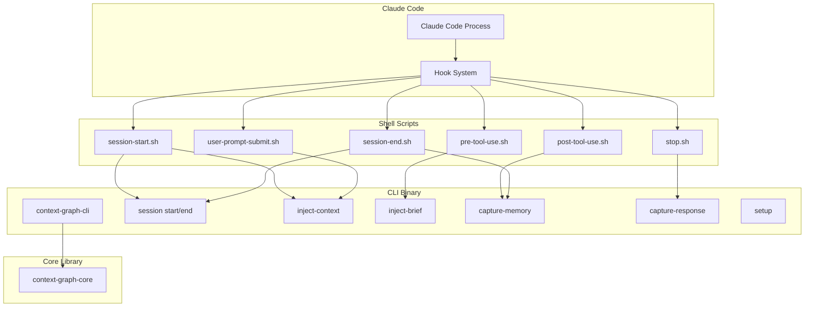

# Technical Specification: Phase 6 - CLI & Hooks Integration

```xml
<technical_spec id="TECH-PHASE6" version="1.0" implements="SPEC-PHASE6">
<metadata>
  <title>CLI & Hooks Integration Implementation</title>
  <status>approved</status>
  <last_updated>2026-01-16</last_updated>
</metadata>

<architecture_diagram>

</architecture_diagram>

<data_models>
<model name="CliConfig" file="crates/context-graph-cli/src/config.rs">
  <field name="db_path" type="PathBuf" constraints="default: ~/.contextgraph/db"/>
  <field name="log_path" type="PathBuf" constraints="default: ~/.contextgraph/logs"/>
  <field name="current_session_file" type="PathBuf" constraints="default: ~/.contextgraph/current_session"/>
  <field name="verbose" type="bool" constraints="default: false"/>
  <field name="timeout_ms" type="u64" constraints="default: 5000"/>
</model>

<model name="SessionCommand" file="crates/context-graph-cli/src/commands/session.rs">
  <variants>
    <variant name="Start">Start a new session, output session_id</variant>
    <variant name="End">End the current session</variant>
  </variants>
</model>

<model name="InjectContextArgs" file="crates/context-graph-cli/src/commands/inject.rs">
  <field name="query" type="Option&lt;String&gt;" constraints="from --query or env"/>
  <field name="session_id" type="Option&lt;String&gt;" constraints="from --session-id or env"/>
  <field name="budget" type="u32" constraints="default: 1200"/>
</model>

<model name="CaptureMemoryArgs" file="crates/context-graph-cli/src/commands/capture.rs">
  <field name="content" type="String" constraints="from --content or env"/>
  <field name="source" type="String" constraints="hook|response"/>
  <field name="session_id" type="Option&lt;String&gt;" constraints="from --session-id or env"/>
  <field name="hook_type" type="Option&lt;String&gt;" constraints="for source=hook"/>
  <field name="tool_name" type="Option&lt;String&gt;" constraints="for PostToolUse"/>
</model>

<model name="HookSettings" file="crates/context-graph-cli/src/setup.rs">
  <field name="hooks" type="HashMap&lt;String, Vec&lt;HookConfig&gt;&gt;" constraints="Claude Code format"/>
</model>

<model name="HookConfig" file="crates/context-graph-cli/src/setup.rs">
  <field name="matcher" type="Option&lt;String&gt;" constraints="tool name regex"/>
  <field name="hooks" type="Vec&lt;HookEntry&gt;" constraints="hook commands"/>
</model>

<model name="HookEntry" file="crates/context-graph-cli/src/setup.rs">
  <field name="type_" type="String" constraints="command"/>
  <field name="command" type="String" constraints="shell script path"/>
  <field name="timeout" type="u64" constraints="milliseconds"/>
</model>
</data_models>

<component_contracts>
<component name="CliApp" path="crates/context-graph-cli/src/main.rs">
  <dependencies>
    - clap for argument parsing
    - tokio for async runtime
    - context-graph-core for business logic
    - tracing for logging
  </dependencies>

  <method name="main">
    <signature>fn main() -> Result&lt;(), CliError&gt;</signature>
    <behavior>
      1. Parse command line arguments via clap
      2. Initialize logging (stderr if verbose, file otherwise)
      3. Load or create config
      4. Initialize database connection
      5. Dispatch to appropriate command handler
      6. Exit with appropriate code
    </behavior>
  </method>
</component>

<component name="SessionCommands" path="crates/context-graph-cli/src/commands/session.rs">
  <method name="handle_session_start">
    <signature>pub async fn handle_session_start(ctx: &amp;CliContext) -> Result&lt;(), CliError&gt;</signature>
    <implements>REQ-P6-04</implements>
    <behavior>
      1. Call SessionManager.start_session()
      2. Write session_id to current_session file
      3. Print session_id to stdout
      4. Log session start to file
    </behavior>
  </method>

  <method name="handle_session_end">
    <signature>pub async fn handle_session_end(ctx: &amp;CliContext) -> Result&lt;(), CliError&gt;</signature>
    <implements>REQ-P6-04</implements>
    <behavior>
      1. Read session_id from current_session file
      2. If no active session, log warning and return Ok
      3. Call SessionManager.end_session(session_id)
      4. Clear current_session file
      5. Log session end to file
    </behavior>
  </method>
</component>

<component name="InjectCommands" path="crates/context-graph-cli/src/commands/inject.rs">
  <method name="handle_inject_context">
    <signature>pub async fn handle_inject_context(ctx: &amp;CliContext, args: InjectContextArgs) -> Result&lt;(), CliError&gt;</signature>
    <implements>REQ-P6-01, REQ-P6-03</implements>
    <behavior>
      1. Get query from args or USER_PROMPT env var
      2. Get session_id from args or CLAUDE_SESSION_ID env var
      3. Embed query with MultiArrayProvider
      4. Call InjectionPipeline.generate_context()
      5. Print formatted context to stdout
      6. If empty result, print nothing (empty stdout)
    </behavior>
  </method>

  <method name="handle_inject_brief">
    <signature>pub async fn handle_inject_brief(ctx: &amp;CliContext, args: InjectContextArgs) -> Result&lt;(), CliError&gt;</signature>
    <implements>REQ-P6-06</implements>
    <behavior>
      1. Get query from args or TOOL_DESCRIPTION env var
      2. Use brief budget (200 tokens)
      3. Call InjectionPipeline.generate_brief_context()
      4. Print brief context to stdout
    </behavior>
  </method>
</component>

<component name="CaptureCommands" path="crates/context-graph-cli/src/commands/capture.rs">
  <method name="handle_capture_memory">
    <signature>pub async fn handle_capture_memory(ctx: &amp;CliContext, args: CaptureMemoryArgs) -> Result&lt;(), CliError&gt;</signature>
    <implements>REQ-P6-01</implements>
    <behavior>
      1. Get content from args or TOOL_DESCRIPTION env var
      2. Get session_id from args or CLAUDE_SESSION_ID env var
      3. Parse source type (hook or response)
      4. Determine HookType from hook_type arg or infer from context
      5. Call MemoryCaptureService.capture_hook_description()
      6. Log capture success
      7. No stdout output (capture only)
    </behavior>
  </method>

  <method name="handle_capture_response">
    <signature>pub async fn handle_capture_response(ctx: &amp;CliContext, content: String) -> Result&lt;(), CliError&gt;</signature>
    <implements>REQ-P6-01</implements>
    <behavior>
      1. Get content from args or RESPONSE_SUMMARY env var
      2. Get session_id from current_session file
      3. Call MemoryCaptureService.capture_claude_response()
      4. Log capture success
      5. No stdout output
    </behavior>
  </method>
</component>

<component name="SetupCommand" path="crates/context-graph-cli/src/commands/setup.rs">
  <method name="handle_setup">
    <signature>pub async fn handle_setup(force: bool) -> Result&lt;(), CliError&gt;</signature>
    <implements>REQ-P6-05</implements>
    <behavior>
      1. Check if .claude/settings.json exists
      2. If exists and not force:
         a. Read existing settings
         b. Validate JSON
         c. Merge hooks config preserving other keys
      3. If not exists or force:
         a. Create .claude directory
         b. Create settings.json with hooks config
      4. Create ./hooks/ directory
      5. Write all 6 hook scripts
      6. chmod +x on all scripts
      7. Print setup summary
    </behavior>
  </method>

  <method name="create_hook_script">
    <signature>fn create_hook_script(name: &amp;str, content: &amp;str) -> Result&lt;(), CliError&gt;</signature>
    <behavior>
      1. Write content to ./hooks/{name}
      2. Set executable permissions (0o755)
    </behavior>
  </method>

  <method name="merge_settings">
    <signature>fn merge_settings(existing: Value, hooks: Value) -> Value</signature>
    <behavior>
      1. Clone existing
      2. Insert or replace "hooks" key
      3. Preserve all other keys
      4. Return merged
    </behavior>
  </method>
</component>

<component name="StatusCommand" path="crates/context-graph-cli/src/commands/status.rs">
  <method name="handle_status">
    <signature>pub async fn handle_status(ctx: &amp;CliContext) -> Result&lt;(), CliError&gt;</signature>
    <behavior>
      1. Get memory count
      2. Get active session info
      3. Get topic count
      4. Get last capture time
      5. Print formatted status to stdout
    </behavior>
  </method>
</component>

<component name="EnvReader" path="crates/context-graph-cli/src/env.rs">
  <method name="get_env_or_arg">
    <signature>pub fn get_env_or_arg(env_name: &amp;str, arg_value: Option&lt;String&gt;) -> Option&lt;String&gt;</signature>
    <implements>REQ-P6-07</implements>
    <behavior>
      1. If arg_value is Some, return it
      2. Else read from environment variable
      3. Log if using env var in verbose mode
    </behavior>
  </method>
</component>
</component_contracts>

<hook_scripts>
<script name="session-start.sh">
#!/bin/bash
set -e

# Start session and get context
SESSION_ID=$(context-graph-cli session start)
export CLAUDE_SESSION_ID="$SESSION_ID"

# Inject portfolio summary
context-graph-cli inject-context --session-id "$SESSION_ID"
</script>

<script name="user-prompt-submit.sh">
#!/bin/bash
set -e

# Read session ID from file or env
SESSION_ID="${CLAUDE_SESSION_ID:-$(cat ~/.contextgraph/current_session 2>/dev/null || echo '')}"

# Inject context based on user prompt
context-graph-cli inject-context \
  --query "${USER_PROMPT:-}" \
  --session-id "$SESSION_ID"
</script>

<script name="pre-tool-use.sh">
#!/bin/bash
set -e

# Quick context for tool use
context-graph-cli inject-brief \
  --query "${TOOL_DESCRIPTION:-${TOOL_NAME:-}}" \
  --budget 200
</script>

<script name="post-tool-use.sh">
#!/bin/bash
set -e

SESSION_ID="${CLAUDE_SESSION_ID:-$(cat ~/.contextgraph/current_session 2>/dev/null || echo '')}"

# Capture tool description as memory
context-graph-cli capture-memory \
  --content "${TOOL_DESCRIPTION:-}" \
  --source hook \
  --hook-type PostToolUse \
  --tool-name "${TOOL_NAME:-}" \
  --session-id "$SESSION_ID"
</script>

<script name="stop.sh">
#!/bin/bash
set -e

SESSION_ID="${CLAUDE_SESSION_ID:-$(cat ~/.contextgraph/current_session 2>/dev/null || echo '')}"

# Capture Claude's response
context-graph-cli capture-response \
  --content "${RESPONSE_SUMMARY:-}" \
  --session-id "$SESSION_ID"
</script>

<script name="session-end.sh">
#!/bin/bash
set -e

SESSION_ID="${CLAUDE_SESSION_ID:-$(cat ~/.contextgraph/current_session 2>/dev/null || echo '')}"

# Capture session summary
if [ -n "${SESSION_SUMMARY:-}" ]; then
  context-graph-cli capture-memory \
    --content "$SESSION_SUMMARY" \
    --source hook \
    --hook-type SessionEnd \
    --session-id "$SESSION_ID"
fi

# End session
context-graph-cli session end
</script>
</hook_scripts>

<settings_json>
{
  "hooks": {
    "SessionStart": [
      {
        "hooks": [
          {
            "type": "command",
            "command": "./hooks/session-start.sh",
            "timeout": 5000
          }
        ]
      }
    ],
    "UserPromptSubmit": [
      {
        "hooks": [
          {
            "type": "command",
            "command": "./hooks/user-prompt-submit.sh",
            "timeout": 2000
          }
        ]
      }
    ],
    "PreToolUse": [
      {
        "matcher": "Edit|Write|Bash",
        "hooks": [
          {
            "type": "command",
            "command": "./hooks/pre-tool-use.sh",
            "timeout": 500
          }
        ]
      }
    ],
    "PostToolUse": [
      {
        "matcher": "*",
        "hooks": [
          {
            "type": "command",
            "command": "./hooks/post-tool-use.sh",
            "timeout": 3000
          }
        ]
      }
    ],
    "Stop": [
      {
        "hooks": [
          {
            "type": "command",
            "command": "./hooks/stop.sh",
            "timeout": 3000
          }
        ]
      }
    ],
    "SessionEnd": [
      {
        "hooks": [
          {
            "type": "command",
            "command": "./hooks/session-end.sh",
            "timeout": 30000
          }
        ]
      }
    ]
  }
}
</settings_json>

<error_types>
<error_enum name="CliError" file="crates/context-graph-cli/src/error.rs">
  <variant name="ConfigError">
    <field name="message" type="String"/>
  </variant>
  <variant name="DatabaseError">
    <field name="source" type="StorageError"/>
  </variant>
  <variant name="EmbeddingError">
    <field name="source" type="EmbedderError"/>
  </variant>
  <variant name="CaptureError">
    <field name="source" type="CaptureError"/>
  </variant>
  <variant name="InjectionError">
    <field name="source" type="InjectionError"/>
  </variant>
  <variant name="IoError">
    <field name="source" type="std::io::Error"/>
  </variant>
  <variant name="JsonError">
    <field name="source" type="serde_json::Error"/>
  </variant>
  <variant name="TimeoutError">
    <field name="operation" type="String"/>
    <field name="duration_ms" type="u64"/>
  </variant>
</error_enum>
</error_types>

<implementation_notes>
<note category="signal_handling">
  Hook scripts receive SIGTERM on timeout.
  CLI catches SIGTERM, outputs partial results if available.
  Always exit cleanly to avoid zombie processes.
</note>

<note category="logging">
  Verbose mode logs to stderr (not stdout to avoid injection).
  File logging to ~/.contextgraph/logs/cli.log
  Log rotation: 7 days retention, 10MB max per file.
</note>

<note category="database_init">
  CLI auto-initializes database on first use.
  Creates ~/.contextgraph directory structure.
  Logs initialization steps.
</note>

<note category="env_vars">
  Always prefer explicit args over env vars.
  Log which source was used in verbose mode.
  Handle missing env vars gracefully (use empty string).
</note>
</implementation_notes>
</technical_spec>
```

## CLI Command Quick Reference

```bash
# Session management
context-graph-cli session start     # Outputs session_id
context-graph-cli session end       # No output

# Context injection
context-graph-cli inject-context --query "text"     # Outputs markdown
context-graph-cli inject-brief --query "text"       # Brief output

# Memory capture
context-graph-cli capture-memory --content "..." --source hook
context-graph-cli capture-response --content "..."

# Setup
context-graph-cli setup             # Creates hooks
context-graph-cli setup --force     # Overwrites existing

# Status
context-graph-cli status            # Shows system status
```

## Environment Variables

| Variable | Hook | CLI Fallback |
|----------|------|--------------|
| CLAUDE_SESSION_ID | All | --session-id |
| USER_PROMPT | UserPromptSubmit | --query |
| TOOL_NAME | PreToolUse, PostToolUse | --tool-name |
| TOOL_DESCRIPTION | PreToolUse, PostToolUse | --content |
| RESPONSE_SUMMARY | Stop | --content |
| SESSION_SUMMARY | SessionEnd | --content |

## File Structure

```
crates/context-graph-cli/
├── Cargo.toml
├── src/
│   ├── main.rs           # Entry point, clap setup
│   ├── config.rs         # CliConfig
│   ├── error.rs          # CliError
│   ├── env.rs            # EnvReader
│   ├── commands/
│   │   ├── mod.rs
│   │   ├── session.rs    # session start/end
│   │   ├── inject.rs     # inject-context, inject-brief
│   │   ├── capture.rs    # capture-memory, capture-response
│   │   ├── setup.rs      # setup command
│   │   └── status.rs     # status command
│   └── scripts/
│       ├── session_start.sh
│       ├── user_prompt_submit.sh
│       ├── pre_tool_use.sh
│       ├── post_tool_use.sh
│       ├── stop.sh
│       └── session_end.sh
└── tests/
    └── integration/
        └── cli_tests.rs
```

## Timeout Strategy

| Hook | Timeout | CLI Budget | Safety Margin |
|------|---------|------------|---------------|
| SessionStart | 5000ms | 4500ms | 500ms |
| UserPromptSubmit | 2000ms | 1800ms | 200ms |
| PreToolUse | 500ms | 400ms | 100ms |
| PostToolUse | 3000ms | 2700ms | 300ms |
| Stop | 3000ms | 2700ms | 300ms |
| SessionEnd | 30000ms | 28000ms | 2000ms |
