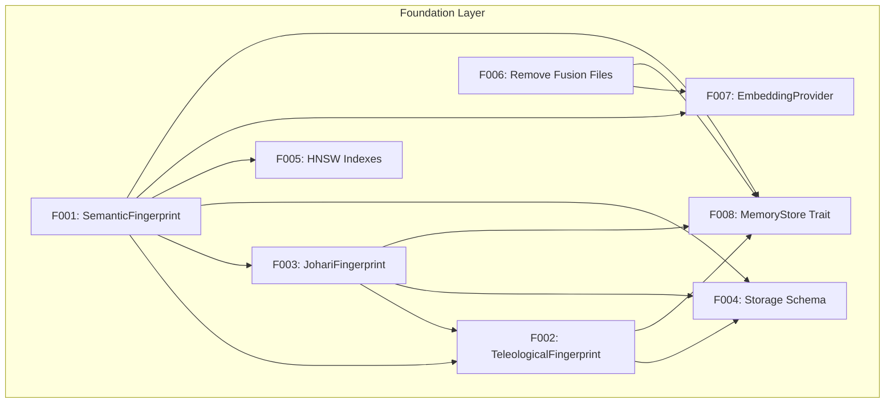
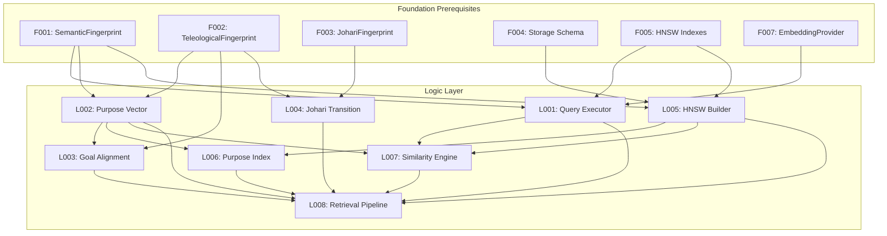
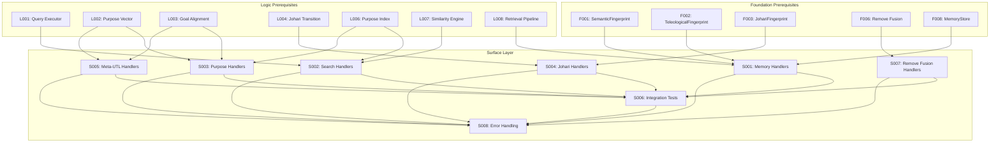

# Dependency Graph: Multi-Array Teleological Fingerprint

**Document ID**: DEPENDENCY-GRAPH-001
**Version**: 1.0.0
**Date**: 2026-01-04
**Status**: Complete
**Total Tasks**: 24 (8 Foundation + 8 Logic + 8 Surface)

---

## 1. Layer Hierarchy

The implementation follows a strict 3-layer dependency hierarchy:

```
+------------------------------------------------------------------+
|                     SURFACE LAYER (S001-S008)                     |
|  MCP Handlers | Integration Tests | Error Handling                |
+------------------------------------------------------------------+
                              |
                              | depends on
                              v
+------------------------------------------------------------------+
|                     LOGIC LAYER (L001-L008)                       |
|  Query Execution | Similarity | Alignment | Retrieval Pipeline    |
+------------------------------------------------------------------+
                              |
                              | depends on
                              v
+------------------------------------------------------------------+
|                   FOUNDATION LAYER (F001-F008)                    |
|  Data Structures | Storage Schema | Traits | Fusion Removal       |
+------------------------------------------------------------------+
```

### Layer Responsibilities

| Layer | Tasks | Purpose | Key Deliverables |
|-------|-------|---------|------------------|
| Foundation | F001-F008 | Data structures and storage | SemanticFingerprint, TeleologicalFingerprint, RocksDB schema, Traits |
| Logic | L001-L008 | Computation and retrieval | Query executor, Similarity engine, Retrieval pipeline |
| Surface | S001-S008 | API exposure and testing | MCP handlers, Integration tests, Error handling |

---

## 2. Full Dependency Graph

### 2.1 Foundation Layer (F001-F008)



| Task ID | Task Title | Dependencies | Dependency Reason |
|---------|------------|--------------|-------------------|
| F001 | SemanticFingerprint | None | Foundation start - defines 12-array structure |
| F002 | TeleologicalFingerprint | F001, F003 | Wraps SemanticFingerprint, contains JohariFingerprint |
| F003 | JohariFingerprint | F001 | Uses embedder indices (0-11) from SemanticFingerprint |
| F004 | Storage Schema | F001, F002, F003 | Persists all fingerprint types in RocksDB |
| F005 | HNSW Indexes | F001 | Index dimensions derived from embedding specs |
| F006 | Remove Fusion Files | None | Independent cleanup task |
| F007 | EmbeddingProvider | F001, F006 | Returns SemanticFingerprint, requires no fusion |
| F008 | MemoryStore Trait | F001, F002, F003, F006 | Stores/retrieves all types, requires clean codebase |

### 2.2 Logic Layer (L001-L008)



| Task ID | Task Title | Dependencies | Dependency Reason |
|---------|------------|--------------|-------------------|
| L001 | Multi-Embedding Query Executor | F001, F005, F007 | Queries across all 12 embedding spaces |
| L002 | Purpose Vector Computation | F001, F002 | Computes purpose from TeleologicalFingerprint |
| L003 | Goal Alignment Calculator | L002, F002 | Uses purpose vectors for alignment scoring |
| L004 | Johari Transition Manager | F002, F003 | Manages quadrant state transitions |
| L005 | Per-Space HNSW Index Builder | F001, F004, F005 | Instantiates 12 HNSW indexes from config |
| L006 | Purpose Pattern Index | L002, L005 | Indexes 12D purpose vectors for retrieval |
| L007 | Cross-Space Similarity Engine | L001, L002, L005 | Aggregates similarity across multiple spaces |
| L008 | Teleological Retrieval Pipeline | L001-L007 | Orchestrates 5-stage retrieval |

### 2.3 Surface Layer (S001-S008)



| Task ID | Task Title | Dependencies | Dependency Reason |
|---------|------------|--------------|-------------------|
| S001 | MCP Memory Handlers | F001, F002, F008, L008 | Exposes store/retrieve via MCP |
| S002 | MCP Search Handlers | L001, L006, L007 | Exposes weighted multi-space search |
| S003 | MCP Purpose Handlers | L002, L003, L006 | Exposes purpose/goal alignment |
| S004 | MCP Johari Handlers | F003, L004 | Exposes Johari quadrant operations |
| S005 | MCP Meta-UTL Handlers | L002, L003 | Exposes learning trajectory and health |
| S006 | Integration Tests | S001-S005, S007 | Tests entire system end-to-end |
| S007 | Remove Fusion Handlers | F006 | Removes legacy MCP handlers |
| S008 | Error Handling | S001-S007 | Implements fail-fast for all handlers |

---

## 3. Critical Path Analysis

### 3.1 Longest Dependency Chain

The **critical path** represents the longest sequence of dependent tasks:

```
F001 --> F002 --> F004 --> L005 --> L006 --> L007 --> L008 --> S002 --> S006 --> S008
```

| Position | Task | Title | Est. Hours |
|----------|------|-------|------------|
| 1 | F001 | SemanticFingerprint | 4h |
| 2 | F002 | TeleologicalFingerprint | 6h |
| 3 | F004 | Storage Schema | 6h |
| 4 | L005 | Per-Space HNSW Index Builder | 6h |
| 5 | L006 | Purpose Pattern Index | 4h |
| 6 | L007 | Cross-Space Similarity Engine | 6h |
| 7 | L008 | Teleological Retrieval Pipeline | 12h |
| 8 | S002 | MCP Search Handlers | 6h |
| 9 | S006 | Integration Tests | 12h |
| 10 | S008 | Error Handling | 6h |

**Critical Path Length**: 10 tasks
**Critical Path Duration**: ~68 hours (estimated)

### 3.2 Alternative Critical Path

Another path of similar length:

```
F001 --> F003 --> F002 --> L002 --> L003 --> L008 --> S003 --> S006 --> S008
```

| Position | Task | Title | Est. Hours |
|----------|------|-------|------------|
| 1 | F001 | SemanticFingerprint | 4h |
| 2 | F003 | JohariFingerprint | 4h |
| 3 | F002 | TeleologicalFingerprint | 6h |
| 4 | L002 | Purpose Vector Computation | 4h |
| 5 | L003 | Goal Alignment Calculator | 4h |
| 6 | L008 | Teleological Retrieval Pipeline | 12h |
| 7 | S003 | MCP Purpose Handlers | 6h |
| 8 | S006 | Integration Tests | 12h |
| 9 | S008 | Error Handling | 6h |

**Alternative Path Length**: 9 tasks
**Alternative Path Duration**: ~58 hours (estimated)

### 3.3 Bottleneck Tasks

Tasks that block the most downstream work:

| Task | Blocks | Impact |
|------|--------|--------|
| F001 | 14 tasks (F002, F003, F004, F005, F007, F008, L001, L002, L005, S001) | Highest |
| L008 | 4 tasks (S001, S002, S003, implicitly S006, S008) | High |
| F006 | 4 tasks (F007, F008, S007, S008) | Medium |
| S006 | 1 task (S008) | Low |

---

## 4. Parallel Execution Groups

Tasks can be executed in parallel within each group if resources allow.

### 4.1 Phase 1: Foundation Start (No Dependencies)

| Task | Title | Can Parallelize With |
|------|-------|---------------------|
| F001 | SemanticFingerprint | F006 |
| F006 | Remove Fusion Files | F001 |

**Phase 1 Duration**: ~4h (parallel)

### 4.2 Phase 2: Foundation Core

| Task | Title | Prerequisites | Can Parallelize With |
|------|-------|---------------|---------------------|
| F003 | JohariFingerprint | F001 | F005 |
| F005 | HNSW Indexes | F001 | F003 |

**Phase 2 Duration**: ~4h (parallel)

### 4.3 Phase 3: Foundation Integration

| Task | Title | Prerequisites | Can Parallelize With |
|------|-------|---------------|---------------------|
| F002 | TeleologicalFingerprint | F001, F003 | F007 |
| F007 | EmbeddingProvider | F001, F006 | F002 |

**Phase 3 Duration**: ~6h (parallel)

### 4.4 Phase 4: Foundation Complete

| Task | Title | Prerequisites |
|------|-------|---------------|
| F004 | Storage Schema | F001, F002, F003 |
| F008 | MemoryStore Trait | F001, F002, F003, F006 |

**Phase 4 Duration**: ~6h (parallel)

### 4.5 Phase 5: Logic Start

| Task | Title | Prerequisites | Can Parallelize With |
|------|-------|---------------|---------------------|
| L001 | Multi-Embedding Query Executor | F001, F005, F007 | L002, L004 |
| L002 | Purpose Vector Computation | F001, F002 | L001, L004 |
| L004 | Johari Transition Manager | F002, F003 | L001, L002 |

**Phase 5 Duration**: ~6h (parallel)

### 4.6 Phase 6: Logic Core

| Task | Title | Prerequisites | Can Parallelize With |
|------|-------|---------------|---------------------|
| L003 | Goal Alignment Calculator | L002, F002 | L005 |
| L005 | Per-Space HNSW Index Builder | F001, F004, F005 | L003 |

**Phase 6 Duration**: ~6h (parallel)

### 4.7 Phase 7: Logic Integration

| Task | Title | Prerequisites | Can Parallelize With |
|------|-------|---------------|---------------------|
| L006 | Purpose Pattern Index | L002, L005 | L007 |
| L007 | Cross-Space Similarity Engine | L001, L002, L005 | L006 |

**Phase 7 Duration**: ~6h (parallel)

### 4.8 Phase 8: Logic Complete

| Task | Title | Prerequisites |
|------|-------|---------------|
| L008 | Teleological Retrieval Pipeline | L001-L007 |

**Phase 8 Duration**: ~12h (sequential)

### 4.9 Phase 9: Surface Start

| Task | Title | Prerequisites | Can Parallelize With |
|------|-------|---------------|---------------------|
| S001 | MCP Memory Handlers | F001, F002, F008, L008 | S007 |
| S007 | Remove Fusion Handlers | F006 | S001 |

**Phase 9 Duration**: ~4h (parallel)

### 4.10 Phase 10: Surface Core

| Task | Title | Prerequisites | Can Parallelize With |
|------|-------|---------------|---------------------|
| S002 | MCP Search Handlers | L001, L006, L007 | S003, S004, S005 |
| S003 | MCP Purpose Handlers | L002, L003, L006 | S002, S004, S005 |
| S004 | MCP Johari Handlers | F003, L004 | S002, S003, S005 |
| S005 | MCP Meta-UTL Handlers | L002, L003 | S002, S003, S004 |

**Phase 10 Duration**: ~6h (parallel)

### 4.11 Phase 11: Surface Integration

| Task | Title | Prerequisites |
|------|-------|---------------|
| S006 | Integration Tests | S001-S005, S007 |

**Phase 11 Duration**: ~12h (sequential)

### 4.12 Phase 12: Surface Complete

| Task | Title | Prerequisites |
|------|-------|---------------|
| S008 | Error Handling | S001-S007, S006 |

**Phase 12 Duration**: ~6h (sequential)

---

## 5. Execution Timeline Summary

### 5.1 Phase Overview

| Phase | Tasks | Duration | Cumulative |
|-------|-------|----------|------------|
| 1 | F001, F006 | 4h | 4h |
| 2 | F003, F005 | 4h | 8h |
| 3 | F002, F007 | 6h | 14h |
| 4 | F004, F008 | 6h | 20h |
| 5 | L001, L002, L004 | 6h | 26h |
| 6 | L003, L005 | 6h | 32h |
| 7 | L006, L007 | 6h | 38h |
| 8 | L008 | 12h | 50h |
| 9 | S001, S007 | 4h | 54h |
| 10 | S002, S003, S004, S005 | 6h | 60h |
| 11 | S006 | 12h | 72h |
| 12 | S008 | 6h | 78h |

**Total Estimated Duration**: ~78 hours (with maximum parallelization)
**Calendar Time**: ~2-3 weeks (assuming 8h/day, 40h/week)

### 5.2 Layer Duration

| Layer | Tasks | Duration (Parallel) | % of Total |
|-------|-------|---------------------|------------|
| Foundation | F001-F008 | 20h | 26% |
| Logic | L001-L008 | 30h | 38% |
| Surface | S001-S008 | 28h | 36% |

---

## 6. Resource Requirements

### 6.1 Minimum Team Size for Critical Path

To execute the critical path without delays:

| Resource | Role | Assigned Tasks |
|----------|------|----------------|
| Dev 1 | Core Developer | F001, F002, L002, L003, L008 |
| Dev 2 | Storage Developer | F004, F005, L005, L006, L007 |
| Dev 3 | Surface Developer | S001, S002, S003, S006, S008 |

### 6.2 Maximum Parallelization Team

For maximum parallel execution:

| Resource | Role | Primary Focus |
|----------|------|---------------|
| Dev 1 | Core Data Structures | F001, F002, F003 |
| Dev 2 | Storage/Index | F004, F005, L005 |
| Dev 3 | Traits/API | F007, F008 |
| Dev 4 | Logic Engine | L001, L002, L007 |
| Dev 5 | Purpose/Alignment | L003, L004, L006 |
| Dev 6 | Retrieval Pipeline | L008 |
| Dev 7 | MCP Handlers | S001-S005 |
| Dev 8 | Testing/Error | S006, S007, S008 |

---

## 7. Risk Analysis

### 7.1 High-Risk Dependencies

| Dependency | Risk | Mitigation |
|------------|------|------------|
| F001 blocks 14+ tasks | Single point of failure | Prioritize F001 completion first |
| L008 is XL effort | Could delay Surface Layer | Start L008 as soon as L007 complete |
| S006 depends on all handlers | Integration issues | Continuous integration testing |

### 7.2 Dependency Verification Points

| Checkpoint | Verify Before Proceeding |
|------------|-------------------------|
| After Phase 4 | All Foundation types compile and test |
| After Phase 8 | Logic Layer retrieval pipeline works E2E |
| After Phase 10 | All MCP handlers respond correctly |
| After Phase 12 | Full system integration passes |

---

## 8. ASCII Dependency Visualization

```
FOUNDATION LAYER
================
Phase 1:  F001 ----+-----> F003 ----+
              \    |               |
               +---|---> F002 <----+
               |   |        |
Phase 2:  F006-+   +-> F005 |
               |       |    |
               v       v    v
Phase 3:  F007 <------ F004 <-------+
               \        |           |
                +-------+-> F008 <--+

LOGIC LAYER
===========
Phase 5:  L001 <---- F001, F005, F007
          L002 <---- F001, F002
          L004 <---- F002, F003
              \
Phase 6:       +-> L003 <---- L002
               +-> L005 <---- F001, F004, F005
                    |
Phase 7:           +-> L006 <---- L002, L005
                   +-> L007 <---- L001, L002, L005
                        |
Phase 8:               +-> L008 <---- ALL L001-L007

SURFACE LAYER
=============
Phase 9:   S001 <---- F001, F002, F008, L008
           S007 <---- F006
               \
Phase 10:       +-> S002 <---- L001, L006, L007
                +-> S003 <---- L002, L003, L006
                +-> S004 <---- F003, L004
                +-> S005 <---- L002, L003
                     |
Phase 11:           +-> S006 <---- ALL S001-S005, S007
                         |
Phase 12:               +-> S008 <---- ALL S001-S007, S006
```

---

## 9. Gantt Chart (Text-Based)

```
Week 1          Week 2          Week 3
Day 1-5         Day 6-10        Day 11-15
|----|----|----|----|----|----|----|----|----|----|----|----|----|----|
F001 ====
F006 ====
     F003 ====
     F005 ====
          F002 ======
          F007 ======
               F004 ======
               F008 ======
                    L001 ======
                    L002 ====
                    L004 ======
                         L003 ====
                         L005 ======
                              L006 ====
                              L007 ======
                                   L008 ==============
                                                       S001 ====
                                                       S007 ==
                                                            S002 ======
                                                            S003 ======
                                                            S004 ====
                                                            S005 ====
                                                                 S006 ============
                                                                              S008 ======
```

---

**END OF DEPENDENCY GRAPH**

*Generated: 2026-01-04*
*Verified by: Architecture Design Agent*
