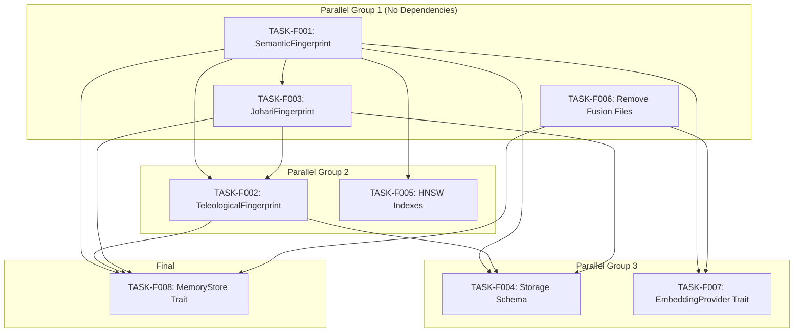

# Foundation Layer Task Index

## Overview

The Foundation Layer establishes data structures, types, and storage for the Multi-Array Teleological Fingerprint architecture with **E13 SPLADE sparse embeddings** and **5-stage optimized retrieval pipeline** support.

**Layer Purpose**: Define the core data representations (SemanticFingerprint, TeleologicalFingerprint, JohariFingerprint) and storage infrastructure (RocksDB schema, HNSW indexes, Matryoshka truncation, and SPLADE sparse indexes) that all higher layers depend on.

> **Storage Optimization**: E13 SPLADE uses **17KB quantized storage** with top-128 sparse activations, enabling efficient hybrid dense+sparse retrieval.

## Dependency Graph



## Execution Order

| # | Task ID | Title | Priority | Dependencies | Effort | 5-Stage Update |
|---|---------|-------|----------|--------------|--------|----------------|
| 1 | TASK-F001 | SemanticFingerprint struct (13 embedders) | P0 | None | M | Done |
| 1 | TASK-F003 | JohariFingerprint struct (13 embedders) | P0 | TASK-F001 | M | Done |
| 1 | TASK-F006 | Remove fusion files | P0 | None | M | N/A |
| 2 | TASK-F002 | TeleologicalFingerprint struct (13D + stage_scores) | P0 | F001, F003 | L | Done |
| 2 | TASK-F005 | HNSW index configuration (13 + Matryoshka) | P1 | F001 | M | Done |
| 3 | TASK-F004 | RocksDB storage schema (8 CFs) | P0 | F001, F002, F003 | L | Done |
| 3 | TASK-F007 | MultiArrayEmbeddingProvider trait (13 embeddings) | P0 | F001, F006 | M | Done |
| 4 | TASK-F008 | TeleologicalMemoryStore trait | P0 | F001, F002, F003, F006 | L | Pending |

## Critical Path

The critical path (longest dependency chain) is:

```
TASK-F006 (parallel) + TASK-F001 -> TASK-F003 -> TASK-F002 -> TASK-F004 -> TASK-F008
```

**Estimated Duration**: 4-5 implementation cycles

## Task Status

| Task | Status | Assigned | Started | Completed | Verified | 5-Stage Spec |
|------|--------|----------|---------|-----------|----------|--------------|
| TASK-F001 | COMPLETE | - | 2025-01 | 2026-01-05 | sherlock-holmes | Updated |
| TASK-F002 | Pending | - | - | - | - | Updated |
| TASK-F003 | Pending | - | - | - | - | Updated |
| TASK-F004 | Pending | - | - | - | - | Updated |
| TASK-F005 | COMPLETE | - | 2026-01 | 2026-01-05 | sherlock-holmes | Updated |
| TASK-F006 | Pending | - | - | - | - | N/A |
| TASK-F007 | Pending | - | - | - | - | Updated |
| TASK-F008 | Pending | - | - | - | - | Pending |

**Progress: 2/8 tasks (25%)** - TASK-F001, TASK-F005 VERIFIED COMPLETE
**5-Stage Pipeline Spec: 6/7 tasks updated** - All relevant task specs updated for 5-stage pipeline

## Parallel Execution Groups

Tasks can be executed in parallel within each group:

### Group 1 (Start Immediately)
- TASK-F001: SemanticFingerprint (13 embedders including E13 SPLADE)
- TASK-F003: JohariFingerprint (13 embedders, can start after F001 partial)
- TASK-F006: Remove fusion files (independent)

### Group 2 (After Group 1)
- TASK-F002: TeleologicalFingerprint (13D purpose vector + stage_scores)
- TASK-F005: HNSW configuration (13 indexes + E1 Matryoshka 128D)

### Group 3 (After Group 2)
- TASK-F004: Storage schema (8 CFs with E13 inverted index + E1 Matryoshka 128D)
- TASK-F007: EmbeddingProvider trait (13 embeddings + SparseEmbedder trait)

### Group 4 (Final)
- TASK-F008: MemoryStore trait (needs F001, F002, F003, F006)

## Traceability Matrix

| Tech Spec | Func Req | Task | Coverage |
|-----------|----------|------|----------|
| TS-101 | FR-101, FR-102, FR-103, FR-104 | TASK-F001 | Complete |
| TS-102 | FR-201, FR-202, FR-203, FR-204 | TASK-F002 | Complete |
| TS-103 | FR-203 | TASK-F003 | Complete |
| TS-201 | FR-301, FR-304 | TASK-F004 | Complete |
| TS-202 | FR-302 | TASK-F005 | Complete |
| TS-203 | FR-304 | TASK-F004 | Partial |
| TS-301 | FR-101, FR-102, FR-104 | TASK-F007 | Complete |
| TS-302 | FR-301, FR-302, FR-303, FR-401 | TASK-F008 | Complete |
| TS-601 | FR-601, FR-602 | TASK-F006 | Complete |

## Files Created

All task documents located in `/home/cabdru/contextgraph/docs2/projection/specs/tasks/foundation/`:

1. `TASK-F001-semantic-fingerprint.md`
2. `TASK-F002-teleological-fingerprint.md`
3. `TASK-F003-johari-fingerprint.md`
4. `TASK-F004-storage-schema.md`
5. `TASK-F005-hnsw-indexes.md`
6. `TASK-F006-remove-fusion-files.md`
7. `TASK-F007-trait-embedding-provider.md`
8. `TASK-F008-trait-memory-store.md`
9. `_index.md` (this file)

## Next Layer: Logic Layer

After Foundation Layer is complete, Logic Layer tasks will build:
- Multi-embedding query execution (13 embeddings)
- Purpose vector computation (13D)
- Goal alignment calculation
- Johari transition management (13 embedders)
- HNSW index instantiation (13 + Matryoshka)
- 5-stage pipeline orchestration

Logic Layer depends on: TASK-F001, F002, F003, F004, F005, F007, F008

## 5-Stage Pipeline Architecture

The Foundation Layer now supports the 5-stage retrieval pipeline:

| Stage | Name | Foundation Support |
|-------|------|-------------------|
| 1 | Recall | E13 SPLADE inverted index (TASK-F004, F005) |
| 2 | Semantic | E1 Matryoshka 128D HNSW (TASK-F004, F005) |
| 3 | Precision | Full E1-E12 dense embeddings (TASK-F001, F005) |
| 4 | Rerank | E12 ColBERT late interaction (TASK-F001) |
| 5 | Teleological | 13D Purpose vector + stage_scores (TASK-F002) |

**Key Changes for 5-Stage Support**:
- E13 SPLADE added to SemanticFingerprint (TASK-F001)
- 13D purpose vectors (TASK-F002)
- StageScores [f32; 5] field (TASK-F002)
- 2 new column families: e13_splade_inverted, e1_matryoshka_128 (TASK-F004)
- InvertedIndexConfig for E6/E13 (TASK-F005)
- SparseEmbedder trait (TASK-F007)
