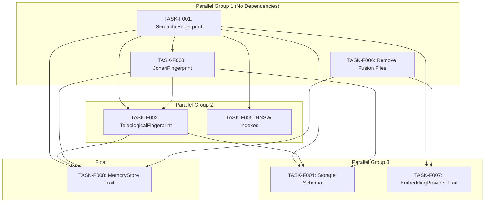

# Foundation Layer Task Index

## Overview

The Foundation Layer establishes data structures, types, and storage for the Multi-Array Teleological Fingerprint architecture.

**Layer Purpose**: Define the core data representations (SemanticFingerprint, TeleologicalFingerprint, JohariFingerprint) and storage infrastructure (RocksDB schema, HNSW indexes) that all higher layers depend on.

## Dependency Graph



## Execution Order

| # | Task ID | Title | Priority | Dependencies | Effort |
|---|---------|-------|----------|--------------|--------|
| 1 | TASK-F001 | SemanticFingerprint struct | P0 | None | M |
| 1 | TASK-F003 | JohariFingerprint struct | P0 | TASK-F001 | M |
| 1 | TASK-F006 | Remove fusion files | P0 | None | M |
| 2 | TASK-F002 | TeleologicalFingerprint struct | P0 | F001, F003 | L |
| 2 | TASK-F005 | HNSW index configuration | P1 | F001 | M |
| 3 | TASK-F004 | RocksDB storage schema | P0 | F001, F002, F003 | L |
| 3 | TASK-F007 | MultiArrayEmbeddingProvider trait | P0 | F001, F006 | M |
| 4 | TASK-F008 | TeleologicalMemoryStore trait | P0 | F001, F002, F003, F006 | L |

## Critical Path

The critical path (longest dependency chain) is:

```
TASK-F006 (parallel) + TASK-F001 -> TASK-F003 -> TASK-F002 -> TASK-F004 -> TASK-F008
```

**Estimated Duration**: 4-5 implementation cycles

## Task Status

| Task | Status | Assigned | Started | Completed | Verified |
|------|--------|----------|---------|-----------|----------|
| TASK-F001 | Pending | - | - | - | - |
| TASK-F002 | Pending | - | - | - | - |
| TASK-F003 | Pending | - | - | - | - |
| TASK-F004 | Pending | - | - | - | - |
| TASK-F005 | Pending | - | - | - | - |
| TASK-F006 | Pending | - | - | - | - |
| TASK-F007 | Pending | - | - | - | - |
| TASK-F008 | Pending | - | - | - | - |

**Progress: 0/8 tasks (0%)**

## Parallel Execution Groups

Tasks can be executed in parallel within each group:

### Group 1 (Start Immediately)
- TASK-F001: SemanticFingerprint
- TASK-F003: JohariFingerprint (can start after F001 partial)
- TASK-F006: Remove fusion files (independent)

### Group 2 (After Group 1)
- TASK-F002: TeleologicalFingerprint (needs F001, F003)
- TASK-F005: HNSW configuration (needs F001)

### Group 3 (After Group 2)
- TASK-F004: Storage schema (needs F001, F002, F003)
- TASK-F007: EmbeddingProvider trait (needs F001, F006)

### Group 4 (Final)
- TASK-F008: MemoryStore trait (needs F001, F002, F003, F006)

## Traceability Matrix

| Tech Spec | Func Req | Task | Coverage |
|-----------|----------|------|----------|
| TS-101 | FR-101, FR-102, FR-103, FR-104 | TASK-F001 | Complete |
| TS-102 | FR-201, FR-202, FR-203, FR-204 | TASK-F002 | Complete |
| TS-103 | FR-203 | TASK-F003 | Complete |
| TS-201 | FR-301, FR-304 | TASK-F004 | Complete |
| TS-202 | FR-302 | TASK-F005 | Complete |
| TS-203 | FR-304 | TASK-F004 | Partial |
| TS-301 | FR-101, FR-102, FR-104 | TASK-F007 | Complete |
| TS-302 | FR-301, FR-302, FR-303, FR-401 | TASK-F008 | Complete |
| TS-601 | FR-601, FR-602 | TASK-F006 | Complete |

## Files Created

All task documents located in `/home/cabdru/contextgraph/docs2/projection/specs/tasks/foundation/`:

1. `TASK-F001-semantic-fingerprint.md`
2. `TASK-F002-teleological-fingerprint.md`
3. `TASK-F003-johari-fingerprint.md`
4. `TASK-F004-storage-schema.md`
5. `TASK-F005-hnsw-indexes.md`
6. `TASK-F006-remove-fusion-files.md`
7. `TASK-F007-trait-embedding-provider.md`
8. `TASK-F008-trait-memory-store.md`
9. `_index.md` (this file)

## Next Layer: Logic Layer

After Foundation Layer is complete, Logic Layer tasks will build:
- Multi-embedding query execution
- Purpose vector computation
- Goal alignment calculation
- Johari transition management
- HNSW index instantiation

Logic Layer depends on: TASK-F001, F002, F003, F004, F005, F007, F008
