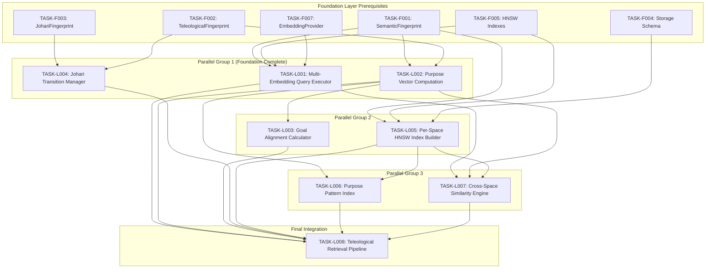

# Logic Layer Task Index

## Overview

The Logic Layer implements computation, retrieval, and reasoning logic for the Multi-Array Teleological Fingerprint architecture.

**Layer Purpose**: Build the computational engines (query execution, similarity computation, alignment calculation) and retrieval pipelines that operate on Foundation Layer data structures.

## Dependency Graph



## Execution Order

| # | Task ID | Title | Priority | Dependencies | Effort |
|---|---------|-------|----------|--------------|--------|
| 1 | TASK-L001 | Multi-Embedding Query Executor | P0 | F001, F005, F007 | L |
| 1 | TASK-L002 | Purpose Vector Computation | P0 | F001, F002 | M |
| 1 | TASK-L004 | Johari Transition Manager | P0 | F002, F003 | L |
| 2 | TASK-L003 | Goal Alignment Calculator | P0 | L002, F002 | M |
| 2 | TASK-L005 | Per-Space HNSW Index Builder | P1 | F001, F004, F005 | L |
| 3 | TASK-L006 | Purpose Pattern Index | P1 | L002, L005 | M |
| 3 | TASK-L007 | Cross-Space Similarity Engine | P0 | L001, L002, L005 | L |
| 4 | TASK-L008 | Teleological Retrieval Pipeline | P0 | L001-L007 | XL |

## Critical Path

The critical path (longest dependency chain) is:

```
Foundation Layer -> L001 + L002 -> L003 + L005 -> L007 -> L008
```

**Estimated Duration**: 5-6 implementation cycles

## Task Status

| Task | Status | Assigned | Started | Completed | Verified |
|------|--------|----------|---------|-----------|----------|
| TASK-L001 | Pending | - | - | - | - |
| TASK-L002 | Pending | - | - | - | - |
| TASK-L003 | Pending | - | - | - | - |
| TASK-L004 | Pending | - | - | - | - |
| TASK-L005 | Pending | - | - | - | - |
| TASK-L006 | Pending | - | - | - | - |
| TASK-L007 | Pending | - | - | - | - |
| TASK-L008 | Pending | - | - | - | - |

**Progress: 0/8 tasks (0%)**

## Parallel Execution Groups

Tasks can be executed in parallel within each group:

### Group 1 (Foundation Layer Complete)
- TASK-L001: Multi-Embedding Query Executor
- TASK-L002: Purpose Vector Computation
- TASK-L004: Johari Transition Manager

### Group 2 (After Group 1 Partial)
- TASK-L003: Goal Alignment Calculator (needs L002)
- TASK-L005: Per-Space HNSW Index Builder (needs F001, F004, F005)

### Group 3 (After Group 2)
- TASK-L006: Purpose Pattern Index (needs L002, L005)
- TASK-L007: Cross-Space Similarity Engine (needs L001, L002, L005)

### Group 4 (Final Integration)
- TASK-L008: Teleological Retrieval Pipeline (needs L001-L007)

## Traceability Matrix

| Tech Spec | Func Req | Task | Coverage |
|-----------|----------|------|----------|
| TS-401 | FR-401, FR-402 | TASK-L001 | Complete |
| TS-402 | FR-403, FR-404 | TASK-L002 | Complete |
| TS-403 | FR-405, FR-406 | TASK-L003 | Complete |
| TS-404 | FR-407, FR-408 | TASK-L004 | Complete |
| TS-405 | FR-302, FR-401 | TASK-L005 | Complete |
| TS-406 | FR-409 | TASK-L006 | Complete |
| TS-407 | FR-410, FR-411 | TASK-L007 | Complete |
| TS-408 | FR-501, FR-502, FR-503 | TASK-L008 | Complete |

## Files Created

All task documents located in `/home/cabdru/contextgraph/docs2/projection/specs/tasks/logic/`:

1. `TASK-L001-multi-embedding-query-executor.md`
2. `TASK-L002-purpose-vector-computation.md`
3. `TASK-L003-goal-alignment-calculator.md`
4. `TASK-L004-johari-transition-manager.md`
5. `TASK-L005-per-space-hnsw-index-builder.md`
6. `TASK-L006-purpose-pattern-index.md`
7. `TASK-L007-cross-space-similarity-engine.md`
8. `TASK-L008-teleological-retrieval-pipeline.md`
9. `_index.md` (this file)

## Component Architecture

```
Logic Layer Components:

+--------------------------------------------------+
|           TASK-L008: Teleological Pipeline        |
|  +-----------+  +-----------+  +-----------+     |
|  | Pre-filter|->| Rerank    |->| Alignment |     |
|  +-----------+  +-----------+  +-----------+     |
|        |              |              |           |
|        v              v              v           |
|  +-----------+  +-----------+  +-----------+     |
|  | Late Int. |->| Misalign  |->| Results   |     |
|  +-----------+  +-----------+  +-----------+     |
+--------------------------------------------------+
         |              |              |
         v              v              v
+----------------+ +-----------+ +------------------+
| L001: Query    | | L007:     | | L003: Goal       |
| Executor       | | Cross-    | | Alignment        |
| (12-space)     | | Space Sim | | Calculator       |
+----------------+ +-----------+ +------------------+
         |              |              |
         v              v              v
+----------------+ +-----------+ +------------------+
| L005: HNSW     | | L002:     | | L004: Johari     |
| Index Builder  | | Purpose   | | Transition       |
| (12 indexes)   | | Vector    | | Manager          |
+----------------+ +-----------+ +------------------+
         |              |
         v              v
+----------------+ +-----------+
| L006: Purpose  | | Foundation|
| Pattern Index  | | Layer     |
| (12D)          | | (F001-F008)|
+----------------+ +-----------+
```

## Key Algorithms

### Multi-UTL Formula (L007)
```
L_multi = sigmoid(2.0 * (SUM_i tau_i * lambda_S * Delta_S_i) *
                         (SUM_j tau_j * lambda_C * Delta_C_j) *
                         w_e * cos(phi))
```

### Cross-Space Aggregation (L001, L007)
- Weighted Average: `sum(w_i * sim_i) / sum(w_i)`
- MaxPooling: `max(sim_i)`
- RRF: `sum(1 / (k + rank_i))`
- Purpose-Weighted: Weight by purpose vector alignment

### Johari State Machine (L004)
```
Open <-> Hidden (disclosure/withdrawal)
Open <-> Unknown (forget)
Blind -> Open (awareness)
Unknown -> Any (discovery)
```

## Next Layer: Surface Layer

After Logic Layer is complete, Surface Layer tasks will build:
- MCP tool handlers for retrieval
- API endpoints for query/store
- CLI interface
- Monitoring and observability
- Integration tests

Surface Layer depends on: All TASK-L* tasks

---

*Logic Layer task index created: 2026-01-04*
*Tasks: 8 total*
*Dependencies: Foundation Layer (F001-F008)*
