# Surface Layer Task Index

## Overview

The Surface Layer implements MCP handlers, API endpoints, integration tests, and error handling for the Multi-Array Teleological Fingerprint architecture.

**Layer Purpose**: Expose the Foundation and Logic Layer functionality through MCP handlers, validate all input/output, and provide comprehensive error handling with fail-fast semantics.

## Dependency Graph

```mermaid
graph TD
    subgraph "Foundation Layer Prerequisites"
        F001[TASK-F001: SemanticFingerprint]
        F002[TASK-F002: TeleologicalFingerprint]
        F003[TASK-F003: JohariFingerprint]
        F006[TASK-F006: Remove Fusion Files]
        F008[TASK-F008: MemoryStore Trait]
    end

    subgraph "Logic Layer Prerequisites"
        L001[TASK-L001: Query Executor]
        L002[TASK-L002: Purpose Vector]
        L003[TASK-L003: Goal Alignment]
        L004[TASK-L004: Johari Transition]
        L006[TASK-L006: Purpose Index]
        L007[TASK-L007: Similarity Engine]
        L008[TASK-L008: Retrieval Pipeline]
    end

    subgraph "Surface Layer - Parallel Group 1"
        S001[TASK-S001: Memory Handlers]
        S007[TASK-S007: Remove Fusion Handlers]
    end

    subgraph "Surface Layer - Parallel Group 2"
        S002[TASK-S002: Search Handlers]
        S003[TASK-S003: Purpose Handlers]
        S004[TASK-S004: Johari Handlers]
        S005[TASK-S005: Meta-UTL Handlers]
    end

    subgraph "Surface Layer - Final"
        S006[TASK-S006: Integration Tests]
        S008[TASK-S008: Error Handling]
    end

    %% Foundation dependencies
    F001 --> S001
    F002 --> S001
    F008 --> S001
    F006 --> S007

    %% Logic dependencies
    L008 --> S001
    L001 --> S002
    L006 --> S002
    L007 --> S002
    L002 --> S003
    L003 --> S003
    L006 --> S003
    F003 --> S004
    L004 --> S004
    L002 --> S005
    L003 --> S005

    %% Internal Surface dependencies
    S001 --> S006
    S002 --> S006
    S003 --> S006
    S004 --> S006
    S005 --> S006
    S007 --> S006
    S001 --> S008
    S002 --> S008
    S003 --> S008
    S004 --> S008
    S005 --> S008
    S006 --> S008
    S007 --> S008
```



## Execution Order

| # | Task ID | Title | Priority | Dependencies | Effort |
|---|---------|-------|----------|--------------|--------|
| 1 | TASK-S001 | MCP Memory Handlers | P0 | F001, F002, F008, L008 | M |
| 1 | TASK-S007 | Remove Fusion Handlers | P0 | F006 | S |
| 2 | TASK-S002 | MCP Search Handlers | P0 | L001, L006, L007 | L |
| 2 | TASK-S003 | MCP Purpose Handlers | P0 | L002, L003, L006 | L |
| 2 | TASK-S004 | MCP Johari Handlers | P1 | F003, L004 | M |
| 2 | TASK-S005 | MCP Meta-UTL Handlers | P1 | L002, L003 | M |
| 3 | TASK-S006 | Integration Tests | P0 | ALL Foundation + Logic | XL |
| 4 | TASK-S008 | Error Handling | P0 | S001-S007 | M |

## Critical Path

The critical path for Surface Layer is:

```
Foundation + Logic Complete -> S001 + S007 (parallel) -> S002-S005 (parallel) -> S006 -> S008
```

**Estimated Duration**: 4-5 implementation cycles after Logic Layer complete

## Task Status

| Task | Status | Assigned | Started | Completed | Verified |
|------|--------|----------|---------|-----------|----------|
| TASK-S001 | Pending | - | - | - | - |
| TASK-S002 | Pending | - | - | - | - |
| TASK-S003 | Pending | - | - | - | - |
| TASK-S004 | Pending | - | - | - | - |
| TASK-S005 | Pending | - | - | - | - |
| TASK-S006 | Pending | - | - | - | - |
| TASK-S007 | Pending | - | - | - | - |
| TASK-S008 | Pending | - | - | - | - |

**Progress: 0/8 tasks (0%)**

## Parallel Execution Groups

### Group 1 (Foundation + Logic Complete)
- TASK-S001: MCP Memory Handlers (store/retrieve with 12-array)
- TASK-S007: Remove Fusion Handlers (clean break)

### Group 2 (After S001 + S007)
- TASK-S002: MCP Search Handlers (weighted multi-space)
- TASK-S003: MCP Purpose Handlers (alignment, goals)
- TASK-S004: MCP Johari Handlers (quadrants, transitions)
- TASK-S005: MCP Meta-UTL Handlers (learning, health)

### Group 3 (After S001-S007)
- TASK-S006: Integration Tests (full system validation)

### Group 4 (Final)
- TASK-S008: Error Handling (fail-fast throughout)

## Traceability Matrix

| Func Req | Task | Coverage |
|----------|------|----------|
| FR-101 | TASK-S001 | 12-array storage via MCP |
| FR-301 | TASK-S001 | Primary storage handlers |
| FR-401 | TASK-S002 | Weighted similarity search |
| FR-402 | TASK-S002 | Per-embedder weights |
| FR-201 | TASK-S003 | Purpose vector query |
| FR-202 | TASK-S003 | North Star alignment |
| FR-303 | TASK-S003 | Goal hierarchy |
| FR-203 | TASK-S004 | Johari quadrants |
| FR-501 | TASK-S005 | Self-aware learning |
| FR-502 | TASK-S005 | Learning trajectory |
| FR-503 | TASK-S005 | System health |
| FR-603 | TASK-S006, S008 | Fail fast |
| FR-604 | TASK-S006 | No mock data |
| FR-601 | TASK-S007 | Remove fusion |
| FR-602 | TASK-S007 | No backwards compat |

## Files Created

All task documents located in `/home/cabdru/contextgraph/docs2/projection/specs/tasks/surface/`:

1. `TASK-S001-mcp-memory-handlers.md`
2. `TASK-S002-mcp-search-handlers.md`
3. `TASK-S003-mcp-purpose-handlers.md`
4. `TASK-S004-mcp-johari-handlers.md`
5. `TASK-S005-mcp-meta-utl-handlers.md`
6. `TASK-S006-integration-tests.md`
7. `TASK-S007-remove-fused-handlers.md`
8. `TASK-S008-error-handling.md`
9. `_index.md` (this file)

## API Surface Summary

### Memory Operations (S001)
- `memory_store` - Store TeleologicalFingerprint with 12-array
- `memory_retrieve` - Retrieve complete fingerprint
- `memory_delete` - Delete by ID
- `memory_batch_store` - Batch storage

### Search Operations (S002)
- `search_multi` - Multi-space weighted search
- `search_single_space` - Targeted space search
- `search_by_purpose` - Purpose similarity search
- `get_weight_profiles` - Available weight presets

### Purpose Operations (S003)
- `purpose_query` - Purpose vector similarity
- `north_star_alignment` - Alignment checking
- `goal_hierarchy_query` - Goal navigation
- `find_aligned_to_goal` - Goal-based retrieval
- `alignment_drift_check` - Drift detection
- `north_star_update` - Goal management

### Johari Operations (S004)
- `johari_get_distribution` - Quadrant distribution
- `johari_find_by_quadrant` - Quadrant filtering
- `johari_update` - Update classifications
- `johari_cross_space_analysis` - Blind spot detection
- `johari_transition_probabilities` - Transition predictions

### Meta-UTL Operations (S005)
- `meta_utl_learning_trajectory` - Per-space learning
- `meta_utl_health_metrics` - System health
- `meta_utl_predict_storage` - Storage impact prediction
- `meta_utl_predict_retrieval` - Quality prediction
- `meta_utl_validate_prediction` - Feedback loop
- `meta_utl_get_optimized_weights` - Meta-learned weights

## Key Constraints

1. **NO FUSION** - All fusion handlers removed (S007)
2. **NO MOCK DATA** - Integration tests use real embeddings (S006)
3. **FAIL FAST** - No silent failures, detailed logging (S008)
4. **NO BACKWARDS COMPATIBILITY** - Clean break from legacy API
5. **REAL EMBEDDINGS** - All 12 embedders with correct dimensions

## Full Dependency Chain

```
Foundation Layer (F001-F008)
    |
    v
Logic Layer (L001-L008)
    |
    v
Surface Layer (S001-S008)
    |
    v
System Complete
```

## Next: Traceability Matrix

After Surface Layer tasks are complete, the Traceability Matrix agent should:
1. Gather all tasks: F001-F008, L001-L008, S001-S008
2. Map each task to Functional Requirements (FR-*)
3. Map each task to Technical Specs (TS-*)
4. Verify 100% coverage of all requirements
5. Generate complete traceability matrix document

---

*Surface Layer task index created: 2026-01-04*
*Tasks: 8 total*
*Dependencies: Foundation Layer (F001-F008), Logic Layer (L001-L008)*
