# Task Index: Teleological Array System Refactoring

## Overview

This document defines the complete task dependency graph for refactoring the ContextGraph system to use teleological arrays (13-embedder arrays) as the fundamental storage and comparison unit.

**Total Tasks**: 49
**Layers**: Foundation (14), Logic (13), Integration (16), Testing (5), Performance (4)
**Estimated Timeline**: 14-18 weeks

---

## Dependency Graph

```mermaid
graph TD
    subgraph Foundation ["Layer 1: Foundation (TASK-CORE-*)"]
        CORE001[TASK-CORE-001: Remove Protocol Constants]
        CORE002[TASK-CORE-002: Define Embedder Enumeration]
        CORE003[TASK-CORE-003: Define TeleologicalArray Type]
        CORE004[TASK-CORE-004: Define Comparison Types]
        CORE005[TASK-CORE-005: Update GoalNode Structure]
        CORE006[TASK-CORE-006: Storage Trait Definition]
        CORE007[TASK-CORE-007: Per-Embedder Index Structure]
        CORE008[TASK-CORE-008: RocksDB Schema Migration]
        CORE009[TASK-CORE-009: Remove Projection Code]
        CORE010[TASK-CORE-010: Module Integration]
        CORE011[TASK-CORE-011: GPU Memory Management]
        CORE012[TASK-CORE-012: Embedding Model Loading]
        CORE013[TASK-CORE-013: Embedding Quantization]
        CORE014[TASK-CORE-014: Unified Error Hierarchy]
    end

    subgraph Logic ["Layer 2: Logic (TASK-LOGIC-*)"]
        LOGIC001[TASK-LOGIC-001: Dense Similarity Functions]
        LOGIC002[TASK-LOGIC-002: Sparse Similarity Functions]
        LOGIC003[TASK-LOGIC-003: Token-Level Similarity]
        LOGIC004[TASK-LOGIC-004: Teleological Comparator]
        LOGIC005[TASK-LOGIC-005: Single Embedder Search]
        LOGIC006[TASK-LOGIC-006: Weighted Full Search]
        LOGIC007[TASK-LOGIC-007: Matrix Strategy Search]
        LOGIC008[TASK-LOGIC-008: 5-Stage Pipeline]
        LOGIC009[TASK-LOGIC-009: Goal Discovery Pipeline]
        LOGIC010[TASK-LOGIC-010: Drift Detection]
        LOGIC011[TASK-LOGIC-011: RRF Fusion]
        LOGIC012[TASK-LOGIC-012: Entry-Point Selection]
        LOGIC013[TASK-LOGIC-013: Search Result Caching]
    end

    subgraph Integration ["Layer 3: Integration (TASK-INTEG-*)"]
        INTEG001[TASK-INTEG-001: Memory MCP Handlers]
        INTEG002[TASK-INTEG-002: Purpose/Goal MCP Handlers]
        INTEG003[TASK-INTEG-003: Consciousness MCP Handlers]
        INTEG004[TASK-INTEG-004: Hook Protocol & Core Handlers]
        INTEG005[TASK-INTEG-005: Edit Hooks]
        INTEG006[TASK-INTEG-006: File Operation Hooks]
        INTEG007[TASK-INTEG-007: Bash Execution Hooks]
        INTEG008[TASK-INTEG-008: Skills Development]
        INTEG009[TASK-INTEG-009: Subagent Creation]
        INTEG010[TASK-INTEG-010: Integration Testing]
        INTEG011[TASK-INTEG-011: Security Implementation]
        INTEG012[TASK-INTEG-012: PreCompact & SubagentStop Hooks]
        INTEG013[TASK-INTEG-013: consolidate_memories Tool]
        INTEG014[TASK-INTEG-014: Core Subagents]
        INTEG015[TASK-INTEG-015: SELF_EGO_NODE Management]
        INTEG016[TASK-INTEG-016: Hook Timeout Configuration]
    end

    subgraph Testing ["Layer 4: Testing (TASK-TEST-*)"]
        TEST001[TASK-TEST-001: Property-Based Testing]
        TEST002[TASK-TEST-002: Fuzzing Infrastructure]
        TEST003[TASK-TEST-003: Integration Test Suite]
        TEST004[TASK-TEST-004: Security Test Suite]
        TEST005[TASK-TEST-005: E2E MCP Protocol Tests]
    end

    subgraph Performance ["Layer 5: Performance (TASK-PERF-*)"]
        PERF001[TASK-PERF-001: Performance Benchmark Suite]
        PERF002[TASK-PERF-002: Profiling Infrastructure]
        PERF003[TASK-PERF-003: GPU Optimization]
        PERF004[TASK-PERF-004: Memory Optimization]
    end

    %% Foundation Dependencies
    CORE001 --> CORE005
    CORE002 --> CORE003
    CORE003 --> CORE004
    CORE003 --> CORE005
    CORE004 --> CORE006
    CORE006 --> CORE007
    CORE007 --> CORE008
    CORE009 --> CORE010
    CORE005 --> CORE010
    CORE008 --> CORE010
    CORE011 --> CORE012
    CORE012 --> CORE013

    %% Foundation to Logic
    CORE002 --> LOGIC001
    CORE003 --> LOGIC001
    CORE003 --> LOGIC002
    CORE003 --> LOGIC003
    CORE004 --> LOGIC004
    LOGIC001 --> LOGIC004
    LOGIC002 --> LOGIC004
    LOGIC003 --> LOGIC004
    CORE002 --> LOGIC012

    %% Logic Internal Dependencies
    LOGIC004 --> LOGIC005
    LOGIC004 --> LOGIC006
    LOGIC004 --> LOGIC007
    LOGIC005 --> LOGIC008
    LOGIC006 --> LOGIC008
    LOGIC007 --> LOGIC008
    LOGIC011 --> LOGIC008
    LOGIC012 --> LOGIC008
    LOGIC004 --> LOGIC009
    LOGIC004 --> LOGIC010
    LOGIC008 --> LOGIC013

    %% Logic to Integration
    CORE010 --> INTEG001
    LOGIC004 --> INTEG001
    LOGIC008 --> INTEG002
    LOGIC004 --> INTEG003
    LOGIC009 --> INTEG004
    LOGIC010 --> INTEG004
    LOGIC004 --> INTEG005

    %% Integration Internal Dependencies
    INTEG001 --> INTEG006
    INTEG002 --> INTEG006
    INTEG006 --> INTEG007
    INTEG006 --> INTEG008
    INTEG007 --> INTEG009
    INTEG008 --> INTEG009
    INTEG009 --> INTEG010
    INTEG001 --> INTEG011
    INTEG004 --> INTEG011
    INTEG004 --> INTEG012
    LOGIC009 --> INTEG012
    INTEG001 --> INTEG013
    LOGIC009 --> INTEG013
    LOGIC010 --> INTEG013
    INTEG001 --> INTEG014
    INTEG004 --> INTEG014
    INTEG012 --> INTEG014
    CORE003 --> INTEG015
    INTEG001 --> INTEG015
    INTEG004 --> INTEG016
    INTEG012 --> INTEG016

    %% Testing Dependencies
    CORE002 --> TEST001
    CORE003 --> TEST001
    LOGIC008 --> TEST001
    INTEG011 --> TEST002
    INTEG001 --> TEST002
    INTEG001 --> TEST003
    INTEG004 --> TEST003
    INTEG014 --> TEST003
    INTEG011 --> TEST004
    INTEG001 --> TEST005
    INTEG013 --> TEST005

    %% Performance Dependencies
    LOGIC008 --> PERF001
    CORE003 --> PERF001
    PERF001 --> PERF002
    CORE011 --> PERF002
    CORE011 --> PERF003
    CORE012 --> PERF003
    PERF001 --> PERF003
    CORE013 --> PERF004
    CORE003 --> PERF004
    PERF002 --> PERF004
```



---

## Execution Order

### Layer 1: Foundation (Weeks 1-4)

| # | Task ID | Title | Depends On | Est. Days | Status |
|---|---------|-------|------------|-----------|--------|
| 1 | TASK-CORE-001 | Remove Protocol Constants | - | 0.5 | :white_check_mark: done |
| 2 | TASK-CORE-002 | Define Embedder Enumeration | - | 1 | :white_check_mark: done |
| 3 | TASK-CORE-003 | Define TeleologicalArray Type | CORE-002 | 2 | :white_check_mark: done |
| 4 | TASK-CORE-004 | Define Comparison Types | CORE-003 | 1.5 | :white_check_mark: done |
| 5 | TASK-CORE-005 | Update GoalNode Structure | CORE-001, CORE-003 | 1 | :white_check_mark: done |
| 6 | TASK-CORE-006 | Storage Trait Definition | CORE-004 | 1.5 | :white_circle: todo |
| 7 | TASK-CORE-007 | Per-Embedder Index Structure | CORE-006 | 2 | :white_check_mark: done |
| 8 | TASK-CORE-008 | RocksDB Schema Migration | CORE-007 | 3 | :white_check_mark: done |
| 9 | TASK-CORE-009 | Remove Projection Code | CORE-001 | 1 | :white_check_mark: done |
| 10 | TASK-CORE-010 | Module Integration | CORE-005, CORE-008, CORE-009 | 1 | :white_check_mark: done |
| 11 | TASK-CORE-011 | GPU Memory Management Infrastructure | - | 2 | :white_check_mark: done |
| 12 | TASK-CORE-012 | Embedding Model Loading Infrastructure | CORE-011 | 2 | :white_circle: todo |
| 13 | TASK-CORE-013 | Embedding Quantization Infrastructure | CORE-012 | 2 | :white_circle: todo |
| 14 | TASK-CORE-014 | Unified Error Type Hierarchy | - | 1.5 | :white_circle: todo |

### Layer 2: Logic (Weeks 5-8)

| # | Task ID | Title | Depends On | Est. Days | Status |
|---|---------|-------|------------|-----------|--------|
| 15 | TASK-LOGIC-001 | Dense Similarity Functions | CORE-002, CORE-003 | 2 | :white_circle: todo |
| 16 | TASK-LOGIC-002 | Sparse Similarity Functions | CORE-003 | 1.5 | :white_circle: todo |
| 17 | TASK-LOGIC-003 | Token-Level Similarity | CORE-003 | 1.5 | :white_circle: todo |
| 18 | TASK-LOGIC-004 | Teleological Comparator | CORE-004, LOGIC-001-003 | 3 | :white_circle: todo |
| 19 | TASK-LOGIC-005 | Single Embedder Search | LOGIC-004 | 2 | :white_circle: todo |
| 20 | TASK-LOGIC-006 | Weighted Full Search | LOGIC-004 | 2 | :white_circle: todo |
| 21 | TASK-LOGIC-007 | Matrix Strategy Search | LOGIC-004 | 2 | :white_circle: todo |
| 22 | TASK-LOGIC-008 | 5-Stage Pipeline | LOGIC-005-007, LOGIC-011-012 | 3 | :white_circle: todo |
| 23 | TASK-LOGIC-009 | Goal Discovery Pipeline | LOGIC-004 | 3 | :white_circle: todo |
| 24 | TASK-LOGIC-010 | Drift Detection | LOGIC-004 | 2 | :white_circle: todo |
| 25 | TASK-LOGIC-011 | RRF Fusion Implementation | LOGIC-005-007 | 1.5 | :white_circle: todo |
| 26 | TASK-LOGIC-012 | Entry-Point Selection Heuristics | CORE-002 | 2 | :white_circle: todo |
| 27 | TASK-LOGIC-013 | Search Result Caching | LOGIC-008 | 1.5 | :white_circle: todo |

### Layer 3: Integration (Weeks 9-14)

| # | Task ID | Title | Depends On | Est. Days | Status |
|---|---------|-------|------------|-----------|--------|
| 28 | TASK-INTEG-001 | Memory MCP Handlers | CORE-010, LOGIC-004 | 2 | :white_circle: todo |
| 29 | TASK-INTEG-002 | Purpose/Goal MCP Handlers | LOGIC-009, LOGIC-010 | 2 | :white_circle: todo |
| 30 | TASK-INTEG-003 | Consciousness MCP Handlers | LOGIC-004 | 2 | :white_circle: todo |
| 31 | TASK-INTEG-004 | Hook Protocol & Core Handlers | CORE-003, LOGIC-006 | 2 | :white_circle: todo |
| 32 | TASK-INTEG-005 | Edit Hooks (PreFileWrite, PostFileWrite) | INTEG-004, LOGIC-010 | 3 | :white_circle: todo |
| 33 | TASK-INTEG-006 | File Operation Hooks (Read) | INTEG-004, LOGIC-001 | 2 | :white_circle: todo |
| 34 | TASK-INTEG-007 | Bash Execution Hooks | INTEG-004, LOGIC-006 | 2 | :white_circle: todo |
| 35 | TASK-INTEG-008 | Skills Development | INTEG-001-003 | 2 | :white_circle: todo |
| 36 | TASK-INTEG-009 | Subagent Creation | INTEG-008, LOGIC-009-010 | 3 | :white_circle: todo |
| 37 | TASK-INTEG-010 | Integration Testing | INTEG-004-009 | 2 | :white_circle: todo |
| 38 | TASK-INTEG-011 | Security Implementation (SEC-01 to SEC-08) | INTEG-001, INTEG-004 | 4 | :white_circle: todo |
| 39 | TASK-INTEG-012 | PreCompact & SubagentStop Hooks | INTEG-004, LOGIC-009 | 2 | :white_circle: todo |
| 40 | TASK-INTEG-013 | consolidate_memories MCP Tool | INTEG-001, LOGIC-009-010 | 2 | :white_circle: todo |
| 41 | TASK-INTEG-014 | Core Subagents (4 agents) | INTEG-001, INTEG-004, INTEG-012 | 3 | :white_circle: todo |
| 42 | TASK-INTEG-015 | SELF_EGO_NODE Management | CORE-003, INTEG-001 | 1.5 | :white_circle: todo |
| 43 | TASK-INTEG-016 | Hook Timeout Configuration | INTEG-004, INTEG-012 | 1 | :white_circle: todo |

### Layer 4: Testing (Weeks 13-15)

| # | Task ID | Title | Depends On | Est. Days | Status |
|---|---------|-------|------------|-----------|--------|
| 44 | TASK-TEST-001 | Property-Based Testing Infrastructure | CORE-002, CORE-003, LOGIC-008 | 2 | :white_circle: todo |
| 45 | TASK-TEST-002 | Fuzzing Infrastructure | INTEG-011, INTEG-001 | 2 | :white_circle: todo |
| 46 | TASK-TEST-003 | Integration Test Suite | INTEG-001, INTEG-004, INTEG-014 | 2.5 | :white_circle: todo |
| 47 | TASK-TEST-004 | Security Test Suite | INTEG-011 | 2 | :white_circle: todo |
| 48 | TASK-TEST-005 | End-to-End MCP Protocol Tests | INTEG-001, INTEG-013 | 1.5 | :white_circle: todo |

### Layer 5: Performance (Weeks 14-18)

| # | Task ID | Title | Depends On | Est. Days | Status |
|---|---------|-------|------------|-----------|--------|
| 49 | TASK-PERF-001 | Performance Benchmark Suite | LOGIC-008, CORE-003 | 2 | :white_circle: todo |
| 50 | TASK-PERF-002 | Profiling Infrastructure | PERF-001, CORE-011 | 1.5 | :white_circle: todo |
| 51 | TASK-PERF-003 | GPU Optimization | CORE-011, CORE-012, PERF-001 | 3 | :white_circle: todo |
| 52 | TASK-PERF-004 | Memory Optimization | CORE-013, CORE-003, PERF-002 | 2 | :white_circle: todo |

---

## Status Tracking

### Foundation (14 tasks)
| Task | Status | Started | Completed | Verified |
|------|--------|---------|-----------|----------|
| TASK-CORE-001 | :white_check_mark: completed | 2026-01-09 | 2026-01-09 | YES |
| TASK-CORE-002 | :white_check_mark: completed | 2026-01-09 | 2026-01-09 | YES |
| TASK-CORE-003 | :white_check_mark: completed | 2026-01-09 | 2026-01-09 | YES |
| TASK-CORE-004 | :white_check_mark: completed | 2026-01-09 | 2026-01-09 | YES |
| TASK-CORE-005 | :white_check_mark: completed | 2026-01-09 | 2026-01-09 | YES (git: bf341d6) |
| TASK-CORE-006 | :white_circle: todo | - | - | - |
| TASK-CORE-007 | :white_check_mark: completed | 2026-01-09 | 2026-01-09 | YES (12 HNSW indexes, 104 tests pass) |
| TASK-CORE-008 | :white_check_mark: completed | 2026-01-09 | 2026-01-09 | YES (EmbedderIndexRegistry integrated) |
| TASK-CORE-009 | :white_check_mark: completed | 2026-01-09 | 2026-01-09 | YES (project_embedding removed, 2759 tests pass) |
| TASK-CORE-010 | :white_check_mark: completed | 2026-01-09 | 2026-01-09 | YES (GoalNode/GoalLevel re-exported, 2759 tests pass) |
| TASK-CORE-011 | :white_check_mark: completed | 2026-01-09 | 2026-01-09 | YES (ModelSlotManager, MemoryPressure, 13 tests pass) |
| TASK-CORE-012 | :white_circle: todo | - | - | - |
| TASK-CORE-013 | :white_circle: todo | - | - | - |
| TASK-CORE-014 | :white_circle: todo | - | - | - |

### Logic (13 tasks)
| Task | Status | Started | Completed | Verified |
|------|--------|---------|-----------|----------|
| TASK-LOGIC-001 | :white_circle: todo | - | - | - |
| TASK-LOGIC-002 | :white_circle: todo | - | - | - |
| TASK-LOGIC-003 | :white_circle: todo | - | - | - |
| TASK-LOGIC-004 | :white_circle: todo | - | - | - |
| TASK-LOGIC-005 | :white_circle: todo | - | - | - |
| TASK-LOGIC-006 | :white_circle: todo | - | - | - |
| TASK-LOGIC-007 | :white_circle: todo | - | - | - |
| TASK-LOGIC-008 | :white_circle: todo | - | - | - |
| TASK-LOGIC-009 | :white_circle: todo | - | - | - |
| TASK-LOGIC-010 | :white_circle: todo | - | - | - |
| TASK-LOGIC-011 | :white_circle: todo | - | - | - |
| TASK-LOGIC-012 | :white_circle: todo | - | - | - |
| TASK-LOGIC-013 | :white_circle: todo | - | - | - |

### Integration (16 tasks)
| Task | Status | Started | Completed | Verified |
|------|--------|---------|-----------|----------|
| TASK-INTEG-001 | :white_circle: todo | - | - | - |
| TASK-INTEG-002 | :white_circle: todo | - | - | - |
| TASK-INTEG-003 | :white_circle: todo | - | - | - |
| TASK-INTEG-004 | :white_circle: todo | - | - | - |
| TASK-INTEG-005 | :white_circle: todo | - | - | - |
| TASK-INTEG-006 | :white_circle: todo | - | - | - |
| TASK-INTEG-007 | :white_circle: todo | - | - | - |
| TASK-INTEG-008 | :white_circle: todo | - | - | - |
| TASK-INTEG-009 | :white_circle: todo | - | - | - |
| TASK-INTEG-010 | :white_circle: todo | - | - | - |
| TASK-INTEG-011 | :white_circle: todo | - | - | - |
| TASK-INTEG-012 | :white_circle: todo | - | - | - |
| TASK-INTEG-013 | :white_circle: todo | - | - | - |
| TASK-INTEG-014 | :white_circle: todo | - | - | - |
| TASK-INTEG-015 | :white_circle: todo | - | - | - |
| TASK-INTEG-016 | :white_circle: todo | - | - | - |

### Testing (5 tasks)
| Task | Status | Started | Completed | Verified |
|------|--------|---------|-----------|----------|
| TASK-TEST-001 | :white_circle: todo | - | - | - |
| TASK-TEST-002 | :white_circle: todo | - | - | - |
| TASK-TEST-003 | :white_circle: todo | - | - | - |
| TASK-TEST-004 | :white_circle: todo | - | - | - |
| TASK-TEST-005 | :white_circle: todo | - | - | - |

### Performance (4 tasks)
| Task | Status | Started | Completed | Verified |
|------|--------|---------|-----------|----------|
| TASK-PERF-001 | :white_circle: todo | - | - | - |
| TASK-PERF-002 | :white_circle: todo | - | - | - |
| TASK-PERF-003 | :white_circle: todo | - | - | - |
| TASK-PERF-004 | :white_circle: todo | - | - | - |

**Progress: 10/52 tasks completed (19%): CORE-001, CORE-002, CORE-003, CORE-004, CORE-005, CORE-007, CORE-008, CORE-009, CORE-010, CORE-011 done**

---

## Critical Path

The critical path determines minimum timeline:

```
CORE-002 → CORE-003 → CORE-004 → LOGIC-004 → LOGIC-008 → INTEG-002 → INTEG-006 → INTEG-007 → INTEG-009 → INTEG-010
```

**Critical Path Duration**: ~30 days (6 weeks minimum)

---

## New Tasks Summary (Investigation Findings)

### Foundation Layer Additions (CORE-011 to CORE-014)

| Task | Title | Implements | Est. Days |
|------|-------|------------|-----------|
| CORE-011 | GPU Memory Management Infrastructure | ARCH-08 (GPU required) | 2 |
| CORE-012 | Embedding Model Loading Infrastructure | Model lifecycle | 2 |
| CORE-013 | Embedding Quantization Infrastructure | Memory reduction | 2 |
| CORE-014 | Unified Error Type Hierarchy | Error handling | 1.5 |

### Logic Layer Additions (LOGIC-011 to LOGIC-013)

| Task | Title | Implements | Est. Days |
|------|-------|------------|-----------|
| LOGIC-011 | RRF Fusion Implementation | Multi-space aggregation | 1.5 |
| LOGIC-012 | Entry-Point Selection Heuristics | ARCH-04 (Entry-point discovery) | 2 |
| LOGIC-013 | Search Result Caching | REQ-LATENCY-01 | 1.5 |

### Integration Layer Additions (INTEG-011 to INTEG-016)

| Task | Title | Implements | Est. Days |
|------|-------|------------|-----------|
| INTEG-011 | Security Implementation | SEC-01 through SEC-08 | 4 |
| INTEG-012 | PreCompact & SubagentStop Hooks | ARCH-07 (missing hooks) | 2 |
| INTEG-013 | consolidate_memories MCP Tool | Constitution MCP tools | 2 |
| INTEG-014 | Core Subagents | 4 required subagents | 3 |
| INTEG-015 | SELF_EGO_NODE Management | Constitution line 154 | 1.5 |
| INTEG-016 | Hook Timeout Configuration | Constitution timeouts | 1 |

### Testing Layer (TEST-001 to TEST-005)

| Task | Title | Implements | Est. Days |
|------|-------|------------|-----------|
| TEST-001 | Property-Based Testing Infrastructure | Invariant verification | 2 |
| TEST-002 | Fuzzing Infrastructure | Security testing | 2 |
| TEST-003 | Integration Test Suite | E2E verification | 2.5 |
| TEST-004 | Security Test Suite | SEC-* verification | 2 |
| TEST-005 | End-to-End MCP Protocol Tests | Protocol compliance | 1.5 |

### Performance Layer (PERF-001 to PERF-004)

| Task | Title | Implements | Est. Days |
|------|-------|------------|-----------|
| PERF-001 | Performance Benchmark Suite | Constitution budgets | 2 |
| PERF-002 | Profiling Infrastructure | Bottleneck analysis | 1.5 |
| PERF-003 | GPU Optimization | Throughput targets | 3 |
| PERF-004 | Memory Optimization | Scale requirements | 2 |

---

## Validation Checkpoints

### After Foundation (Week 4)
- [ ] All core types compile without errors
- [ ] No projection code in codebase
- [ ] Storage trait is object-safe
- [ ] RocksDB schema migration reversible
- [ ] GPU memory pool functional
- [ ] Error hierarchy complete

### After Logic (Week 8)
- [ ] All similarity functions benchmarked
- [ ] Comparator handles all comparison types
- [ ] Search latency <60ms at 1M memories
- [ ] Goal discovery clusters correctly
- [ ] Entry-point selection working
- [ ] RRF fusion verified

### After Integration (Week 14)
- [ ] All 5 MCP tools functional
- [ ] All 6 hooks working with timeouts
- [ ] Skills discoverable and loadable
- [ ] All 4 subagents operational
- [ ] Security (SEC-01 to SEC-08) verified
- [ ] SELF_EGO_NODE initialized

### After Testing (Week 15)
- [ ] Property tests pass (1000 cases)
- [ ] Fuzzing finds no crashes
- [ ] Integration tests > 90% coverage
- [ ] Security tests pass
- [ ] E2E MCP tests pass

### After Performance (Week 18)
- [ ] Benchmarks meet constitution targets
- [ ] Profiling shows no major bottlenecks
- [ ] GPU utilization > 80%
- [ ] Memory optimized for 10M+ scale

---

## Risk Areas

### Critical (Must Address)
- **TASK-CORE-002**: Embedder definitions must match constitution exactly (7 of 13 were wrong)
- **TASK-LOGIC-008**: Hardcoded entry-point violates ARCH-04 (fixed by LOGIC-012)
- **TASK-INTEG-011**: All SEC-* requirements must be implemented

### High Risk
- **TASK-CORE-008 (RocksDB Schema)**: Core data model change, requires careful migration
- **TASK-LOGIC-004 (Comparator)**: Critical for all downstream operations
- **TASK-INTEG-014 (Subagents)**: Complex agent coordination

### Medium Risk
- **TASK-LOGIC-008 (5-Stage Pipeline)**: Complex multi-stage retrieval
- **TASK-INTEG-013 (Consolidation)**: Data loss potential without dry_run
- **TASK-PERF-003 (GPU Optimization)**: Hardware variance

### Low Risk
- Foundation type definitions
- Simple MCP handlers
- Testing infrastructure

---

## Traceability to Constitution

| Requirement | Task(s) |
|-------------|---------|
| ARCH-01: Atomic storage | CORE-003, CORE-006 |
| ARCH-02: Apples-to-apples | LOGIC-004 |
| ARCH-03: Autonomous-first | INTEG-002, INTEG-003 |
| ARCH-04: Entry-point discovery | LOGIC-012 |
| ARCH-05: 13 embedders | CORE-002 |
| ARCH-06: MCP boundary | INTEG-001, INTEG-013 |
| ARCH-07: Hook-driven lifecycle | INTEG-004, INTEG-012, INTEG-016 |
| ARCH-08: GPU required | CORE-011, PERF-003 |
| SEC-01 to SEC-08 | INTEG-011, TEST-004 |
| Performance budgets | PERF-001, PERF-003, PERF-004 |
| SELF_EGO_NODE | INTEG-015 |
| 4 Subagents | INTEG-014 |
| 5 MCP Tools | INTEG-001, INTEG-002, INTEG-006, INTEG-009, INTEG-013 |
| 6 Hooks | INTEG-004, INTEG-012 |
