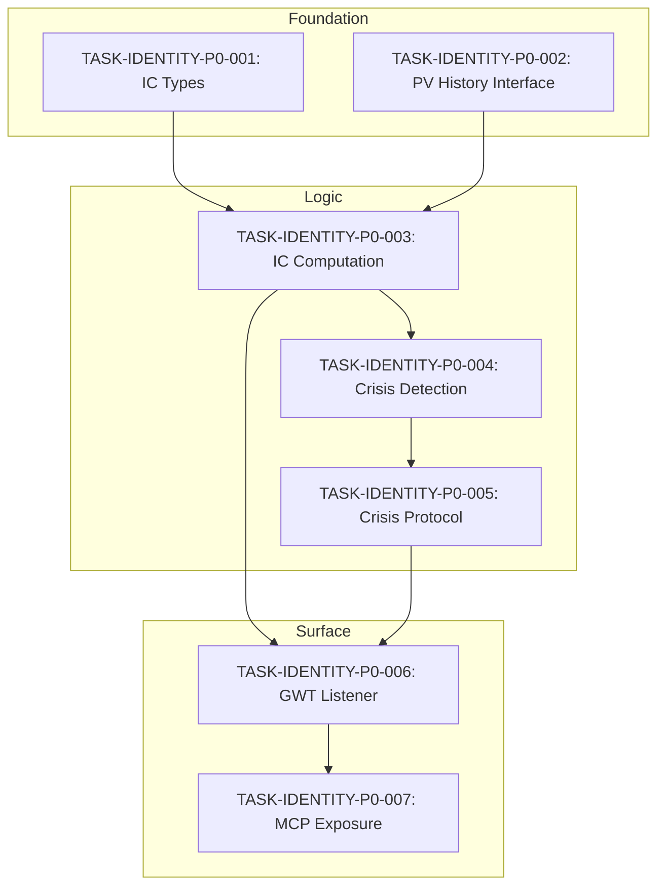

# Functional Specification: Identity Continuity Loop

**Spec ID:** SPEC-IDENTITY-001
**Version:** 1.0.0
**Status:** Draft
**Owner:** Context Graph Core Team
**Last Updated:** 2026-01-11
**Related Specs:** SPEC-GWT-001, SPEC-DREAM-001

---

## 1. Overview

### 1.1 Purpose

The Identity Continuity Loop ensures the ContextGraph system maintains a coherent, persistent sense of self across sessions and operations. This is a **P0 Critical Blocker** identified in the Master Consciousness Gap Analysis (BLOCKER 3).

### 1.2 Problem Statement

The current SELF_EGO_NODE implementation has:
- **Correct formula:** IC = cos(PV_t, PV_{t-1}) x r(t)
- **Correct thresholds:** Healthy (>0.9), Warning (0.7-0.9), Degraded (0.5-0.7), Critical (<0.5)
- **MISSING:** Continuous IC calculation loop
- **MISSING:** IC < 0.7 threshold detection with crisis protocol
- **MISSING:** Wire to GWT attention mechanism

### 1.3 Success Criteria

The system achieves identity continuity when:
1. Identity Continuity (IC) is computed on every workspace broadcast
2. IC >= 0.7 maintained across sessions (per constitution.yaml line 369)
3. IC < 0.7 triggers identity crisis protocol
4. IC state accessible via MCP tools
5. SELF_EGO_NODE persists across restarts

---

## 2. User Stories

### US-IDENTITY-01: Continuous Identity Monitoring (Must Have)

**As** the ContextGraph system
**I want** to continuously compute my identity coherence
**So that** I can detect when my sense of self is drifting

**Priority:** P0 - Critical

**Acceptance Criteria:**

| ID | Given | When | Then |
|----|-------|------|------|
| AC-01-01 | A workspace broadcast occurs with memory entering | The system processes the broadcast | IC is computed as cos(PV_t, PV_{t-1}) x r(t) |
| AC-01-02 | PV_t and PV_{t-1} both exist | IC is calculated | IC value is in range [0, 1] |
| AC-01-03 | This is the first purpose vector (no PV_{t-1}) | IC is calculated | IC defaults to 1.0 (healthy) |
| AC-01-04 | Kuramoto r is 0.0 | IC is calculated | IC is 0.0 (Critical state) |

---

### US-IDENTITY-02: Identity Crisis Detection (Must Have)

**As** the ContextGraph system
**I want** to detect when my identity coherence drops below threshold
**So that** I can trigger protective measures before identity fragmentation

**Priority:** P0 - Critical

**Acceptance Criteria:**

| ID | Given | When | Then |
|----|-------|------|------|
| AC-02-01 | IC >= 0.9 | Status is computed | Status is Healthy |
| AC-02-02 | IC in [0.7, 0.9) | Status is computed | Status is Warning |
| AC-02-03 | IC in [0.5, 0.7) | Status is computed | Status is Degraded |
| AC-02-04 | IC < 0.5 | Status is computed | Status is Critical |
| AC-02-05 | Status transitions to Critical | Event is emitted | WorkspaceEvent::IdentityCritical is broadcast |

---

### US-IDENTITY-03: Identity Crisis Protocol (Must Have)

**As** the ContextGraph system
**I want** to execute a crisis protocol when identity coherence is critical
**So that** I can pause, introspect, and rebuild my sense of self

**Priority:** P0 - Critical

**Acceptance Criteria:**

| ID | Given | When | Then |
|----|-------|------|------|
| AC-03-01 | IC < 0.7 (Warning or below) | Crisis protocol is triggered | A purpose snapshot is recorded with context |
| AC-03-02 | IC < 0.5 (Critical) | Crisis protocol is triggered | WorkspaceEvent::IdentityCritical is emitted |
| AC-03-03 | IdentityCritical event is emitted | Dream system receives event | Introspective dream cycle is triggered |
| AC-03-04 | Crisis protocol completes | Identity is re-evaluated | New IC is computed and status updated |

---

### US-IDENTITY-04: GWT Attention Integration (Must Have)

**As** the ContextGraph system
**I want** my identity monitoring to be wired to the Global Workspace
**So that** identity state influences conscious processing

**Priority:** P0 - Critical

**Acceptance Criteria:**

| ID | Given | When | Then |
|----|-------|------|------|
| AC-04-01 | Workspace broadcasts MemoryEnters event | Listener receives event | Identity continuity cycle is triggered |
| AC-04-02 | Identity status changes | New status differs from previous | WorkspaceEvent is emitted for the transition |
| AC-04-03 | IC is computed | GwtSystem is updated | get_ego_state MCP tool returns current IC |

---

### US-IDENTITY-05: Purpose Vector History (Should Have)

**As** the ContextGraph system
**I want** to maintain a history of purpose vectors
**So that** I can track identity evolution and compute continuity

**Priority:** P1 - High

**Acceptance Criteria:**

| ID | Given | When | Then |
|----|-------|------|------|
| AC-05-01 | Purpose vector is updated | Snapshot is recorded | Identity trajectory contains new snapshot |
| AC-05-02 | Trajectory has >1000 snapshots | New snapshot is recorded | Oldest snapshot is evicted (FIFO) |
| AC-05-03 | get_historical_purpose_vector(i) is called | Index i exists | Returns purpose vector at index i |

---

## 3. Requirements

### 3.1 Functional Requirements

| ID | Requirement | Priority | Story Ref | Rationale |
|----|-------------|----------|-----------|-----------|
| REQ-IDENTITY-001 | System MUST compute IC = cos(PV_t, PV_{t-1}) x r(t) on workspace broadcast | Must | US-01 | PRD formula requirement |
| REQ-IDENTITY-002 | IC computation MUST use cosine similarity for purpose vector comparison | Must | US-01 | Constitution line 369 |
| REQ-IDENTITY-003 | IC MUST be multiplied by Kuramoto order parameter r(t) | Must | US-01 | Sync modulates continuity |
| REQ-IDENTITY-004 | System MUST detect when IC < 0.7 | Must | US-02 | PRD threshold |
| REQ-IDENTITY-005 | System MUST classify IC into Healthy/Warning/Degraded/Critical | Must | US-02 | Constitution lines 387-392 |
| REQ-IDENTITY-006 | System MUST record purpose snapshot on IC < 0.7 | Must | US-03 | Enable trajectory analysis |
| REQ-IDENTITY-007 | System MUST emit IdentityCritical event on IC < 0.5 | Must | US-03 | Trigger dream cycle |
| REQ-IDENTITY-008 | IdentityContinuityMonitor MUST subscribe to workspace events | Must | US-04 | GWT integration |
| REQ-IDENTITY-009 | IC state MUST be accessible via get_ego_state MCP tool | Must | US-04 | External visibility |
| REQ-IDENTITY-010 | Identity trajectory MUST maintain up to 1000 snapshots | Should | US-05 | Memory efficiency |

### 3.2 Non-Functional Requirements

| ID | Category | Requirement | Metric | Rationale |
|----|----------|-------------|--------|-----------|
| NFR-IDENTITY-001 | Performance | IC computation < 1ms | p95 latency | Real-time monitoring |
| NFR-IDENTITY-002 | Performance | Workspace event processing < 5ms | p95 latency | Constitution perf budgets |
| NFR-IDENTITY-003 | Reliability | IC never NaN or Infinity | 100% | AP-10 anti-pattern |
| NFR-IDENTITY-004 | Reliability | Handle zero-magnitude vectors gracefully | 100% | Edge case protection |
| NFR-IDENTITY-005 | Availability | Identity monitoring uptime > 99.9% | Monthly | Critical system |

---

## 4. Edge Cases and Error States

### 4.1 Edge Cases

| ID | Related Req | Scenario | Expected Behavior |
|----|-------------|----------|-------------------|
| EC-IDENTITY-01 | REQ-001 | First purpose vector (no previous) | IC = 1.0, Status = Healthy |
| EC-IDENTITY-02 | REQ-003 | Kuramoto r = 0.0 (no sync) | IC = 0.0, Status = Critical |
| EC-IDENTITY-03 | REQ-003 | Kuramoto r = 1.0 (perfect sync) | IC = cos(PV_t, PV_{t-1}) |
| EC-IDENTITY-04 | REQ-002 | PV_t = [0.0; 13] (zero vector) | Return IC = 0.0 (no purpose) |
| EC-IDENTITY-05 | REQ-002 | PV_t and PV_{t-1} identical | IC = r(t) (cos = 1.0) |
| EC-IDENTITY-06 | REQ-002 | PV_t and PV_{t-1} orthogonal | IC = 0.0 (cos = 0.0) |
| EC-IDENTITY-07 | REQ-002 | PV_t and PV_{t-1} opposite | IC = -r(t) -> clamped to 0.0 |

### 4.2 Error States

| ID | Error Condition | Error Type | Recovery Action |
|----|-----------------|------------|-----------------|
| ERR-IDENTITY-01 | NaN in purpose vector | ValidationError | Reject vector, log warning |
| ERR-IDENTITY-02 | Workspace broadcaster not available | SystemError | Queue event for retry |
| ERR-IDENTITY-03 | Kuramoto network not initialized | InitializationError | Use r = 0.0, emit warning |
| ERR-IDENTITY-04 | Purpose snapshot exceeds trajectory limit | OverflowWarning | Evict oldest, continue |

---

## 5. Data Model

### 5.1 Core Types

```rust
/// Identity continuity calculation result
pub struct IdentityContinuityResult {
    /// IC = cos(PV_t, PV_{t-1}) x r(t)
    pub identity_coherence: f32,
    /// Cosine similarity between consecutive purpose vectors
    pub purpose_continuity: f32,
    /// Kuramoto order parameter at time t
    pub kuramoto_r: f32,
    /// Status classification
    pub status: IdentityStatus,
    /// Timestamp of computation
    pub computed_at: DateTime<Utc>,
}

/// Status thresholds per constitution.yaml lines 387-392
pub enum IdentityStatus {
    Healthy,   // IC > 0.9
    Warning,   // 0.7 <= IC <= 0.9
    Degraded,  // 0.5 <= IC < 0.7
    Critical,  // IC < 0.5
}

/// Monitor for continuous identity tracking
pub struct IdentityContinuityMonitor {
    /// Current purpose vector (PV_t)
    current_pv: [f32; 13],
    /// Previous purpose vector (PV_{t-1})
    previous_pv: Option<[f32; 13]>,
    /// Last computed IC result
    last_result: Option<IdentityContinuityResult>,
    /// Threshold for crisis detection
    crisis_threshold: f32,  // 0.7
}
```

### 5.2 Events

```rust
/// Workspace event for identity crisis
WorkspaceEvent::IdentityCritical {
    identity_coherence: f32,
    previous_status: IdentityStatus,
    current_status: IdentityStatus,
    reason: String,
    timestamp: DateTime<Utc>,
}
```

---

## 6. Interface Contracts

### 6.1 IdentityContinuityMonitor Trait

```rust
pub trait IdentityContinuityMonitoring {
    /// Compute IC for a new purpose vector
    ///
    /// # Arguments
    /// * `new_pv` - The new purpose vector PV_t
    /// * `kuramoto_r` - Current Kuramoto order parameter
    ///
    /// # Returns
    /// * IdentityContinuityResult with IC and status
    fn compute_continuity(
        &mut self,
        new_pv: &[f32; 13],
        kuramoto_r: f32,
    ) -> CoreResult<IdentityContinuityResult>;

    /// Get the current identity status
    fn current_status(&self) -> IdentityStatus;

    /// Get the last computed IC value
    fn identity_coherence(&self) -> f32;

    /// Check if identity is in crisis (IC < 0.7)
    fn is_in_crisis(&self) -> bool;
}
```

### 6.2 WorkspaceEventListener Implementation

```rust
impl WorkspaceEventListener for IdentityContinuityListener {
    fn on_event(&mut self, event: &WorkspaceEvent) -> CoreResult<()>;
    fn event_types(&self) -> Vec<WorkspaceEventType>;
}
```

---

## 7. Test Plan

### 7.1 Unit Tests

| ID | Test Case | Type | Req Ref | Input | Expected |
|----|-----------|------|---------|-------|----------|
| TC-IDENTITY-001 | IC computation with identical vectors | Unit | REQ-001 | PV_t == PV_{t-1}, r=0.9 | IC = 0.9 |
| TC-IDENTITY-002 | IC computation with orthogonal vectors | Unit | REQ-001 | PV_t perp PV_{t-1}, r=0.9 | IC = 0.0 |
| TC-IDENTITY-003 | IC computation with zero r | Unit | REQ-003 | Any PVs, r=0.0 | IC = 0.0 |
| TC-IDENTITY-004 | IC computation with no previous | Unit | EC-01 | First PV | IC = 1.0, Healthy |
| TC-IDENTITY-005 | Status Healthy threshold | Unit | REQ-005 | IC = 0.95 | Healthy |
| TC-IDENTITY-006 | Status Warning threshold | Unit | REQ-005 | IC = 0.75 | Warning |
| TC-IDENTITY-007 | Status Degraded threshold | Unit | REQ-005 | IC = 0.55 | Degraded |
| TC-IDENTITY-008 | Status Critical threshold | Unit | REQ-005 | IC = 0.3 | Critical |
| TC-IDENTITY-009 | Crisis detection at boundary | Unit | REQ-004 | IC = 0.699 | is_in_crisis = true |
| TC-IDENTITY-010 | Crisis detection above boundary | Unit | REQ-004 | IC = 0.7 | is_in_crisis = false |
| TC-IDENTITY-011 | Zero vector handling | Unit | EC-04 | PV = [0.0; 13] | IC = 0.0, no panic |
| TC-IDENTITY-012 | Negative cosine clamping | Unit | EC-07 | Opposite PVs | IC >= 0.0 |

### 7.2 Integration Tests

| ID | Test Case | Type | Req Ref | Description |
|----|-----------|------|---------|-------------|
| TC-IDENTITY-101 | Workspace event triggers IC | Integration | REQ-008 | MemoryEnters event causes IC computation |
| TC-IDENTITY-102 | Crisis emits IdentityCritical | Integration | REQ-007 | IC < 0.5 emits event to broadcaster |
| TC-IDENTITY-103 | MCP get_ego_state returns IC | Integration | REQ-009 | MCP tool reflects current IC state |
| TC-IDENTITY-104 | Full loop with Kuramoto | Integration | REQ-003 | IC uses live Kuramoto r value |

### 7.3 Chaos Tests

| ID | Test Case | Type | Description |
|----|-----------|------|-------------|
| TC-IDENTITY-201 | Rapid PV changes | Chaos | 1000 PV updates/sec, verify no panics |
| TC-IDENTITY-202 | Concurrent IC access | Chaos | Multiple threads reading IC |
| TC-IDENTITY-203 | NaN injection | Chaos | Inject NaN in PV, verify graceful handling |

---

## 8. Dependency Graph



---

## 9. Traceability Matrix

| Requirement | Task IDs | Test IDs | Status |
|-------------|----------|----------|--------|
| REQ-IDENTITY-001 | T001, T003 | TC-001-004 | Pending |
| REQ-IDENTITY-002 | T001, T003 | TC-001-002 | Pending |
| REQ-IDENTITY-003 | T003 | TC-003 | Pending |
| REQ-IDENTITY-004 | T004 | TC-009-010 | Pending |
| REQ-IDENTITY-005 | T004 | TC-005-008 | Pending |
| REQ-IDENTITY-006 | T005 | TC-101 | Pending |
| REQ-IDENTITY-007 | T005 | TC-102 | Pending |
| REQ-IDENTITY-008 | T006 | TC-101 | Pending |
| REQ-IDENTITY-009 | T007 | TC-103 | Pending |
| REQ-IDENTITY-010 | T002 | Unit tests in ego_node.rs | Pending |

---

## 10. Open Questions

1. **Persistence scope:** Should IC history be persisted to RocksDB or only maintained in memory?
   - **Tentative answer:** Memory for now, persistence in TASK-GWT-P1-001 for SELF_EGO_NODE

2. **Crisis backoff:** Should there be a cooldown between crisis protocol invocations?
   - **Tentative answer:** Yes, 30-second minimum between IdentityCritical emissions

3. **Dream integration:** How tightly coupled should crisis protocol be to DreamController?
   - **Tentative answer:** Loosely coupled via WorkspaceEvent; Dream system subscribes to IdentityCritical

---

## Revision History

| Version | Date | Author | Changes |
|---------|------|--------|---------|
| 1.0.0 | 2026-01-11 | Claude Opus 4.5 | Initial specification |
