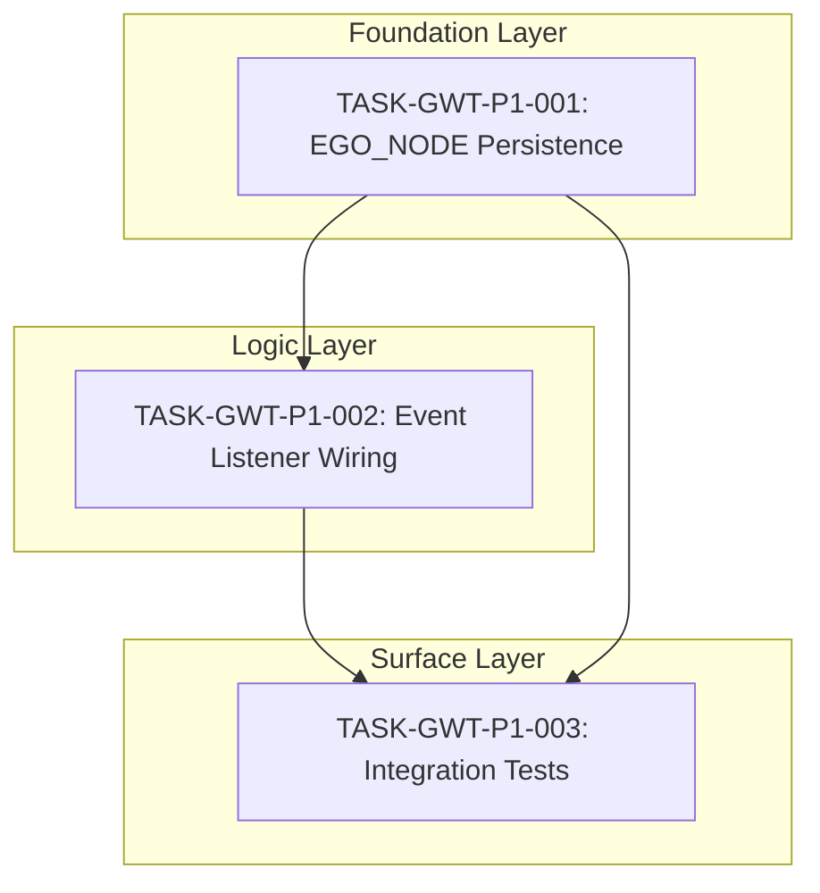

# Task Traceability Matrix: GWT Consciousness Equation

## Coverage: SPEC-GWT-001 -> TASK-GWT-P1-*

| Spec Item | Type | Task ID | Status |
|-----------|------|---------|--------|
| REQ-GWT-001: SELF_EGO_NODE RocksDB Persistence | requirement | TASK-GWT-P1-001 | Completed |
| REQ-GWT-002: Workspace Events Trigger Subsystems | requirement | TASK-GWT-P1-002 | Completed |
| REQ-GWT-003: DreamEventListener Queue Memories | requirement | TASK-GWT-P1-002 | Completed |
| REQ-GWT-004: NeuromodulationEventListener Dopamine | requirement | TASK-GWT-P1-002 | Completed |
| REQ-GWT-005: MetaCognitiveEventListener Epistemic | requirement | TASK-GWT-P1-002 | Completed |
| REQ-GWT-006: IdentityCritical Dream Consolidation | requirement | TASK-GWT-P1-003 | Ready |
| REQ-GWT-007: C(t) Full Computation Flow | requirement | - | Already Implemented |
| REQ-GWT-008: Integration Tests | requirement | TASK-GWT-P1-003 | Ready |

---

## Dependency Graph

---

## Execution Order

| # | Task ID | Title | Layer | Depends On | Status |
|---|---------|-------|-------|------------|--------|
| 1 | TASK-GWT-P1-001 | SELF_EGO_NODE Persistence Layer | Foundation | - | Completed |
| 2 | TASK-GWT-P1-002 | Workspace Event Listener Wiring | Logic | TASK-GWT-P1-001 | Completed |
| 3 | TASK-GWT-P1-003 | End-to-End Integration Tests | Surface | TASK-GWT-P1-001, TASK-GWT-P1-002 | Ready |

---

## Test Coverage Matrix

| Test Case ID | Requirement | Task ID | Status |
|--------------|-------------|---------|--------|
| IT-GWT-001 | REQ-GWT-007 | TASK-GWT-P1-003 | Ready |
| IT-GWT-002 | REQ-GWT-001 | TASK-GWT-P1-003 | Ready |
| IT-GWT-003 | REQ-GWT-006 | TASK-GWT-P1-003 | Ready |
| IT-GWT-004 | REQ-GWT-007 | TASK-GWT-P1-003 | Ready |
| CH-GWT-001 | NFR-GWT-003 | TASK-GWT-P1-003 | Ready |
| CH-GWT-002 | NFR-GWT-002 | TASK-GWT-P1-003 | Ready |
| CH-GWT-003 | NFR-GWT-001 | TASK-GWT-P1-003 | Ready |

---

## Validation Checklist

### Completeness
- [x] All functional requirements have tasks
- [x] All non-functional requirements have tasks
- [x] All methods specified have implementation tasks
- [x] All error states covered in test plan
- [x] Task dependencies form valid DAG (no cycles)
- [x] Layer ordering correct (foundation -> logic -> surface)

### Test Coverage
- [x] Unit tests exist for core components (consciousness.rs, state_machine.rs)
- [x] Integration tests specified (TASK-GWT-P1-003)
- [x] Chaos tests specified (3 scenarios)
- [x] Edge cases documented (overflow, corruption, deadlock)

### Traceability
- [x] All tasks trace to requirements
- [x] All requirements trace to specification
- [x] All test cases trace to requirements
- [x] Gap analysis reference included

---

## Commit References

| Task ID | Commit Hash | Date |
|---------|-------------|------|
| TASK-GWT-P1-001 | ccddb7f | 2026-01-11 |
| TASK-GWT-P1-002 | 22dd8a1 | 2026-01-11 |
| TASK-GWT-P1-003 | - | Pending |

---

## Gap Analysis Alignment

| Gap Analysis Item | Priority | Task Coverage | Status |
|-------------------|----------|---------------|--------|
| GAP 4: GWT Consciousness Equation | P1 | TASK-GWT-P1-001, TASK-GWT-P1-002, TASK-GWT-P1-003 | 67% Complete |

---

## Status Summary

| Status | Count |
|--------|-------|
| Completed | 2 |
| Ready | 1 |
| Blocked | 0 |
| In Progress | 0 |

**Progress: 2/3 tasks (67%)**

---

## Approval Status

| Check | Status | Verified By | Date |
|-------|--------|-------------|------|
| All requirements covered | Pass | Specification Agent | 2026-01-11 |
| Dependencies valid | Pass | Specification Agent | 2026-01-11 |
| Test plan complete | Pass | Specification Agent | 2026-01-11 |
| Traceability complete | Pass | Specification Agent | 2026-01-11 |

---

## Change Log

| Date | Change | Author |
|------|--------|--------|
| 2026-01-11 | Initial creation | Specification Agent |
| 2026-01-11 | Updated status for TASK-GWT-P1-001, TASK-GWT-P1-002 as Completed | Specification Agent |
