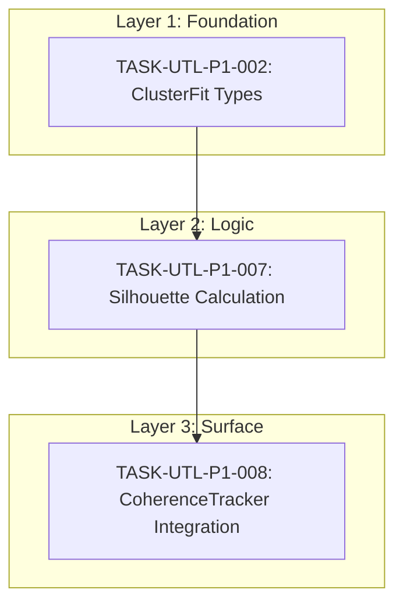

# Task Traceability Matrix: ClusterFit Coherence Component

## Overview

This traceability matrix covers the ClusterFit implementation for the coherence (Delta-C) calculation, addressing GAP 2 from the Master Consciousness Gap Analysis.

**Specification Reference**: SPEC-UTL-002
**Gap Reference**: MASTER-CONSCIOUSNESS-GAP-ANALYSIS.md, GAP 2

---

## Dependency Graph

---

## Execution Order

| # | Task ID | Title | Layer | Depends On | Status |
|---|---------|-------|-------|------------|--------|
| 1 | TASK-UTL-P1-002 | ClusterFit Types and Configuration | foundation | - | Ready |
| 2 | TASK-UTL-P1-007 | Silhouette Calculation and Distance Methods | logic | TASK-UTL-P1-002 | Blocked |
| 3 | TASK-UTL-P1-008 | Integration into CoherenceTracker | surface | TASK-UTL-P1-007 | Blocked |

---

## Coverage: SPEC-UTL-002 -> TASK-UTL-P1-*

| Spec Item | Type | Task ID | Status |
|-----------|------|---------|--------|
| REQ-UTL-002-01: Compute silhouette coefficient | requirement | TASK-UTL-P1-007 | Blocked |
| REQ-UTL-002-02: Compute intra-cluster distance (a) | requirement | TASK-UTL-P1-007 | Blocked |
| REQ-UTL-002-03: Compute inter-cluster distance (b) | requirement | TASK-UTL-P1-007 | Blocked |
| REQ-UTL-002-04: Normalize silhouette to [0,1] | requirement | TASK-UTL-P1-007 | Blocked |
| REQ-UTL-002-05: Expose compute_cluster_fit() API | requirement | TASK-UTL-P1-008 | Blocked |
| REQ-UTL-002-06: Three-component coherence formula | requirement | TASK-UTL-P1-008 | Blocked |
| REQ-UTL-002-07: Default weights (0.4, 0.4, 0.2) | requirement | TASK-UTL-P1-002, TASK-UTL-P1-008 | Partial |
| REQ-UTL-002-08: Configurable weights | requirement | TASK-UTL-P1-002, TASK-UTL-P1-008 | Partial |
| NFR-UTL-002-01: < 2ms p95 latency | performance | TASK-UTL-P1-007 | Blocked |
| NFR-UTL-002-02: Match sklearn within 0.001 | accuracy | TASK-UTL-P1-007 | Blocked |
| NFR-UTL-002-03: Handle empty clusters | robustness | TASK-UTL-P1-007 | Blocked |
| NFR-UTL-002-04: > 90% test coverage | quality | All tasks | Pending |

---

## Type Definitions Coverage

| Type | Task ID | Status |
|------|---------|--------|
| ClusterFitConfig | TASK-UTL-P1-002 | Ready |
| DistanceMetric | TASK-UTL-P1-002 | Ready |
| ClusterContext | TASK-UTL-P1-002 | Ready |
| ClusterFitResult | TASK-UTL-P1-002 | Ready |
| ClusterFitCalculator | TASK-UTL-P1-007 | Blocked |
| CoherenceResult | TASK-UTL-P1-008 | Blocked |

---

## Method Coverage

| Method Signature | Task ID | Status |
|------------------|---------|--------|
| `ClusterFitCalculator::new(config)` | TASK-UTL-P1-007 | Blocked |
| `ClusterFitCalculator::compute(vertex, context)` | TASK-UTL-P1-007 | Blocked |
| `ClusterFitCalculator::compute_distance(a, b)` | TASK-UTL-P1-007 | Blocked |
| `compute_silhouette(a, b)` | TASK-UTL-P1-007 | Blocked |
| `normalize_silhouette(s)` | TASK-UTL-P1-007 | Blocked |
| `cosine_distance(a, b)` | TASK-UTL-P1-007 | Blocked |
| `euclidean_distance(a, b)` | TASK-UTL-P1-007 | Blocked |
| `manhattan_distance(a, b)` | TASK-UTL-P1-007 | Blocked |
| `CoherenceTracker::compute_coherence()` | TASK-UTL-P1-008 | Blocked |
| `CoherenceTracker::compute_coherence_full()` | TASK-UTL-P1-008 | Blocked |
| `CoherenceTracker::set_weights()` | TASK-UTL-P1-008 | Blocked |

---

## Test Coverage Matrix

| Test Case ID | Requirement | Task ID | Status |
|--------------|-------------|---------|--------|
| TC-01: Silhouette matches sklearn (well-separated) | REQ-UTL-002-01 | TASK-UTL-P1-007 | Pending |
| TC-02: Silhouette matches sklearn (overlapping) | REQ-UTL-002-01 | TASK-UTL-P1-007 | Pending |
| TC-03: Intra-cluster distance correct | REQ-UTL-002-02 | TASK-UTL-P1-007 | Pending |
| TC-04: Inter-cluster distance correct | REQ-UTL-002-03 | TASK-UTL-P1-007 | Pending |
| TC-05: Normalization maps [-1,1] to [0,1] | REQ-UTL-002-04 | TASK-UTL-P1-007 | Pending |
| TC-06: Empty same_cluster returns 0.5 | NFR-UTL-002-03 | TASK-UTL-P1-007 | Pending |
| TC-07: Empty nearest_cluster returns 0.5 | NFR-UTL-002-03 | TASK-UTL-P1-007 | Pending |
| TC-08: NaN handling returns fallback | AP-10 compliance | TASK-UTL-P1-007 | Pending |
| TC-09: Three-component formula correct | REQ-UTL-002-06 | TASK-UTL-P1-008 | Pending |
| TC-10: Default weights are 0.4, 0.4, 0.2 | REQ-UTL-002-07 | TASK-UTL-P1-008 | Pending |
| TC-11: ClusterFit failure uses fallback | Robustness | TASK-UTL-P1-008 | Pending |
| TC-12: Latency < 2ms p95 | NFR-UTL-002-01 | TASK-UTL-P1-007 | Pending |

---

## Edge Cases Coverage

| Edge Case | Expected Behavior | Task ID | Status |
|-----------|-------------------|---------|--------|
| EC-01: Single-member cluster | Return 0.5 | TASK-UTL-P1-007 | Pending |
| EC-02: Only one cluster exists | Return 0.5 | TASK-UTL-P1-007 | Pending |
| EC-03: NaN/Inf values in input | Return fallback, log warning | TASK-UTL-P1-007 | Pending |
| EC-04: Empty same_cluster vector | Return 0.5 | TASK-UTL-P1-007 | Pending |
| EC-05: Empty nearest_cluster vector | Return 0.5 | TASK-UTL-P1-007 | Pending |
| EC-06: Very large cluster (>10K) | Sample to maintain latency | TASK-UTL-P1-007 | Pending |

---

## Constitution Alignment

| Constitution Reference | Implementation | Task ID |
|------------------------|----------------|---------|
| `delta_sc.ΔC: "α×Connectivity + β×ClusterFit + γ×Consistency (0.4, 0.4, 0.2)"` | Three-component formula | TASK-UTL-P1-008 |
| `AP-10: No NaN/Infinity in UTL calculations` | Fallback handling | TASK-UTL-P1-007 |
| `AP-09: No unbounded caches` | Cluster sampling | TASK-UTL-P1-007 |
| `ARCH-02: Apples-to-apples comparison` | Same embedder type only | TASK-UTL-P1-007 |

---

## Gap Analysis Alignment

| Gap Analysis Item | Priority | Task Coverage | Status |
|-------------------|----------|---------------|--------|
| GAP 2: ClusterFit Missing from Coherence | P1 | TASK-UTL-P1-002, 007, 008 | Planned |

**Gap Description from Analysis:**
> "ΔC = Σwₖ × (EdgeAlign + SubGraphDensity + ClusterFit)"
> Currently only EdgeAlign and SubGraphDensity implemented.
> **Missing**: ClusterFit component with silhouette score.

**Resolution:**
- TASK-UTL-P1-002: Create types and configuration
- TASK-UTL-P1-007: Implement silhouette calculation
- TASK-UTL-P1-008: Integrate into CoherenceTracker

---

## File Impact Summary

| File | Modifications | Task ID |
|------|---------------|---------|
| `crates/context-graph-utl/src/coherence/cluster_fit.rs` | Create | TASK-UTL-P1-002 |
| `crates/context-graph-utl/src/coherence/cluster_fit.rs` | Add calculator impl | TASK-UTL-P1-007 |
| `crates/context-graph-utl/src/coherence/mod.rs` | Export cluster_fit | TASK-UTL-P1-002 |
| `crates/context-graph-utl/src/coherence/tracker.rs` | Add ClusterFit integration | TASK-UTL-P1-008 |
| `crates/context-graph-utl/src/config/coherence.rs` | Add weight fields | TASK-UTL-P1-002 |
| `crates/context-graph-utl/src/error.rs` | Add error variants | TASK-UTL-P1-002 |

---

## Status Summary

| Status | Count |
|--------|-------|
| Ready | 1 |
| Blocked | 2 |
| In Progress | 0 |
| Completed | 0 |

**Progress: 0/3 tasks (0%)**

---

## Validation Checklist

### Completeness
- [x] All functional requirements have tasks
- [x] All non-functional requirements have tasks
- [x] All methods specified have implementation tasks
- [x] All edge cases documented in test plan
- [x] Task dependencies form valid DAG (no cycles)
- [x] Layer ordering correct (foundation -> logic -> surface)

### Test Coverage
- [x] Unit tests specified for all methods
- [x] Integration tests identified (TASK-UTL-P1-008)
- [x] Edge cases documented (6 cases)
- [x] Error handling tested (NaN, bounds)
- [x] sklearn validation cases specified

### Traceability
- [x] All tasks trace to requirements
- [x] All requirements trace to specification
- [x] All test cases trace to requirements
- [x] Gap analysis reference included
- [x] Constitution alignment documented

---

## Change Log

| Date | Change | Author |
|------|--------|--------|
| 2026-01-11 | Initial creation | Specification Agent |
