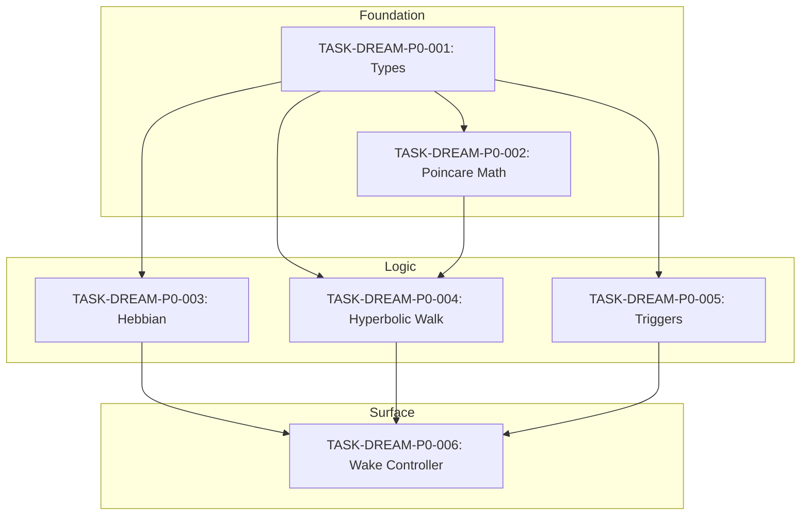
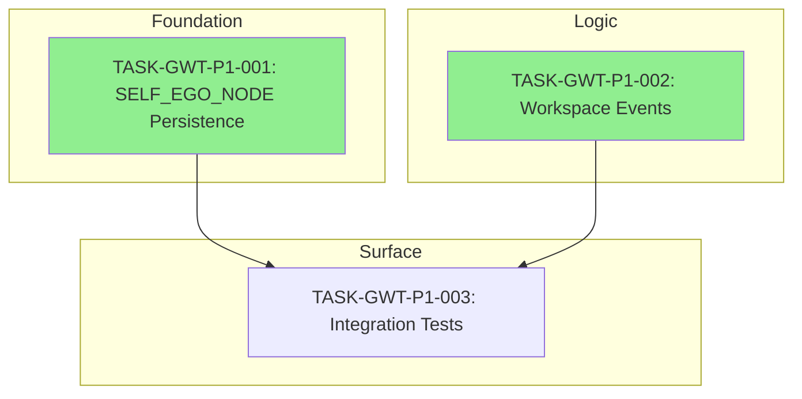
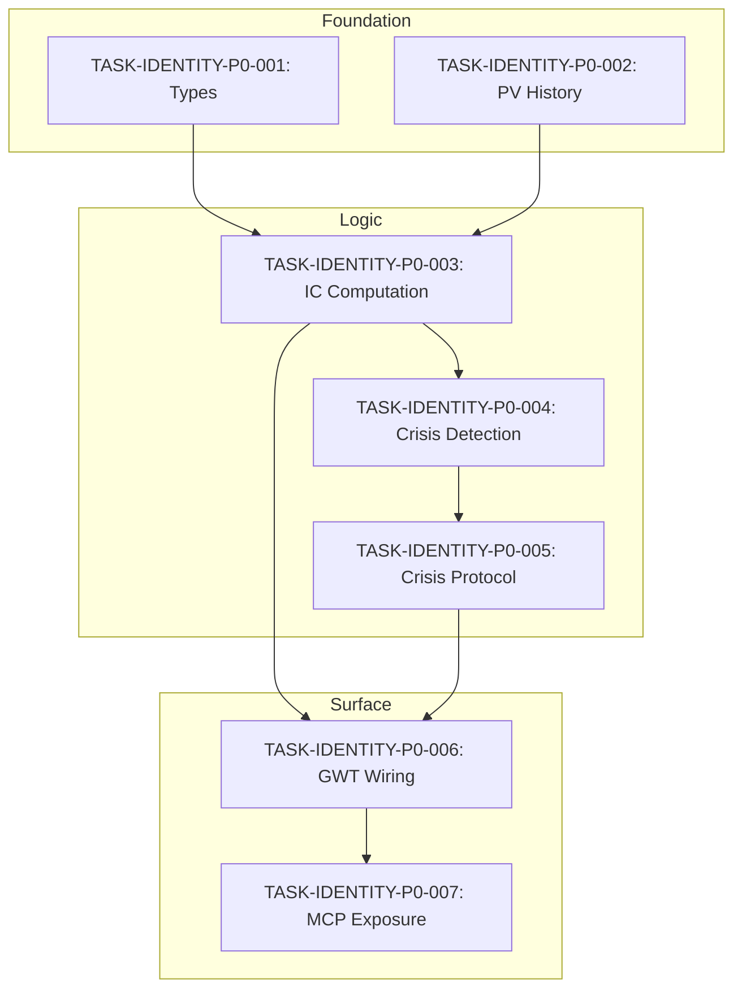
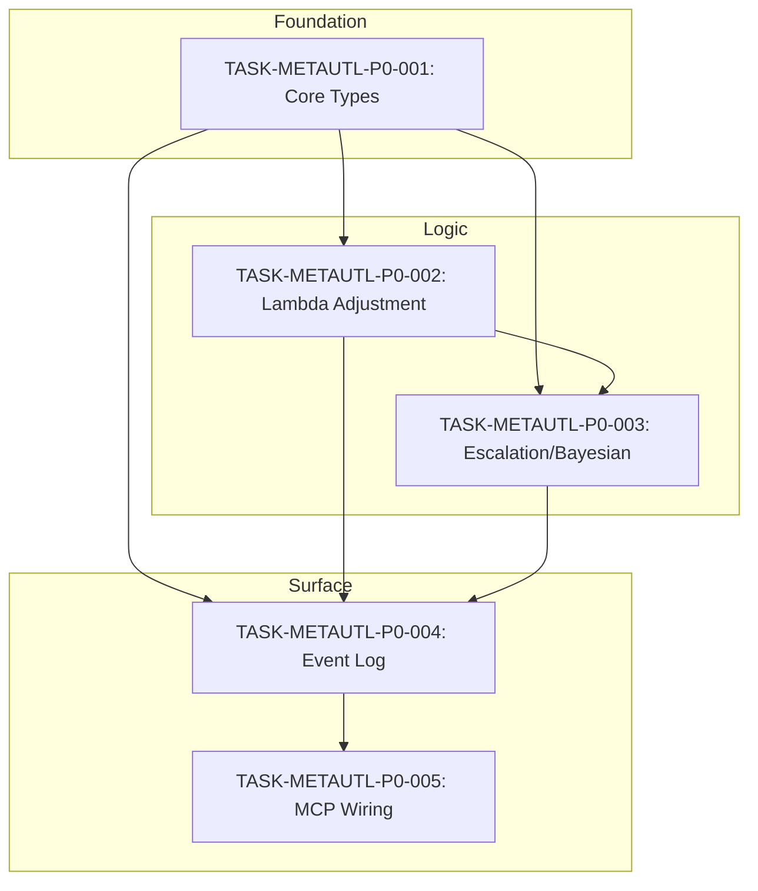
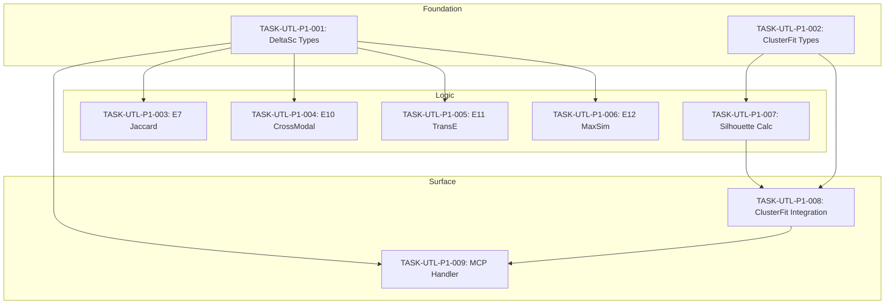
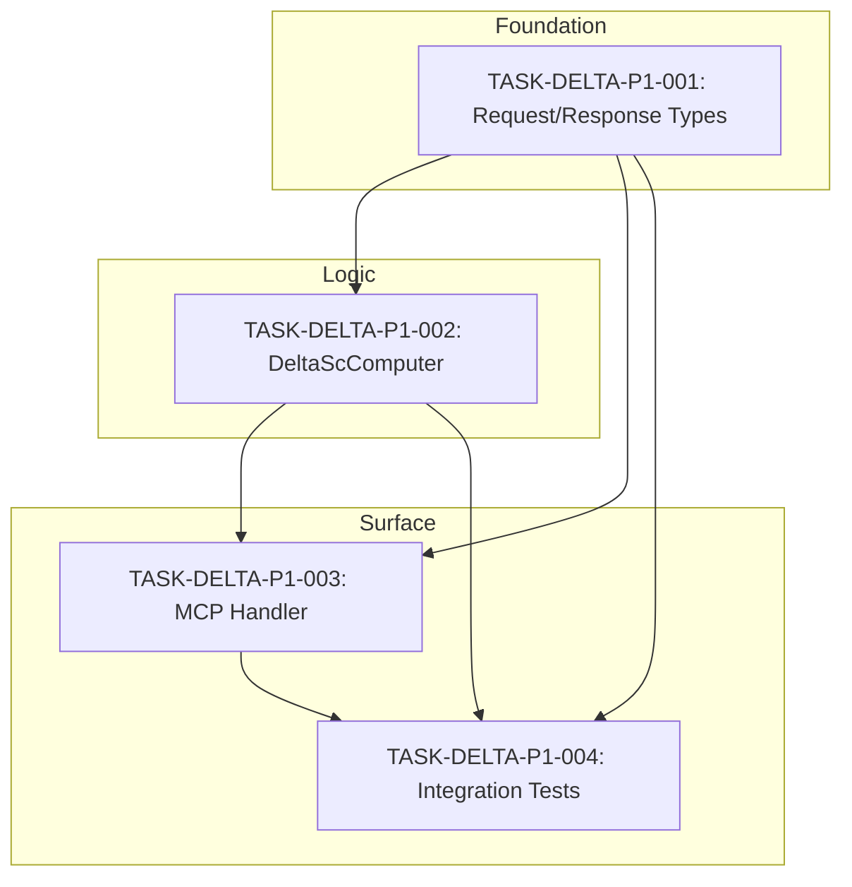
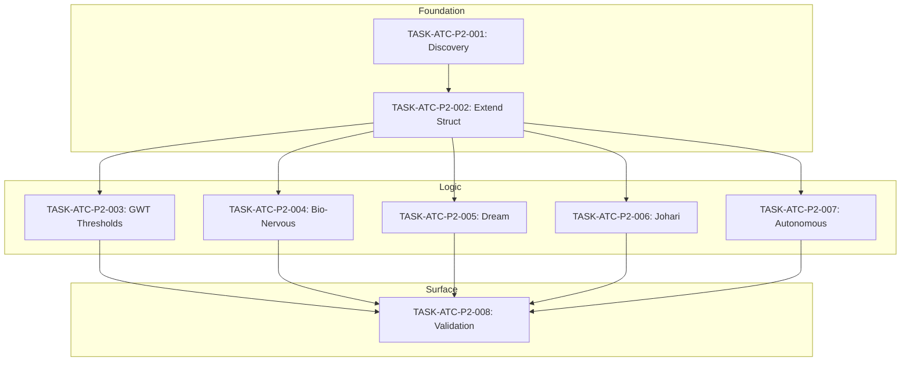
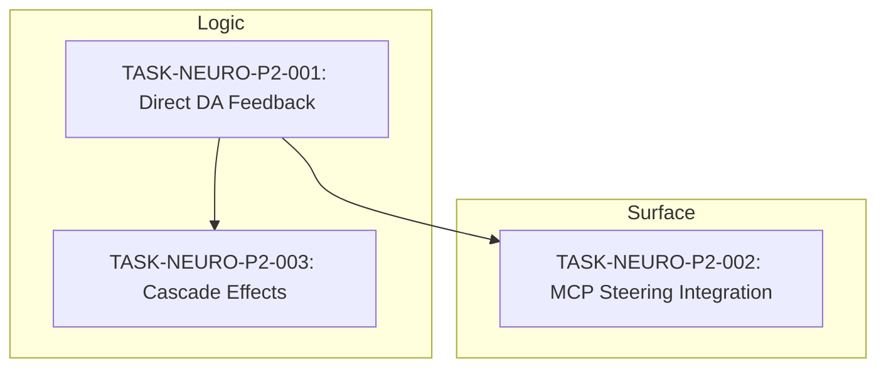

# Task Index: Computational Consciousness System

## Overview

This document provides a comprehensive index of all implementation tasks for the ContextGraph Computational Consciousness System. Tasks are organized by priority, subsystem, layer, and status to facilitate execution planning and progress tracking.

**Total Tasks: 48**
**Last Updated:** 2026-01-11

---

## Executive Summary

| Priority | Total | Completed | In Progress | Ready | Blocked |
|----------|-------|-----------|-------------|-------|---------|
| P0 (Critical) | 18 | 5 | 0 | 13 | 0 |
| P1 (Substantial) | 16 | 4 | 0 | 10 | 2 |
| P2 (Refinement) | 13 | 0 | 0 | 13 | 0 |
| P3 (Enhancement) | 1 | 0 | 0 | 1 | 0 |
| **Total** | **48** | **9** | **0** | **37** | **2** |

---

## Tasks by Priority

### P0 - Critical (18 Tasks)

These tasks implement core consciousness functionality required for system operation.

#### DREAM Subsystem (6 Tasks)

| ID | Title | Layer | Status | Depends On |
|----|-------|-------|--------|------------|
| TASK-DREAM-P0-001 | Dream Layer Types and Interfaces | Foundation | **COMPLETED** | None |
| TASK-DREAM-P0-002 | Poincare Ball Math Utilities | Foundation | **COMPLETED** | P0-001 |
| TASK-DREAM-P0-003 | Hebbian Learning Implementation | Logic | Ready | P0-001 |
| TASK-DREAM-P0-004 | Hyperbolic Random Walk Implementation | Logic | **COMPLETED** | P0-001, P0-002 |
| TASK-DREAM-P0-005 | Dream Trigger Implementation | Logic | **COMPLETED** | P0-001 |
| TASK-DREAM-P0-006 | Wake Controller and MCP Integration | Surface | Ready | P0-003, P0-004, P0-005 |

#### IDENTITY Subsystem (7 Tasks)

| ID | Title | Layer | Status | Depends On |
|----|-------|-------|--------|------------|
| TASK-IDENTITY-P0-001 | Identity Continuity Types | Foundation | **COMPLETED** | None |
| TASK-IDENTITY-P0-002 | Purpose Vector History Interface | Foundation | Ready | None |
| TASK-IDENTITY-P0-003 | Identity Continuity Computation | Logic | Ready | P0-001, P0-002 |
| TASK-IDENTITY-P0-004 | Crisis Detection | Logic | Ready | P0-003 |
| TASK-IDENTITY-P0-005 | Crisis Protocol | Logic | Ready | P0-004 |
| TASK-IDENTITY-P0-006 | GWT Attention Wiring | Surface | Ready | P0-003, P0-005 |
| TASK-IDENTITY-P0-007 | MCP Tool Exposure | Surface | Ready | P0-006 |

#### META-UTL Subsystem (5 Tasks)

| ID | Title | Layer | Status | Depends On |
|----|-------|-------|--------|------------|
| TASK-METAUTL-P0-001 | Core Types and Accuracy History | Foundation | Ready | None |
| TASK-METAUTL-P0-002 | Lambda Adjustment Algorithm | Logic | Ready | P0-001 |
| TASK-METAUTL-P0-003 | Escalation Logic and Bayesian Optimization | Logic | Ready | P0-001, P0-002 |
| TASK-METAUTL-P0-004 | Meta-Learning Event Log | Surface | Ready | P0-001, P0-002, P0-003 |
| TASK-METAUTL-P0-005 | MCP Tool Wiring | Surface | Ready | P0-001, P0-002, P0-003, P0-004 |

---

### P1 - Substantial (16 Tasks)

These tasks implement major features and capabilities.

#### GWT Subsystem (3 Tasks)

| ID | Title | Layer | Status | Depends On |
|----|-------|-------|--------|------------|
| TASK-GWT-P1-001 | SELF_EGO_NODE Persistence Layer | Foundation | **Completed** | None |
| TASK-GWT-P1-002 | Wire Workspace Events to Subsystem Listeners | Logic | **Completed** | None |
| TASK-GWT-P1-003 | End-to-End GWT Integration Tests | Surface | Ready | P1-001, P1-002 |

#### UTL Subsystem (9 Tasks)

| ID | Title | Layer | Status | Depends On |
|----|-------|-------|--------|------------|
| TASK-UTL-P1-001 | DeltaSc Request/Response Types | Foundation | **COMPLETED** | None |
| TASK-UTL-P1-002 | ClusterFit Types and Cluster Interface | Foundation | **COMPLETED** | None |
| TASK-UTL-P1-003 | JaccardCodeEntropy for E7 | Logic | Ready | UTL-P1-001 |
| TASK-UTL-P1-004 | CrossModalEntropy for E10 | Logic | Ready | UTL-P1-001 |
| TASK-UTL-P1-005 | TransEEntropy for E11 | Logic | Ready | UTL-P1-001 |
| TASK-UTL-P1-006 | MaxSimTokenEntropy for E12 | Logic | Ready | UTL-P1-001 |
| TASK-UTL-P1-007 | Silhouette Calculation and Distance Methods | Logic | Ready | UTL-P1-002 |
| TASK-UTL-P1-008 | Integrate ClusterFit into CoherenceTracker | Surface | Blocked | UTL-P1-002, UTL-P1-007 |
| TASK-UTL-P1-009 | Register compute_delta_sc MCP Handler | Surface | Blocked | UTL-P1-001, UTL-P1-008 |

#### DELTA Subsystem (4 Tasks)

| ID | Title | Layer | Status | Depends On |
|----|-------|-------|--------|------------|
| TASK-DELTA-P1-001 | ComputeDeltaSc Request/Response Types | Foundation | Ready | None |
| TASK-DELTA-P1-002 | DeltaScComputer Implementation | Logic | Ready | DELTA-P1-001 |
| TASK-DELTA-P1-003 | MCP Handler Registration | Surface | Ready | DELTA-P1-001, DELTA-P1-002 |
| TASK-DELTA-P1-004 | Integration Tests with FSV Pattern | Surface | Ready | DELTA-P1-001, DELTA-P1-002, DELTA-P1-003 |

---

### P2 - Refinement (13 Tasks)

These tasks improve existing functionality with domain adaptation and minor enhancements.

#### ATC Subsystem (8 Tasks)

| ID | Title | Layer | Status | Depends On |
|----|-------|-------|--------|------------|
| TASK-ATC-P2-001 | Discover Hardcoded Thresholds | Foundation | Ready | None |
| TASK-ATC-P2-002 | Extend DomainThresholds Struct | Foundation | Ready | ATC-P2-001 |
| TASK-ATC-P2-003 | Migrate GWT Layer Thresholds | Logic | Ready | ATC-P2-002 |
| TASK-ATC-P2-004 | Migrate Bio-Nervous Layer Thresholds | Logic | Ready | ATC-P2-002 |
| TASK-ATC-P2-005 | Migrate Dream Layer Thresholds | Logic | Ready | ATC-P2-002 |
| TASK-ATC-P2-006 | Migrate Johari Classification Thresholds | Logic | Ready | ATC-P2-002 |
| TASK-ATC-P2-007 | Migrate Autonomous Services Thresholds | Logic | Ready | ATC-P2-002 |
| TASK-ATC-P2-008 | Validation and Integration Testing | Surface | Ready | P2-003 to P2-007 |

#### NEURO Subsystem (2 Tasks)

| ID | Title | Layer | Status | Depends On |
|----|-------|-------|--------|------------|
| TASK-NEURO-P2-001 | Direct Dopamine Feedback Loop | Logic | Ready | None |
| TASK-NEURO-P2-002 | MCP Steering Handler Integration | Surface | Ready | NEURO-P2-001 |

#### MCP Subsystem (1 Task)

| ID | Title | Layer | Status | Depends On |
|----|-------|-------|--------|------------|
| TASK-MCP-P2-001 | MCP Tool Naming Aliases | Surface | Ready | None |

---

### P3 - Enhancement (1 Task)

Optional enhancements for future consideration.

#### NEURO Subsystem (1 Task)

| ID | Title | Layer | Status | Depends On |
|----|-------|-------|--------|------------|
| TASK-NEURO-P2-003 | Cross-Neuromodulator Cascade Effects | Logic | Ready | NEURO-P2-001 |

---

## Tasks by Subsystem

### DREAM - Dream Layer for Memory Consolidation

**Spec Reference:** SPEC-DREAM-001
**Total Tasks:** 6
**Progress:** 4/6 (67%)



---

### GWT - Global Workspace Theory

**Spec Reference:** SPEC-GWT-001
**Total Tasks:** 3
**Progress:** 2/3 (67%)



---

### IDENTITY - Identity Continuity Loop

**Spec Reference:** SPEC-IDENTITY-001
**Total Tasks:** 7
**Progress:** 1/7 (14%)



---

### META-UTL - Meta-Level UTL Self-Correction

**Spec Reference:** SPEC-METAUTL-001
**Total Tasks:** 5
**Progress:** 0/5 (0%)



---

### UTL - Universal Teleological Learning

**Spec Reference:** SPEC-UTL-001, SPEC-UTL-002, SPEC-UTL-003, SPEC-UTL-004
**Total Tasks:** 9
**Progress:** 2/9 (22%)



---

### DELTA - Delta-S/Delta-C Computation

**Spec Reference:** SPEC-UTL-001
**Total Tasks:** 4
**Progress:** 0/4 (0%)



---

### ATC - Adaptive Threshold Control

**Spec Reference:** SPEC-ATC-001
**Total Tasks:** 8
**Progress:** 0/8 (0%)



---

### NEURO - Neuromodulation Enhancements

**Spec Reference:** SPEC-NEURO-001
**Total Tasks:** 3
**Progress:** 0/3 (0%)



---

### MCP - Model Context Protocol

**Spec Reference:** SPEC-MCP-001
**Total Tasks:** 1
**Progress:** 0/1 (0%)

| ID | Title | Layer | Status | Depends On |
|----|-------|-------|--------|------------|
| TASK-MCP-P2-001 | MCP Tool Naming Aliases | Surface | Ready | None |

---

## Tasks by Layer

### Foundation Layer (12 Tasks)

Foundation tasks create types, interfaces, and data structures with no business logic.

| ID | Subsystem | Title | Status |
|----|-----------|-------|--------|
| TASK-DREAM-P0-001 | DREAM | Types and Interfaces | **COMPLETED** |
| TASK-DREAM-P0-002 | DREAM | Poincare Ball Math | **COMPLETED** |
| TASK-IDENTITY-P0-001 | IDENTITY | Identity Continuity Types | **COMPLETED** |
| TASK-IDENTITY-P0-002 | IDENTITY | Purpose Vector History | Ready |
| TASK-METAUTL-P0-001 | META-UTL | Core Types | Ready |
| TASK-GWT-P1-001 | GWT | SELF_EGO_NODE Persistence | **COMPLETED** |
| TASK-UTL-P1-001 | UTL | DeltaSc Request/Response | **COMPLETED** |
| TASK-UTL-P1-002 | UTL | ClusterFit Types | **COMPLETED** |
| TASK-DELTA-P1-001 | DELTA | Request/Response Types | Ready |
| TASK-ATC-P2-001 | ATC | Discover Thresholds | Ready |
| TASK-ATC-P2-002 | ATC | Extend DomainThresholds | Ready |

### Logic Layer (22 Tasks)

Logic tasks implement core algorithms and business logic.

| ID | Subsystem | Title | Status |
|----|-----------|-------|--------|
| TASK-DREAM-P0-003 | DREAM | Hebbian Learning | Ready |
| TASK-DREAM-P0-004 | DREAM | Hyperbolic Random Walk | **COMPLETED** |
| TASK-DREAM-P0-005 | DREAM | Dream Triggers | **COMPLETED** |
| TASK-IDENTITY-P0-003 | IDENTITY | IC Computation | Ready |
| TASK-IDENTITY-P0-004 | IDENTITY | Crisis Detection | Ready |
| TASK-IDENTITY-P0-005 | IDENTITY | Crisis Protocol | Ready |
| TASK-METAUTL-P0-002 | META-UTL | Lambda Adjustment | Ready |
| TASK-METAUTL-P0-003 | META-UTL | Escalation/Bayesian | Ready |
| TASK-GWT-P1-002 | GWT | Workspace Events | **COMPLETED** |
| TASK-UTL-P1-003 | UTL | JaccardCodeEntropy E7 | Ready |
| TASK-UTL-P1-004 | UTL | CrossModalEntropy E10 | Ready |
| TASK-UTL-P1-005 | UTL | TransEEntropy E11 | Ready |
| TASK-UTL-P1-006 | UTL | MaxSimTokenEntropy E12 | Ready |
| TASK-UTL-P1-007 | UTL | Silhouette Calculation | Ready |
| TASK-DELTA-P1-002 | DELTA | DeltaScComputer | Ready |
| TASK-ATC-P2-003 | ATC | GWT Thresholds | Ready |
| TASK-ATC-P2-004 | ATC | Bio-Nervous Thresholds | Ready |
| TASK-ATC-P2-005 | ATC | Dream Thresholds | Ready |
| TASK-ATC-P2-006 | ATC | Johari Thresholds | Ready |
| TASK-ATC-P2-007 | ATC | Autonomous Thresholds | Ready |
| TASK-NEURO-P2-001 | NEURO | Direct DA Feedback | Ready |
| TASK-NEURO-P2-003 | NEURO | Cascade Effects | Ready |

### Surface Layer (14 Tasks)

Surface tasks integrate with external APIs (MCP), write tests, and provide user-facing features.

| ID | Subsystem | Title | Status |
|----|-----------|-------|--------|
| TASK-DREAM-P0-006 | DREAM | Wake Controller + MCP | Ready |
| TASK-IDENTITY-P0-006 | IDENTITY | GWT Attention Wiring | Ready |
| TASK-IDENTITY-P0-007 | IDENTITY | MCP Tool Exposure | Ready |
| TASK-METAUTL-P0-004 | META-UTL | Event Log | Ready |
| TASK-METAUTL-P0-005 | META-UTL | MCP Tool Wiring | Ready |
| TASK-GWT-P1-003 | GWT | Integration Tests | Ready |
| TASK-UTL-P1-008 | UTL | ClusterFit Integration | Blocked |
| TASK-UTL-P1-009 | UTL | MCP Handler | Blocked |
| TASK-DELTA-P1-003 | DELTA | MCP Handler Registration | Ready |
| TASK-DELTA-P1-004 | DELTA | Integration Tests | Ready |
| TASK-ATC-P2-008 | ATC | Validation Tests | Ready |
| TASK-NEURO-P2-002 | NEURO | MCP Steering Integration | Ready |
| TASK-MCP-P2-001 | MCP | Tool Naming Aliases | Ready |

---

## Tasks by Status

### Completed (9 Tasks)

| ID | Subsystem | Title | Priority |
|----|-----------|-------|----------|
| TASK-DREAM-P0-001 | DREAM | Types and Interfaces | P0 |
| TASK-DREAM-P0-002 | DREAM | Poincare Ball Math Utilities | P0 |
| TASK-DREAM-P0-004 | DREAM | Hyperbolic Random Walk Implementation | P0 |
| TASK-DREAM-P0-005 | DREAM | Dream Trigger Implementation | P0 |
| TASK-IDENTITY-P0-001 | IDENTITY | Identity Continuity Types | P0 |
| TASK-GWT-P1-001 | GWT | SELF_EGO_NODE Persistence Layer | P1 |
| TASK-GWT-P1-002 | GWT | Wire Workspace Events | P1 |
| TASK-UTL-P1-001 | UTL | DeltaSc Request/Response Types | P1 |
| TASK-UTL-P1-002 | UTL | ClusterFit Types and Cluster Interface | P1 |

### In Progress (0 Tasks)

No tasks currently in progress.

### Ready (41 Tasks)

Tasks ready for immediate implementation with all dependencies satisfied or no dependencies.

### Blocked (2 Tasks)

| ID | Subsystem | Blocked By | Reason |
|----|-----------|------------|--------|
| TASK-UTL-P1-008 | UTL | UTL-P1-007 | Silhouette logic required |
| TASK-UTL-P1-009 | UTL | UTL-P1-008 | Full pipeline required |

---

## Execution Order Recommendations

### Phase 1: Foundation (Parallel Execution)

Execute all foundation tasks first. These have no dependencies:

1. TASK-DREAM-P0-001
2. TASK-IDENTITY-P0-001
3. TASK-IDENTITY-P0-002
4. TASK-METAUTL-P0-001
5. TASK-UTL-P1-001
6. TASK-UTL-P1-002
7. TASK-DELTA-P1-001
8. TASK-ATC-P2-001

### Phase 2: Logic (Sequential by Subsystem)

Execute logic layer after foundation completes:

**DREAM Path:** P0-002 -> P0-003, P0-004, P0-005 (parallel)
**IDENTITY Path:** P0-003 -> P0-004 -> P0-005
**META-UTL Path:** P0-002 -> P0-003 (parallel)
**DELTA Path:** P1-002

### Phase 3: Surface (Integration)

Execute surface layer after logic completes:

**DREAM Path:** P0-006
**IDENTITY Path:** P0-006 -> P0-007
**META-UTL Path:** P0-004 -> P0-005
**GWT Path:** P1-003
**DELTA Path:** P1-003 -> P1-004

---

## Critical Path Analysis

The critical path for system readiness is:

```
IDENTITY-P0-001 -> IDENTITY-P0-003 -> IDENTITY-P0-004 -> IDENTITY-P0-005 -> IDENTITY-P0-006 -> IDENTITY-P0-007
```

**Estimated Duration:** 7 sequential tasks x 3.5 hours average = 24.5 hours

**Parallel Critical Path (with team):**

```
Foundation (8 tasks parallel) -> Logic (max 4 sequential) -> Surface (max 2 sequential)
```

**Estimated Duration with 4-agent team:** ~20 hours

---

## Related Documents

| Document | Purpose |
|----------|---------|
| [_traceability.md](./_traceability.md) | PRD -> Spec -> Task mapping |
| [TASK-GWT-TRACEABILITY.md](./TASK-GWT-TRACEABILITY.md) | GWT-specific traceability |
| [TASK-UTL-CLUSTERFIT-TRACEABILITY.md](./TASK-UTL-CLUSTERFIT-TRACEABILITY.md) | ClusterFit-specific traceability |

---

## Change Log

| Date | Author | Change |
|------|--------|--------|
| 2026-01-11 | Documentation Agent | Comprehensive index creation with all 48 tasks |
| 2026-01-11 | Audit Agent | TASK-DREAM-P0-001 marked complete (18 tests pass) |
| 2026-01-11 | Claude Agent | Updated index: 9 tasks completed (DREAM P0-001/002/004/005, IDENTITY P0-001, GWT P1-001/002, UTL P1-001/002) |
