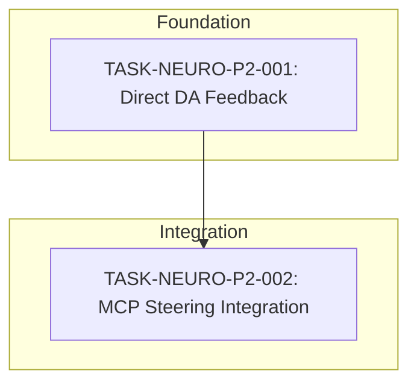

# Task Index: Neuromodulation Domain

## Overview

This index tracks all tasks related to the Neuromodulation subsystem enhancements identified in the Master Consciousness Gap Analysis.

---

## Dependency Graph

---

## Execution Order

| # | Task ID | Title | Layer | Depends On | Status |
|---|---------|-------|-------|------------|--------|
| 1 | TASK-NEURO-P2-001 | Direct Dopamine Feedback Loop | logic | - | Ready |
| 2 | TASK-NEURO-P2-002 | MCP Steering Handler Integration | surface | TASK-NEURO-P2-001 | Blocked |

---

## Task Details

### TASK-NEURO-P2-001: Direct Dopamine Feedback Loop

**Priority**: P2 (Minor Refinement)
**Layer**: Logic
**Complexity**: Low
**Duration**: 2-4 hours

**Description**: Implement `on_goal_progress(delta)` method in DopamineModulator and NeuromodulationManager to enable direct dopamine modulation from steering feedback.

**Files Modified**:
- `crates/context-graph-core/src/neuromod/dopamine.rs`
- `crates/context-graph-core/src/neuromod/state.rs`
- `crates/context-graph-core/src/neuromod/mod.rs`

---

### TASK-NEURO-P2-002: MCP Steering Handler Integration (Future)

**Priority**: P2 (Minor Refinement)
**Layer**: Surface
**Complexity**: Low
**Duration**: 1-2 hours

**Description**: Wire the steering MCP handler to call `neuromod_manager.on_goal_progress()` after computing steering feedback.

**Files Modified**:
- `crates/context-graph-mcp/src/handlers/steering.rs`
- `crates/context-graph-mcp/src/handlers/mod.rs`

**Note**: This task is created as a placeholder. Full specification will be generated after TASK-NEURO-P2-001 is completed.

---

## Status Summary

| Status | Count |
|--------|-------|
| Ready | 1 |
| Blocked | 1 |
| In Progress | 0 |
| Completed | 0 |

**Progress: 0/2 tasks (0%)**

---

## Gap Analysis Reference

This task set addresses **REFINEMENT 3** from the Master Consciousness Gap Analysis (P2 priority):

> **Neuromodulation Feedback Loop**
> - Location: `src/neuromodulation/steering.ts` (Rust equivalent in this project)
> - Impact: Steering feedback updates edge weights, not DA directly
> - Current: `Steering -> Edge Weights -> Indirect DA effect`
> - Preferred: `Steering -> Direct DA modulation -> Cascade effects`

---

## Related Specifications

| Spec ID | Title | Status |
|---------|-------|--------|
| SPEC-NEURO-001 | Direct Dopamine Feedback Loop | Approved |
