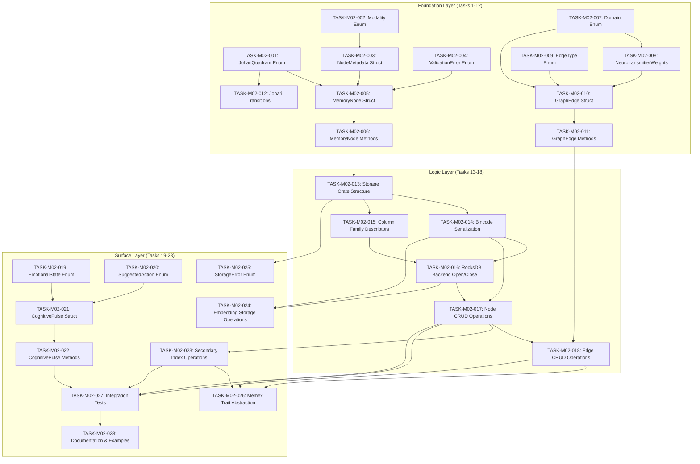

# Task Index: Module 02 - Core Infrastructure

## Overview
- **Module ID:** module-02
- **Module Name:** Core Infrastructure
- **Total Tasks:** 28
- **Foundation:** 12 tasks
- **Logic:** 6 tasks
- **Surface:** 10 tasks
- **Current Progress:** 12/28 (43%) - Tasks 001-012 VERIFIED (Foundation Layer COMPLETE)
- **Version:** 1.0.0
- **Created:** 2025-12-31
- **Dependencies:** module-01-ghost-system

## Dependency Graph



## Execution Order

| # | Task ID | Title | Layer | Depends On | Est. Hours | Status |
|---|---------|-------|-------|------------|------------|--------|
| 1 | TASK-M02-001 | Define JohariQuadrant Enum | foundation | — | 2.0 | ✅ Complete |
| 2 | TASK-M02-002 | Define Modality Enum | foundation | — | 1.5 | ✅ Complete |
| 3 | TASK-M02-003 | Define NodeMetadata Struct | foundation | 002 | 3.0 | ✅ Complete |
| 4 | TASK-M02-004 | Define ValidationError Enum | foundation | — | 1.0 | ✅ Complete |
| 5 | TASK-M02-005 | Define MemoryNode Struct | foundation | 001, 003, 004 | 2.0 | ✅ Complete |
| 6 | TASK-M02-006 | Implement MemoryNode Methods | foundation | 005 | 3.0 | ✅ Complete |
| 7 | TASK-M02-007 | Define Domain Enum (Marblestone) | foundation | — | 1.0 | ✅ Complete |
| 8 | TASK-M02-008 | Define NeurotransmitterWeights Struct | foundation | 007 | 2.0 | ✅ Complete |
| 9 | TASK-M02-009 | Define EdgeType Enum (Marblestone) + Migrate from graph_edge.rs | foundation | — | 1.5 | ✅ Complete |
| 10 | TASK-M02-010 | Define GraphEdge Struct (13-field Marblestone) | foundation | 007, 008, 009 | 2.0 | ✅ Complete |
| 11 | TASK-M02-011 | Implement GraphEdge Methods | foundation | 010 | 2.5 | ✅ Complete |
| 12 | TASK-M02-012 | Implement Johari Transition Logic | foundation | 001 | 2.0 | ✅ Complete |
| 13 | TASK-M02-013 | Create Storage Crate Structure | logic | 006 | 1.5 | ⏳ Ready |
| 14 | TASK-M02-014 | Implement Bincode Serialization | logic | 013 | 2.5 | ⛔ Blocked |
| 15 | TASK-M02-015 | Define Column Family Descriptors | logic | 013 | 3.0 | ⛔ Blocked |
| 16 | TASK-M02-016 | Implement RocksDB Backend Open/Close | logic | 014, 015 | 3.0 | ⛔ Blocked |
| 17 | TASK-M02-017 | Implement Node CRUD Operations | logic | 014, 016 | 4.0 | ⛔ Blocked |
| 18 | TASK-M02-018 | Implement Edge CRUD Operations | logic | 011, 017 | 3.0 | ⛔ Blocked |
| 19 | TASK-M02-019 | Define EmotionalState Enum | surface | — | 1.0 | ⏳ Ready |
| 20 | TASK-M02-020 | Define SuggestedAction Enum | surface | — | 1.0 | ⏳ Ready |
| 21 | TASK-M02-021 | Define CognitivePulse Struct | surface | 019, 020 | 2.0 | ⛔ Blocked |
| 22 | TASK-M02-022 | Implement CognitivePulse Methods | surface | 021 | 3.0 | ⛔ Blocked |
| 23 | TASK-M02-023 | Implement Secondary Index Operations | surface | 017 | 3.0 | ⛔ Blocked |
| 24 | TASK-M02-024 | Implement Embedding Storage Operations | surface | 014, 016 | 2.0 | ⛔ Blocked |
| 25 | TASK-M02-025 | Implement StorageError Enum | surface | 013 | 1.5 | ⛔ Blocked |
| 26 | TASK-M02-026 | Implement Memex Trait Abstraction | surface | 017, 018, 023 | 2.0 | ⛔ Blocked |
| 27 | TASK-M02-027 | Create Module Integration Tests | surface | 017, 018, 022, 023 | 4.0 | ⛔ Blocked |
| 28 | TASK-M02-028 | Document Public API with Examples | surface | 027 | 3.0 | ⛔ Blocked |

## Status Legend
- ⏳ Ready — Can be started now (no blocking dependencies)
- 🔄 In Progress — Currently being worked on
- ✅ Complete — Finished and verified
- ⛔ Blocked — Waiting on dependencies
- ❌ Failed — Needs revision

## Completion Tracking

| Task | Started | Completed | Verified | Notes |
|------|---------|-----------|----------|-------|
| TASK-M02-001 | 2025-12-31 | 2025-12-31 | 2025-12-31 | Verified via commit 857b910 |
| TASK-M02-002 | 2025-12-31 | 2025-12-31 | 2025-12-31 | Verified: 19 tests pass, 0 clippy warnings |
| TASK-M02-003 | 2025-12-31 | 2025-12-31 | 2025-12-31 | Sherlock-Holmes verified: 39/39 tests pass, 0 clippy warnings, SEC-06 + AP-010 compliant |
| TASK-M02-004 | 2025-12-31 | 2025-12-31 | 2025-12-31 | Sherlock-Holmes verified: 10/10 tests pass, 0 clippy warnings |
| TASK-M02-005 | 2025-12-31 | 2025-12-31 | 2025-12-31 | Sherlock-Holmes verified: 60/60 tests pass, 0 clippy warnings |
| TASK-M02-006 | 2025-12-31 | 2025-12-31 | 2025-12-31 | Sherlock-Holmes verified: 86/86 tests pass, 0 clippy warnings |
| TASK-M02-007 | 2025-12-31 | 2025-12-31 | 2025-12-31 | Sherlock-Holmes verified: 29/29 tests pass, 0 clippy warnings |
| TASK-M02-008 | 2025-12-31 | 2025-12-31 | 2025-12-31 | Sherlock-Holmes verified: 66/66 marblestone tests pass (29 Domain + 37 NT), 0 clippy warnings |
| TASK-M02-009 | 2025-12-31 | 2025-12-31 | 2025-12-31 | Sherlock-Holmes verified: 31 EdgeType tests pass, 330 total tests, 0 clippy warnings |
| TASK-M02-010 | 2025-12-31 | 2025-12-31 | 2025-12-31 | Sherlock-Holmes verified: 32 graph_edge tests pass, 0 clippy warnings, 13 fields confirmed |
| TASK-M02-011 | 2025-12-31 | 2025-12-31 | 2025-12-31 | Sherlock-Holmes verified: 78/78 graph_edge tests pass, 0 clippy warnings, 9 methods + Default impl |
| TASK-M02-012 | 2025-12-31 | 2025-12-31 | 2025-12-31 | Sherlock-Holmes verified: 27+ transition tests pass, 0 clippy warnings, all transition rules match spec |
| TASK-M02-013 | — | — | — | Depends on 006 |
| TASK-M02-014 | — | — | — | Depends on 013 |
| TASK-M02-015 | — | — | — | Depends on 013 |
| TASK-M02-016 | — | — | — | Depends on 014, 015 |
| TASK-M02-017 | — | — | — | Depends on 014, 016 |
| TASK-M02-018 | — | — | — | Depends on 011, 017 |
| TASK-M02-019 | — | — | — | No dependencies |
| TASK-M02-020 | — | — | — | No dependencies |
| TASK-M02-021 | — | — | — | Depends on 019, 020 |
| TASK-M02-022 | — | — | — | Depends on 021 |
| TASK-M02-023 | — | — | — | Depends on 017 |
| TASK-M02-024 | — | — | — | Depends on 014, 016 |
| TASK-M02-025 | — | — | — | Depends on 013 |
| TASK-M02-026 | — | — | — | Depends on 017, 018, 023 |
| TASK-M02-027 | — | — | — | Depends on 017, 018, 022, 023 |
| TASK-M02-028 | — | — | — | Depends on 027 |

## Critical Path

The longest dependency chain that determines minimum completion time:

```
TASK-M02-002 → TASK-M02-003 → TASK-M02-005 → TASK-M02-006 → TASK-M02-013 →
TASK-M02-014 → TASK-M02-016 → TASK-M02-017 → TASK-M02-018 → TASK-M02-026 →
TASK-M02-027 → TASK-M02-028
```

**Critical Path Length:** 12 tasks sequential

## Parallel Opportunities

Tasks that can execute simultaneously:

- **Batch 1 (No dependencies):**
  - TASK-M02-001, TASK-M02-002, TASK-M02-004, TASK-M02-007, TASK-M02-009, TASK-M02-019, TASK-M02-020

- **Batch 2 (After respective deps):**
  - TASK-M02-003 (after 002)
  - TASK-M02-008 (after 007)
  - TASK-M02-012 (after 001)

- **Batch 3:**
  - TASK-M02-005 (after 001, 003, 004)
  - TASK-M02-010 (after 007, 008, 009)
  - TASK-M02-021 (after 019, 020)

- **Batch 4:**
  - TASK-M02-006 (after 005)
  - TASK-M02-011 (after 010)
  - TASK-M02-022 (after 021)

## Quality Gates

| Gate | Criteria | Required For |
|------|----------|--------------|
| Foundation Complete | TASK-M02-001 through TASK-M02-012 pass all tests | Logic Layer start |
| Storage Functional | TASK-M02-013 through TASK-M02-018 pass all tests | Surface Layer start |
| Module Complete | All 28 tasks complete, >80% test coverage | Module 03 start |

## Spec References

- **TECH-CORE-002:** Core Infrastructure Technical Specification
- **REQ-CORE-001 through REQ-CORE-008:** Core Requirements
- **Marblestone Integration Spec:** Neurotransmitter weighting architecture

---

*Generated: 2025-12-31*
*Module: 02 - Core Infrastructure*
*Framework: Atomic Task Breakdown v1.0*
