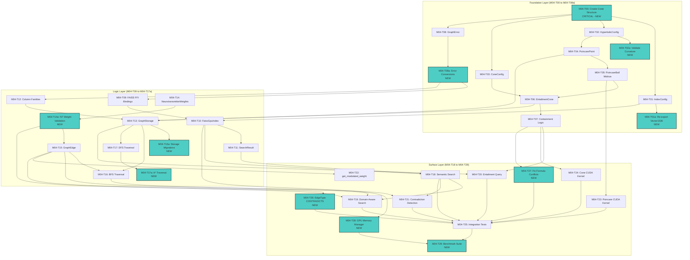

# Task Index: Module 04 - Knowledge Graph

```yaml
metadata:
  module_id: "module-04"
  module_name: "Knowledge Graph"
  version: "1.2.0"
  phase: 2
  total_tasks: 36
  approach: "inside-out-bottom-up"
  created: "2025-12-31"
  updated: "2026-01-03"
  dependencies:
    - module-02-core-infrastructure
    - module-03-embedding-pipeline
  estimated_duration: "5 weeks"
  spec_refs:
    - "SPEC-GRAPH-004 (Functional)"
    - "TECH-GRAPH-004 (Technical)"
```

---

## Overview

- **Total Tasks:** 36
- **Foundation:** 12 tasks (M04-T00 to M04-T08a) - Sequences 1-12
- **Logic:** 13 tasks (M04-T09 to M04-T17a, M04-T26) - Sequences 13-25
- **Surface:** 11 tasks (M04-T18 to M04-T25, M04-T27 to M04-T29) - Sequences 26-36
- **Current Progress:** 4/36 (11.1%) - M04-T00, M04-T01, M04-T01a, M04-T02, M04-T02a Complete

### Atomic Task Files Created

All 36 atomic task files are located in `/home/cabdru/contextgraph/specs/tasks/module04/`:

| Layer | Task Files | Count |
|-------|------------|-------|
| Foundation | M04-T00 to M04-T08a | 12 |
| Logic | M04-T09 to M04-T17a, M04-T26 | 13 |
| Surface | M04-T18 to M04-T25, M04-T27 to M04-T29 | 11 |

### Critical Blockers Identified

| Issue | Severity | Resolution Task |
|-------|----------|-----------------|
| `context-graph-graph` crate DOES NOT EXIST | CRITICAL | M04-T00 |
| No FAISS FFI implementation exists | CRITICAL | M04-T09 |
| No CUDA kernels exist | HIGH | M04-T23, M04-T24 |
| Vector1536 type not re-exported | HIGH | M04-T01a |
| EdgeType::CONTRADICTS missing | HIGH | M04-T26 |
| Formula conflicts in containment | MEDIUM | M04-T27 |

---

## Dependency Graph



---

## Execution Order

| # | Task ID | Title | Layer | Depends On | Status | Est. Hours |
|---|---------|-------|-------|------------|--------|------------|
| 1 | M04-T00 | **Create context-graph-graph Crate Structure** | foundation | - | :white_check_mark: Complete | 3 |
| 2 | M04-T01 | Complete IndexConfig for FAISS IVF-PQ | foundation | T00 | :white_check_mark: Complete | 2 |
| 3 | M04-T01a | **Re-export Vector1536 from Core** | foundation | T01 | :white_check_mark: Complete | 1 |
| 4 | M04-T02 | Define HyperbolicConfig for Poincare Ball | foundation | T00 | :white_check_mark: Verified | 1 |
| 5 | M04-T02a | **Implement Curvature Validation** | foundation | T02 | :white_check_mark: Verified | 0.5 |
| 6 | M04-T03 | Define ConeConfig for Entailment Cones | foundation | T00 | :hourglass: Ready | 1.5 |
| 7 | M04-T04 | Define PoincarePoint for 64D Hyperbolic Space | foundation | T02 | :no_entry: Blocked | 2 |
| 8 | M04-T05 | Implement PoincareBall Mobius Operations | foundation | T04 | :no_entry: Blocked | 4 |
| 9 | M04-T06 | Define EntailmentCone Struct | foundation | T03, T05 | :no_entry: Blocked | 3 |
| 10 | M04-T07 | Implement EntailmentCone Containment Logic | foundation | T06 | :no_entry: Blocked | 3 |
| 11 | M04-T08 | Define GraphError Enum | foundation | T00 | :hourglass: Ready | 1.5 |
| 12 | M04-T08a | **Implement Error Conversions (From traits)** | foundation | T08 | :no_entry: Blocked | 1 |
| 13 | M04-T09 | Define FAISS FFI Bindings | logic | T08a | :no_entry: Blocked | 4 |
| 14 | M04-T10 | Implement FaissGpuIndex Wrapper | logic | T01, T09 | :no_entry: Blocked | 5 |
| 15 | M04-T11 | Implement SearchResult Struct | logic | T10 | :no_entry: Blocked | 1.5 |
| 16 | M04-T12 | Define Graph Storage Column Families | logic | T08a | :no_entry: Blocked | 2 |
| 17 | M04-T13 | Implement GraphStorage Backend | logic | T04, T06, T12 | :no_entry: Blocked | 4 |
| 18 | M04-T13a | **Implement Storage Schema Migrations** | logic | T13 | :no_entry: Blocked | 2 |
| 19 | M04-T14 | Implement NeurotransmitterWeights for Edges | logic | - | :hourglass: Ready | 2 |
| 20 | M04-T14a | **Implement NT Weight Range Validation** | logic | T14 | :no_entry: Blocked | 1 |
| 21 | M04-T15 | Implement GraphEdge with Marblestone Fields | logic | T14a | :no_entry: Blocked | 3 |
| 22 | M04-T16 | Implement BFS Graph Traversal | logic | T13, T15 | :no_entry: Blocked | 3 |
| 23 | M04-T17 | Implement DFS Graph Traversal | logic | T13 | :no_entry: Blocked | 2 |
| 24 | M04-T17a | **Implement A* Hyperbolic Traversal** | logic | T17 | :no_entry: Blocked | 3 |
| 25 | M04-T18 | Implement Semantic Search Operation | surface | T10, T11 | :no_entry: Blocked | 3 |
| 26 | M04-T19 | Implement Domain-Aware Search (Marblestone) | surface | T14a, T15, T18 | :no_entry: Blocked | 3 |
| 27 | M04-T20 | Implement Entailment Query Operation | surface | T07, T13 | :no_entry: Blocked | 4 |
| 28 | M04-T21 | Implement Contradiction Detection | surface | T18, T16 | :no_entry: Blocked | 3 |
| 29 | M04-T22 | Implement get_modulated_weight Function | surface | T15 | :no_entry: Blocked | 1 |
| 30 | M04-T23 | Implement Poincare Distance CUDA Kernel | surface | T05 | :no_entry: Blocked | 4 |
| 31 | M04-T24 | Implement Cone Membership CUDA Kernel | surface | T07 | :no_entry: Blocked | 4 |
| 32 | M04-T26 | **Add EdgeType::CONTRADICTS Variant** | surface | T15 | :no_entry: Blocked | 1 |
| 33 | M04-T27 | **Fix Containment Formula Conflicts** | surface | T07 | :no_entry: Blocked | 2 |
| 34 | M04-T28 | **Implement GPU Memory Manager** | surface | T10 | :no_entry: Blocked | 3 |
| 35 | M04-T25 | Create Module Integration Tests | surface | T18-T24, T26, T27 | :no_entry: Blocked | 6 |
| 36 | M04-T29 | **Create Performance Benchmark Suite** | surface | T25, T28 | :no_entry: Blocked | 4 |

**Total Estimated Hours:** ~95 hours (~2.4 weeks full-time)

---

## Status Legend

| Symbol | Status | Description |
|--------|--------|-------------|
| :hourglass: | Ready | Can be started immediately, all dependencies met |
| :arrows_counterclockwise: | In Progress | Currently being worked on |
| :white_check_mark: | Complete | Finished and verified |
| :no_entry: | Blocked | Waiting on dependencies |
| :x: | Failed | Needs revision |

---

## Completion Tracking

| Task | Started | Completed | Verified | Notes |
|------|---------|-----------|----------|-------|
| M04-T00 | 2026-01-03 | 2026-01-03 | Yes | COMPLETE: Crate exists with full structure |
| M04-T01 | 2026-01-03 | 2026-01-03 | Yes | COMPLETE: IndexConfig with 8 fields |
| M04-T01a | 2026-01-03 | 2026-01-03 | Yes | COMPLETE: EmbeddingVector re-export |
| M04-T02 | 2026-01-03 | 2026-01-03 | Yes | VERIFIED: HyperbolicConfig 4 fields (sherlock-holmes) |
| M04-T02a | 2026-01-03 | 2026-01-03 | Yes | VERIFIED: validate() with NaN checks (sherlock-holmes) |
| M04-T03 | - | - | - | |
| M04-T04 | - | - | - | |
| M04-T05 | - | - | - | |
| M04-T06 | - | - | - | |
| M04-T07 | - | - | - | |
| M04-T08 | - | - | - | |
| M04-T08a | - | - | - | NEW: Error conversions |
| M04-T09 | - | - | - | No existing FAISS FFI |
| M04-T10 | - | - | - | |
| M04-T11 | - | - | - | |
| M04-T12 | - | - | - | |
| M04-T13 | - | - | - | |
| M04-T13a | - | - | - | NEW: Schema migrations |
| M04-T14 | - | - | - | Can start immediately |
| M04-T14a | - | - | - | NEW: Range validation |
| M04-T15 | - | - | - | |
| M04-T16 | - | - | - | |
| M04-T17 | - | - | - | |
| M04-T17a | - | - | - | NEW: A* traversal |
| M04-T18 | - | - | - | |
| M04-T19 | - | - | - | |
| M04-T20 | - | - | - | |
| M04-T21 | - | - | - | |
| M04-T22 | - | - | - | |
| M04-T23 | - | - | - | No CUDA kernels exist |
| M04-T24 | - | - | - | No CUDA kernels exist |
| M04-T25 | - | - | - | |
| M04-T26 | - | - | - | NEW: Missing EdgeType |
| M04-T27 | - | - | - | NEW: Formula fix |
| M04-T28 | - | - | - | NEW: GPU memory |
| M04-T29 | - | - | - | NEW: Benchmarks |

---

## Critical Path Analysis

The longest dependency chain that determines minimum completion time:

```
M04-T00 (Crate)
    -> M04-T02 (HyperbolicConfig)
    -> M04-T04 (PoincarePoint)
    -> M04-T05 (PoincareBall)
    -> M04-T06 (EntailmentCone)
    -> M04-T07 (Containment)
    -> M04-T20 (Entailment Query)
    -> M04-T25 (Integration Tests)
    -> M04-T29 (Benchmarks)
```

**Critical Path Length:** 9 tasks
**Estimated Critical Path Duration:** ~30 hours

### Secondary Critical Path (FAISS):

```
M04-T00 (Crate)
    -> M04-T08 (GraphError)
    -> M04-T08a (Error Conversions)
    -> M04-T09 (FAISS FFI)
    -> M04-T10 (FaissGpuIndex)
    -> M04-T11 (SearchResult)
    -> M04-T18 (Semantic Search)
    -> M04-T19 (Domain Search)
    -> M04-T25 (Integration Tests)
```

---

## Parallel Opportunities

Tasks that can execute simultaneously once their dependencies are met:

### Batch 1 (No dependencies - can start immediately):
- **M04-T00**: Create crate structure (CRITICAL - must complete first)
- **M04-T14**: NeurotransmitterWeights (standalone types)

### Batch 2 (After M04-T00 completes):
- M04-T01: IndexConfig
- M04-T02: HyperbolicConfig
- M04-T03: ConeConfig
- M04-T08: GraphError

### Batch 3 (After Foundation configs):
- M04-T01a: Vector1536 re-export (needs T01)
- M04-T02a: Curvature validation (needs T02)
- M04-T04: PoincarePoint (needs T02)
- M04-T08a: Error conversions (needs T08)

### Batch 4 (After types defined):
- M04-T05: PoincareBall (needs T04)
- M04-T09: FAISS FFI (needs T08a)
- M04-T12: Column Families (needs T08a)
- M04-T14a: NT validation (needs T14)

### Batch 5 (After core logic):
- M04-T06: EntailmentCone (needs T03, T05)
- M04-T10: FaissGpuIndex (needs T01, T09)
- M04-T15: GraphEdge (needs T14a)

### Batch 6 (After structs):
- M04-T07: Containment (needs T06)
- M04-T11: SearchResult (needs T10)
- M04-T13: GraphStorage (needs T04, T06, T12)

### Batch 7 (After storage):
- M04-T16: BFS (needs T13, T15)
- M04-T17: DFS (needs T13)
- M04-T18: Semantic Search (needs T10, T11)
- M04-T23: Poincare CUDA (needs T05)
- M04-T24: Cone CUDA (needs T07)

### Batch 8 (Surface layer):
- M04-T19: Domain Search (needs T14a, T15, T18)
- M04-T20: Entailment Query (needs T07, T13)
- M04-T21: Contradiction (needs T18, T16)
- M04-T22: get_modulated_weight (needs T15)
- M04-T26: EdgeType::CONTRADICTS (needs T15)
- M04-T27: Formula fixes (needs T07)
- M04-T28: GPU Memory Manager (needs T10)

### Batch 9 (Integration):
- M04-T17a: A* Traversal (needs T17)
- M04-T13a: Storage Migrations (needs T13)
- M04-T25: Integration Tests (needs T18-T24, T26, T27)

### Batch 10 (Final):
- M04-T29: Benchmark Suite (needs T25, T28)

---

## New Tasks Summary (From Analysis)

### From Foundation Analysis (Agent 1):
| Task ID | Title | Justification |
|---------|-------|---------------|
| M04-T00 | Create crate structure | Crate does not exist |
| M04-T01a | Re-export Vector1536 | Missing type dependency |
| M04-T02a | Curvature validation | Spec requires c < 0 |

### From Logic Analysis (Agent 2):
| Task ID | Title | Justification |
|---------|-------|---------------|
| M04-T13a | Storage migrations | Schema versioning needed |
| M04-T14a | NT weight validation | Range [0,1] not enforced |
| M04-T17a | A* traversal | Hyperbolic heuristics needed |

### From Surface Analysis (Agent 3):
| Task ID | Title | Justification |
|---------|-------|---------------|
| M04-T26 | EdgeType::CONTRADICTS | Missing edge type for T21 |
| M04-T27 | Fix formula conflicts | Containment formulas inconsistent |
| M04-T28 | GPU memory manager | VRAM budget tracking |
| M04-T29 | Benchmark suite | Performance validation |

---

## Requirement Mappings

| Requirement | Task ID(s) | Coverage |
|-------------|------------|----------|
| REQ-KG-001 (FAISS Index) | M04-T01, M04-T09, M04-T10 | Full |
| REQ-KG-050 (Hyperbolic Points) | M04-T02, M04-T04 | Full |
| REQ-KG-051 (Mobius Operations) | M04-T05 | Full |
| REQ-KG-052 (Entailment Cones) | M04-T03, M04-T06 | Full |
| REQ-KG-053 (Containment Check) | M04-T07, M04-T27 | Full |
| REQ-KG-060 (Semantic Search) | M04-T18 | Full |
| REQ-KG-061 (Graph Traversal) | M04-T16, M04-T17, M04-T17a | Full |
| REQ-KG-062 (Entailment Query) | M04-T20 | Full |
| REQ-KG-063 (Contradiction) | M04-T21, M04-T26 | Full |
| REQ-KG-065 (Marblestone) | M04-T14, M04-T15, M04-T19, M04-T22 | Full |
| NFR-KG-001 (GPU Performance) | M04-T23, M04-T24, M04-T28, M04-T29 | Full |

---

## Quality Gates

| Gate | Criteria | Required For |
|------|----------|--------------|
| **Gate 0: Crate Exists** | M04-T00 complete, crate compiles | All other tasks |
| **Gate 1: Foundation Complete** | M04-T00 through M04-T08a pass all tests | Week 2 start |
| **Gate 2: Index Functional** | M04-T09 through M04-T15 pass all tests | Week 3 start |
| **Gate 3: Queries Operational** | M04-T16 through M04-T22 pass all tests | Week 4 start |
| **Gate 4: GPU Kernels Ready** | M04-T23, M04-T24, M04-T28 compile and test | Week 5 start |
| **Gate 5: Module Complete** | All 33 tasks complete, benchmarks pass | Module 5 start |

---

## File Structure (Expected)

```
crates/context-graph-graph/
  Cargo.toml
  src/
    lib.rs
    config.rs                    # M04-T01, T02, T03
    error.rs                     # M04-T08, T08a
    hyperbolic/
      mod.rs
      poincare.rs                # M04-T04
      mobius.rs                  # M04-T05
    entailment/
      mod.rs
      cones.rs                   # M04-T06, T07, T27
    index/
      mod.rs
      faiss_ffi.rs               # M04-T09
      gpu_index.rs               # M04-T10, T11, T28
    storage/
      mod.rs                     # M04-T12
      rocksdb.rs                 # M04-T13, T13a
      edges.rs                   # M04-T14, T14a, T15, T26
    traversal/
      mod.rs
      bfs.rs                     # M04-T16
      dfs.rs                     # M04-T17
      astar.rs                   # M04-T17a
    marblestone/
      mod.rs                     # M04-T22
      domain_search.rs           # M04-T19
  kernels/
    poincare_distance.cu         # M04-T23
    cone_check.cu                # M04-T24
  tests/
    config_tests.rs
    error_tests.rs
    poincare_tests.rs
    mobius_tests.rs
    entailment_tests.rs
    faiss_ffi_tests.rs
    gpu_index_tests.rs
    search_result_tests.rs
    storage_tests.rs
    marblestone_tests.rs
    edge_tests.rs
    traversal_tests.rs
    search_tests.rs
    domain_search_tests.rs
    entailment_query_tests.rs
    contradiction_tests.rs
    cuda_tests.rs
    integration_tests.rs         # M04-T25
  benches/
    benchmark_suite.rs           # M04-T29
```

---

## Performance Targets Summary

| Operation | Target | Conditions |
|-----------|--------|------------|
| FAISS k=10 search | <5ms | nprobe=128, 10M vectors |
| FAISS k=100 search | <10ms | nprobe=128, 10M vectors |
| Poincare distance (CPU) | <10us | Single pair |
| Poincare distance (GPU) | <1ms | 1K x 1K batch |
| Cone containment (CPU) | <50us | Single check |
| Cone containment (GPU) | <2ms | 1K x 1K batch |
| BFS depth=6 | <100ms | 10M nodes |
| Domain-aware search | <10ms | k=10, 10M vectors |
| Entailment query | <1ms | Per cone check |

---

## Memory Budget

| Component | Budget |
|-----------|--------|
| FAISS GPU index (10M vectors) | 8GB |
| Hyperbolic coordinates (10M nodes) | 2.5GB |
| Entailment cones (10M nodes) | 2.7GB |
| RocksDB cache | 8GB |
| **Total VRAM** | **24GB (RTX 5090)** |

---

## Critical Constraints

1. **NO MOCK FAISS**: Per spec REQ-KG-TEST, all tests MUST use real FAISS GPU index
2. **Hyperbolic Constraint**: All PoincarePoint instances MUST maintain ||coords|| < 1.0
3. **Crate Must Exist First**: M04-T00 is blocking for 24 other tasks
4. **GPU Tests**: Mark with `#[requires_gpu]` for CI handling

---

*Generated: 2026-01-03*
*Module: 04 - Knowledge Graph*
*Version: 1.2.0*
*Total Tasks: 36 atomic tasks (individual task files in this directory)*
